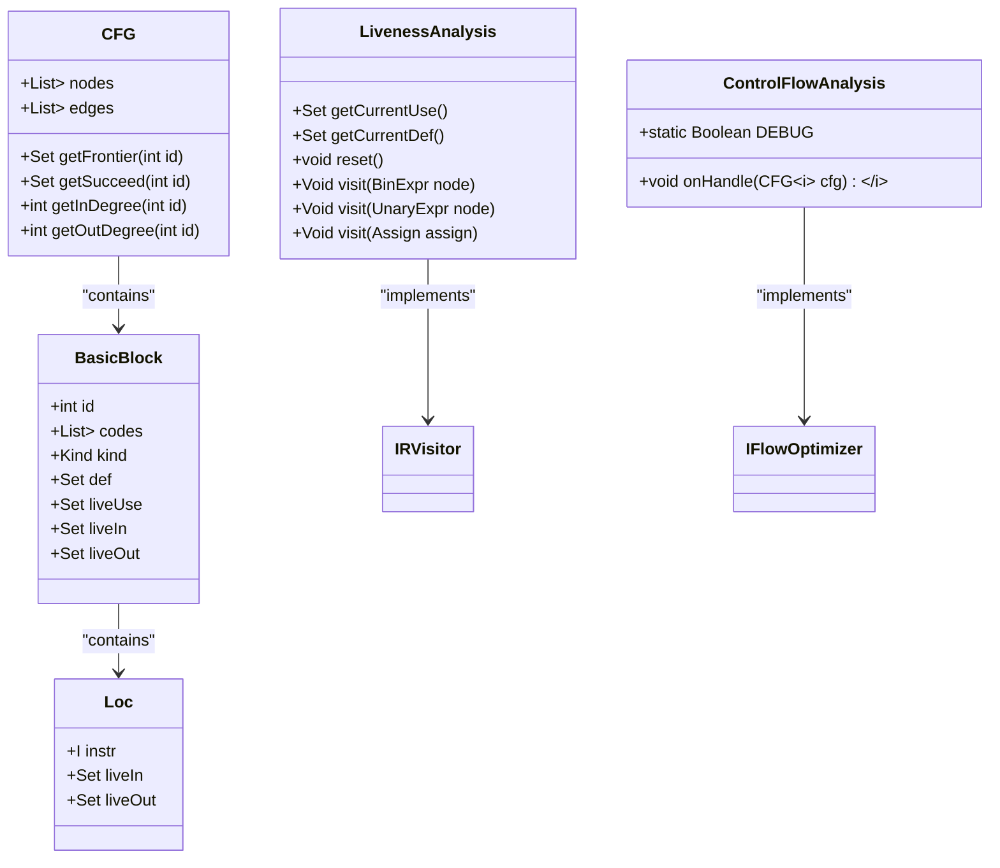

# Liveness Analysis

<cite>
**Referenced Files in This Document**   
- [LivenessAnalysis.java](file://ep20/src/main/java/org/teachfx/antlr4/ep20/pass/cfg/LivenessAnalysis.java)
- [Loc.java](file://ep20/src/main/java/org/teachfx/antlr4/ep20/pass/cfg/Loc.java)
- [BasicBlock.java](file://ep20/src/main/java/org/teachfx/antlr4/ep20/pass/cfg/BasicBlock.java)
- [CFG.java](file://ep20/src/main/java/org/teachfx/antlr4/ep20/pass/cfg/CFG.java)
- [ControlFlowAnalysis.java](file://ep20/src/main/java/org/teachfx/antlr4/ep20/pass/cfg/ControlFlowAnalysis.java)
- [LivenessAnalysisTest.java](file://ep20/src/test/java/org/teachfx/antlr4/ep20/pass/cfg/LivenessAnalysisTest.java)
</cite>

## Table of Contents
1. [Introduction](#introduction)
2. [Data Flow Equations for Liveness Analysis](#data-flow-equations-for-liveness-analysis)
3. [GEN and KILL Set Computation](#gen-and-kill-set-computation)
4. [Integration with ControlFlowAnalysis Framework](#integration-with-controlflowanalysis-framework)
5. [Usage in Register Allocation and Dead Code Elimination](#usage-in-register-allocation-and-dead-code-elimination)
6. [Step-by-Step Examples](#step-by-step-examples)
7. [Visualization of Live Variable Sets](#visualization-of-live-variable-sets)
8. [Precision Issues and Complex Expression Handling](#precision-issues-and-complex-expression-handling)
9. [Function Call Handling](#function-call-handling)

## Introduction
Liveness analysis is a fundamental data flow analysis technique used in compiler optimization to determine which variables are live at each program point. A variable is considered live at a given point if its value may be used along some execution path before being redefined. This analysis is crucial for various compiler optimizations including register allocation, dead code elimination, and memory management. The implementation in the LivenessAnalysis.java file provides a visitor-based approach to compute liveness information by traversing the intermediate representation (IR) of the program and determining the use and definition of operands at each instruction.

**Section sources**
- [LivenessAnalysis.java](file://ep20/src/main/java/org/teachfx/antlr4/ep20/pass/cfg/LivenessAnalysis.java#L1-L147)

## Data Flow Equations for Liveness Analysis
The liveness analysis follows the standard data flow equations for backward data flow problems. For each basic block, the analysis computes two sets: liveIn and liveOut. The liveOut set contains variables that are live at the exit of the block, while the liveIn set contains variables live at the entry. The equations are defined as follows: liveOut[B] = ∪(liveIn[S]) for all successors S of block B, and liveIn[B] = (liveOut[B] - def[B]) ∪ use[B], where def[B] represents variables defined in block B and use[B] represents variables used in block B before any definition. The analysis iteratively applies these equations until a fixed point is reached, ensuring that the liveness information is accurate across all control flow paths.

**Section sources**
- [LivenessAnalysis.java](file://ep20/src/main/java/org/teachfx/antlr4/ep20/pass/cfg/LivenessAnalysis.java#L1-L147)
- [CFG.java](file://ep20/src/main/java/org/teachfx/antlr4/ep20/pass/cfg/CFG.java#L1-L158)

## GEN and KILL Set Computation
The computation of GEN and KILL sets for each basic block is performed by analyzing the IR instructions within the block. The GEN set (equivalent to use[B]) contains variables that are used in the block before being redefined, while the KILL set (equivalent to def[B]) contains variables that are defined within the block. In the implementation, these sets are computed by visiting each instruction in the basic block. For example, in an assignment statement "x = y + z", the variables y and z are added to the use set (GEN), while x is added to the def set (KILL). The analysis handles different types of instructions including binary expressions, unary expressions, assignments, and function calls, correctly identifying the operands that are used and defined in each case.

**Section sources**
- [LivenessAnalysis.java](file://ep20/src/main/java/org/teachfx/antlr4/ep20/pass/cfg/LivenessAnalysis.java#L42-L147)
- [BasicBlock.java](file://ep20/src/main/java/org/teachfx/antlr4/ep20/pass/cfg/BasicBlock.java#L1-L130)

## Integration with ControlFlowAnalysis Framework
The liveness analysis is integrated with the ControlFlowAnalysis framework through the visitor pattern and the control flow graph (CFG) structure. The LivenessAnalysis class implements the IRVisitor interface, allowing it to traverse the IR nodes and collect use and def information. The analysis operates on the CFG, which represents the program's control flow structure with basic blocks as nodes and control flow edges as connections between blocks. The ControlFlowAnalysis class provides methods to access predecessors and successors of basic blocks, which are essential for solving the data flow equations. The framework supports iterative analysis until convergence, ensuring that liveness information is propagated correctly across all possible execution paths.

**Diagram sources**
- [LivenessAnalysis.java](file://ep20/src/main/java/org/teachfx/antlr4/ep20/pass/cfg/LivenessAnalysis.java#L1-L147)
- [ControlFlowAnalysis.java](file://ep20/src/main/java/org/teachfx/antlr4/ep20/pass/cfg/ControlFlowAnalysis.java#L1-L68)
- [CFG.java](file://ep20/src/main/java/org/teachfx/antlr4/ep20/pass/cfg/CFG.java#L1-L158)
- [BasicBlock.java](file://ep20/src/main/java/org/teachfx/antlr4/ep20/pass/cfg/BasicBlock.java#L1-L130)
- [Loc.java](file://ep20/src/main/java/org/teachfx/antlr4/ep20/pass/cfg/Loc.java#L1-L30)

**Section sources**
- [LivenessAnalysis.java](file://ep20/src/main/java/org/teachfx/antlr4/ep20/pass/cfg/LivenessAnalysis.java#L1-L147)
- [ControlFlowAnalysis.java](file://ep20/src/main/java/org/teachfx/antlr4/ep20/pass/cfg/ControlFlowAnalysis.java#L1-L68)
- [CFG.java](file://ep20/src/main/java/org/teachfx/antlr4/ep20/pass/cfg/CFG.java#L1-L158)

## Usage in Register Allocation and Dead Code Elimination
Liveness analysis plays a critical role in both register allocation and dead code elimination. In register allocation, the liveness information determines when a variable's value is needed, allowing the allocator to assign the same register to multiple variables that are not live simultaneously, thus minimizing register pressure. For dead code elimination, statements that define variables which are never subsequently used (not live after the definition) can be safely removed as they have no effect on the program's output. The analysis provides the necessary information to identify such opportunities by tracking which variables are live at each program point, enabling these optimizations to improve code efficiency without altering program behavior.

**Section sources**
- [LivenessAnalysis.java](file://ep20/src/main/java/org/teachfx/antlr4/ep20/pass/cfg/LivenessAnalysis.java#L1-L147)
- [BasicBlock.java](file://ep20/src/main/java/org/teachfx/antlr4/ep20/pass/cfg/BasicBlock.java#L1-L130)

## Step-by-Step Examples
Consider a simple program with a conditional statement: if (a > b) { c = a; } else { c = b; } d = c + 1;. The liveness analysis would proceed as follows: First, the CFG is constructed with basic blocks for the condition, then-branch, else-branch, and merge point. Starting from the exit block, the analysis works backward. At the final assignment, variable c is used, so it is live-in to that block. Tracing back, c is defined in both branches, so it is live-out from both the then and else blocks. Variables a and b are used in the condition and in the respective branches, making them live at the entry point. The analysis correctly identifies that c is live after the conditional, while a and b are only live within their respective usage contexts.

**Section sources**
- [LivenessAnalysis.java](file://ep20/src/main/java/org/teachfx/antlr4/ep20/pass/cfg/LivenessAnalysis.java#L42-L147)
- [LivenessAnalysisTest.java](file://ep20/src/test/java/org/teachfx/antlr4/ep20/pass/cfg/LivenessAnalysisTest.java#L1-L179)

## Visualization of Live Variable Sets
The live variable sets at block boundaries can be visualized using the liveIn and liveOut fields in the Loc class, which are populated during the analysis. For each basic block, the liveIn set shows variables that are live at the entry point, while the liveOut set shows variables live at the exit. These sets can be displayed alongside the control flow graph, with each node annotated with its liveIn and liveOut information. For example, a basic block containing "x = y + z; w = x * 2" would have liveIn containing y and z (if they are used later), and liveOut containing w (if it is used in subsequent blocks). This visualization helps in understanding the flow of data and identifying optimization opportunities.

**Diagram sources**
- [Loc.java](file://ep20/src/main/java/org/teachfx/antlr4/ep20/pass/cfg/Loc.java#L1-L30)
- [BasicBlock.java](file://ep20/src/main/java/org/teachfx/antlr4/ep20/pass/cfg/BasicBlock.java#L1-L130)

**Section sources**
- [Loc.java](file://ep20/src/main/java/org/teachfx/antlr4/ep20/pass/cfg/Loc.java#L1-L30)
- [BasicBlock.java](file://ep20/src/main/java/org/teachfx/antlr4/ep20/pass/cfg/BasicBlock.java#L1-L130)

## Precision Issues and Complex Expression Handling
The liveness analysis implementation addresses precision issues by carefully handling complex expressions and ensuring accurate use-def chain construction. For complex expressions involving multiple operands, the analysis visits each sub-expression recursively to collect all used variables. The current implementation correctly handles binary and unary operations, assignments, and conditional jumps. However, precision may be affected in cases of function calls, where the analysis must make conservative assumptions about which variables might be modified or used by the called function. The analysis resets its state for each instruction visit, ensuring that local use and def information is accurately captured without interference from previous computations.

**Section sources**
- [LivenessAnalysis.java](file://ep20/src/main/java/org/teachfx/antlr4/ep20/pass/cfg/LivenessAnalysis.java#L42-L147)
- [LivenessAnalysisTest.java](file://ep20/src/test/java/org/teachfx/antlr4/ep20/pass/cfg/LivenessAnalysisTest.java#L1-L179)

## Function Call Handling
Function call handling in liveness analysis requires special consideration due to potential side effects and unknown usage patterns. In the current implementation, the visit method for CallFunc is present but has a placeholder comment indicating that the actual parameter processing needs to be implemented based on the specific function call structure. The analysis takes a conservative approach, potentially treating all global variables and parameters as live across function calls to ensure correctness. This conservative approach may reduce optimization opportunities but guarantees that no live variables are incorrectly eliminated. Future enhancements could include interprocedural analysis to track variable usage across function boundaries more precisely.

**Section sources**
- [LivenessAnalysis.java](file://ep20/src/main/java/org/teachfx/antlr4/ep20/pass/cfg/LivenessAnalysis.java#L78-L85)
- [LivenessAnalysisTest.java](file://ep20/src/test/java/org/teachfx/antlr4/ep20/pass/cfg/LivenessAnalysisTest.java#L1-L179)