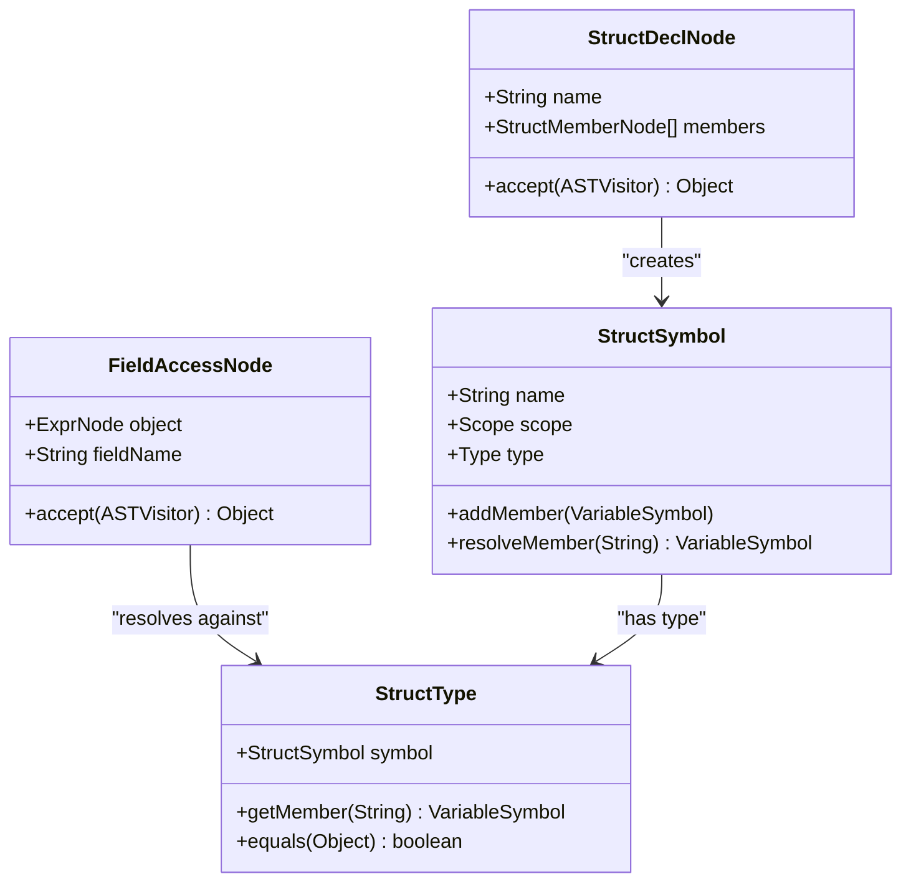
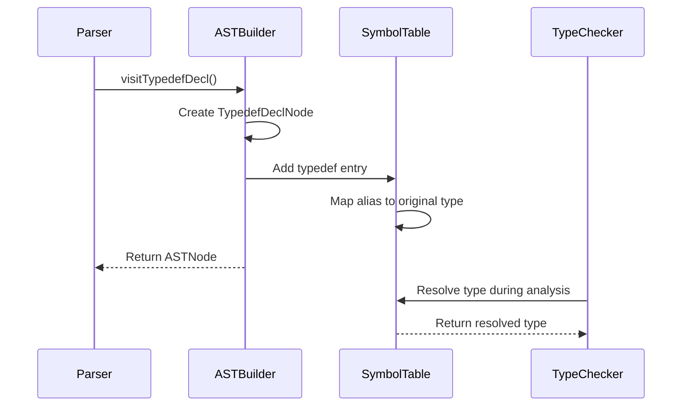
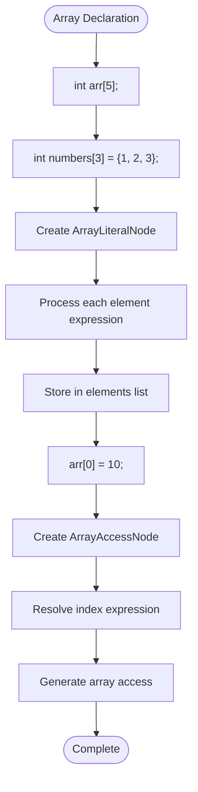
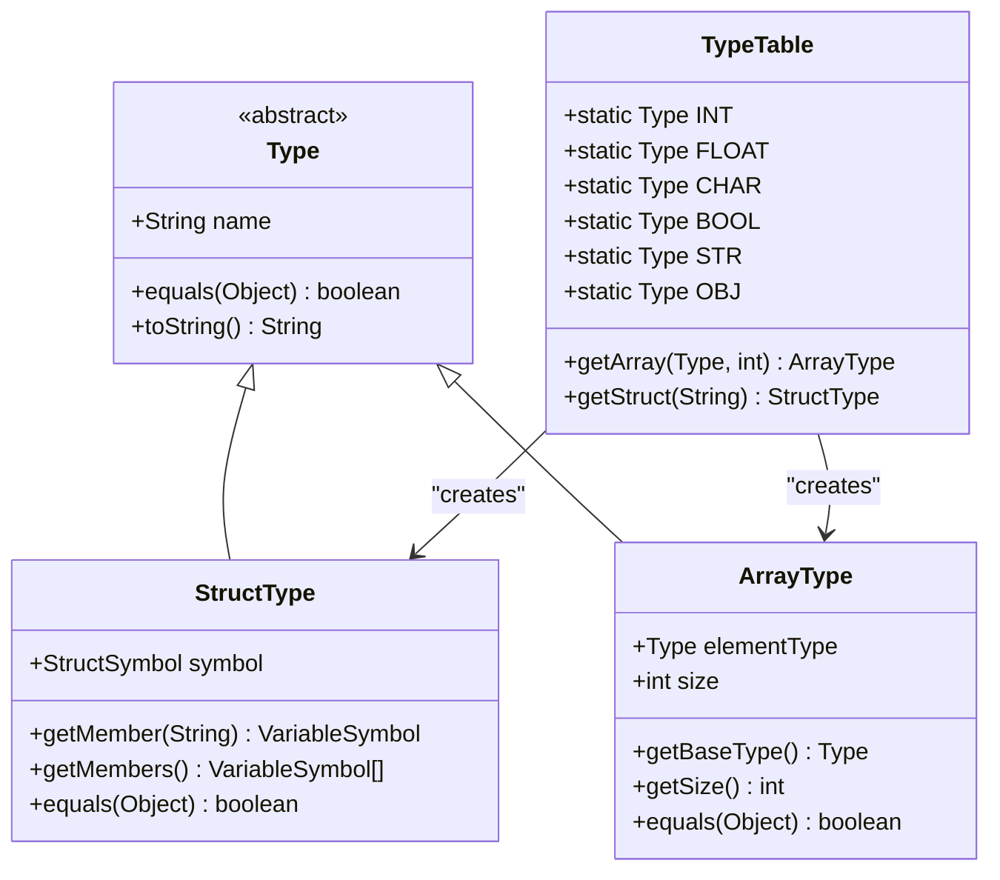
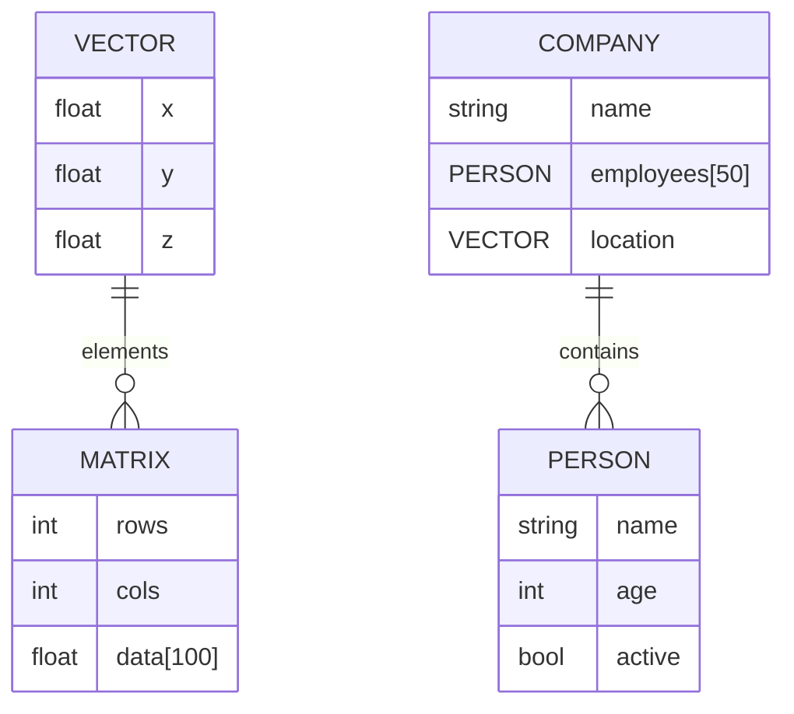
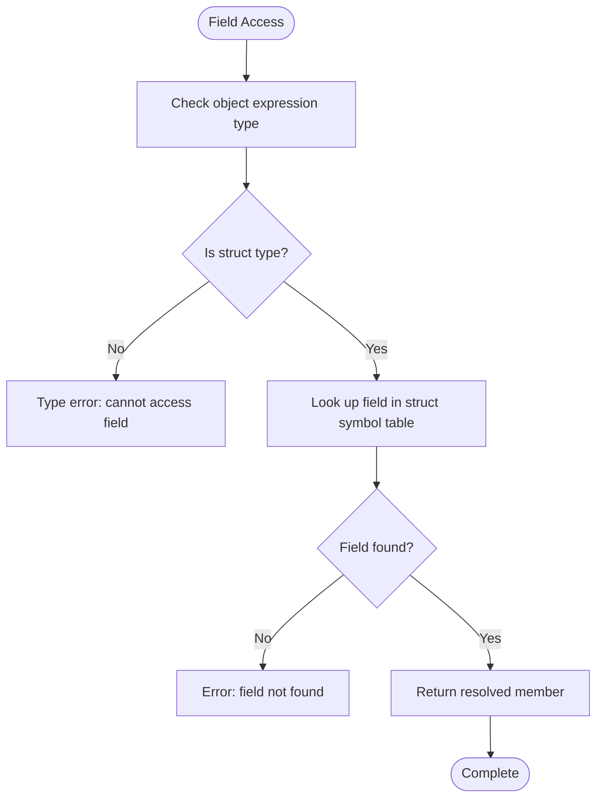
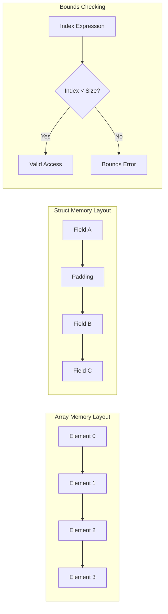

# Advanced Language Features

<cite>
**Referenced Files in This Document**   
- [StructDeclNode.java](file://ep20/src/main/java/org/teachfx/antlr4/ep20/ast/decl/StructDeclNode.java)
- [StructSymbol.java](file://ep20/src/main/java/org/teachfx/antlr4/ep20/symtab/symbol/StructSymbol.java)
- [TypedefDeclNode.java](file://ep20/src/main/java/org/teachfx/antlr4/ep20/ast/decl/TypedefDeclNode.java)
- [FieldAccessNode.java](file://ep20/src/main/java/org/teachfx/antlr4/ep20/ast/expr/FieldAccessNode.java)
- [ArrayLiteralNode.java](file://ep20/src/main/java/org/teachfx/antlr4/ep20/ast/expr/ArrayLiteralNode.java)
- [ArrayAccessNode.java](file://ep20/src/main/java/org/teachfx/antlr4/ep20/ast/expr/ArrayAccessNode.java)
- [ArrayType.java](file://ep20/src/main/java/org/teachfx/antlr4/ep20/symtab/type/ArrayType.java)
- [StructType.java](file://ep20/src/main/java/org/teachfx/antlr4/ep20/symtab/type/StructType.java)
- [CymbolASTBuilder.java](file://ep20/src/main/java/org/teachfx/antlr4/ep20/pass/ast/CymbolASTBuilder.java)
- [ArraysTest.java](file://ep20/src/test/java/org/teachfx/antlr4/ep20/ArraysTest.java)
</cite>

## Table of Contents
1. [User-Defined Types](#user-defined-types)
2. [Structs and Member Access](#structs-and-member-access)
3. [Type Aliases](#type-aliases)
4. [Array Support](#array-support)
5. [Composite Type Representation](#composite-type-representation)
6. [Complex Data Structures](#complex-data-structures)
7. [Member Lookup and Type Equivalence](#member-lookup-and-type-equivalence)
8. [Bounds Checking and Memory Layout](#bounds-checking-and-memory-layout)

## User-Defined Types

The Cymbol language supports advanced user-defined types through structs and type aliases, enabling developers to create complex data models and improve code readability. These features are implemented through dedicated AST nodes and symbol table entries that maintain type information throughout compilation.

**Section sources**
- [StructDeclNode.java](file://ep20/src/main/java/org/teachfx/antlr4/ep20/ast/decl/StructDeclNode.java#L1-L50)
- [TypedefDeclNode.java](file://ep20/src/main/java/org/teachfx/antlr4/ep20/ast/decl/TypedefDeclNode.java#L1-L40)

## Structs and Member Access

Structs in Cymbol are defined using the `StructDeclNode` class, which represents struct declarations in the abstract syntax tree. Each struct is associated with a `StructSymbol` in the symbol table that maintains metadata about the struct's members and scope. Struct members are defined through `StructMemberNode` instances that specify the member's type and identifier.

Member access is handled by the `FieldAccessNode` class, which represents expressions that access fields within a struct instance. During semantic analysis, the compiler resolves the field name against the struct's symbol table to ensure validity and type correctness.

**Diagram sources**
- [StructDeclNode.java](file://ep20/src/main/java/org/teachfx/antlr4/ep20/ast/decl/StructDeclNode.java#L1-L50)
- [StructSymbol.java](file://ep20/src/main/java/org/teachfx/antlr4/ep20/symtab/symbol/StructSymbol.java#L1-L60)
- [FieldAccessNode.java](file://ep20/src/main/java/org/teachfx/antlr4/ep20/ast/expr/FieldAccessNode.java#L1-L40)
- [StructType.java](file://ep20/src/main/java/org/teachfx/antlr4/ep20/symtab/type/StructType.java#L1-L50)

**Section sources**
- [StructDeclNode.java](file://ep20/src/main/java/org/teachfx/antlr4/ep20/ast/decl/StructDeclNode.java#L1-L100)
- [StructSymbol.java](file://ep20/src/main/java/org/teachfx/antlr4/ep20/symtab/symbol/StructSymbol.java#L1-L80)
- [FieldAccessNode.java](file://ep20/src/main/java/org/teachfx/antlr4/ep20/ast/expr/FieldAccessNode.java#L1-L60)

## Type Aliases

Type aliases are implemented through the `TypedefDeclNode` class, which represents typedef declarations in the AST. When processed by the `CymbolASTBuilder`, these nodes create entries in the symbol table that map an alias name to an existing type. This mechanism allows developers to create more readable type names and simplify complex type expressions.

The `TypedefSymbol` class in the symbol table maintains the relationship between the alias and its underlying type, enabling transparent type resolution during compilation.

**Diagram sources**
- [TypedefDeclNode.java](file://ep20/src/main/java/org/teachfx/antlr4/ep20/ast/decl/TypedefDeclNode.java#L1-L40)
- [CymbolASTBuilder.java](file://ep20/src/main/java/org/teachfx/antlr4/ep20/pass/ast/CymbolASTBuilder.java#L290-L300)

**Section sources**
- [TypedefDeclNode.java](file://ep20/src/main/java/org/teachfx/antlr4/ep20/ast/decl/TypedefDeclNode.java#L1-L50)
- [CymbolASTBuilder.java](file://ep20/src/main/java/org/teachfx/antlr4/ep20/pass/ast/CymbolASTBuilder.java#L290-L306)

## Array Support

Cymbol provides comprehensive array support including declaration, initialization, and element access. Arrays are declared with a specified size and can be initialized using array literals through the `ArrayLiteralNode` class. Element access is managed by the `ArrayAccessNode` class, which represents subscript operations on array variables.

The `CymbolASTBuilder` processes array initializers by converting each expression in the initializer list into an `ExprNode` and creating an `ArrayLiteralNode` to represent the complete initialization.

**Diagram sources**
- [ArrayLiteralNode.java](file://ep20/src/main/java/org/teachfx/antlr4/ep20/ast/expr/ArrayLiteralNode.java#L1-L30)
- [ArrayAccessNode.java](file://ep20/src/main/java/org/teachfx/antlr4/ep20/ast/expr/ArrayAccessNode.java#L1-L40)
- [CymbolASTBuilder.java](file://ep20/src/main/java/org/teachfx/antlr4/ep20/pass/ast/CymbolASTBuilder.java#L273-L280)

**Section sources**
- [ArrayLiteralNode.java](file://ep20/src/main/java/org/teachfx/antlr4/ep20/ast/expr/ArrayLiteralNode.java#L1-L50)
- [ArrayAccessNode.java](file://ep20/src/main/java/org/teachfx/antlr4/ep20/ast/expr/ArrayAccessNode.java#L1-L60)
- [ArraysTest.java](file://ep20/src/test/java/org/teachfx/antlr4/ep20/ArraysTest.java#L1-L80)

## Composite Type Representation

The type system in Cymbol represents composite types through the `StructType` and `ArrayType` classes. `StructType` encapsulates struct symbols and provides methods for member lookup and type equivalence checking. `ArrayType` represents array types with a base type and dimension information, enabling proper type checking for array operations.

These classes extend the base `Type` class and integrate with the `TypeTable` to ensure consistent type representation throughout the compilation process.

**Diagram sources**
- [StructType.java](file://ep20/src/main/java/org/teachfx/antlr4/ep20/symtab/type/StructType.java#L1-L50)
- [ArrayType.java](file://ep20/src/main/java/org/teachfx/antlr4/ep20/symtab/type/ArrayType.java#L1-L50)
- [TypeTable.java](file://ep20/src/main/java/org/teachfx/antlr4/ep20/symtab/type/TypeTable.java#L1-L100)

**Section sources**
- [StructType.java](file://ep20/src/main/java/org/teachfx/antlr4/ep20/symtab/type/StructType.java#L1-L80)
- [ArrayType.java](file://ep20/src/main/java/org/teachfx/antlr4/ep20/symtab/type/ArrayType.java#L1-L70)

## Complex Data Structures

Cymbol enables the creation of sophisticated data structures by combining structs, arrays, and type aliases. Developers can define structs containing array members, arrays of structs, or nested combinations of both. Type aliases can be used to simplify the declaration of complex types, improving code readability and maintainability.

The compiler handles these complex structures by recursively resolving type information and ensuring proper memory layout during code generation.

**Diagram sources**
- [StructDeclNode.java](file://ep20/src/main/java/org/teachfx/antlr4/ep20/ast/decl/StructDeclNode.java#L1-L100)
- [ArrayType.java](file://ep20/src/main/java/org/teachfx/antlr4/ep20/symtab/type/ArrayType.java#L1-L50)

## Member Lookup and Type Equivalence

The compiler performs member lookup by traversing the symbol table hierarchy to resolve struct members. When a `FieldAccessNode` is encountered, the type of the object expression is checked to ensure it is a struct type, then the field name is looked up in the struct's symbol table.

Struct type equivalence is determined by name-based comparison rather than structural equivalence. Two struct types are considered equivalent only if they reference the same `StructSymbol` in the symbol table, preventing accidental type compatibility between similarly structured but differently named structs.

**Diagram sources**
- [FieldAccessNode.java](file://ep20/src/main/java/org/teachfx/antlr4/ep20/ast/expr/FieldAccessNode.java#L1-L60)
- [StructType.java](file://ep20/src/main/java/org/teachfx/antlr4/ep20/symtab/type/StructType.java#L1-L80)
- [CymbolASTBuilder.java](file://ep20/src/main/java/org/teachfx/antlr4/ep20/pass/ast/CymbolASTBuilder.java#L295-L300)

**Section sources**
- [FieldAccessNode.java](file://ep20/src/main/java/org/teachfx/antlr4/ep20/ast/expr/FieldAccessNode.java#L1-L70)
- [StructType.java](file://ep20/src/main/java/org/teachfx/antlr4/ep20/symtab/type/StructType.java#L1-L90)

## Bounds Checking and Memory Layout

Array bounds checking is implemented during semantic analysis to ensure that all array accesses are within valid index ranges. The compiler analyzes array declarations to determine the size and validates index expressions against this size. While compile-time checking handles constant indices, runtime bounds checking may be required for dynamic indices.

Memory layout considerations include contiguous storage for array elements and proper alignment for struct members. Arrays are stored in row-major order with elements placed sequentially in memory. Struct members are laid out in declaration order, with potential padding added for alignment purposes depending on the target architecture.

**Diagram sources**
- [ArrayAccessNode.java](file://ep20/src/main/java/org/teachfx/antlr4/ep20/ast/expr/ArrayAccessNode.java#L1-L50)
- [ArrayType.java](file://ep20/src/main/java/org/teachfx/antlr4/ep20/symtab/type/ArrayType.java#L1-L60)
- [StructType.java](file://ep20/src/main/java/org/teachfx/antlr4/ep20/symtab/type/StructType.java#L1-L70)

**Section sources**
- [ArrayAccessNode.java](file://ep20/src/main/java/org/teachfx/antlr4/ep20/ast/expr/ArrayAccessNode.java#L1-L80)
- [ArrayType.java](file://ep20/src/main/java/org/teachfx/antlr4/ep20/symtab/type/ArrayType.java#L1-L80)