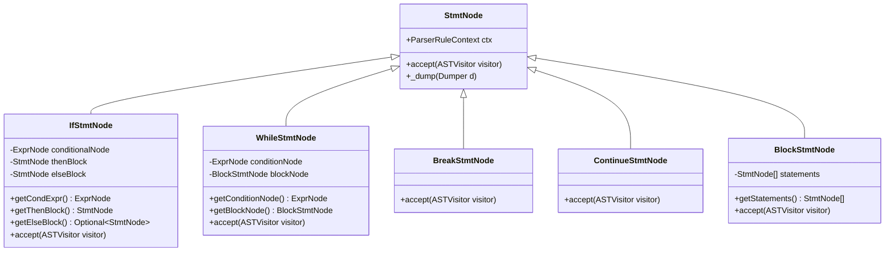
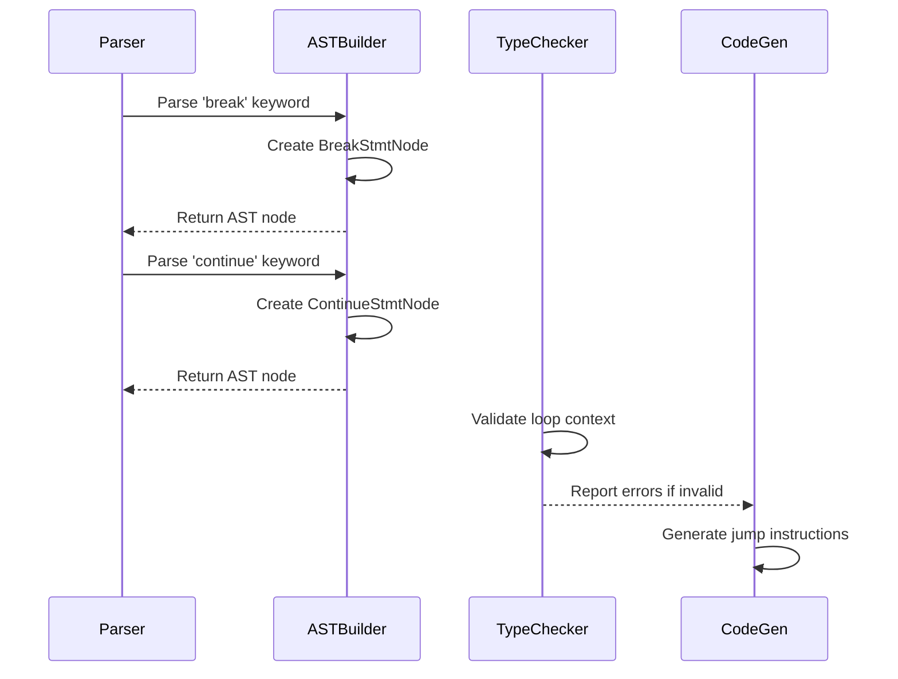
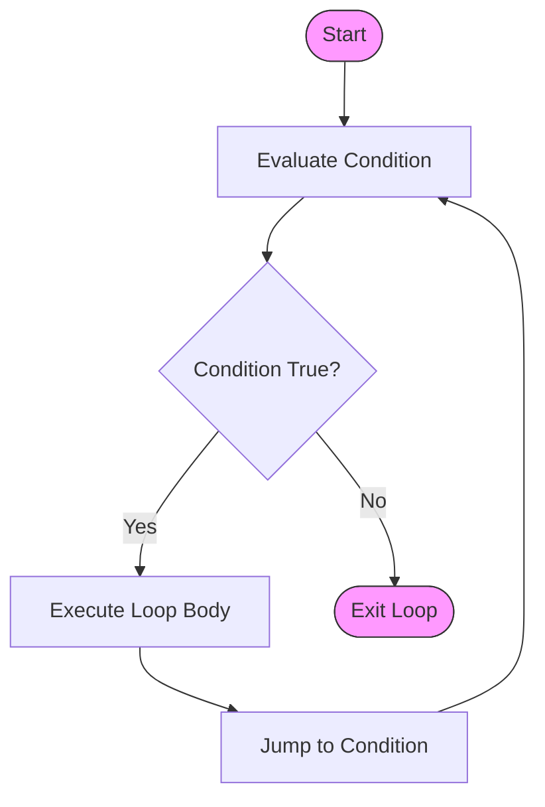

# Control Structures

<cite>
**Referenced Files in This Document**   
- [IfStmtNode.java](file://ep20/src/main/java/org/teachfx/antlr4/ep20/ast/stmt/IfStmtNode.java)
- [WhileStmtNode.java](file://ep20/src/main/java/org/teachfx/antlr4/ep20/ast/stmt/WhileStmtNode.java)
- [BreakStmtNode.java](file://ep20/src/main/java/org/teachfx/antlr4/ep20/ast/stmt/BreakStmtNode.java)
- [ContinueStmtNode.java](file://ep20/src/main/java/org/teachfx/antlr4/ep20/ast/stmt/ContinueStmtNode.java)
- [BlockStmtNode.java](file://ep20/src/main/java/org/teachfx/antlr4/ep20/ast/stmt/BlockStmtNode.java)
- [CymbolParser.java](file://ep21/src/main/java/org/teachfx/antlr4/ep21/parser/CymbolParser.java)
- [TypeChecker.java](file://ep20/src/main/java/org/teachfx/antlr4/ep20/pass/sematic/TypeChecker.java)
</cite>

## Table of Contents
1. [Introduction](#introduction)
2. [Control Flow Constructs Overview](#control-flow-constructs-overview)
3. [AST Representation of Control Structures](#ast-representation-of-control-structures)
4. [If-Else Statements](#if-else-statements)
5. [While Loops](#while-loops)
6. [Break and Continue Statements](#break-and-continue-statements)
7. [Block Scoping and Local Variables](#block-scoping-and-local-variables)
8. [Semantic Analysis and Type Checking](#semantic-analysis-and-type-checking)
9. [Intermediate Representation Translation](#intermediate-representation-translation)
10. [Common Programming Patterns](#common-programming-patterns)
11. [Limitations and Special Behaviors](#limitations-and-special-behaviors)

## Introduction
This document provides a comprehensive analysis of control flow constructs in the Cymbol language as implemented in the Antlr4-based compiler framework. The focus is on the abstract syntax tree (AST) representation, semantic rules, and compilation process for control structures including if-else statements, while loops, break and continue statements, and block scoping mechanisms. The document details how these constructs are represented in the AST node hierarchy, validated during type checking, and translated to intermediate representation.

## Control Flow Constructs Overview
The Cymbol language implements standard imperative control flow constructs with C-like syntax. These include conditional execution (if-else), iterative execution (while loops), and flow control statements (break and continue). All control structures are represented as statement nodes in the AST hierarchy, inheriting from the base StmtNode class. The language supports nested control structures and enforces strict type checking on condition expressions.

## AST Representation of Control Structures
Control flow constructs are represented through a hierarchy of AST node classes that extend the StmtNode base class. The primary control structure nodes include IfStmtNode for conditional statements, WhileStmtNode for loops, and specialized nodes for break and continue statements. Block statements are represented by BlockStmtNode, which contains a list of child statements and establishes a new scope boundary.

**Diagram sources**
- [IfStmtNode.java](file://ep20/src/main/java/org/teachfx/antlr4/ep20/ast/stmt/IfStmtNode.java)
- [WhileStmtNode.java](file://ep20/src/main/java/org/teachfx/antlr4/ep20/ast/stmt/WhileStmtNode.java)
- [BreakStmtNode.java](file://ep20/src/main/java/org/teachfx/antlr4/ep20/ast/stmt/BreakStmtNode.java)
- [ContinueStmtNode.java](file://ep20/src/main/java/org/teachfx/antlr4/ep20/ast/stmt/ContinueStmtNode.java)
- [BlockStmtNode.java](file://ep20/src/main/java/org/teachfx/antlr4/ep20/ast/stmt/BlockStmtNode.java)

**Section sources**
- [IfStmtNode.java](file://ep20/src/main/java/org/teachfx/antlr4/ep20/ast/stmt/IfStmtNode.java)
- [WhileStmtNode.java](file://ep20/src/main/java/org/teachfx/antlr4/ep20/ast/stmt/WhileStmtNode.java)
- [BreakStmtNode.java](file://ep20/src/main/java/org/teachfx/antlr4/ep20/ast/stmt/BreakStmtNode.java)
- [ContinueStmtNode.java](file://ep20/src/main/java/org/teachfx/antlr4/ep20/ast/stmt/ContinueStmtNode.java)

## If-Else Statements
The IfStmtNode class represents if-else conditional statements in the AST. It contains three main components: a condition expression node, a then-block statement node, and an optional else-block statement node. The condition expression must evaluate to a boolean type, which is verified during semantic analysis. The then and else blocks can contain any valid statement sequence, including nested control structures.

During compilation, the if-else construct is translated into conditional jump instructions in the intermediate representation. The condition is evaluated first, and based on its truth value, execution continues to either the then-block or the else-block (if present). The AST node maintains references to its child nodes, enabling proper traversal during code generation.

**Section sources**
- [IfStmtNode.java](file://ep20/src/main/java/org/teachfx/antlr4/ep20/ast/stmt/IfStmtNode.java)
- [CymbolParser.java](file://ep21/src/main/java/org/teachfx/antlr4/ep21/parser/CymbolParser.java)

## While Loops
The WhileStmtNode class implements while loop constructs in the Cymbol language. It consists of a condition expression node and a block statement node representing the loop body. The condition is evaluated before each iteration, and the loop continues execution as long as the condition evaluates to true. The loop body is always enclosed in a BlockStmtNode, which establishes a new lexical scope for variables declared within the loop.

The AST representation ensures that break and continue statements within the loop body can be properly resolved during semantic analysis. The compiler validates that the condition expression has boolean type and that the loop body contains valid statements. During code generation, the while loop is translated into a sequence of instructions that include a conditional jump back to the loop header.

**Section sources**
- [WhileStmtNode.java](file://ep20/src/main/java/org/teachfx/antlr4/ep20/ast/stmt/WhileStmtNode.java)
- [CymbolParser.java](file://ep21/src/main/java/org/teachfx/antlr4/ep21/parser/CymbolParser.java)

## Break and Continue Statements
Break and continue statements are represented by dedicated AST nodes: BreakStmtNode and ContinueStmtNode. Both inherit from StmtNode and contain minimal state, primarily storing the parser context for error reporting. These statements can only appear within the scope of a loop construct, which is verified during semantic analysis.

The break statement terminates the enclosing loop immediately, transferring control to the statement following the loop. The continue statement skips the remaining statements in the current iteration and proceeds directly to the loop condition evaluation. The compiler validates that these statements appear within appropriate loop contexts and generates corresponding jump instructions in the intermediate representation.

**Diagram sources**
- [BreakStmtNode.java](file://ep20/src/main/java/org/teachfx/antlr4/ep20/ast/stmt/BreakStmtNode.java)
- [ContinueStmtNode.java](file://ep20/src/main/java/org/teachfx/antlr4/ep20/ast/stmt/ContinueStmtNode.java)

**Section sources**
- [BreakStmtNode.java](file://ep20/src/main/java/org/teachfx/antlr4/ep20/ast/stmt/BreakStmtNode.java)
- [ContinueStmtNode.java](file://ep20/src/main/java/org/teachfx/antlr4/ep20/ast/stmt/ContinueStmtNode.java)

## Block Scoping and Local Variables
Block statements, represented by BlockStmtNode, define lexical scope boundaries in the Cymbol language. Each block establishes a new local scope that can contain variable declarations and other statements. The scope hierarchy is maintained through the symbol table infrastructure, with each block potentially introducing a new LocalScope instance.

Variables declared within a block have their lifetime limited to that block's execution. The compiler enforces scope rules during semantic analysis, ensuring that variables are declared before use and that no duplicate names exist within the same scope. Nested blocks create nested scopes, allowing for variable shadowing where an inner block can declare a variable with the same name as one in an outer block.

**Section sources**
- [BlockStmtNode.java](file://ep20/src/main/java/org/teachfx/antlr4/ep20/ast/stmt/BlockStmtNode.java)
- [CymbolParser.java](file://ep21/src/main/java/org/teachfx/antlr4/ep21/parser/CymbolParser.java)

## Semantic Analysis and Type Checking
Control flow constructs undergo rigorous semantic validation during the type checking phase. The TypeChecker visitor traverses the AST and verifies several key properties: condition expressions in if and while statements must have boolean type; break and continue statements must appear within loop contexts; and all variables referenced in conditions or loop bodies must be properly declared.

The type checking process also validates that control flow is well-structured, ensuring that all paths through conditional statements are accounted for and that loops have proper entry and exit points. For nested control structures, the checker maintains context about the current scope and loop nesting level to properly validate break and continue statements.

**Section sources**
- [TypeChecker.java](file://ep20/src/main/java/org/teachfx/antlr4/ep20/pass/sematic/TypeChecker.java)
- [IfStmtNode.java](file://ep20/src/main/java/org/teachfx/antlr4/ep20/ast/stmt/IfStmtNode.java)
- [WhileStmtNode.java](file://ep20/src/main/java/org/teachfx/antlr4/ep20/ast/stmt/WhileStmtNode.java)

## Intermediate Representation Translation
During code generation, control flow constructs are translated into three-address code instructions. If-else statements become conditional jump sequences with label targets for the then and else branches. While loops are translated into a pattern that includes a header label, the loop body, a conditional jump back to the header, and an exit label.

The translation process preserves the hierarchical structure of the original AST while flattening it into a linear sequence of instructions. Basic block boundaries are established at natural control flow points, and the resulting intermediate representation maintains the same semantic behavior as the source code. Loop optimization opportunities, such as loop invariant code motion, are preserved in the IR structure.

**Diagram sources**
- [WhileStmtNode.java](file://ep20/src/main/java/org/teachfx/antlr4/ep20/ast/stmt/WhileStmtNode.java)
- [CymbolIRBuilder.java](file://ep20/src/main/java/org/teachfx/antlr4/ep20/pass/ir/CymbolIRBuilder.java)

## Common Programming Patterns
The Cymbol language supports several common programming patterns through its control flow constructs. These include guarded execution (if statements for precondition checking), iterative processing (while loops for data traversal), and early termination (break statements for exceptional conditions). Nested if-else chains can be used for multi-way branching, though the language does not currently support switch statements.

A typical pattern involves using a while loop with a compound condition to iterate through data structures, with break statements used for early termination when a search target is found. Another common pattern is the use of flag variables in loop conditions to control execution based on multiple criteria evaluated within the loop body.

**Section sources**
- [IfStmtNode.java](file://ep20/src/main/java/org/teachfx/antlr4/ep20/ast/stmt/IfStmtNode.java)
- [WhileStmtNode.java](file://ep20/src/main/java/org/teachfx/antlr4/ep20/ast/stmt/WhileStmtNode.java)

## Limitations and Special Behaviors
Compared to standard C-like languages, the Cymbol implementation has several limitations and special behaviors. Currently, there is no support for for loops or switch statements, requiring developers to use while loops and nested if-else chains instead. The break and continue statements do not support labeled targets, limiting them to the innermost enclosing loop.

Another limitation is the lack of do-while loops, which can make certain algorithms less natural to express. The type system requires explicit boolean conditions, preventing the use of integer-to-boolean implicit conversions common in C. Additionally, the compiler does not yet implement advanced loop optimizations such as strength reduction or unrolling, though the IR structure allows for future implementation of these features.

**Section sources**
- [IfStmtNode.java](file://ep20/src/main/java/org/teachfx/antlr4/ep20/ast/stmt/IfStmtNode.java)
- [WhileStmtNode.java](file://ep20/src/main/java/org/teachfx/antlr4/ep20/ast/stmt/WhileStmtNode.java)
- [TypeChecker.java](file://ep20/src/main/java/org/teachfx/antlr4/ep20/pass/sematic/TypeChecker.java)