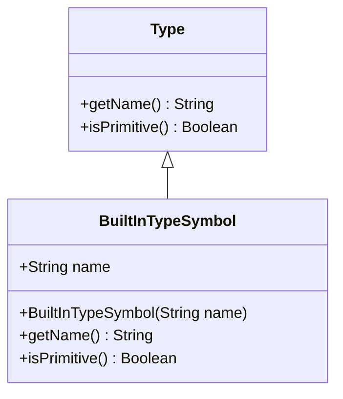
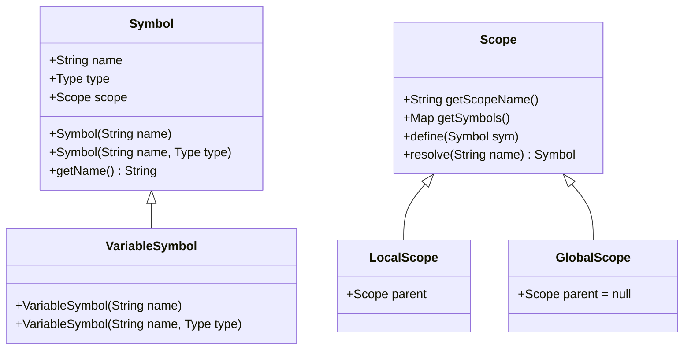
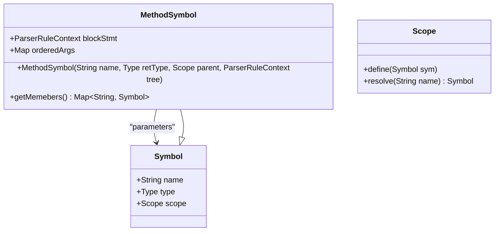
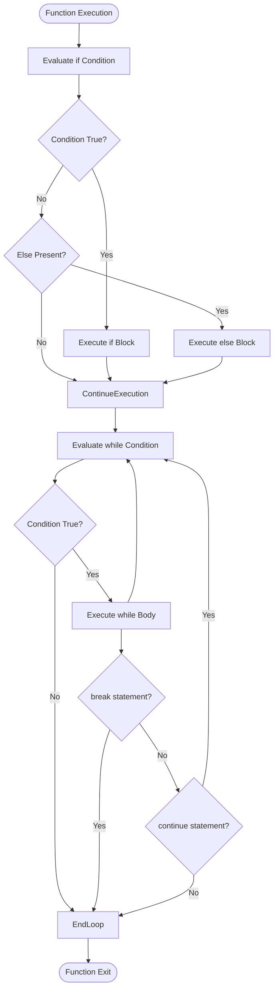
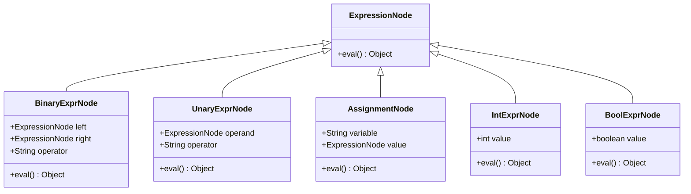

# Cymbol Language Specification

<cite>
**Referenced Files in This Document**   
- [CymbolLexer.java](file://ep16/src/main/java/org/teachfx/antlr4/ep16/parser/CymbolLexer.java)
- [CymbolParser.java](file://ep16/src/main/java/org/teachfx/antlr4/ep16/parser/CymbolParser.java)
- [Type.java](file://ep16/src/main/java/org/teachfx/antlr4/ep16/symtab/Type.java)
- [TypeTable.java](file://ep16/src/main/java/org/teachfx/antlr4/ep16/symtab/TypeTable.java)
- [VariableSymbol.java](file://ep16/src/main/java/org/teachfx/antlr4/ep16/symtab/VariableSymbol.java)
- [MethodSymbol.java](file://ep16/src/main/java/org/teachfx/antlr4/ep16/symtab/MethodSymbol.java)
- [Symbol.java](file://ep16/src/main/java/org/teachfx/antlr4/ep16/symtab/Symbol.java)
</cite>

## Table of Contents
1. [Introduction](#introduction)
2. [Data Types and Type System](#data-types-and-type-system)
3. [Variable Declarations and Scoping Rules](#variable-declarations-and-scoping-rules)
4. [Function Declarations and Parameters](#function-declarations-and-parameters)
5. [Control Structures](#control-structures)
6. [Operators and Expressions](#operators-and-expressions)
7. [Formal Grammar Specification](#formal-grammar-specification)
8. [Language Evolution Across Episodes](#language-evolution-across-episodes)

## Introduction
The Cymbol programming language is a C-like procedural language implemented through a series of ANTLR4-based compiler development episodes. This specification documents the complete syntax and semantics of Cymbol as evolved through these episodes, with a focus on the implementation in episode 16 where the language reaches full procedural programming capabilities. The language features static typing, lexical scoping, and supports fundamental programming constructs including variables, functions, control flow, and expressions.

**Section sources**
- [CymbolLexer.java](file://ep16/src/main/java/org/teachfx/antlr4/ep16/parser/CymbolLexer.java#L59-L117)
- [TypeTable.java](file://ep16/src/main/java/org/teachfx/antlr4/ep16/symtab/TypeTable.java#L0-L18)

## Data Types and Type System

Cymbol implements a static type system with the following primitive data types:
- **int**: Integer values
- **float**: Floating-point values
- **bool**: Boolean values (true/false)
- **void**: Function return type indicating no value
- **char**: Character values
- **string**: String literals
- **null**: Null reference value

The type system is implemented through the `Type` interface and concrete `BuiltInTypeSymbol` classes. Type checking is enforced at compile time, and implicit conversions are limited. The `TypeTable` class defines all built-in types as static constants, ensuring type consistency throughout the compiler.

**Diagram sources**
- [Type.java](file://ep16/src/main/java/org/teachfx/antlr4/ep16/symtab/Type.java#L0-L7)
- [TypeTable.java](file://ep16/src/main/java/org/teachfx/antlr4/ep16/symtab/TypeTable.java#L0-L18)

**Section sources**
- [Type.java](file://ep16/src/main/java/org/teachfx/antlr4/ep16/symtab/Type.java#L0-L7)
- [TypeTable.java](file://ep16/src/main/java/org/teachfx/antlr4/ep16/symtab/TypeTable.java#L0-L18)

## Variable Declarations and Scoping Rules

Variables in Cymbol are declared with explicit type annotations using the syntax `type identifier;`. Multiple variables of the same type can be declared in a single statement separated by commas. The language implements lexical scoping with distinct global and local scopes.

Scope resolution follows a hierarchical model where each local scope references its parent scope. Variable lookup proceeds from the current scope outward to enclosing scopes. The `VariableSymbol` class represents variables in the symbol table, storing both name and type information.

**Diagram sources**
- [Symbol.java](file://ep16/src/main/java/org/teachfx/antlr4/ep16/symtab/Symbol.java#L0-L38)
- [VariableSymbol.java](file://ep16/src/main/java/org/teachfx/antlr4/ep16/symtab/VariableSymbol.java#L0-L13)
- [Scope.java](file://ep16/src/main/java/org/teachfx/antlr4/ep16/symtab/Scope.java)
- [LocalScope.java](file://ep16/src/main/java/org/teachfx/antlr4/ep16/symtab/LocalScope.java)

**Section sources**
- [Symbol.java](file://ep16/src/main/java/org/teachfx/antlr4/ep16/symtab/Symbol.java#L0-L38)
- [VariableSymbol.java](file://ep16/src/main/java/org/teachfx/antlr4/ep16/symtab/VariableSymbol.java#L0-L13)

## Function Declarations and Parameters

Functions in Cymbol are declared using the syntax `return_type function_name(parameters) { body }`. Parameter lists are comma-separated and each parameter must specify its type. Functions can be declared at global scope only. The `MethodSymbol` class represents functions in the symbol table, storing return type, parameter information, and reference to the function body.

Function calls use standard C-style syntax with arguments evaluated left-to-right. Return statements must match the declared return type, with void functions prohibiting return values. The language supports function overloading through symbol table management in different scopes.

**Diagram sources**
- [MethodSymbol.java](file://ep16/src/main/java/org/teachfx/antlr4/ep16/symtab/MethodSymbol.java#L0-L31)
- [Symbol.java](file://ep16/src/main/java/org/teachfx/antlr4/ep16/symtab/Symbol.java#L0-L38)

**Section sources**
- [MethodSymbol.java](file://ep16/src/main/java/org/teachfx/antlr4/ep16/symtab/MethodSymbol.java#L0-L31)

## Control Structures

Cymbol supports standard procedural control structures:
- **if-else**: Conditional execution with optional else clause
- **while**: Pre-condition loop
- **break**: Exit from loop
- **continue**: Skip to next iteration

These constructs follow C-style syntax with parentheses around conditions and braces around statement blocks. The language does not support switch statements or for loops in its current implementation. Control flow analysis is handled during the semantic analysis phase, ensuring proper nesting and scoping of control structures.

**Diagram sources**
- [CymbolParser.java](file://ep16/src/main/java/org/teachfx/antlr4/ep16/parser/CymbolParser.java)
- [CymbolLexer.java](file://ep16/src/main/java/org/teachfx/antlr4/ep16/parser/CymbolLexer.java#L59-L117)

**Section sources**
- [CymbolParser.java](file://ep16/src/main/java/org/teachfx/antlr4/ep16/parser/CymbolParser.java)
- [CymbolLexer.java](file://ep16/src/main/java/org/teachfx/antlr4/ep16/parser/CymbolLexer.java#L59-L117)

## Operators and Expressions

Cymbol supports a comprehensive set of operators organized by precedence:
- **Arithmetic**: +, -, *, /, unary -
- **Relational**: ==, !=, >, >=, <, <=
- **Logical**: ! (logical not)
- **Assignment**: = 

Expression evaluation follows standard operator precedence rules. The language supports parenthesized expressions for explicit grouping. All binary operations require operands of compatible types, with type checking enforced during semantic analysis. Boolean expressions are used in control flow contexts and return type bool.

**Diagram sources**
- [CymbolParser.java](file://ep16/src/main/java/org/teachfx/antlr4/ep16/parser/CymbolParser.java)
- [CymbolLexer.java](file://ep16/src/main/java/org/teachfx/antlr4/ep16/parser/CymbolLexer.java#L59-L117)

**Section sources**
- [CymbolParser.java](file://ep16/src/main/java/org/teachfx/antlr4/ep16/parser/CymbolParser.java)
- [CymbolLexer.java](file://ep16/src/main/java/org/teachfx/antlr4/ep16/parser/CymbolLexer.java#L59-L117)

## Formal Grammar Specification

The Cymbol language grammar is defined using ANTLR4 syntax in the Cymbol.g4 file. The formal grammar rules are derived from the generated parser and lexer classes. Key production rules include:

- **program**: (functionDeclaration | variableDeclaration)*
- **functionDeclaration**: type ID '(' parameterList? ')' block
- **parameterList**: parameter (',' parameter)*
- **parameter**: type ID
- **block**: '{' statement* '}'
- **statement**: expressionStatement | declaration | ifStatement | whileStatement | returnStatement
- **expression**: assignmentExpression
- **assignmentExpression**: relationalExpression ('=' assignmentExpression)?
- **relationalExpression**: additiveExpression (('=' '=' | '!' '=' | '>' | '>=' | '<' | '<=') additiveExpression)*
- **additiveExpression**: multiplicativeExpression (('+' | '-') multiplicativeExpression)*
- **multiplicativeExpression**: unaryExpression (('*' | '/') unaryExpression)*
- **unaryExpression**: ('-' | '!') unaryExpression | primaryExpression
- **primaryExpression**: ID | INT | FLOAT | BOOL | STRING | '(' expression ')' | functionCall

The lexer defines all terminal symbols including keywords, operators, literals, and identifiers. The grammar evolves from simple arithmetic expressions in early episodes to full procedural constructs in later episodes.

**Section sources**
- [CymbolParser.java](file://ep16/src/main/java/org/teachfx/antlr4/ep16/parser/CymbolParser.java)
- [CymbolLexer.java](file://ep16/src/main/java/org/teachfx/antlr4/ep16/parser/CymbolLexer.java#L59-L117)

## Language Evolution Across Episodes

The Cymbol language evolves incrementally across compiler implementation episodes:
- **ep1-ep9**: Focus on lexical analysis and simple expression evaluation
- **ep10-ep13**: Introduction of abstract syntax trees and expression evaluation
- **ep14-ep15**: Symbol table implementation and basic type system
- **ep16**: Full procedural language with functions, variables, control flow, and type checking
- **ep17+**: Advanced features including call graphs, optimization, and code generation

Each episode builds upon the previous implementation, gradually adding language features and compiler components. The progression follows a pedagogical approach to compiler construction, moving from lexical analysis through parsing, semantic analysis, and code generation. The language syntax remains consistent throughout the evolution, with new features being added to the existing grammar structure.

**Section sources**
- [CymbolLexer.java](file://ep16/src/main/java/org/teachfx/antlr4/ep16/parser/CymbolLexer.java#L59-L117)
- [CymbolParser.java](file://ep16/src/main/java/org/teachfx/antlr4/ep16/parser/CymbolParser.java)
- [TypeTable.java](file://ep16/src/main/java/org/teachfx/antlr4/ep16/symtab/TypeTable.java#L0-L18)