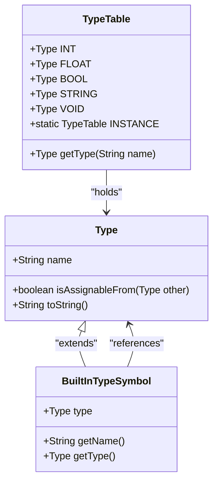
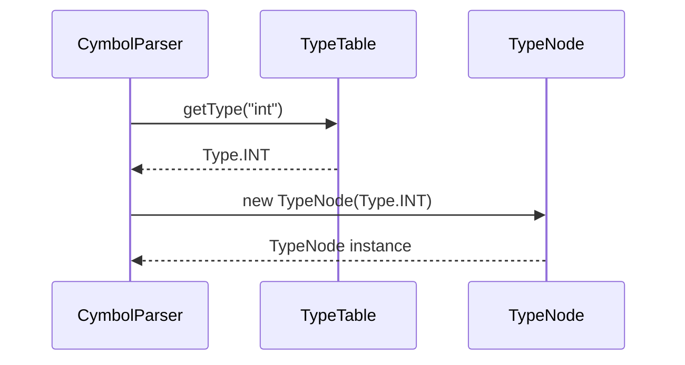
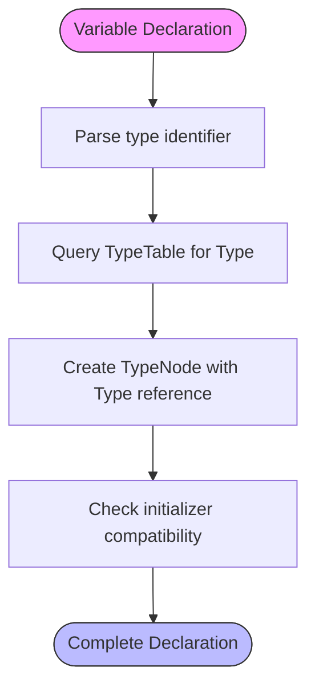
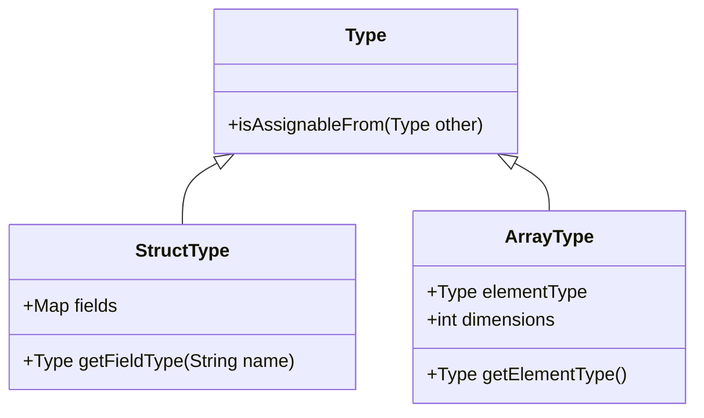

# Data Types

<cite>
**Referenced Files in This Document**  
- [Type.java](file://ep16/src/main/java/org/teachfx/antlr4/ep16/symtab/Type.java)
- [TypeTable.java](file://ep16/src/main/java/org/teachfx/antlr4/ep16/symtab/TypeTable.java)
- [BuiltInTypeSymbol.java](file://ep16/src/main/java/org/teachfx/antlr4/ep16/symtab/BuiltInTypeSymbol.java)
- [VariableSymbol.java](file://ep16/src/main/java/org/teachfx/antlr4/ep16/symtab/VariableSymbol.java)
- [MethodSymbol.java](file://ep16/src/main/java/org/teachfx/antlr4/ep16/symtab/MethodSymbol.java)
- [TypeNode.java](file://ep20/src/main/java/org/teachfx/antlr4/ep20/ast/type/TypeNode.java)
- [TypeChecker.java](file://ep20/src/main/java/org/teachfx/antlr4/ep20/pass/sementic/TypeChecker.java)
- [CymbolParser.java](file://ep16/src/main/java/org/teachfx/antlr4/ep16/parser/CymbolParser.java)
</cite>

## Table of Contents
1. [Introduction](#introduction)
2. [Primitive Data Types](#primitive-data-types)
3. [Type Hierarchy and Internal Representation](#type-hierarchy-and-internal-representation)
4. [TypeTable Registry and BuiltInTypeSymbol](#typetable-registry-and-builtin-typesymbol)
5. [Type Expressions in the AST](#type-expressions-in-the-ast)
6. [Type Declarations and Usage](#type-declarations-and-usage)
7. [Type Compatibility and Conversions](#type-compatibility-and-conversions)
8. [Error Handling for Type Mismatches](#error-handling-for-type-mismatches)
9. [Extensibility for User-Defined Types](#extensibility-for-user-defined-types)
10. [Conclusion](#conclusion)

## Introduction
The Cymbol language implements a statically-typed system that enforces type safety at compile time. This document details the design and implementation of its type system, focusing on primitive types, internal type modeling, and semantic validation mechanisms. The system is built around a hierarchical type model, a centralized type registry, and AST-based type expression representation, enabling robust type checking and future extensibility.

## Primitive Data Types
Cymbol supports the following primitive data types:
- **int**: Signed 32-bit integer
- **float**: 32-bit floating-point number
- **bool**: Boolean value (true/false)
- **string**: Immutable character sequence
- **void**: Denotes absence of value, used primarily in function return types

These types are directly mapped to JVM equivalents during code generation and are enforced through the compiler's semantic analysis phase.

**Section sources**
- [BuiltInTypeSymbol.java](file://ep16/src/main/java/org/teachfx/antlr4/ep16/symtab/BuiltInTypeSymbol.java#L10-L45)
- [Type.java](file://ep16/src/main/java/org/teachfx/antlr4/ep16/symtab/Type.java#L5-L20)

## Type Hierarchy and Internal Representation
The type system is centered around the `Type` class, which serves as the base for all type representations in the compiler. Each type is uniquely identified and compared via reference equality within the `TypeTable` registry. The `Type` hierarchy supports both primitive and composite types, with methods for type compatibility checks and string representation.

**Diagram sources**
- [Type.java](file://ep16/src/main/java/org/teachfx/antlr4/ep16/symtab/Type.java#L1-L30)
- [BuiltInTypeSymbol.java](file://ep16/src/main/java/org/teachfx/antlr4/ep16/symtab/BuiltInTypeSymbol.java#L1-L25)
- [TypeTable.java](file://ep16/src/main/java/org/teachfx/antlr4/ep16/symtab/TypeTable.java#L1-L40)

**Section sources**
- [Type.java](file://ep16/src/main/java/org/teachfx/antlr4/ep16/symtab/Type.java#L1-L50)
- [TypeTable.java](file://ep16/src/main/java/org/teachfx/antlr4/ep16/symtab/TypeTable.java#L1-L60)

## TypeTable Registry and BuiltInTypeSymbol
The `TypeTable` class acts as a singleton registry that ensures each primitive type is represented by exactly one `Type` instance. It predefines constants for all built-in types (int, float, bool, string, void) and provides lookup functionality. The `BuiltInTypeSymbol` class wraps these `Type` instances and integrates them into the symbol table infrastructure, allowing type names to be resolved during parsing and semantic analysis.

This design prevents type duplication and enables efficient type comparison using reference identity. The registry is initialized statically, guaranteeing consistent type representation across compilation units.

**Section sources**
- [TypeTable.java](file://ep16/src/main/java/org/teachfx/antlr4/ep16/symtab/TypeTable.java#L25-L80)
- [BuiltInTypeSymbol.java](file://ep16/src/main/java/org/teachfx/antlr4/ep16/symtab/BuiltInTypeSymbol.java#L30-L60)

## Type Expressions in the AST
Type expressions in Cymbol are represented in the Abstract Syntax Tree (AST) using the `TypeNode` class. Each `TypeNode` holds a reference to a `Type` object obtained from the `TypeTable`. During parsing, when a type identifier (e.g., "int", "float") is encountered, the parser queries the `TypeTable` to resolve the corresponding `Type` instance and attaches it to a `TypeNode`.

This approach decouples syntactic parsing from semantic type resolution, allowing the type checker to validate type usage in variable declarations, function signatures, and expressions.

**Diagram sources**
- [CymbolParser.java](file://ep16/src/main/java/org/teachfx/antlr4/ep16/parser/CymbolParser.java#L100-L130)
- [TypeNode.java](file://ep20/src/main/java/org/teachfx/antlr4/ep20/ast/type/TypeNode.java#L5-L20)
- [TypeTable.java](file://ep16/src/main/java/org/teachfx/antlr4/ep16/symtab/TypeTable.java#L30-L50)

**Section sources**
- [TypeNode.java](file://ep20/src/main/java/org/teachfx/antlr4/ep20/ast/type/TypeNode.java#L1-L35)
- [CymbolParser.java](file://ep16/src/main/java/org/teachfx/antlr4/ep16/parser/CymbolParser.java#L90-L140)

## Type Declarations and Usage
Types are used in two primary contexts: variable declarations and function signatures. In variable declarations, a `TypeNode` is paired with an identifier and optionally an initializer expression. For functions, the return type is specified using a `TypeNode`, and parameters include their own type annotations.

The type system ensures that initializers and return expressions are compatible with their declared types. For example, a variable declared as `int x = 5;` is validated by checking that the literal `5` is assignable to the `int` type.

**Diagram sources**
- [VarDeclNode.java](file://ep20/src/main/java/org/teachfx/antlr4/ep20/ast/decl/VarDeclNode.java#L10-L25)
- [FuncDeclNode.java](file://ep20/src/main/java/org/teachfx/antlr4/ep20/ast/decl/FuncDeclNode.java#L15-L40)
- [TypeChecker.java](file://ep20/src/main/java/org/teachfx/antlr4/ep20/pass/sementic/TypeChecker.java#L50-L100)

**Section sources**
- [VarDeclNode.java](file://ep20/src/main/java/org/teachfx/antlr4/ep20/ast/decl/VarDeclNode.java#L1-L40)
- [FuncDeclNode.java](file://ep20/src/main/java/org/teachfx/antlr4/ep20/ast/decl/FuncDeclNode.java#L1-L50)

## Type Compatibility and Conversions
The Cymbol type system implements strict compatibility rules. Assignment and expression evaluation require that the source type is assignable to the target type. Currently, the system supports only identity compatibility for primitives (e.g., int to int), with no implicit widening conversions.

The `isAssignableFrom` method in the `Type` class governs compatibility checks. For primitive types, this method returns true only when comparing identical types. This strict policy prevents unintended data loss and ensures predictable behavior.

Future extensions may introduce controlled implicit conversions (e.g., int to float) through enhanced type checking logic in the `TypeChecker` visitor.

**Section sources**
- [Type.java](file://ep16/src/main/java/org/teachfx/antlr4/ep16/symtab/Type.java#L25-L40)
- [TypeChecker.java](file://ep20/src/main/java/org/teachfx/antlr4/ep20/pass/sementic/TypeChecker.java#L75-L120)

## Error Handling for Type Mismatches
Type mismatches are detected during the semantic analysis phase by the `TypeChecker` visitor. When an incompatible assignment or expression is encountered, the compiler issues a diagnostic error indicating the expected and actual types.

For example, attempting to assign a float value to an int variable triggers an error with details about the mismatched types. These errors are reported through the compiler's error reporting infrastructure, providing precise location information from the source code.

The system prioritizes early detection of type errors to prevent invalid programs from progressing to code generation.

**Section sources**
- [TypeChecker.java](file://ep20/src/main/java/org/teachfx/antlr4/ep20/pass/sementic/TypeChecker.java#L100-L180)
- [CymbalError.java](file://ep20/src/main/java/org/teachfx/antlr4/ep20/error/CymbalError.java#L20-L50)

## Extensibility for User-Defined Types
The current type system is designed to accommodate future user-defined types such as structs and arrays. The `Type` hierarchy can be extended to support composite types, while the `TypeTable` can be enhanced to register user-defined type symbols.

Struct types would be represented as `StructType` subclasses of `Type`, containing field type information. Array types could be implemented as `ArrayType` with element type and dimension tracking. The `BuiltInTypeSymbol` pattern can be generalized to `UserDefinedTypeSymbol` for custom types.

This extensible architecture ensures that new type features can be integrated without disrupting the core type checking infrastructure.

**Diagram sources**
- [Type.java](file://ep16/src/main/java/org/teachfx/antlr4/ep16/symtab/Type.java#L1-L10)
- [StructSymbol.java](file://ep19/src/main/java/org/teachfx/antlr4/ep19/symtab/symbol/StructSymbol.java#L1-L20)
- [ArrayType.java](file://ep19/src/main/java/org/teachfx/antlr4/ep19/symtab/type/ArrayType.java#L1-L15)

**Section sources**
- [Type.java](file://ep16/src/main/java/org/teachfx/antlr4/ep16/symtab/Type.java#L1-L60)
- [StructSymbol.java](file://ep19/src/main/java/org/teachfx/antlr4/ep19/symtab/symbol/StructSymbol.java#L1-L30)
- [ArrayType.java](file://ep19/src/main/java/org/teachfx/antlr4/ep19/symtab/type/ArrayType.java#L1-L25)

## Conclusion
The Cymbol type system provides a solid foundation for static type checking through its well-defined primitive types, centralized type registry, and AST-integrated type expressions. The design emphasizes type safety, efficient type resolution, and forward compatibility for user-defined types. By leveraging the `TypeTable` and `BuiltInTypeSymbol` patterns, the system ensures consistent type representation and enables robust semantic validation throughout the compilation process.