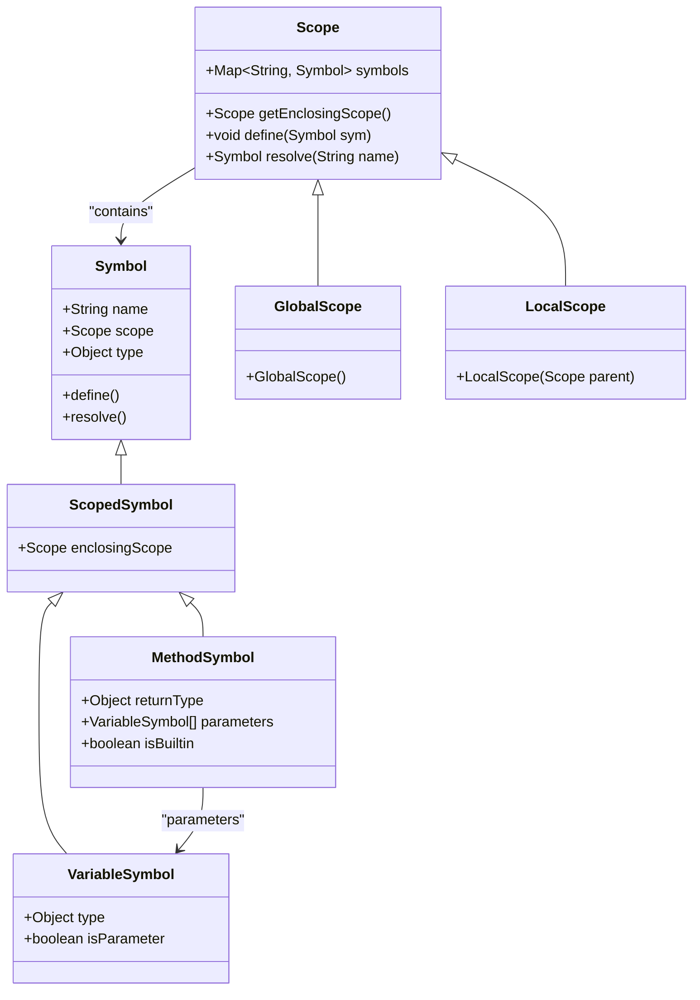
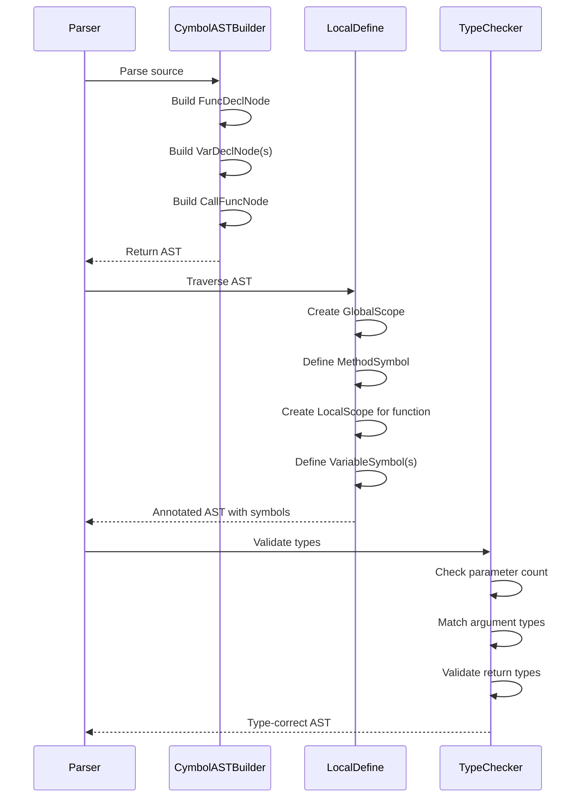

# Functions and Variables

<cite>
**Referenced Files in This Document**  
- [FuncDeclNode.java](file://ep20/src/main/java/org/teachfx/antlr4/ep20/ast/decl/FuncDeclNode.java)
- [CallFuncNode.java](file://ep20/src/main/java/org/teachfx/antlr4/ep20/ast/expr/CallFuncNode.java)
- [VarDeclNode.java](file://ep20/src/main/java/org/teachfx/antlr4/ep20/ast/decl/VarDeclNode.java)
- [VarDeclStmtNode.java](file://ep20/src/main/java/org/teachfx/antlr4/ep20/ast/stmt/VarDeclStmtNode.java)
- [MethodSymbol.java](file://ep20/src/main/java/org/teachfx/antlr4/ep20/symtab/symbol/MethodSymbol.java)
- [VariableSymbol.java](file://ep20/src/main/java/org/teachfx/antlr4/ep20/symtab/symbol/VariableSymbol.java)
- [LocalScope.java](file://ep20/src/main/java/org/teachfx/antlr4/ep20/symtab/scope/LocalScope.java)
- [GlobalScope.java](file://ep20/src/main/java/org/teachfx/antlr4/ep20/symtab/scope/GlobalScope.java)
- [TypeChecker.java](file://ep20/src/main/java/org/teachfx/antlr4/ep20/pass/sementic/TypeChecker.java)
- [CymbolASTBuilder.java](file://ep20/src/main/java/org/teachfx/antlr4/ep20/pass/ast/CymbolASTBuilder.java)
</cite>

## Table of Contents
1. [Function Declaration and Call Semantics](#function-declaration-and-call-semantics)
2. [Variable Declaration and Scoping](#variable-declaration-and-scoping)
3. [Symbol Table Management](#symbol-table-management)
4. [Scoping and Name Resolution](#scoping-and-name-resolution)
5. [Function Signature Validation](#function-signature-validation)
6. [Examples and Usage Patterns](#examples-and-usage-patterns)
7. [AST Representation and Source Mapping](#ast-representation-and-source-mapping)

## Function Declaration and Call Semantics

The Cymbol language supports structured function declarations through the `FuncDeclNode` AST node, which captures the complete syntactic structure of a function definition. Functions are declared with a return type, identifier, parameter list, and body block. The parameter list is represented as a sequence of `VarDeclNode` instances, each specifying a parameter’s type and name.

Function calls are modeled using the `CallFuncNode`, which contains a reference to the callee (via identifier) and a list of argument expressions. During semantic analysis, the compiler resolves the target function symbol and validates that the number and types of arguments match the declared parameter list.

Return types are explicitly declared and enforced during type checking. The compiler ensures that all control paths in a non-void function yield a return value of the correct type. Recursive function calls are permitted and handled naturally through symbol resolution and type validation.

**Section sources**
- [FuncDeclNode.java](file://ep20/src/main/java/org/teachfx/antlr4/ep20/ast/decl/FuncDeclNode.java#L1-L50)
- [CallFuncNode.java](file://ep20/src/main/java/org/teachfx/antlr4/ep20/ast/expr/CallFuncNode.java#L1-L40)

## Variable Declaration and Scoping

Variables in Cymbol are declared using `VarDeclNode` for individual declarations and `VarDeclStmtNode` for statement-level variable declarations within blocks. Two primary scopes exist: global and local. Global variables are declared outside any function and are accessible throughout the program. Local variables are declared within function bodies and have block-level scope.

Each `VarDeclNode` carries a type specifier and an optional initializer. The AST representation preserves the declaration order and nesting structure, enabling accurate scope tracking during semantic analysis. The `VarDeclStmtNode` wraps a list of `VarDeclNode` instances and serves as a container within the statement hierarchy of the AST.

**Section sources**
- [VarDeclNode.java](file://ep20/src/main/java/org/teachfx/antlr4/ep20/ast/decl/VarDeclNode.java#L1-L35)
- [VarDeclStmtNode.java](file://ep20/src/main/java/org/teachfx/antlr4/ep20/ast/stmt/VarDeclStmtNode.java#L1-L25)

## Symbol Table Management

Symbol creation and management are central to the Cymbol compiler’s semantic analysis phase. Symbols are instances of classes derived from the base `Symbol` class, with `MethodSymbol` representing functions and `VariableSymbol` representing variables.

When a function is declared, a `MethodSymbol` is created and inserted into the current scope (typically global for top-level functions). The symbol stores the function’s name, return type, parameter list (as `VariableSymbol` instances), and reference to its AST node. Similarly, variable declarations result in `VariableSymbol` instances being added to the appropriate scope.

The symbol table is implemented as a hierarchical scope chain, where each scope (global, local) can contain symbols and delegate unresolved lookups to its parent. This structure supports nested scoping and shadowing rules.

**Diagram sources**
- [Symbol.java](file://ep20/src/main/java/org/teachfx/antlr4/ep20/symtab/symbol/Symbol.java#L1-L20)
- [VariableSymbol.java](file://ep20/src/main/java/org/teachfx/antlr4/ep20/symtab/symbol/VariableSymbol.java#L1-L30)
- [MethodSymbol.java](file://ep20/src/main/java/org/teachfx/antlr4/ep20/symtab/symbol/MethodSymbol.java#L1-L40)
- [Scope.java](file://ep20/src/main/java/org/teachfx/antlr4/ep20/symtab/scope/Scope.java#L1-L25)
- [GlobalScope.java](file://ep20/src/main/java/org/teachfx/antlr4/ep20/symtab/scope/GlobalScope.java#L1-L15)
- [LocalScope.java](file://ep20/src/main/java/org/teachfx/antlr4/ep20/symtab/scope/LocalScope.java#L1-L20)

**Section sources**
- [MethodSymbol.java](file://ep20/src/main/java/org/teachfx/antlr4/ep20/symtab/symbol/MethodSymbol.java#L1-L50)
- [VariableSymbol.java](file://ep20/src/main/java/org/teachfx/antlr4/ep20/symtab/symbol/VariableSymbol.java#L1-L40)

## Scoping and Name Resolution

Cymbol employs lexical scoping with a hierarchical scope stack. The `LocalDefine` pass traverses the AST and creates scopes for functions and blocks, populating them with declared symbols. The `LocalResolver` pass then resolves all identifiers by searching the current scope and its ancestors.

Name resolution follows a strict lookup order: local scope first, then enclosing function scope, then global scope. If no symbol is found, a compilation error is issued. Shadowing is allowed—inner declarations can hide outer ones—but the compiler tracks this for debugging and analysis purposes.

Variable lifetime is tied to scope: global variables exist for the program duration, while local variables are created upon block entry and destroyed upon exit. The AST and symbol table together ensure correct binding and lifetime tracking.

**Section sources**
- [LocalScope.java](file://ep20/src/main/java/org/teachfx/antlr4/ep20/symtab/scope/LocalScope.java#L1-L30)
- [GlobalScope.java](file://ep20/src/main/java/org/teachfx/antlr4/ep20/symtab/scope/GlobalScope.java#L1-L20)
- [LocalDefine.java](file://ep20/src/main/java/org/teachfx/antlr4/ep20/pass/symtab/LocalDefine.java#L1-L60)
- [LocalResolver.java](file://ep20/src/main/java/org/teachfx/antlr4/ep20/pass/ast/ASTBaseVisitor.java#L1-L100)

## Function Signature Validation

The `TypeChecker` pass validates function signatures during semantic analysis. For each function call (`CallFuncNode`), the compiler resolves the target `MethodSymbol` and compares the argument count and types against the parameter list. Type coercion and compatibility rules are applied based on the language’s type system.

Return type consistency is enforced: the expression in a `return` statement must match the function’s declared return type. The checker also verifies that non-void functions have a return statement on all execution paths.

Parameter types are checked at declaration time, ensuring that only valid types are used. The symbol table enables efficient lookup and validation across function definitions and calls.

**Section sources**
- [TypeChecker.java](file://ep20/src/main/java/org/teachfx/antlr4/ep20/pass/sementic/TypeChecker.java#L1-L120)
- [FuncDeclNode.java](file://ep20/src/main/java/org/teachfx/antlr4/ep20/ast/decl/FuncDeclNode.java#L1-L50)
- [CallFuncNode.java](file://ep20/src/main/java/org/teachfx/antlr4/ep20/ast/expr/CallFuncNode.java#L1-L40)

## Examples and Usage Patterns

The following patterns are supported in Cymbol:

- Functions with zero or multiple parameters of mixed types
- Recursive function calls (e.g., factorial, Fibonacci)
- Local variable declarations with initializers
- Nested function scopes with variable shadowing
- Functions returning primitive types (int, float, bool)

These constructs are validated through the AST and symbol table infrastructure, ensuring correctness at compile time.

**Diagram sources**
- [CymbolASTBuilder.java](file://ep20/src/main/java/org/teachfx/antlr4/ep20/pass/ast/CymbolASTBuilder.java#L1-L80)
- [LocalDefine.java](file://ep20/src/main/java/org/teachfx/antlr4/ep20/pass/symtab/LocalDefine.java#L1-L60)
- [TypeChecker.java](file://ep20/src/main/java/org/teachfx/antlr4/ep20/pass/sementic/TypeChecker.java#L1-L120)

## AST Representation and Source Mapping

The AST nodes `FuncDeclNode`, `CallFuncNode`, `VarDeclNode`, and `VarDeclStmtNode` directly mirror the source-level constructs. Each node retains source location information (line, column) for error reporting and debugging.

The `CompileUnit` serves as the root of the AST, containing a list of top-level declarations including functions and global variables. The hierarchical structure enables systematic traversal for symbol collection, type checking, and code generation.

This close correspondence between source syntax and AST structure simplifies compiler passes and ensures accurate semantic analysis.

**Section sources**
- [FuncDeclNode.java](file://ep20/src/main/java/org/teachfx/antlr4/ep20/ast/decl/FuncDeclNode.java#L1-L50)
- [CallFuncNode.java](file://ep20/src/main/java/org/teachfx/antlr4/ep20/ast/expr/CallFuncNode.java#L1-L40)
- [VarDeclNode.java](file://ep20/src/main/java/org/teachfx/antlr4/ep20/ast/decl/VarDeclNode.java#L1-L35)
- [CompileUnit.java](file://ep20/src/main/java/org/teachfx/antlr4/ep20/ast/CompileUnit.java#L1-L20)