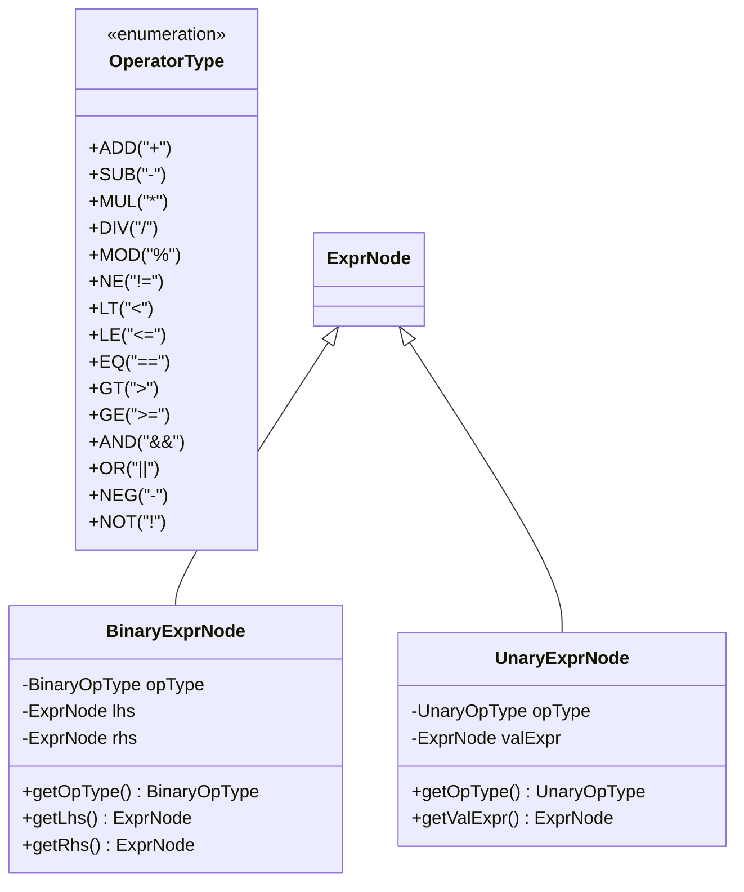
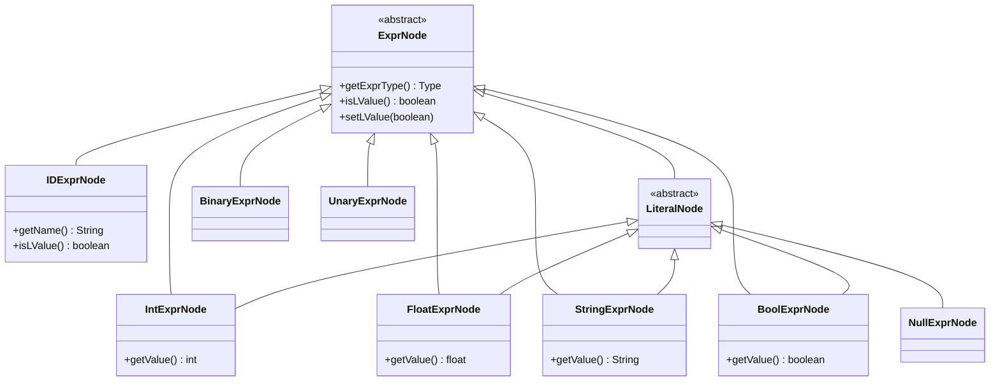

# Operators and Expressions

<cite>
**Referenced Files in This Document**   
- [BinaryExprNode.java](file://ep20/src/main/java/org/teachfx/antlr4/ep20/ast/expr/BinaryExprNode.java)
- [UnaryExprNode.java](file://ep20/src/main/java/org/teachfx/antlr4/ep20/ast/expr/UnaryExprNode.java)
- [OperatorType.java](file://ep20/src/main/java/org/teachfx/antlr4/ep20/symtab/type/OperatorType.java)
- [ExprNode.java](file://ep20/src/main/java/org/teachfx/antlr4/ep20/ast/expr/ExprNode.java)
- [TypeChecker.java](file://ep20/src/main/java/org/teachfx/antlr4/ep20/pass/sematic/TypeChecker.java)
</cite>

## Table of Contents
1. [Expression Evaluation and AST Representation](#expression-evaluation-and-ast-representation)
2. [Supported Operators and Operator Semantics](#supported-operators-and-operator-semantics)
3. [Operator Precedence and Associativity](#operator-precedence-and-associativity)
4. [Expression Types and AST Hierarchy](#expression-types-and-ast-hierarchy)
5. [OperatorType and Type System Integration](#operatortype-and-type-system-integration)
6. [Type Checking and Operand Validation](#type-checking-and-operand-validation)
7. [Intermediate Code Generation for Expressions](#intermediate-code-generation-for-expressions)
8. [Special Expression Forms](#special-expression-forms)

## Expression Evaluation and AST Representation

The Cymbol language implements expression evaluation through a structured Abstract Syntax Tree (AST) hierarchy rooted in the `ExprNode` class. Each expression node in the AST encapsulates semantic and syntactic information necessary for type checking, code generation, and runtime evaluation. The base `ExprNode` class provides common functionality such as type information storage via `TypeNode`, l-value tracking, and visitor pattern support for traversal.

Expression evaluation follows a recursive descent model where compound expressions are decomposed into constituent sub-expressions, each represented by specialized AST nodes. This design enables modular processing during semantic analysis and code generation phases of compilation.

**Section sources**
- [ExprNode.java](file://ep20/src/main/java/org/teachfx/antlr4/ep20/ast/expr/ExprNode.java#L1-L42)

## Supported Operators and Operator Semantics

The Cymbol language supports a comprehensive set of operators categorized into binary and unary operations, as defined in the `OperatorType` class. These operators are implemented through dedicated AST node types that capture both syntactic structure and semantic intent.

### Binary Operators
Binary operators are implemented via the `BinaryExprNode` class and include:
- **Arithmetic**: `+` (ADD), `-` (SUB), `*` (MUL), `/` (DIV), `%` (MOD)
- **Relational**: `<` (LT), `<=` (LE), `==` (EQ), `!=` (NE), `>` (GT), `>=` (GE)
- **Logical**: `&&` (AND), `||` (OR)

### Unary Operators
Unary operators are handled by the `UnaryExprNode` class and include:
- **Arithmetic Negation**: `-` (NEG)
- **Logical Negation**: `!` (NOT)

Each operator is represented by an enum constant in `OperatorType.BinaryOpType` or `OperatorType.UnaryOpType`, which stores the corresponding textual representation (e.g., "+" for ADD) and provides parsing utilities through `fromString()` methods.

**Diagram sources**
- [OperatorType.java](file://ep20/src/main/java/org/teachfx/antlr4/ep20/symtab/type/OperatorType.java#L5-L59)
- [BinaryExprNode.java](file://ep20/src/main/java/org/teachfx/antlr4/ep20/ast/expr/BinaryExprNode.java#L1-L97)
- [UnaryExprNode.java](file://ep20/src/main/java/org/teachfx/antlr4/ep20/ast/expr/UnaryExprNode.java#L1-L57)

**Section sources**
- [OperatorType.java](file://ep20/src/main/java/org/teachfx/antlr4/ep20/symtab/type/OperatorType.java#L1-L60)
- [BinaryExprNode.java](file://ep20/src/main/java/org/teachfx/antlr4/ep20/ast/expr/BinaryExprNode.java#L1-L97)
- [UnaryExprNode.java](file://ep20/src/main/java/org/teachfx/antlr4/ep20/ast/expr/UnaryExprNode.java#L1-L57)

## Operator Precedence and Associativity

While explicit precedence and associativity rules are not encoded directly in the AST nodes, the parser's grammar structure enforces operator precedence during AST construction. The hierarchy of grammar rules ensures that higher-precedence operators (e.g., multiplication) are nested deeper in the AST than lower-precedence operators (e.g., addition).

The effective precedence order from highest to lowest is:
1. Unary operators (`-`, `!`)
2. Multiplicative operators (`*`, `/`, `%`)
3. Additive operators (`+`, `-`)
4. Relational operators (`<`, `<=`, `==`, `!=`, `>`, `>=`)
5. Logical AND (`&&`)
6. Logical OR (`||`)

All binary operators are left-associative, meaning expressions like `a - b - c` are parsed as `((a - b) - c)`. This associativity is naturally captured in the AST structure through left-deep trees.

**Section sources**
- [BinaryExprNode.java](file://ep20/src/main/java/org/teachfx/antlr4/ep20/ast/expr/BinaryExprNode.java#L1-L97)
- [UnaryExprNode.java](file://ep20/src/main/java/org/teachfx/antlr4/ep20/ast/expr/UnaryExprNode.java#L1-L57)

## Expression Types and AST Hierarchy

The Cymbol AST implements a type hierarchy for expressions rooted in the abstract `ExprNode` class. Specific expression types are represented by dedicated subclasses that capture their unique characteristics:

**Diagram sources**
- [ExprNode.java](file://ep20/src/main/java/org/teachfx/antlr4/ep20/ast/expr/ExprNode.java#L1-L42)
- [BinaryExprNode.java](file://ep20/src/main/java/org/teachfx/antlr4/ep20/ast/expr/BinaryExprNode.java#L1-L97)
- [UnaryExprNode.java](file://ep20/src/main/java/org/teachfx/antlr4/ep20/ast/expr/UnaryExprNode.java#L1-L57)

**Section sources**
- [ExprNode.java](file://ep20/src/main/java/org/teachfx/antlr4/ep20/ast/expr/ExprNode.java#L1-L42)

## OperatorType and Type System Integration

The `OperatorType` class serves as a central registry for all supported operators in the Cymbol language, integrating tightly with the type system. Each operator enum constant provides metadata about the operator's textual representation through `getOpRawVal()` and enables parsing via `fromString()`.

This design allows the type checker and code generator to uniformly handle operators by their semantic type rather than their textual form. The separation of operator semantics from syntax facilitates consistent type checking and enables potential operator overloading mechanisms in future extensions.

The `OperatorType` class is referenced directly by `BinaryExprNode` and `UnaryExprNode` to store the specific operator being applied, ensuring type safety and enabling compile-time validation of operator usage.

**Section sources**
- [OperatorType.java](file://ep20/src/main/java/org/teachfx/antlr4/ep20/symtab/type/OperatorType.java#L1-L60)
- [BinaryExprNode.java](file://ep20/src/main/java/org/teachfx/antlr4/ep20/ast/expr/BinaryExprNode.java#L1-L97)
- [UnaryExprNode.java](file://ep20/src/main/java/org/teachfx/antlr4/ep20/ast/expr/UnaryExprNode.java#L1-L57)

## Type Checking and Operand Validation

Type checking for expressions is implemented in the `TypeChecker` class, which extends `ASTBaseVisitor` to traverse the expression AST. The type checker validates operand types according to operator semantics and enforces type compatibility rules.

For binary operators, the type checker ensures that both operands are of compatible types (e.g., arithmetic operators require numeric types, relational operators require comparable types). The result type of a binary expression is typically derived from the operand types, with `getExprType()` in `BinaryExprNode` currently returning the type of the left-hand operand.

Unary operators have specific type requirements: the negation operator (`-`) requires a numeric operand, while the logical negation operator (`!`) requires a boolean operand. These constraints are enforced during the type checking phase.

The current implementation provides the visitor infrastructure for type checking, with specific validation logic to be implemented in overridden visit methods for each expression type.

**Section sources**
- [TypeChecker.java](file://ep20/src/main/java/org/teachfx/antlr4/ep20/pass/sematic/TypeChecker.java#L1-L106)
- [BinaryExprNode.java](file://ep20/src/main/java/org/teachfx/antlr4/ep20/ast/expr/BinaryExprNode.java#L1-L97)
- [UnaryExprNode.java](file://ep20/src/main/java/org/teachfx/antlr4/ep20/ast/expr/UnaryExprNode.java#L1-L57)

## Intermediate Code Generation for Expressions

Expression evaluation is translated into intermediate code through the AST visitor pattern. Each expression node accepts a visitor that generates appropriate three-address code or virtual machine instructions based on the operator and operand types.

The code generation process follows the structure of the AST, with compound expressions generating sequences of instructions that evaluate sub-expressions and apply operators. For example, the expression `a + b * c` would generate code that first computes `b * c`, then adds the result to `a`.

The `BinaryExprNode` and `UnaryExprNode` classes provide the structural information needed for code generation, including operator type and operand references. The generated code respects operator precedence and associativity as encoded in the AST structure.

**Section sources**
- [BinaryExprNode.java](file://ep20/src/main/java/org/teachfx/antlr4/ep20/ast/expr/BinaryExprNode.java#L1-L97)
- [UnaryExprNode.java](file://ep20/src/main/java/org/teachfx/antlr4/ep20/ast/expr/UnaryExprNode.java#L1-L57)

## Special Expression Forms

The current implementation does not explicitly support ternary conditional expressions (`condition ? trueExpr : falseExpr`) or short-circuit evaluation as distinct AST node types. However, the language could support these features through existing control flow constructs.

Logical operators `&&` and `||` are implemented as standard binary operators without explicit short-circuit semantics in the AST. Any short-circuit behavior would need to be implemented during code generation by generating conditional jumps rather than eager evaluation.

Future extensions could introduce dedicated AST nodes for ternary operations and implement short-circuit evaluation through specialized code generation patterns that respect the left-to-right evaluation order and early termination semantics.

**Section sources**
- [BinaryExprNode.java](file://ep20/src/main/java/org/teachfx/antlr4/ep20/ast/expr/BinaryExprNode.java#L1-L97)
- [UnaryExprNode.java](file://ep20/src/main/java/org/teachfx/antlr4/ep20/ast/expr/UnaryExprNode.java#L1-L57)