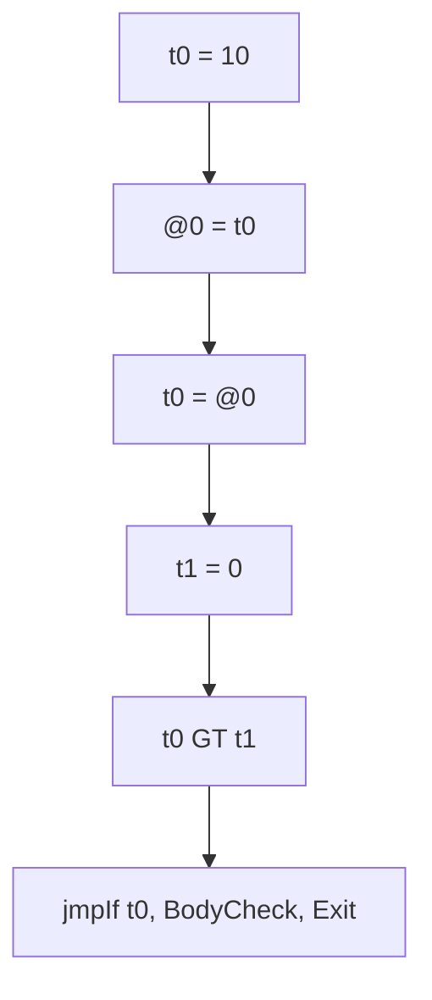
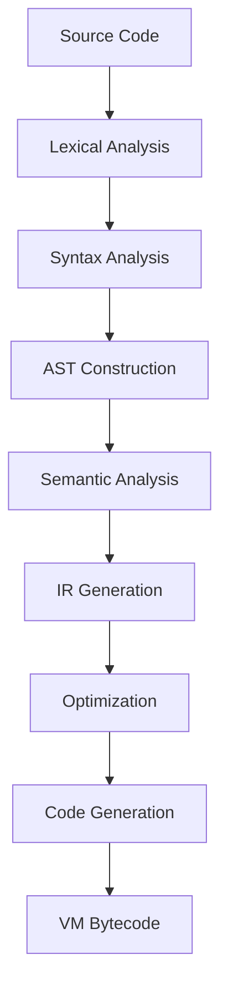

# Development Guide

<cite>
**Referenced Files in This Document**   
- [README.md](file://README.md)
- [README_EN.md](file://README_EN.md)
- [ep20/README.md](file://ep20/README.md)
- [ep20/docs/project-architecture.md](file://ep20/docs/project-architecture.md)
- [ep20/pom.xml](file://ep20/pom.xml)
- [ep19/README.md](file://ep19/README.md)
- [scripts/run.sh](file://scripts/run.sh)
- [ep20/docs/compilation-sequence.md](file://ep20/docs/compilation-sequence.md)
- [ep20/docs/module-interaction.md](file://ep20/docs/module-interaction.md)
- [ep20/docs/tdd_implementation_steps.md](file://ep20/docs/tdd_implementation_steps.md)
- [ep20/docs/tdd_improvement_tasks.md](file://ep20/docs/tdd_improvement_tasks.md)
- [ep20/docs/tdd_test_case_guide.md](file://ep20/docs/tdd_test_case_guide.md)
- [ep18/VM_Design.md](file://ep18/VM_Design.md)
</cite>

## Table of Contents
1. [Introduction](#introduction)
2. [Development Environment Setup](#development-environment-setup)
3. [Project Building](#project-building)
4. [Contribution Process](#contribution-process)
5. [Coding Standards and Style Guidelines](#coding-standards-and-style-guidelines)
6. [Debugging Tips](#debugging-tips)
7. [Extending the Compiler](#extending-the-compiler)
8. [Backward Compatibility](#backward-compatibility)
9. [Documentation and Examples](#documentation-and-examples)
10. [Versioning and Release Management](#versioning-and-release-management)

## Introduction

The Cymbol compiler project is an educational compiler framework built on ANTLR4, demonstrating modern compiler construction techniques through 21 evolutionary episodes (EP1-EP21). The framework progresses from simple lexical analyzers to a complete compiler with JIT compilation capabilities. This development guide provides comprehensive information for contributors working on the compiler framework, covering setup, contribution workflows, coding standards, debugging, extension mechanisms, and release practices.

**Section sources**
- [README.md](file://README.md#L1-L250)
- [README_EN.md](file://README_EN.md#L1-L147)

## Development Environment Setup

### Prerequisites
The project requires the following environment setup:
- **Java**: JDK 11 or higher (OpenJDK 18+ recommended)
- **Build Tool**: Maven 3.6 or higher (3.8+ recommended)
- **Parser Generator**: ANTLR4 runtime (managed via Maven dependencies)
- **Version Control**: Git

### Initial Setup
1. Clone the repository:
```bash
git clone https://github.com/your-org/cymbol-compiler.git
cd cymbol-compiler
```

2. Verify Java installation:
```bash
java -version
# Should show Java 11+ or OpenJDK 18+
```

3. Verify Maven installation:
```bash
mvn -version
# Should show Maven 3.6+
```

### Project Structure Navigation
The repository contains 21 episodes (ep1-ep21), each representing an evolutionary stage:
- **ep1-ep10**: Interpreter phase
- **ep11-ep20**: Compiler phase with intermediate representation and optimization
- **ep21**: JIT compilation phase

For full compiler development, focus on ep20 as it contains the complete implementation.

### Helper Scripts
The project provides convenience scripts in the `scripts/` directory:
- `run.sh`: Main development script for compiling, running, and testing modules
- `run.py`: Python alternative for cross-platform compatibility
- `run.bat`, `run.ps1`: Windows batch and PowerShell scripts

The `run.sh` script supports the following commands:
```bash
./scripts/run.sh compile <module>    # Compile a module
./scripts/run.sh run <module>        # Run a module's main class
./scripts/run.sh test <module>       # Run tests for a module
./scripts/run.sh clean <module>      # Clean a module
./scripts/run.sh help                # Show help
```

Example usage:
```bash
./scripts/run.sh compile ep20
./scripts/run.sh run ep20 "src/main/resources/t.cymbol"
./scripts/run.sh test ep19
```

**Section sources**
- [README_EN.md](file://README_EN.md#L100-L147)
- [ep20/README.md](file://ep20/README.md#L1-L294)
- [scripts/run.sh](file://scripts/run.sh)

## Project Building

### Build Process
The project uses Maven as its build system with a multi-module structure. Each episode directory (ep*) is an independent Maven module.

1. Clean and install the entire project:
```bash
mvn clean install
```

2. Build a specific module (e.g., ep20):
```bash
cd ep20
mvn clean package
```

3. Build with dependencies included:
```bash
mvn clean package
# Creates JAR with dependencies in target/ directory
```

### Running the Compiler
After building, the compiler can be executed in several ways:

1. Using the convenience script:
```bash
./scripts/run.sh run ep20 "input.cymbol"
```

2. Using Maven exec plugin:
```bash
mvn exec:java -pl ep20 -Dexec.args="src/main/resources/t.cymbol"
```

3. Direct Java execution:
```bash
java -cp ep20/target/classes org.teachfx.antlr4.ep20.Compiler input.cymbol
```

### Testing
The project includes comprehensive test suites with high coverage:

1. Run all tests:
```bash
mvn test
```

2. Run specific test class:
```bash
mvn test -Dtest=LiteralExprNodeTest
```

3. Run specific test method:
```bash
mvn test -Dtest=LiteralExprNodeTest#testIntegerLiteralValue
```

4. Run tests with specific tags:
```bash
mvn test -Dgroups=ast
```

### Code Quality Checks
The project includes tools for maintaining code quality:

1. Generate test coverage report:
```bash
mvn jacoco:report
```

2. Check code style:
```bash
mvn checkstyle:check
```

3. Analyze code quality:
```bash
mvn spotbugs:check
```

**Section sources**
- [README.md](file://README.md#L200-L250)
- [ep20/README.md](file://ep20/README.md#L250-L294)
- [ep20/pom.xml](file://ep20/pom.xml)

## Contribution Process

### Branching Strategy
The project follows a feature-branch workflow:

1. Fork the repository on GitHub
2. Create a feature branch from the main branch:
```bash
git checkout -b feature/your-feature-name
```
3. Implement your changes with regular commits
4. Push your branch to your fork:
```bash
git push origin feature/your-feature-name
```
5. Create a Pull Request (PR) from your branch to the main repository

### Code Review Process
All contributions must go through code review:

1. PRs should have clear descriptions explaining:
   - Purpose of the change
   - Implementation approach
   - Any design decisions made
   - Testing strategy

2. Reviewers will check for:
   - Code quality and adherence to style guidelines
   - Test coverage and correctness
   - Documentation updates
   - Backward compatibility
   - Performance implications

3. Address feedback by pushing additional commits to the same branch
4. The PR will be merged once approved by at least one maintainer

### Pull Request Workflow
1. Ensure all tests pass locally before submitting
2. Include appropriate test cases for new functionality
3. Update documentation if API or behavior changes
4. Reference any related issues in the PR description
5. Wait for review feedback and address comments
6. Once approved, maintainers will merge the PR

### Contribution Requirements
All contributions must meet the following requirements:
- Follow project coding standards
- Include comprehensive test cases
- Update relevant documentation
- Ensure all existing tests continue to pass
- Maintain backward compatibility when possible
- Include performance considerations for significant changes

**Section sources**
- [README.md](file://README.md#L200-L250)
- [ep20/README.md](file://ep20/README.md#L280-L294)

## Coding Standards and Style Guidelines

### Java Coding Standards
The project follows standard Java conventions with the following specifics:

1. **Naming Conventions**:
   - Classes: PascalCase (e.g., `ASTNode`, `SymbolTable`)
   - Methods: camelCase (e.g., `acceptVisitor`, `resolveSymbol`)
   - Variables: camelCase (e.g., `currentScope`, `symbolName`)
   - Constants: UPPER_SNAKE_CASE (e.g., `MAX_RECURSION_DEPTH`)

2. **Code Formatting**:
   - 4 spaces for indentation (no tabs)
   - Maximum line length: 120 characters
   - Braces on same line for control structures
   - Empty lines to separate logical code blocks

3. **Documentation**:
   - JavaDoc for all public classes and methods
   - Clear method documentation including parameters, return values, and exceptions
   - Class-level documentation explaining purpose and usage

### Design Patterns
The compiler framework extensively uses design patterns:

#### Visitor Pattern
Used for AST and IR traversal:
```java
public interface ASTVisitor {
    void visit(BinaryExprNode node);
    void visit(IfStmtNode node);
    // ... other visit methods
}
```

#### Singleton Pattern
Applied to global state managers:
- `SymbolTable`: Global symbol table instance
- `TypeTable`: Global type registry

#### Strategy Pattern
Used for pluggable components:
- `IOperatorEmitter`: Interface for different code generation strategies
- `IFlowOptimizer`: Interface for optimization algorithms

#### Factory Pattern
Used for object creation:
- `IRBuilder`: Creates IR nodes
- `CFGBuilder`: Creates control flow graph components

### Error Handling
The project uses a comprehensive error handling system:

1. **Error Classification**:
   - Lexical errors
   - Syntax errors
   - Semantic errors
   - Type errors
   - Runtime errors

2. **Error Reporting**:
   - Detailed error messages with context
   - Source location tracking (file, line, column)
   - Phase-specific error categorization

3. **Error Classes**:
   - `CymbalError`: Base error class with message, location, and phase
   - `ErrorIssuer`: Manages error collection and reporting

### Testing Guidelines
The project follows test-driven development (TDD) principles:

1. **Test Structure**:
   - Unit tests for individual classes
   - Integration tests for module interactions
   - End-to-end tests for complete compilation pipeline

2. **Test Coverage**:
   - Target > 95% coverage for core modules
   - 100% pass rate required
   - Mutation testing encouraged for critical components

3. **Test Organization**:
   - Tests mirror source package structure
   - Clear test method names describing what is tested
   - Parameterized tests for multiple input cases

**Section sources**
- [ep20/docs/project-architecture.md](file://ep20/docs/project-architecture.md#L1-L624)
- [ep20/README.md](file://ep20/README.md#L280-L294)

## Debugging Tips

### Debugging Tools
The compiler framework includes several debugging utilities:

#### AST Dumper
Visualizes the abstract syntax tree:
```java
Dumper dumper = new Dumper();
dumper.visit(astRoot);
// Outputs indented tree representation
```

#### IR Viewer
Displays intermediate representation:
```java
// Generates graph_0_origin.md and graph_0_optimized.md
// Contains Mermaid-formatted control flow graphs
```

#### Control Flow Graph Visualization
Generates Mermaid diagrams of control flow:


### Common Issues and Solutions

#### Issue: Compilation Fails with "Class Not Found"
**Symptoms**: `ClassNotFoundException` when running the compiler
**Solution**:
1. Ensure proper classpath setup
2. Verify Maven build completed successfully
3. Check that the main class is correctly specified

#### Issue: Syntax Errors in Valid Code
**Symptoms**: Parser rejects syntactically correct Cymbol code
**Solution**:
1. Check ANTLR4 grammar rules in `Cymbol.g4`
2. Verify lexer and parser were regenerated after grammar changes
3. Use ANTLR4 plugin tools to test grammar interactively

#### Issue: Type Checking Failures
**Symptoms**: Valid type operations rejected by type checker
**Solution**:
1. Verify type compatibility rules in `TypeChecker`
2. Check symbol resolution in nested scopes
3. Validate type table registration

#### Issue: Incorrect Code Generation
**Symptoms**: Generated bytecode produces wrong results
**Solution**:
1. Examine IR output for correctness
2. Check control flow graph construction
3. Verify instruction emission in `CymbolAssembler`

### Debugging Workflow
1. **Reproduce the Issue**: Create a minimal test case
2. **Check AST**: Use AST dumper to verify parse result
3. **Examine IR**: Review intermediate representation
4. **Analyze CFG**: Check control flow graph structure
5. **Inspect Bytecode**: Compare generated instructions with expected
6. **Add Logging**: Use debug output to trace execution

### Logging Configuration
The project uses Log4j2 for logging. Configure `log4j2.xml` to enable different log levels:

```xml
<Configuration>
    <Loggers>
        <Logger name="org.teachfx.antlr4.ep20" level="DEBUG"/>
        <Root level="INFO"/>
    </Loggers>
</Configuration>
```

Set log levels to:
- `ERROR`: Critical failures only
- `WARN`: Potential issues
- `INFO`: General execution flow
- `DEBUG`: Detailed debugging information
- `TRACE`: Maximum verbosity

**Section sources**
- [ep20/docs/project-architecture.md](file://ep20/docs/project-architecture.md#L500-L624)
- [ep20/README.md](file://ep20/README.md#L150-L250)

## Extending the Compiler

### Adding New Language Features

#### 1. Grammar Modification
To add new syntax, modify the ANTLR4 grammar file:

1. Update `Cymbol.g4` with new rules:
```antlr
// Add new expression type
expression : expression PLUS expression
          | expression MINUS expression
          | NEW_FEATURE expression  // New feature
          | primary
          ;

// Add new statement type
statement : IF LPAREN expression RPAREN statement
         | WHILE LPAREN expression RPAREN statement
         | NEW_STATEMENT SEMI      // New statement
         | ...
         ;
```

2. Regenerate lexer and parser:
```bash
mvn compile
# ANTLR4 plugin automatically regenerates files
```

#### 2. AST Node Creation
Add corresponding AST nodes:

1. Create new node class in `ast/expr/` or `ast/stmt/`:
```java
public class NewFeatureNode extends ExprNode {
    private ExprNode operand;
    
    public NewFeatureNode(ExprNode operand, Location location) {
        super(location);
        this.operand = operand;
    }
    
    @Override
    public void accept(ASTVisitor visitor) {
        visitor.visit(this);
    }
    
    // Getters and setters
}
```

2. Update `ASTVisitor` interface:
```java
public interface ASTVisitor {
    void visit(NewFeatureNode node);
    // ... other methods
}
```

#### 3. Semantic Analysis
Extend type checking and symbol resolution:

1. Update `TypeChecker`:
```java
@Override
public void visit(NewFeatureNode node) {
    node.getOperand().accept(this);
    
    // Validate operand type
    Type operandType = node.getOperand().getType();
    if (!isValidOperandType(operandType)) {
        errorIssuer.issueError(
            new CymbalError(
                "Invalid operand type for new feature",
                node.getLocation(),
                Phase.SEMANTIC
            )
        );
    }
    
    // Set result type
    node.setType(determineResultType(operandType));
}
```

### Adding Optimization Passes

#### 1. Control Flow Optimization
Implement new optimization algorithms:

1. Create optimizer class implementing `IFlowOptimizer`:
```java
public class NewOptimizationPass implements IFlowOptimizer {
    private ErrorIssuer errorIssuer;
    
    public NewOptimizationPass(ErrorIssuer errorIssuer) {
        this.errorIssuer = errorIssuer;
    }
    
    @Override
    public void optimize(CFG cfg) {
        // Implement optimization logic
        optimizeBasicBlocks(cfg.getBlocks());
        eliminateRedundantOperations(cfg);
        updateControlFlowEdges(cfg);
    }
    
    private void optimizeBasicBlocks(List<BasicBlock> blocks) {
        // Optimization implementation
    }
}
```

2. Register optimizer in compilation pipeline:
```java
public class CompilerPipeline {
    private List<IFlowOptimizer> optimizers;
    
    public CompilerPipeline() {
        optimizers = new ArrayList<>();
        optimizers.add(new ControlFlowAnalysis(errorIssuer));
        optimizers.add(new LivenessAnalysis(errorIssuer));
        optimizers.add(new NewOptimizationPass(errorIssuer)); // Add new optimizer
    }
}
```

#### 2. IR-Level Optimization
Transform intermediate representation:

1. Create IR transformation pass:
```java
public class IRTransformationPass {
    public void transform(Prog irProgram) {
        List<Stmt> stmts = irProgram.getBlockList();
        
        for (int i = 0; i < stmts.size(); i++) {
            Stmt stmt = stmts.get(i);
            
            if (stmt instanceof BinExpr && isOptimizable((BinExpr) stmt)) {
                Stmt optimized = createOptimizedStatement((BinExpr) stmt);
                stmts.set(i, optimized);
            }
        }
    }
}
```

### Adding New Data Types

#### 1. Type System Extension
1. Create new type class:
```java
public class CustomType implements Type {
    private String name;
    private Map<String, Type> fields;
    
    public CustomType(String name) {
        this.name = name;
        this.fields = new HashMap<>();
    }
    
    @Override
    public boolean isCompatibleWith(Type other) {
        // Define compatibility rules
        return this.equals(other) || 
               (other instanceof CustomType && 
                hasCompatibleStructure((CustomType) other));
    }
    
    public void addField(String name, Type type) {
        fields.put(name, type);
    }
    
    // Getters and other methods
}
```

2. Register type in `TypeTable`:
```java
TypeTable typeTable = TypeTable.getInstance();
typeTable.registerType("custom", new CustomType("custom"));
```

#### 2. Code Generation Support
Update assembler to handle new types:
```java
public class CymbolVMIOperatorEmitter implements IOperatorEmitter {
    @Override
    public void emitLoad(VarSlot slot) {
        if (slot instanceof FrameSlot && 
            slot.getType() instanceof CustomType) {
            // Special handling for custom type
            emit("LOAD_CUSTOM " + slot.getSlot());
        } else {
            emit("LOAD " + slot.getSlot());
        }
    }
}
```

**Section sources**
- [ep20/docs/project-architecture.md](file://ep20/docs/project-architecture.md#L100-L500)
- [ep20/README.md](file://ep20/README.md#L100-L250)

## Backward Compatibility

### Versioning Strategy
The project follows semantic versioning principles:

- **Major version**: Breaking changes to API or language features
- **Minor version**: New features with backward compatibility
- **Patch version**: Bug fixes and minor improvements

### Maintaining Compatibility
When making changes, consider backward compatibility:

#### 1. Language Features
- Avoid removing existing syntax
- Deprecate features before removal
- Provide migration paths for breaking changes
- Maintain support for older language constructs

#### 2. API Changes
- Use deprecation annotations for methods to be removed:
```java
@Deprecated
public void oldMethod() {
    // Mark for removal in next major version
    newMethod();
}
```

- Provide backward-compatible wrappers
- Maintain serialization compatibility
- Avoid changing method signatures in stable APIs

#### 3. Binary Compatibility
- Ensure generated bytecode remains compatible with EP18 VM
- Maintain instruction set compatibility
- Preserve stack-based execution model
- Ensure memory layout compatibility

### Deprecation Process
When deprecating features:

1. Mark the feature as deprecated with `@Deprecated` annotation
2. Add JavaDoc explaining replacement and removal timeline
3. Provide migration guide in documentation
4. Maintain functionality for at least one major version
5. Remove in the next major version with announcement

Example:
```java
/**
 * @deprecated Use {@link NewFeature} instead. 
 * Will be removed in version 2.0.
 */
@Deprecated
public class OldFeature {
    // Implementation
}
```

### Testing Compatibility
Ensure backward compatibility through testing:

1. **Regression Tests**: Maintain tests for existing features
2. **Compatibility Suite**: Test with code written for previous versions
3. **Fuzz Testing**: Test edge cases and unusual inputs
4. **Performance Baselines**: Ensure no performance regressions

**Section sources**
- [ep20/docs/project-architecture.md](file://ep20/docs/project-architecture.md#L550-L624)
- [ep20/README.md](file://ep20/README.md#L250-L294)

## Documentation and Examples

### Documentation Structure
The project maintains comprehensive documentation:

#### 1. Project-Level Documentation
- `README.md`: Project overview and quick start
- `docs/`: General project documentation
- `LICENSE`: License information

#### 2. Episode-Specific Documentation
Each episode has its own documentation:
- `epXX/README.md`: Episode-specific overview
- `epXX/docs/`: Detailed documentation for the episode
- `epXX/Design.md`: Design decisions and architecture

#### 3. Technical Documentation
- `project-architecture.md`: System architecture
- `compilation-sequence.md`: Compilation pipeline
- `module-interaction.md`: Module relationships
- `tdd_implementation_steps.md`: TDD process
- `tdd_improvement_tasks.md`: Improvement roadmap
- `tdd_test_case_guide.md`: Test case guidelines

### Updating Documentation
When making changes, update documentation accordingly:

#### 1. API Changes
- Update JavaDoc for modified classes and methods
- Add examples for new features
- Update parameter and return value descriptions
- Document exceptions and error conditions

#### 2. Feature Documentation
- Add new sections for new language features
- Update syntax diagrams and examples
- Document limitations and known issues
- Provide best practices and usage patterns

#### 3. Example Updates
The project includes example programs in `src/main/resources/`:

1. Update existing examples to demonstrate new features
2. Add new example files for significant features
3. Ensure examples cover common use cases
4. Include edge case examples for complex features

Example directory structure:
```
src/main/resources/
├── t.cymbol           # Main test program
├── arrays.cymbol      # Array examples
├── structs.cymbol     # Struct examples
├── functions.cymbol   # Function examples
└── optimization.cymbol # Optimization examples
```

### Documentation Standards
Follow these guidelines for documentation:

1. **Clarity**: Use clear and concise language
2. **Completeness**: Cover all aspects of the feature
3. **Accuracy**: Ensure information is correct and up-to-date
4. **Examples**: Include working code examples
5. **Cross-References**: Link to related documentation
6. **Visuals**: Use diagrams for complex concepts

### Diagram Standards
Use Mermaid.js for diagrams in Markdown files:



**Section sources**
- [ep20/docs/project-architecture.md](file://ep20/docs/project-architecture.md#L550-L624)
- [ep20/docs/compilation-sequence.md](file://ep20/docs/compilation-sequence.md)
- [ep20/docs/module-interaction.md](file://ep20/docs/module-interaction.md)

## Versioning and Release Management

### Versioning Scheme
The project follows semantic versioning (MAJOR.MINOR.PATCH):

- **MAJOR**: Incompatible API changes
- **MINOR**: Backward-compatible functionality additions
- **PATCH**: Backward-compatible bug fixes

Version format: `X.Y.Z` (e.g., `1.2.3`)

### Release Cycle
The project follows a regular release cycle:

#### 1. Development Phase
- Feature development in feature branches
- Regular commits with descriptive messages
- Continuous integration testing
- Code reviews for all changes

#### 2. Release Preparation
1. Create release branch:
```bash
git checkout -b release/v1.2.0
```

2. Update version numbers in `pom.xml` files
3. Update documentation and release notes
4. Run comprehensive test suite
5. Fix any last-minute issues

#### 3. Release Process
1. Create release tag:
```bash
git tag -a v1.2.0 -m "Release version 1.2.0"
git push origin v1.2.0
```

2. Generate release artifacts:
```bash
mvn clean package
# Creates JAR files with dependencies
```

3. Publish to Maven repository (if applicable)
4. Update documentation website
5. Announce release on project channels

### Release Artifacts
Each release includes:

1. **Source Distribution**:
   - Complete source code
   - Documentation
   - Examples

2. **Binary Distribution**:
   - Compiled JAR files
   - Dependencies packaged
   - Executable compiler

3. **Documentation**:
   - API documentation (JavaDoc)
   - User guide
   - Release notes

### Release Notes
Each release must include comprehensive release notes:

#### 1. New Features
- List of new language features
- New API additions
- Enhanced capabilities

#### 2. Improvements
- Performance optimizations
- Memory usage improvements
- Usability enhancements

#### 3. Bug Fixes
- List of fixed issues
- Issue tracker references
- Affected components

#### 4. Breaking Changes
- Deprecated features
- Removed functionality
- Migration instructions

#### 5. Known Issues
- Current limitations
- Workarounds
- Planned fixes

### Continuous Integration
The project uses GitHub Actions for CI/CD:

1. **Automated Testing**:
   - Run tests on every push
   - Test multiple Java versions
   - Code coverage reporting

2. **Build Verification**:
   - Compile all modules
   - Check code quality
   - Verify documentation

3. **Release Automation**:
   - Tag-based release triggers
   - Artifact generation
   - Documentation deployment

### Maintenance Policy
The project maintains the following support policy:

- **Current Version**: Full support and active development
- **Previous Major Version**: Security fixes and critical bug fixes
- **Older Versions**: No support, encourage upgrade

Deprecation timeline:
- Mark features as deprecated in MINOR release
- Remove in next MAJOR release
- Provide at least one release cycle of warning

**Section sources**
- [README.md](file://README.md#L1-L250)
- [ep20/README.md](file://ep20/README.md#L250-L294)
- [ep20/docs/project-architecture.md](file://ep20/docs/project-architecture.md#L550-L624)