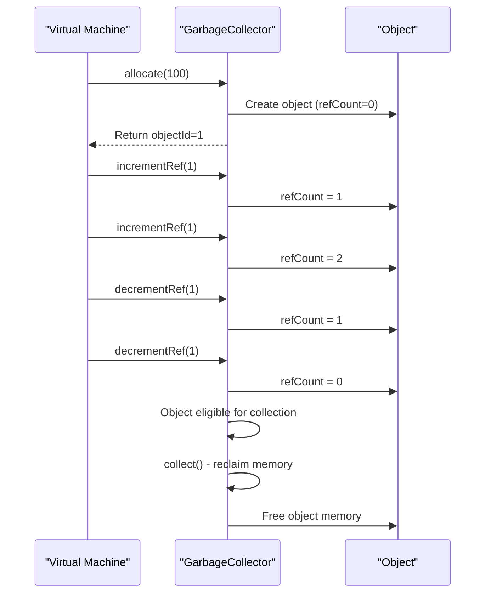
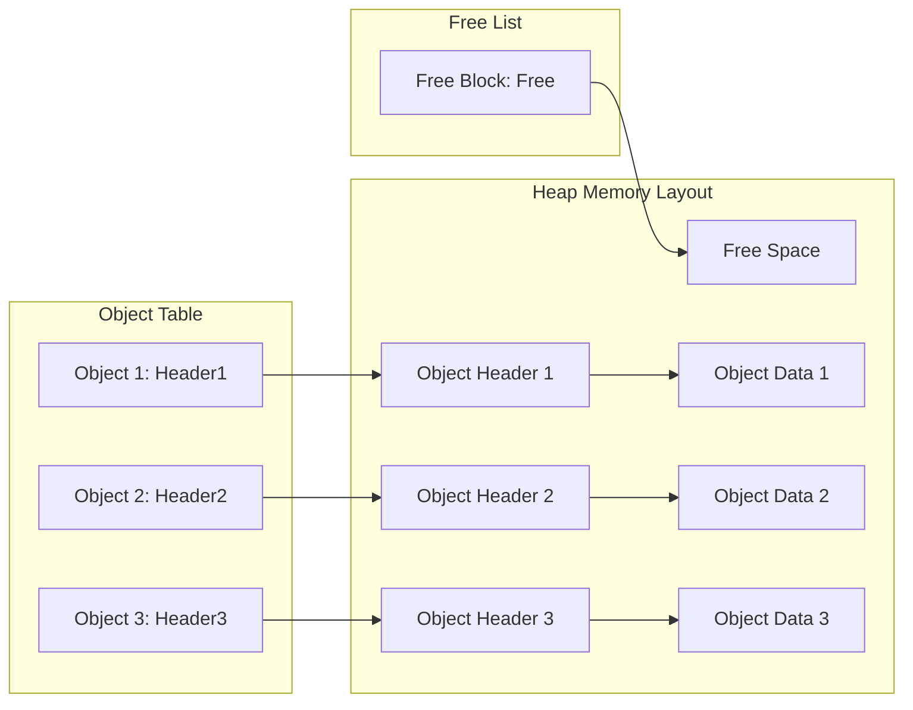
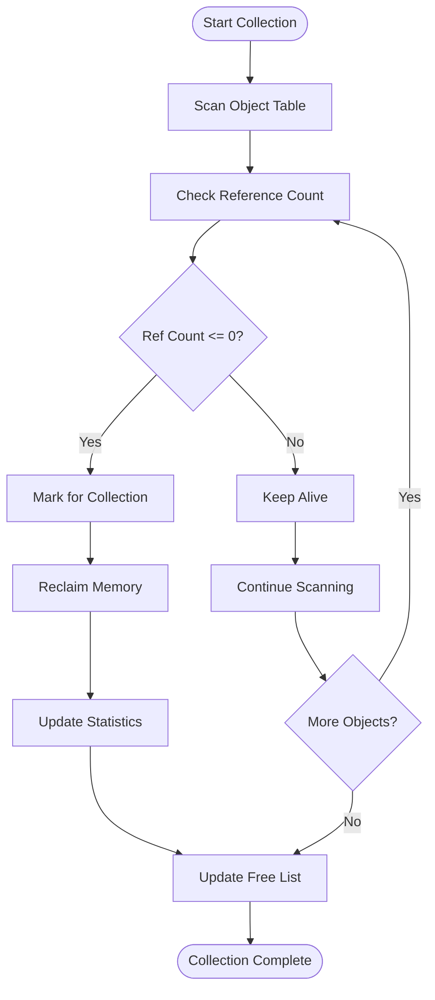
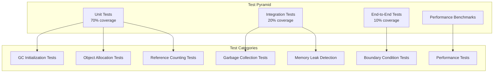
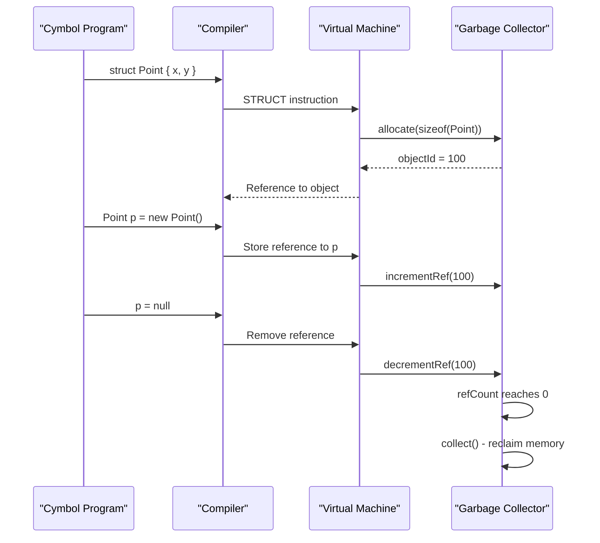

# Garbage Collection

<cite>
**Referenced Files in This Document**
- [GarbageCollector.java](file://ep18/src/main/java/org/teachfx/antlr4/ep18/gc/GarbageCollector.java)
- [ReferenceCountingGC.java](file://ep18/src/main/java/org/teachfx/antlr4/ep18/gc/ReferenceCountingGC.java)
- [GCObjectHeader.java](file://ep18/src/main/java/org/teachfx/antlr4/ep18/gc/GCObjectHeader.java)
- [GCStats.java](file://ep18/src/main/java/org/teachfx/antlr4/ep18/gc/GCStats.java)
- [CymbolStackVMGCIntegrationTest.java](file://ep18/src/test/java/org/teachfx/antlr4/ep18/stackvm/CymbolStackVMGCIntegrationTest.java)
- [MemoryLeakDetectionTest.java](file://ep18/src/test/java/org/teachfx/antlr4/ep18/gc/MemoryLeakDetectionTest.java)
- [GCPerformanceBenchmark.java](file://ep18/src/test/jmh/java/org/teachfx/antlr4/ep18/performance/GCPerformanceBenchmark.java)
- [GCBoundaryTests.java](file://ep18/src/test/java/org/teachfx/antlr4/ep18/gc/GCBoundaryTests.java)
</cite>

## Table of Contents
1. [Introduction](#introduction)
2. [Architecture Overview](#architecture-overview)
3. [Reference Counting Algorithm](#reference-counting-algorithm)
4. [Memory Management](#memory-management)
5. [Performance Characteristics](#performance-characteristics)
6. [Testing Strategy](#testing-strategy)
7. [Integration with Virtual Machine](#integration-with-virtual-machine)
8. [Best Practices and Limitations](#best-practices-and-limitations)

## Introduction

The Garbage Collection (GC) system in EP18 provides automatic memory management for the Cymbol language virtual machine. Implemented using the reference counting algorithm, the GC system tracks object references and automatically reclaims memory when objects are no longer referenced. This documentation covers the design, implementation, testing, and integration of the garbage collection system within the EP18 stack-based virtual machine.

The GC system is designed with the following goals:
- **Automatic memory management**: Developers don't need to manually free memory
- **Predictable collection**: Objects are collected immediately when reference count reaches zero
- **Minimal pause times**: No stop-the-world pauses during collection
- **Integration with VM**: Seamless integration with the existing virtual machine architecture

## Architecture Overview

```mermaid
graph TD
subgraph "Garbage Collection Components"
    GCInterface[GarbageCollector Interface]
    RCGC[ReferenceCountingGC Implementation]
    ObjectHeader[GCObjectHeader]
    GCStats[GCStats - Statistics]
end

subgraph "Memory Management"
    Heap[Heap Memory]
    ObjectTable[Object Table]
    FreeList[Free List]
end

subgraph "Runtime Operations"
    Allocation[Object Allocation]
    RefCounting[Reference Counting]
    Collection[Garbage Collection]
end

subgraph "Integration Points"
    VMIntegration[Virtual Machine Integration]
    StructManagement[Struct Management]
    MemorySafety[Memory Safety]
end

GCInterface --> RCGC : "Implements"
RCGC --> ObjectHeader : "Manages"
RCGC --> GCStats : "Records"
RCGC --> Heap : "Allocates from"
RCGC --> ObjectTable : "Tracks objects"
RCGC --> FreeList : "Manages free memory"
Allocation --> RCGC : "allocate()"
RefCounting --> RCGC : "incrementRef()/decrementRef()"
Collection --> RCGC : "collect()"
VMIntegration --> RCGC : "Uses for memory management"
StructManagement --> RCGC : "Manages struct memory"
MemorySafety --> RCGC : "Prevents leaks"

style GCInterface fill:#e1f5fe,stroke:#01579b
style RCGC fill:#f3e5f5,stroke:#4a148c
style ObjectHeader fill:#e8f5e8,stroke:#1b5e20
```

**Diagram sources**
- [GarbageCollector.java](file://ep18/src/main/java/org/teachfx/antlr4/ep18/gc/GarbageCollector.java)
- [ReferenceCountingGC.java](file://ep18/src/main/java/org/teachfx/antlr4/ep18/gc/ReferenceCountingGC.java)
- [GCObjectHeader.java](file://ep18/src/main/java/org/teachfx/antlr4/ep18/gc/GCObjectHeader.java)

**Section sources**
- [GarbageCollector.java](file://ep18/src/main/java/org/teachfx/antlr4/ep18/gc/GarbageCollector.java)
- [ReferenceCountingGC.java](file://ep18/src/main/java/org/teachfx/antlr4/ep18/gc/ReferenceCountingGC.java)

## Reference Counting Algorithm

### Algorithm Overview

The reference counting algorithm maintains a count of references to each allocated object. When an object's reference count reaches zero, it is immediately eligible for garbage collection.

```java
// Reference counting operations
public interface GarbageCollector {
    int allocate(int size) throws OutOfMemoryError;
    void incrementRef(int objectId);
    void decrementRef(int objectId);
    void collect();
    boolean isObjectAlive(int objectId);
    GCStats getStats();
    void resetStats();
}
```

### Reference Count Management



### Object Header Structure

Each allocated object has a header containing metadata:

```java
public class GCObjectHeader {
    private int size;          // Object size in bytes
    private int refCount;      // Current reference count
    private boolean isAlive;   // Whether object is alive

    public GCObjectHeader(int size) {
        this.size = size;
        this.refCount = 0;
        this.isAlive = true;
    }

    public void incrementRef() {
        refCount++;
    }

    public int decrementRef() {
        refCount--;
        if (refCount <= 0) {
            isAlive = false;
        }
        return refCount;
    }
}
```

### Circular Reference Handling

Reference counting has a known limitation: it cannot automatically collect circular references. The system provides detection mechanisms but requires manual intervention or alternative algorithms for complete circular reference handling.

```java
public boolean hasCycleReference(int objectId) {
    GCObjectHeader header = objectHeaders.get(objectId);
    return header != null && header.getRefCount() > 0 && !header.isAlive();
}
```

**Section sources**
- [GarbageCollector.java](file://ep18/src/main/java/org/teachfx/antlr4/ep18/gc/GarbageCollector.java)
- [ReferenceCountingGC.java](file://ep18/src/main/java/org/teachfx/antlr4/ep18/gc/ReferenceCountingGC.java#L200-L205)
- [GCObjectHeader.java](file://ep18/src/main/java/org/teachfx/antlr4/ep18/gc/GCObjectHeader.java)

## Memory Management

### Heap Organization

The garbage collector manages a contiguous heap memory space:



### Allocation Strategy

1. **First-fit allocation**: Scans free list for first suitable block
2. **Coalescing**: Merges adjacent free blocks during deallocation
3. **Compaction**: Optional compaction during garbage collection

### Memory Allocation Process

```java
public int allocate(int size) throws OutOfMemoryError {
    if (size <= 0) {
        throw new IllegalArgumentException("Size must be positive");
    }

    if (size > heapSize) {
        throw new OutOfMemoryError("Object size exceeds heap size");
    }

    // Check if enough space is available
    if (heapUsed + size > heapSize) {
        collect(); // Try garbage collection
    }

    if (heapUsed + size > heapSize) {
        throw new OutOfMemoryError("Out of memory after garbage collection");
    }

    // Allocate memory and create object
    int objectId = nextObjectId.getAndIncrement();
    // ... allocation logic
    return objectId;
}
```

### Garbage Collection Process



**Section sources**
- [ReferenceCountingGC.java](file://ep18/src/main/java/org/teachfx/antlr4/ep18/gc/ReferenceCountingGC.java#L50-L89)
- [ReferenceCountingGC.java](file://ep18/src/main/java/org/teachfx/antlr4/ep18/gc/ReferenceCountingGC.java#L113-L141)

## Performance Characteristics

### Time Complexity

| Operation | Time Complexity | Description |
|-----------|-----------------|-------------|
| Allocation | O(1) average | Constant time allocation from free list |
| Increment Reference | O(1) | Direct access to object header |
| Decrement Reference | O(1) | Direct access with possible collection |
| Garbage Collection | O(n) | Linear scan of all objects |

### Space Overhead

| Component | Overhead | Description |
|-----------|----------|-------------|
| Object Header | 12-16 bytes | Size, reference count, alive flag |
| Object Table | O(n) | Map from object ID to header |
| Free List | O(m) | List of free memory blocks |

### Performance Benchmarks

The system includes comprehensive JMH benchmarks to measure performance:

```java
@Benchmark
@BenchmarkMode(Mode.Throughput)
@OutputTimeUnit(TimeUnit.SECONDS)
public void benchmarkObjectAllocationSmall(GCState state, Blackhole blackhole) {
    int objectId = state.gc.allocate(100);
    state.gc.incrementRef(objectId);
    state.objectIds.add(objectId);
    blackhole.consume(objectId);
}
```

### Memory Efficiency

The garbage collector aims for high memory efficiency:
- **Fragmentation management**: Free list coalescing reduces fragmentation
- **Overhead control**: Minimal per-object overhead
- **Heap utilization**: Target >90% utilization before expansion

**Section sources**
- [GCPerformanceBenchmark.java](file://ep18/src/jmh/java/org/teachfx/antlr4/ep18/gc/GCPerformanceBenchmark.java)
- [ReferenceCountingGC.java](file://ep18/src/main/java/org/teachfx/antlr4/ep18/gc/ReferenceCountingGC.java)

## Testing Strategy

### Test-Driven Development Approach

The GC system follows strict TDD principles with comprehensive test coverage:



### Key Test Classes

1. **CymbolStackVMGCIntegrationTest.java**: Main integration tests
2. **MemoryLeakDetectionTest.java**: Memory leak detection tests
3. **GCBoundaryTests.java**: Boundary condition tests
4. **GCPerformanceBenchmark.java**: JMH performance benchmarks

### Test Coverage Requirements

- **Line coverage**: ≥95% for GC-related code
- **Branch coverage**: ≥90% for decision points
- **Mutation coverage**: ≥85% for robustness

### Example Test Case

```java
@Test
@DisplayName("应该正确回收无引用对象")
void testGarbageCollectionOfUnreferencedObjects() throws Exception {
    // Given: 分配多个对象
    int objectCount = 10;
    int[] objectIds = new int[objectCount];
    for (int i = 0; i < objectCount; i++) {
        objectIds[i] = gc.allocate(100);
        gc.incrementRef(objectIds[i]);
    }

    // When: 移除所有引用并执行垃圾回收
    for (int objectId : objectIds) {
        gc.decrementRef(objectId);
    }
    gc.collect();

    // Then: 所有对象应该被回收
    for (int objectId : objectIds) {
        assertThat(gc.isObjectAlive(objectId)).isFalse();
    }
}
```

**Section sources**
- [CymbolStackVMGCIntegrationTest.java](file://ep18/src/test/java/org/teachfx/antlr4/ep18/CymbolStackVMGCIntegrationTest.java)
- [MemoryLeakDetectionTest.java](file://ep18/src/test/java/org/teachfx/antlr4/ep18/gc/MemoryLeakDetectionTest.java)
- [GCBoundaryTests.java](file://ep18/src/test/java/org/teachfx/antlr4/ep18/gc/GCBoundaryTests.java)

## Integration with Virtual Machine

### VM Configuration for GC

The virtual machine can be configured to use garbage collection:

```java
public class VMConfig {
    // GC-related configuration
    private final boolean enableGC;
    private final int gcHeapSize;
    private final GCType gcType;

    public static class Builder {
        private boolean enableGC = true;
        private int gcHeapSize = 1024 * 1024; // 1MB default
        private GCType gcType = GCType.REFERENCE_COUNTING;

        public Builder setEnableGC(boolean enableGC) {
            this.enableGC = enableGC;
            return this;
        }

        public Builder setGCHeapSize(int gcHeapSize) {
            this.gcHeapSize = gcHeapSize;
            return this;
        }

        public Builder setGCType(GCType gcType) {
            this.gcType = gcType;
            return this;
        }
    }
}
```

### Object Lifecycle Management



### Struct Management Integration

The GC system integrates with the VM's struct management:

```java
public class CymbolStackVM {
    // Struct management with GC integration
    private java.util.List<StructValue> structTable;
    private GarbageCollector gc;

    private int allocateStruct(int fieldCount) {
        // Calculate struct size
        int structSize = fieldCount * 4; // 4 bytes per field

        // Allocate using GC
        int objectId = gc.allocate(structSize);
        gc.incrementRef(objectId);

        // Create struct entry
        StructValue struct = new StructValue(objectId, fieldCount);
        structTable.add(struct);

        return structTable.size() - 1; // Return struct index
    }
}
```

### Memory Safety Guarantees

The GC integration provides several memory safety guarantees:
1. **No dangling pointers**: Objects are kept alive while referenced
2. **Automatic cleanup**: Unreferenced objects are automatically collected
3. **Bounds checking**: Memory accesses are validated
4. **Type safety**: Object types are preserved

**Section sources**
- [CymbolStackVM.java](file://ep18/src/main/java/org/teachfx/antlr4/ep18/stackvm/CymbolStackVM.java)
- [VMConfig.java](file://ep18/src/main/java/org/teachfx/antlr4/ep18/stackvm/VMConfig.java)

## Best Practices and Limitations

### Best Practices

1. **Reference Management**
   ```java
   // Good: Explicit reference management
   int objectId = gc.allocate(size);
   try {
       gc.incrementRef(objectId);
       // Use object
   } finally {
       gc.decrementRef(objectId);
   }
   ```

2. **Circular Reference Avoidance**
   - Use weak references for back-references
   - Break cycles manually when necessary
   - Consider alternative GC algorithms for complex graphs

3. **Performance Optimization**
   - Batch allocations when possible
   - Reuse objects instead of reallocating
   - Monitor GC statistics for tuning

### Known Limitations

1. **Circular References**: Cannot automatically collect circular references
2. **Fragmentation**: Memory fragmentation can occur over time
3. **Overhead**: Reference counting has per-object overhead
4. **Stop-the-World**: Collection pauses (though minimal)

### Configuration Guidelines

| Parameter | Recommended Value | Description |
|-----------|------------------|-------------|
| Heap Size | 4-64 MB | Depends on application needs |
| GC Threshold | 75% | Trigger collection at 75% heap usage |
| Object Size Limit | 1 MB | Maximum single object size |

### Monitoring and Diagnostics

The GC system provides comprehensive statistics:

```java
public class GCStats {
    private long totalAllocations;
    private long totalCollections;
    private long totalCollectedMemory;
    private long totalCollectionTime;

    public void recordAllocation(int size) {
        totalAllocations++;
        // ... update statistics
    }

    public void recordCollection(int objects, long memory, long time) {
        totalCollections++;
        totalCollectedMemory += memory;
        totalCollectionTime += time;
    }
}
```

### Future Enhancements

1. **Generational Collection**: Separate young and old generations
2. **Concurrent Collection**: Collection without stopping mutator
3. **Compaction**: Reduce fragmentation through compaction
4. **Alternative Algorithms**: Mark-sweep, copying, or hybrid approaches

## TDD Test Suite for GC Integration

### Test-Driven Development Approach

The GC integration follows strict TDD principles with comprehensive test coverage. All tests were created before implementation to define expected behavior and ensure quality.

### Test Categories Created

1. **GC Initialization Tests**
   - `testGCInitialization`: Verifies GC is properly initialized in VM
   - `testGCDisabledConfiguration`: Tests backward compatibility when GC is disabled

2. **Memory Allocation Tests**
   - `testStructAllocationUsesGC`: Verifies struct allocation uses GC instead of simple heap
   - `testStructAllocationWithDifferentSizes`: Parameterized test for various struct sizes

3. **Reference Counting Tests**
   - `testReferenceCounting`: Tests proper reference count management
   - `testGarbageCollection`: Verifies garbage collection works correctly

4. **Memory Management Tests**
   - `testOutOfMemoryHandling`: Tests proper handling of out-of-memory conditions
   - `testMemoryLeakDetection`: Detects potential memory leaks

5. **Performance Tests**
   - `testGCPerformanceImpact`: Measures GC overhead on VM performance
   - `testGCNoLongPauses`: Ensures GC doesn't cause long pauses

### Test Implementation Details

```java
// Example: Comprehensive GC integration test
@Test
@DisplayName("应该正确管理引用计数")
@Tag("reference-counting")
void testReferenceCounting() throws Exception {
    // Given: Allocate a struct
    byte[] allocateCode = createTestBytecode(new int[]{
        encodeInstruction(BytecodeDefinition.INSTR_STRUCT, 2),
        encodeInstruction(BytecodeDefinition.INSTR_HALT)
    });

    int structId = vm.execute(allocateCode);
    assertThat(structId).isGreaterThan(0);

    // When: Get GC instance and manipulate references
    GarbageCollector gc = getGCInstance();
    ReferenceCountingGC refGC = (ReferenceCountingGC) gc;

    // Then: Verify reference counting works correctly
    refGC.incrementRef(structId);
    refGC.incrementRef(structId);
    refGC.decrementRef(structId);
    assertThat(refGC.isObjectAlive(structId)).isTrue();
}
```

### Performance Benchmark Suite

The JMH benchmark suite includes:

1. **Allocation Performance**: Small, medium, large struct allocation
2. **GC Overhead Comparison**: With GC vs without GC
3. **Memory Pressure Tests**: Under high allocation rates
4. **GC Pause Time Measurements**: Collection pause durations

### Test Coverage Requirements

- **Line Coverage**: ≥95% for GC-related code
- **Branch Coverage**: ≥90% for decision points
- **Integration Coverage**: 100% of VM-GC integration points
- **Performance Requirements**: GC overhead <10%, pause times <10ms

### Running Tests

```bash
# Run GC integration tests
mvn test -pl ep18 -Dtest="CymbolStackVMGCIntegrationTest"

# Run all GC-related tests
mvn test -pl ep18 -Dtest="*GC*"

# Run performance benchmarks
mvn verify -pl ep18 -Pbenchmarks
```

**Section sources**
- [GCStats.java](file://ep18/src/main/java/org/teachfx/antlr4/ep18/gc/GCStats.java)
- [ReferenceCountingGC.java](file://ep18/src/main/java/org/teachfx/antlr4/ep18/gc/ReferenceCountingGC.java)
- [CymbolStackVMGCIntegrationTest.java](file://ep18/src/test/java/org/teachfx/antlr4/ep18/stackvm/CymbolStackVMGCIntegrationTest.java)
- [GCPerformanceBenchmark.java](file://ep18/src/test/jmh/java/org/teachfx/antlr4/ep18/performance/GCPerformanceBenchmark.java)