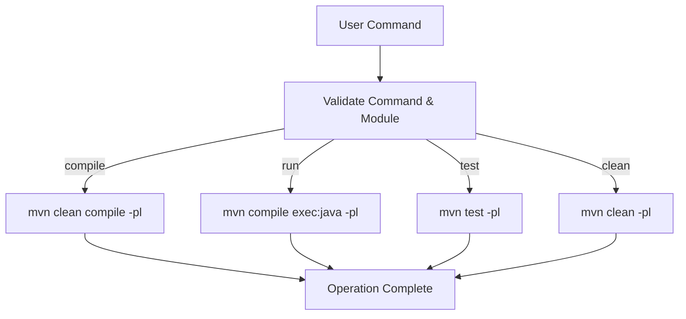

# Getting Started

<cite>
**Referenced Files in This Document**   
- [README.md](file://README.md)
- [README_EN.md](file://README_EN.md)
- [ep19/README.md](file://ep19/README.md)
- [ep20/README.md](file://ep20/README.md)
- [scripts/run.sh](file://scripts/run.sh)
- [scripts/run.py](file://scripts/run.py)
- [pom.xml](file://pom.xml)
- [ep1/pom.xml](file://ep1/pom.xml)
- [ep2/pom.xml](file://ep2/pom.xml)
- [ep3/pom.xml](file://ep3/pom.xml)
- [ep4/pom.xml](file://ep4/pom.xml)
- [ep5/pom.xml](file://ep5/pom.xml)
- [ep6/pom.xml](file://ep6/pom.xml)
- [ep7/pom.xml](file://ep7/pom.xml)
- [ep8/pom.xml](file://ep8/pom.xml)
- [ep9/pom.xml](file://ep9/pom.xml)
- [ep10/pom.xml](file://ep10/pom.xml)
- [ep11/pom.xml](file://ep11/pom.xml)
- [ep12/pom.xml](file://ep12/pom.xml)
- [ep13/pom.xml](file://ep13/pom.xml)
- [ep14/pom.xml](file://ep14/pom.xml)
- [ep15/pom.xml](file://ep15/pom.xml)
- [ep16/pom.xml](file://ep16/pom.xml)
- [ep17/pom.xml](file://ep17/pom.xml)
- [ep18/pom.xml](file://ep18/pom.xml)
- [ep19/pom.xml](file://ep19/pom.xml)
- [ep20/pom.xml](file://ep20/pom.xml)
- [ep21/pom.xml](file://ep21/pom.xml)
</cite>

## Table of Contents
1. [Prerequisites](#prerequisites)
2. [Repository Setup](#repository-setup)
3. [Project Structure Overview](#project-structure-overview)
4. [Building Episodes with Maven](#building-episodes-with-maven)
5. [Running Compiler Stages](#running-compiler-stages)
6. [Using Helper Scripts](#using-helper-scripts)
7. [Processing Input Files](#processing-input-files)
8. [Common Issues and Solutions](#common-issues-and-solutions)

## Prerequisites

Before setting up the compiler framework, ensure you have the following prerequisites installed:

- **Java Development Kit (JDK)**: Version 18 or higher (OpenJDK 18+ recommended)
- **Apache Maven**: Version 3.8 or higher
- **Git**: For cloning the repository

Verify your installation with these commands:
```bash
java -version
mvn -version
git --version
```

The project relies on ANTLR4 for parsing, which is managed automatically through Maven dependencies, so no separate ANTLR4 installation is required.

**Section sources**
- [README_EN.md](file://README_EN.md#L25-L35)

## Repository Setup

To get started with the compiler framework, follow these steps to clone and initialize the repository:

1. Clone the repository from its source:
```bash
git clone https://github.com/whtoo/How_to_implment_PL_in_Antlr4.git
cd How_to_implment_PL_in_Antlr4
```

2. Verify the project structure by listing the top-level directories:
```bash
ls -la
```

3. Perform an initial build of the entire project to download all dependencies:
```bash
mvn clean install
```

This command will compile all modules and install them into your local Maven repository, ensuring that all dependencies are resolved.

**Section sources**
- [README_EN.md](file://README_EN.md#L60-L70)

## Project Structure Overview

The repository is organized into 21 progressive episodes (ep1-ep21), each representing a stage in compiler development:

- **ep1-ep10**: Interpreter-focused implementations
- **ep11-ep20**: Compiler development with intermediate representation and code generation
- **ep21**: JIT compilation and advanced analysis

Each episode directory contains:
- `src/main/java/`: Java source code implementing the compiler stage
- `pom.xml`: Maven configuration file specific to the episode
- Additional resources and test files as needed

Key directories outside episodes:
- `scripts/`: Utility scripts for building and running episodes
- `docs/`: Project documentation and design notes

To navigate between implementation phases, simply change into the desired episode directory:
```bash
cd ep16  # Work on symbol table and type checking
cd ep18  # Work on stack-based virtual machine
cd ep20  # Work on full compilation pipeline
```

**Section sources**
- [README.md](file://README.md#L25-L45)

## Building Episodes with Maven

Each episode can be built independently using Maven. Navigate to any episode directory and use standard Maven commands:

```bash
# Build a specific episode (e.g., ep16)
cd ep16
mvn clean compile

# Package the episode
mvn clean package

# Run tests for the episode
mvn test
```

To build from the root directory without changing directories, use the `-pl` (project list) flag:

```bash
# Compile ep11 from root directory
mvn compile -pl ep11

# Clean and compile ep15
mvn clean compile -pl ep15

# Run tests for ep19
mvn test -pl ep19
```

All episodes share a common parent POM configuration, ensuring consistent build settings across the project.

**Section sources**
- [README_EN.md](file://README_EN.md#L75-L85)

## Running Compiler Stages

To execute a compiler stage, use Maven's exec plugin with the appropriate main class. The entry point varies by episode:

```bash
# Run ep4 (arithmetic calculator)
mvn exec:java -pl ep4 -Dexec.mainClass="org.teachfx.antlr4.Calc"

# Run ep11 (arithmetic interpreter)
mvn exec:java -pl ep11 -Dexec.mainClass="org.teachfx.antlr4.Calc"

# Run ep16 (function evaluation with scope)
mvn exec:java -pl ep16 -Dexec.mainClass="org.teachfx.antlr4.ep16.Compiler"

# Run ep20 (full compiler) with input file
mvn exec:java -pl ep20 -Dexec.mainClass="org.teachfx.antlr4.ep20.Compiler" -Dexec.args="src/main/resources/t.cymbol"
```

For episodes that process input files, provide the file path as an argument to the main class.

**Section sources**
- [README_EN.md](file://README_EN.md#L100-L115)

## Using Helper Scripts

The framework provides two helper scripts in the `scripts/` directory to simplify common operations:

### run.sh (Bash)
```bash
# Navigate to project root and use the script
./scripts/run.sh compile ep16    # Compile ep16 module
./scripts/run.sh run ep16       # Run ep16 module
./scripts/run.sh test ep19      # Run tests for ep19
./scripts/run.sh clean ep20     # Clean ep20 module
./scripts/run.sh run ep20 "src/main/resources/t.cymbol"  # Run with input file
./scripts/run.sh help           # Show help
```

### run.py (Python)
```bash
# Use Python version of the script
python scripts/run.py compile ep11
python scripts/run.py run ep11
python scripts/run.py test ep12
```

Both scripts support the same commands:
- `compile`: Clean and compile the specified episode
- `run`: Compile and run the episode
- `test`: Compile and run tests
- `clean`: Remove compiled files
- `help`: Display usage information

The scripts automatically detect the main class from the episode's pom.xml configuration.



**Diagram sources**
- [scripts/run.sh](file://scripts/run.sh#L1-L102)
- [scripts/run.py](file://scripts/run.py#L1-L137)

**Section sources**
- [scripts/run.sh](file://scripts/run.sh#L1-L102)
- [scripts/run.py](file://scripts/run.py#L1-L137)

## Processing Input Files

To process input files through the compiler pipeline, follow these steps:

1. Create a Cymbol source file (e.g., `example.cymbol`):
```cymbol
int factorial(int n) {
    if (n <= 1) {
        return 1;
    }
    return n * factorial(n - 1);
}

int main() {
    return factorial(5);
}
```

2. Compile and run using the appropriate episode:
```bash
# Using ep20 compiler
./scripts/run.sh run ep20 "example.cymbol"

# Or directly with Maven
mvn exec:java -pl ep20 -Dexec.mainClass="org.teachfx.antlr4.ep20.Compiler" -Dexec.args="example.cymbol"
```

3. For episodes that generate output files (like ep18, ep20), the results will be saved in the current directory:
- `.vm` files for virtual machine bytecode
- `graph_*.md` files for control flow graph visualizations

The compilation pipeline processes files through these stages:
1. Lexical analysis (tokenization)
2. Syntax analysis (parsing)
3. AST construction
4. Semantic analysis (symbol resolution, type checking)
5. Intermediate representation generation
6. Code generation

**Section sources**
- [ep20/README.md](file://ep20/README.md#L150-L170)

## Common Issues and Solutions

### Java Version Compatibility
**Issue**: Compilation fails with "release version 18 not supported"
**Solution**: Ensure JDK 18+ is installed and JAVA_HOME is correctly set:
```bash
export JAVA_HOME=/path/to/jdk-18
```

### Missing Main Class
**Issue**: "Cannot find main class" when running episodes
**Solution**: Some older episodes may have incorrect `run.main.entry` in pom.xml. Check and correct the main class name, or run directly with the correct class:
```bash
mvn exec:java -pl ep5 -Dexec.mainClass="org.teachfx.antlr4.ExtractInterfaceTool"
```

### ANTLR4 Generation Issues
**Issue**: Missing generated parser files
**Solution**: Force regeneration by cleaning and recompiling:
```bash
mvn clean compile -pl ep20
```

### Script Execution Permissions
**Issue**: "Permission denied" when running run.sh
**Solution**: Make the script executable:
```bash
chmod +x scripts/run.sh
```

### Python Script Encoding
**Issue**: Python script fails with encoding errors on Windows
**Solution**: Ensure Python 3 is used and file is read with UTF-8 encoding (already handled in run.py).

### Module Not Found
**Issue**: "Unknown lifecycle phase" or "module not found"
**Solution**: Always run commands from the project root directory, or navigate to the correct directory first.

**Section sources**
- [README_EN.md](file://README_EN.md#L118-L140)
- [README.md](file://README.md#L50-L60)