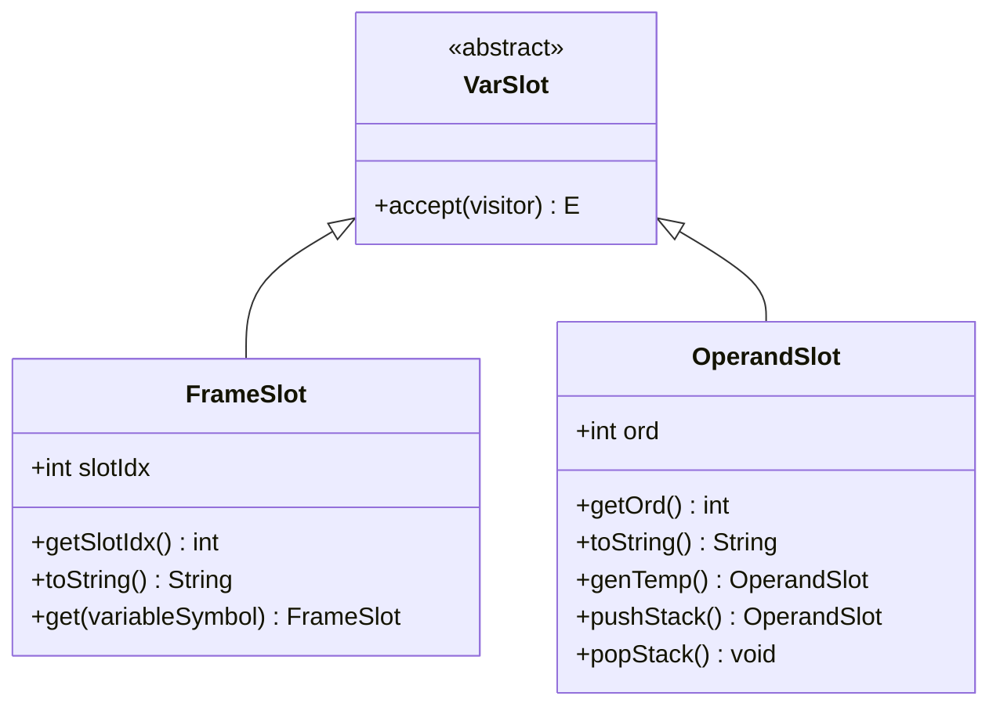
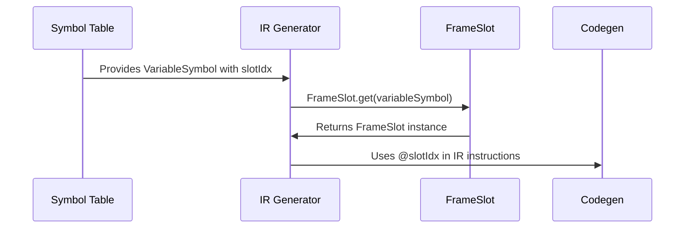
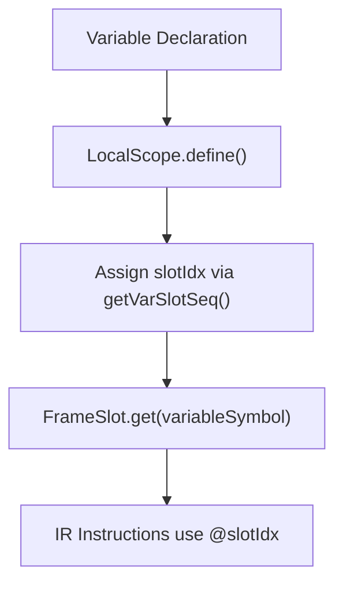
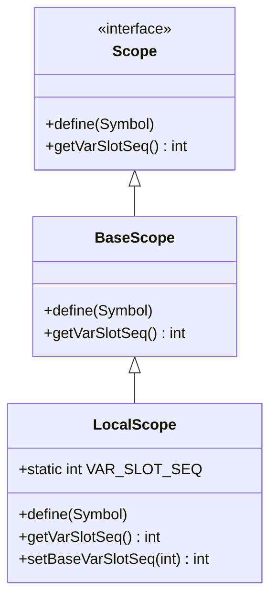

# Addressing and Storage Representation

<cite>
**Referenced Files in This Document**   
- [FrameSlot.java](file://ep20/src/main/java/org/teachfx/antlr4/ep20/ir/expr/addr/FrameSlot.java)
- [OperandSlot.java](file://ep20/src/main/java/org/teachfx/antlr4/ep20/ir/expr/addr/OperandSlot.java)
- [VarSlot.java](file://ep20/src/main/java/org/teachfx/antlr4/ep20/ir/expr/VarSlot.java)
- [VariableSymbol.java](file://ep20/src/main/java/org/teachfx/antlr4/ep20/symtab/symbol/VariableSymbol.java)
- [LocalScope.java](file://ep20/src/main/java/org/teachfx/antlr4/ep20/symtab/scope/LocalScope.java)
</cite>

## Table of Contents
1. [Introduction](#introduction)
2. [Core Addressing Abstractions](#core-addressing-abstractions)
3. [FrameSlot: Stack Frame Addressing](#frameslot-stack-frame-addressing)
4. [OperandSlot: Temporary Operand Management](#operandslot-temporary-operand-management)
5. [VarSlot: Symbol-to-Storage Binding](#varslot-symbol-to-storage-binding)
6. [Storage Representation Examples](#storage-representation-examples)
7. [Scope Hierarchy Integration](#scope-hierarchy-integration)
8. [Platform-Independent Optimization](#platform-independent-optimization)

## Introduction
This document details the addressing modes and storage representation mechanisms in the Intermediate Representation (IR) of the Cymbol compiler. The system employs a layered abstraction model to represent variable storage and operand handling, enabling platform-independent code generation and optimization. The core components—FrameSlot, OperandSlot, and VarSlot—work in concert with the symbol table to map high-level language constructs to efficient runtime storage representations.

## Core Addressing Abstractions

The IR addressing system is built around three key abstractions that provide a uniform interface for representing different storage locations and operand types. These abstractions decouple the logical representation of variables and operands from their physical implementation, allowing for flexible code generation and optimization strategies.



**Diagram sources**
- [VarSlot.java](file://ep20/src/main/java/org/teachfx/antlr4/ep20/ir/expr/VarSlot.java#L2-L4)
- [FrameSlot.java](file://ep20/src/main/java/org/teachfx/antlr4/ep20/ir/expr/addr/FrameSlot.java#L6-L30)
- [OperandSlot.java](file://ep20/src/main/java/org/teachfx/antlr4/ep20/ir/expr/addr/OperandSlot.java#L5-L37)

**Section sources**
- [VarSlot.java](file://ep20/src/main/java/org/teachfx/antlr4/ep20/ir/expr/VarSlot.java#L2-L4)
- [FrameSlot.java](file://ep20/src/main/java/org/teachfx/antlr4/ep20/ir/expr/addr/FrameSlot.java#L6-L30)
- [OperandSlot.java](file://ep20/src/main/java/org/teachfx/antlr4/ep20/ir/expr/addr/OperandSlot.java#L5-L37)

## FrameSlot: Stack Frame Addressing

FrameSlot represents variables stored in stack frames using offset-based addressing. Each FrameSlot instance corresponds to a specific location within a function's stack frame, identified by a slot index that represents the offset from the frame base pointer. This addressing mode is used for all variables with automatic storage duration, including local variables, function parameters, and compiler-generated temporaries that require stack allocation.

The FrameSlot class provides a factory method `get(VariableSymbol)` that creates a FrameSlot instance based on a VariableSymbol's slot index, establishing a direct link between the symbol table entry and its runtime storage location. The toString() method formats the slot index with an "@" prefix (e.g., "@3"), which is used in IR code generation to represent stack-relative addressing.



**Diagram sources**
- [FrameSlot.java](file://ep20/src/main/java/org/teachfx/antlr4/ep20/ir/expr/addr/FrameSlot.java#L6-L30)
- [VariableSymbol.java](file://ep20/src/main/java/org/teachfx/antlr4/ep20/symtab/symbol/VariableSymbol.java#L1-L20)

**Section sources**
- [FrameSlot.java](file://ep20/src/main/java/org/teachfx/antlr4/ep20/ir/expr/addr/FrameSlot.java#L6-L30)

## OperandSlot: Temporary Operand Management

OperandSlot serves as a wrapper for operands that may require special handling during code generation, particularly temporary values generated during expression evaluation. Unlike FrameSlot, which represents fixed storage locations, OperandSlot instances are dynamically created to represent transient computation results. Each OperandSlot is assigned a unique ordinal number that identifies it within the current compilation unit.

The class maintains a static sequence counter (ordSeq) to ensure unique ordinals for temporaries. The genTemp() factory method creates new OperandSlot instances with incrementing ordinals, while pushStack() and popStack() provide stack-like semantics for managing temporary lifetimes during expression evaluation. The toString() method formats the ordinal with a "t" prefix (e.g., "t5"), which is used in three-address code generation.

OperandSlot enables efficient register allocation strategies by providing a uniform representation for temporaries that can be optimized before final code generation, allowing the compiler to minimize memory accesses and maximize register usage.

**Section sources**
- [OperandSlot.java](file://ep20/src/main/java/org/teachfx/antlr4/ep20/ir/expr/addr/OperandSlot.java#L5-L37)

## VarSlot: Symbol-to-Storage Binding

VarSlot is an abstract base class that serves as the foundation for all variable storage representations in the IR. It extends the Operand class, establishing that all variable slots can be used as operands in IR instructions. As an abstract class, VarSlot cannot be instantiated directly but provides the common interface for concrete implementations like FrameSlot and OperandSlot.

The VarSlot hierarchy enables polymorphic handling of different storage types in IR operations. For example, the Assign statement class provides factory methods that accept VarSlot parameters, allowing assignments between any combination of FrameSlot and OperandSlot instances. This abstraction allows the IR to express data flow relationships without committing to specific storage implementations until code generation.

The visitor pattern implementation in VarSlot (via the accept() method) enables type-specific processing of different slot types during optimization and code generation phases, facilitating operations like liveness analysis, register allocation, and instruction selection.

**Section sources**
- [VarSlot.java](file://ep20/src/main/java/org/teachfx/antlr4/ep20/ir/expr/VarSlot.java#L2-L4)

## Storage Representation Examples

The addressing system handles different variable categories through appropriate slot types:

### Local Variables
Local variables are represented by FrameSlot instances with slot indices assigned by the LocalScope. When a variable is declared, the scope assigns it a slot index that determines its position in the stack frame.



### Function Parameters
Function parameters are also represented as FrameSlot instances, with slot indices assigned in the order of parameter declaration. The calling convention determines the initial layout of parameters in the stack frame.

### Temporaries
Expression temporaries are represented by OperandSlot instances created through genTemp(). These temporaries hold intermediate computation results and are optimized during code generation.

```mermaid
sequenceDiagram
participant Parser as Parser
participant IRGen as IR Generator
participant Temp as OperandSlot
Parser->>IRGen : Expression : a + b * c
IRGen->>Temp : t1 = genTemp() // for b * c
IRGen->>Temp : t2 = genTemp() // for a + t1
IRGen->>Codegen : Generate : t1 = b * c; t2 = a + t1
```

**Diagram sources**
- [OperandSlot.java](file://ep20/src/main/java/org/teachfx/antlr4/ep20/ir/expr/addr/OperandSlot.java#L5-L37)
- [Assign.java](file://ep20/src/main/java/org/teachfx/antlr4/ep20/ir/stmt/Assign.java#L16-L28)

**Section sources**
- [OperandSlot.java](file://ep20/src/main/java/org/teachfx/antlr4/ep20/ir/expr/addr/OperandSlot.java#L5-L37)
- [Assign.java](file://ep20/src/main/java/org/teachfx/antlr4/ep20/ir/stmt/Assign.java#L16-L28)

## Scope Hierarchy Integration

The addressing system is tightly integrated with the symbol table's scope hierarchy, particularly through the LocalScope class. Each LocalScope maintains a sequence counter (VAR_SLOT_SEQ) that tracks the next available slot index for local variables. When a symbol is defined in a local scope, the scope assigns it a slot index using this counter, which is then used to create FrameSlot instances.

The scope hierarchy ensures that nested scopes receive contiguous slot index ranges, enabling efficient stack frame layout. The setBaseVarSlotSeq() method allows child scopes to continue the slot numbering from their parent, maintaining a consistent addressing scheme across the entire function.



**Diagram sources**
- [LocalScope.java](file://ep20/src/main/java/org/teachfx/antlr4/ep20/symtab/scope/LocalScope.java#L1-L52)

**Section sources**
- [LocalScope.java](file://ep20/src/main/java/org/teachfx/antlr4/ep20/symtab/scope/LocalScope.java#L1-L52)

## Platform-Independent Optimization

The addressing abstractions enable platform-independent optimizations by providing a uniform representation of storage locations that can be transformed before final code generation. Optimizations such as register allocation, dead code elimination, and common subexpression elimination operate on the IR using VarSlot instances without knowledge of the target architecture.

During optimization, OperandSlot instances can be coalesced, eliminated, or converted to register references based on liveness analysis and register availability. FrameSlot instances can be reordered or eliminated based on stack slot usage patterns. The separation between logical storage representation (VarSlot) and physical implementation (stack offset, register, etc.) allows the compiler to explore different optimization strategies without affecting the semantic correctness of the IR.

The IR visitor pattern enables traversal-based optimizations that can transform the addressing representation while preserving data flow relationships. This approach supports multiple optimization passes that progressively refine the storage representation before final code generation.

**Section sources**
- [VarSlot.java](file://ep20/src/main/java/org/teachfx/antlr4/ep20/ir/expr/VarSlot.java#L2-L4)
- [IRVisitor.java](file://ep20/src/main/java/org/teachfx/antlr4/ep20/ir/IRVisitor.java)