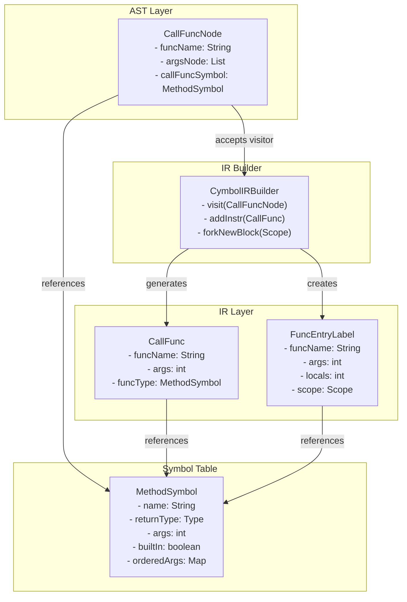
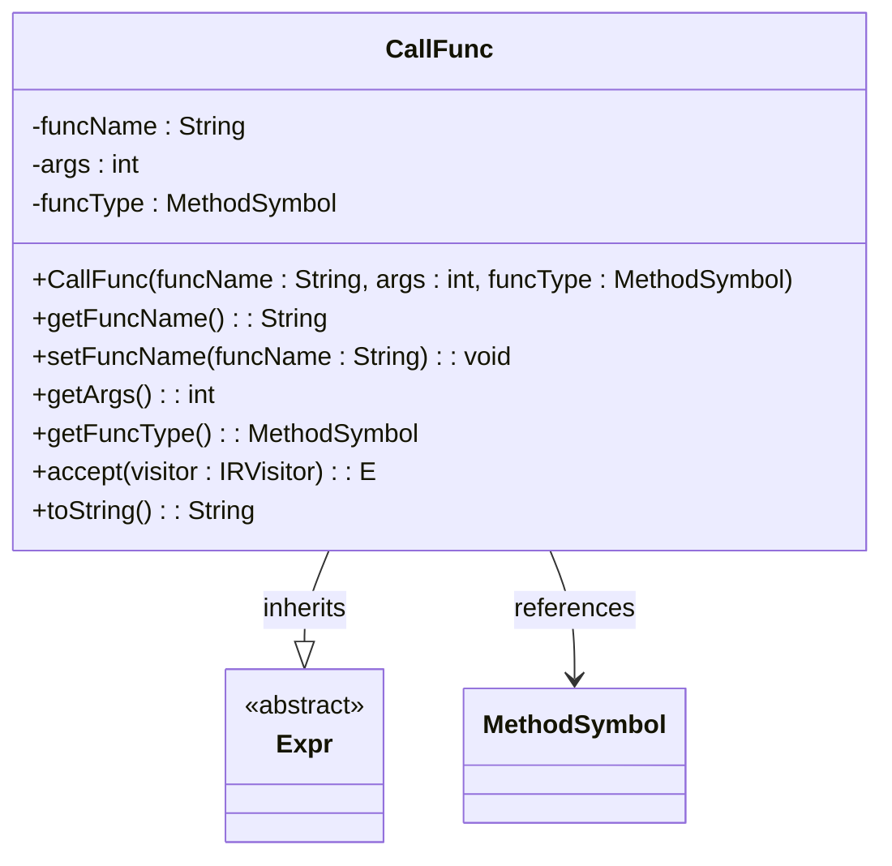
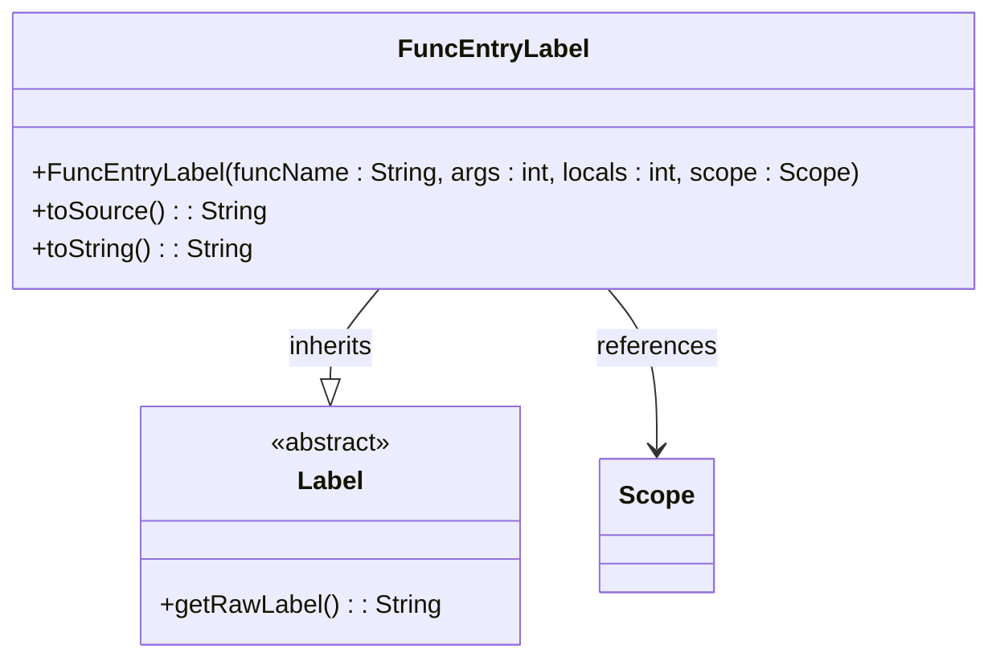
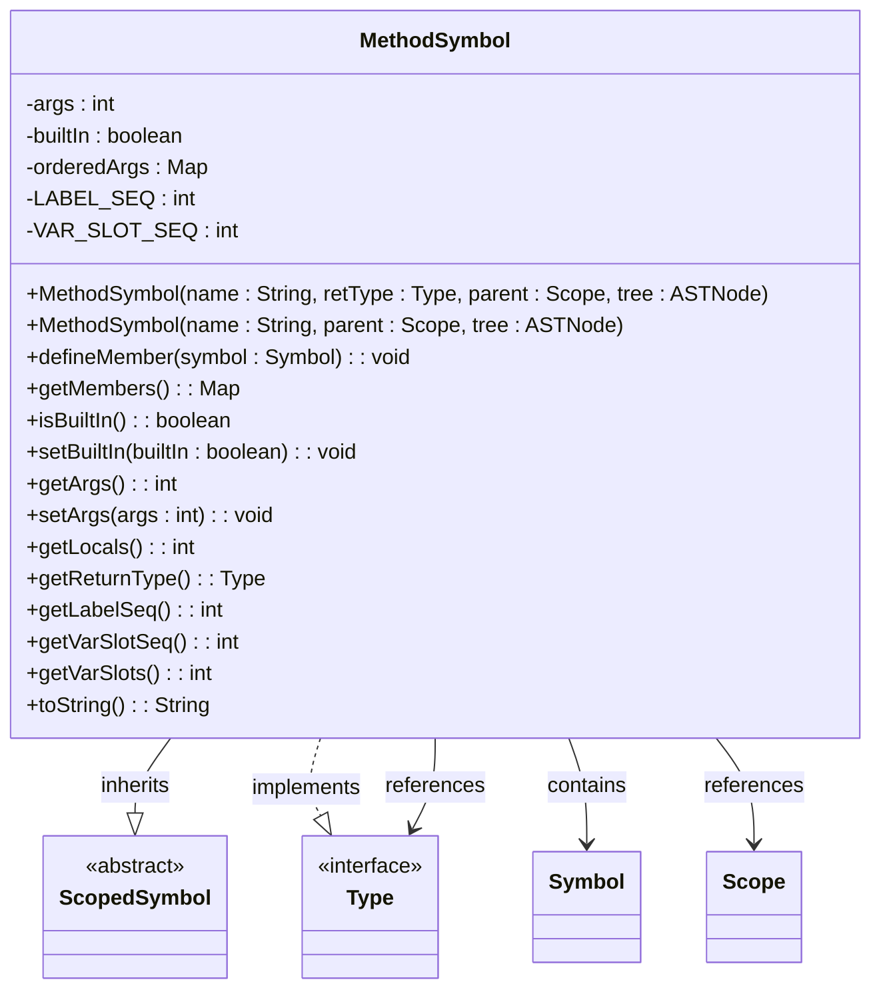
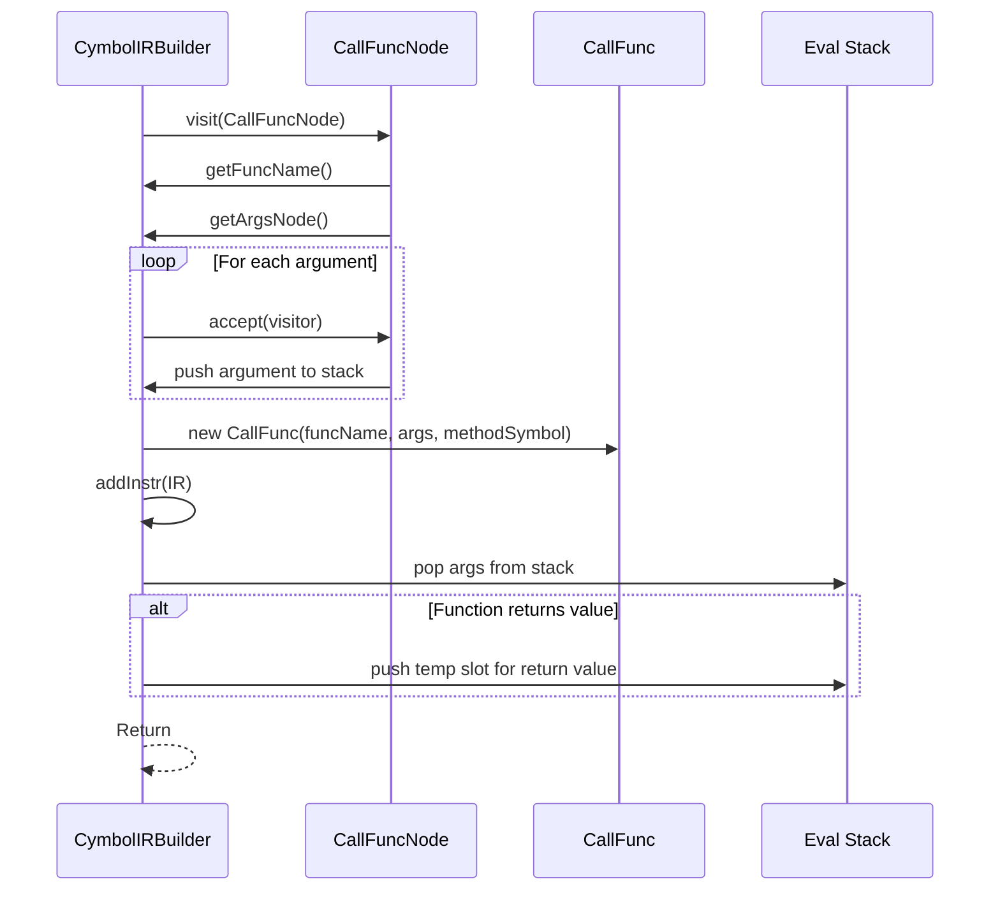
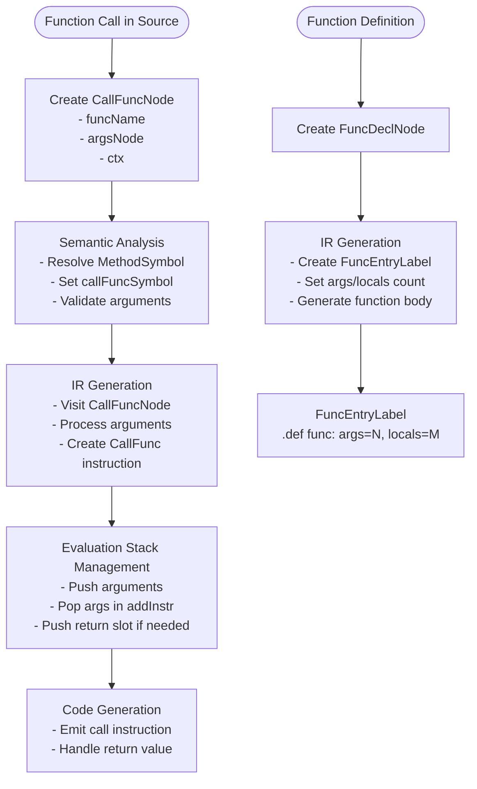

# Function Call Representation in IR

<cite>
**Referenced Files in This Document**   
- [CallFunc.java](file://ep20/src/main/java/org/teachfx/antlr4/ep20/ir/expr/CallFunc.java)
- [FuncEntryLabel.java](file://ep20/src/main/java/org/teachfx/antlr4/ep20/ir/stmt/FuncEntryLabel.java)
- [MethodSymbol.java](file://ep20/src/main/java/org/teachfx/antlr4/ep20/symtab/symbol/MethodSymbol.java)
- [CymbolIRBuilder.java](file://ep20/src/main/java/org/teachfx/antlr4/ep20/pass/ir/CymbolIRBuilder.java)
- [CallFuncNode.java](file://ep20/src/main/java/org/teachfx/antlr4/ep20/ast/expr/CallFuncNode.java)
</cite>

## Table of Contents
1. [Introduction](#introduction)
2. [Core Components](#core-components)
3. [Architecture Overview](#architecture-overview)
4. [Detailed Component Analysis](#detailed-component-analysis)
5. [Dependency Analysis](#dependency-analysis)
6. [Performance Considerations](#performance-considerations)
7. [Troubleshooting Guide](#troubleshooting-guide)
8. [Conclusion](#conclusion)

## Introduction
This document provides a comprehensive analysis of function call representation in the Intermediate Representation (IR) of a compiler implementation based on ANTLR4. It focuses on how function invocations are modeled using three-address code, particularly through the `CallFunc` class. The analysis covers the structural design of call instructions, their interaction with function entry points via `FuncEntryLabel`, parameter passing mechanisms, stack frame management, and support for various calling patterns including direct calls, recursion, and function pointers. The document also explains how built-in and user-defined functions are uniformly represented in the IR, how symbol table integration enables function signature resolution and type checking, and identifies optimization opportunities specific to function calls during the IR phase.

## Core Components
The function call mechanism in the IR is implemented through several core components that work together to represent and manage function invocations. These include the `CallFunc` class for modeling call instructions, `FuncEntryLabel` for marking function entry points, `MethodSymbol` for representing function signatures in the symbol table, `CymbolIRBuilder` for constructing IR from AST nodes, and `CallFuncNode` as the AST representation of function calls. These components form a cohesive system that translates high-level function calls into low-level IR instructions while preserving semantic information needed for code generation and optimization.

**Section sources**
- [CallFunc.java](file://ep20/src/main/java/org/teachfx/antlr4/ep20/ir/expr/CallFunc.java#L1-L42)
- [FuncEntryLabel.java](file://ep20/src/main/java/org/teachfx/antlr4/ep20/ir/stmt/FuncEntryLabel.java#L1-L21)
- [MethodSymbol.java](file://ep20/src/main/java/org/teachfx/antlr4/ep20/symtab/symbol/MethodSymbol.java#L1-L149)
- [CymbolIRBuilder.java](file://ep20/src/main/java/org/teachfx/antlr4/ep20/pass/ir/CymbolIRBuilder.java#L1-L473)
- [CallFuncNode.java](file://ep20/src/main/java/org/teachfx/antlr4/ep20/ast/expr/CallFuncNode.java#L1-L76)

## Architecture Overview
The function call representation architecture follows a layered approach where AST nodes are transformed into IR instructions through a visitor pattern. The process begins with `CallFuncNode` in the AST layer, which contains information about the called function and its arguments. During IR generation, `CymbolIRBuilder` processes these AST nodes and creates `CallFunc` instructions that capture the callee, argument count, and function type information. Function entry points are marked with `FuncEntryLabel` instructions that provide metadata about parameter and local variable counts. The `MethodSymbol` class in the symbol table stores function signature information that is used for type checking and code generation. This architecture enables a clean separation between syntactic representation, semantic analysis, and low-level code generation.



**Diagram sources**
- [CallFuncNode.java](file://ep20/src/main/java/org/teachfx/antlr4/ep20/ast/expr/CallFuncNode.java#L1-L76)
- [CallFunc.java](file://ep20/src/main/java/org/teachfx/antlr4/ep20/ir/expr/CallFunc.java#L1-L42)
- [FuncEntryLabel.java](file://ep20/src/main/java/org/teachfx/antlr4/ep20/ir/stmt/FuncEntryLabel.java#L1-L21)
- [MethodSymbol.java](file://ep20/src/main/java/org/teachfx/antlr4/ep20/symtab/symbol/MethodSymbol.java#L1-L149)
- [CymbolIRBuilder.java](file://ep20/src/main/java/org/teachfx/antlr4/ep20/pass/ir/CymbolIRBuilder.java#L1-L473)

## Detailed Component Analysis

### CallFunc Class Analysis
The `CallFunc` class is the central component for representing function calls in the IR. It extends the `Expr` base class and contains fields for the function name, argument count, and function type symbol. The constructor initializes these fields, and getter methods provide access to them. The `accept` method enables visitor pattern traversal, allowing code generators and optimizers to process call instructions. The `toString` method provides a human-readable representation of the call instruction in three-address code format.



**Diagram sources**
- [CallFunc.java](file://ep20/src/main/java/org/teachfx/antlr4/ep20/ir/expr/CallFunc.java#L1-L42)
- [MethodSymbol.java](file://ep20/src/main/java/org/teachfx/antlr4/ep20/symtab/symbol/MethodSymbol.java#L1-L149)

**Section sources**
- [CallFunc.java](file://ep20/src/main/java/org/teachfx/antlr4/ep20/ir/expr/CallFunc.java#L1-L42)

### FuncEntryLabel Class Analysis
The `FuncEntryLabel` class represents function entry points in the IR and extends the `Label` class. It is constructed with the function name, number of arguments, number of local variables, and the associated scope. The label format includes metadata about the function's parameter and local variable counts, which is crucial for stack frame management during code generation. The `toSource` and `toString` methods return the formatted label string, preserving the function metadata for downstream processing.



**Diagram sources**
- [FuncEntryLabel.java](file://ep20/src/main/java/org/teachfx/antlr4/ep20/ir/stmt/FuncEntryLabel.java#L1-L21)
- [Scope.java](file://ep20/src/main/java/org/teachfx/antlr4/ep20/symtab/scope/Scope.java#L1-L10)

**Section sources**
- [FuncEntryLabel.java](file://ep20/src/main/java/org/teachfx/antlr4/ep20/ir/stmt/FuncEntryLabel.java#L1-L21)

### MethodSymbol Class Analysis
The `MethodSymbol` class represents function symbols in the symbol table and implements both `ScopedSymbol` and `Type` interfaces. It stores function metadata including name, return type, parameter count, and whether the function is built-in. The class maintains an ordered map of parameter symbols, ensuring that argument order is preserved. Methods like `getArgs`, `getLocals`, and `isBuiltIn` provide access to function characteristics, while `defineMember` manages parameter registration with slot indexing for stack allocation.



**Diagram sources**
- [MethodSymbol.java](file://ep20/src/main/java/org/teachfx/antlr4/ep20/symtab/symbol/MethodSymbol.java#L1-L149)
- [Symbol.java](file://ep20/src/main/java/org/teachfx/antlr4/ep20/symtab/symbol/Symbol.java#L1-L10)
- [Scope.java](file://ep20/src/main/java/org/teachfx/antlr4/ep20/symtab/scope/Scope.java#L1-L10)
- [Type.java](file://ep20/src/main/java/org/teachfx/antlr4/ep20/symtab/type/Type.java#L1-L10)

**Section sources**
- [MethodSymbol.java](file://ep20/src/main/java/org/teachfx/antlr4/ep20/symtab/symbol/MethodSymbol.java#L1-L149)

### CymbolIRBuilder Call Processing
The `CymbolIRBuilder` class handles the transformation of AST function call nodes into IR instructions. The `visit(CallFuncNode)` method processes function calls by first visiting all argument expressions (which are pushed onto an evaluation stack), then creating a `CallFunc` instruction with the function name, argument count, and method symbol. The `addInstr` method manages the evaluation stack by popping argument values and optionally pushing a temporary slot for the return value if the function is not void. This ensures proper stack balance and enables subsequent instructions to access the return value.



**Diagram sources**
- [CymbolIRBuilder.java](file://ep20/src/main/java/org/teachfx/antlr4/ep20/pass/ir/CymbolIRBuilder.java#L1-L473)
- [CallFuncNode.java](file://ep20/src/main/java/org/teachfx/antlr4/ep20/ast/expr/CallFuncNode.java#L1-L76)
- [CallFunc.java](file://ep20/src/main/java/org/teachfx/antlr4/ep20/ir/expr/CallFunc.java#L1-L42)

**Section sources**
- [CymbolIRBuilder.java](file://ep20/src/main/java/org/teachfx/antlr4/ep20/pass/ir/CymbolIRBuilder.java#L1-L473)

### Call Instruction Structure and Flow
The function call process follows a structured flow from AST to IR generation. When a function call is encountered in the source code, it is represented as a `CallFuncNode` in the AST. During semantic analysis, the `TypeChecker` resolves the function symbol and sets the `callFuncSymbol` field. In the IR generation phase, `CymbolIRBuilder` visits the node, processes arguments, and emits a `CallFunc` instruction. Function definitions are marked with `FuncEntryLabel` instructions that specify parameter and local variable counts. This structure enables the backend to generate proper prologue and epilogue code for stack frame management.



**Diagram sources**
- [CallFuncNode.java](file://ep20/src/main/java/org/teachfx/antlr4/ep20/ast/expr/CallFuncNode.java#L1-L76)
- [CymbolIRBuilder.java](file://ep20/src/main/java/org/teachfx/antlr4/ep20/pass/ir/CymbolIRBuilder.java#L1-L473)
- [CallFunc.java](file://ep20/src/main/java/org/teachfx/antlr4/ep20/ir/expr/CallFunc.java#L1-L42)
- [FuncEntryLabel.java](file://ep20/src/main/java/org/teachfx/antlr4/ep20/ir/stmt/FuncEntryLabel.java#L1-L21)

**Section sources**
- [CallFuncNode.java](file://ep20/src/main/java/org/teachfx/antlr4/ep20/ast/expr/CallFuncNode.java#L1-L76)
- [CymbolIRBuilder.java](file://ep20/src/main/java/org/teachfx/antlr4/ep20/pass/ir/CymbolIRBuilder.java#L1-L473)

## Dependency Analysis
The function call representation system has a well-defined dependency structure that ensures proper information flow from the AST to the IR. The `CallFuncNode` in the AST depends on `MethodSymbol` for type information, which is resolved during semantic analysis. The `CymbolIRBuilder` depends on both `CallFuncNode` and `MethodSymbol` to generate `CallFunc` instructions. The `CallFunc` instruction itself depends on `MethodSymbol` for function type information needed for code generation. Function entry points represented by `FuncEntryLabel` depend on `MethodSymbol` for parameter and local variable counts. This dependency chain ensures that semantic information is preserved throughout the compilation process.

```mermaid
graph TD
CallFuncNode --> MethodSymbol : references
CymbolIRBuilder --> CallFuncNode : visits
CymbolIRBuilder --> MethodSymbol : uses
CymbolIRBuilder --> CallFunc : creates
CallFunc --> MethodSymbol : references
FuncEntryLabel --> MethodSymbol : references
TypeChecker --> CallFuncNode : resolves
TypeChecker --> MethodSymbol : validates
```

**Diagram sources**
- [CallFuncNode.java](file://ep20/src/main/java/org/teachfx/antlr4/ep20/ast/expr/CallFuncNode.java#L1-L76)
- [MethodSymbol.java](file://ep20/src/main/java/org/teachfx/antlr4/ep20/symtab/symbol/MethodSymbol.java#L1-L149)
- [CymbolIRBuilder.java](file://ep20/src/main/java/org/teachfx/antlr4/ep20/pass/ir/CymbolIRBuilder.java#L1-L473)
- [CallFunc.java](file://ep20/src/main/java/org/teachfx/antlr4/ep20/ir/expr/CallFunc.java#L1-L42)
- [FuncEntryLabel.java](file://ep20/src/main/java/org/teachfx/antlr4/ep20/ir/stmt/FuncEntryLabel.java#L1-L21)
- [TypeChecker.java](file://ep20/src/main/java/org/teachfx/antlr4/ep20/pass/semetic/TypeChecker.java#L1-L10)

**Section sources**
- [CallFuncNode.java](file://ep20/src/main/java/org/teachfx/antlr4/ep20/ast/expr/CallFuncNode.java#L1-L76)
- [MethodSymbol.java](file://ep20/src/main/java/org/teachfx/antlr4/ep20/symtab/symbol/MethodSymbol.java#L1-L149)
- [CymbolIRBuilder.java](file://ep20/src/main/java/org/teachfx/antlr4/ep20/pass/ir/CymbolIRBuilder.java#L1-L473)

## Performance Considerations
The function call representation in the IR enables several optimization opportunities. The explicit argument count in `CallFunc` instructions allows for validation and optimization of parameter passing. The use of an evaluation stack with `OperandSlot` management enables efficient handling of call/return sequences. The separation of call instructions from argument evaluation allows for reordering and elimination of redundant computations. The `MethodSymbol`'s built-in flag enables special handling of intrinsic functions that can be optimized or inlined. The structured control flow with explicit block linking supports interprocedural analysis and optimization. These features collectively enable optimizations such as tail call elimination, function inlining, and argument passing optimization.

## Troubleshooting Guide
Common issues in function call representation typically involve symbol resolution, type checking, and stack management. If a function call fails to resolve, verify that the `MethodSymbol` is properly defined in the symbol table and that the `callFuncSymbol` is set during semantic analysis. For type mismatch errors, check that argument types are compatible with the function signature stored in `MethodSymbol`. Stack imbalance issues may occur if the evaluation stack is not properly managed in `addInstr`—ensure that arguments are correctly popped and return values are pushed when needed. Missing function entry labels can cause code generation failures; verify that `FuncEntryLabel` is created for all function declarations in `CymbolIRBuilder.visit(FuncDeclNode)`.

**Section sources**
- [CymbolIRBuilder.java](file://ep20/src/main/java/org/teachfx/antlr4/ep20/pass/ir/CymbolIRBuilder.java#L1-L473)
- [MethodSymbol.java](file://ep20/src/main/java/org/teachfx/antlr4/ep20/symtab/symbol/MethodSymbol.java#L1-L149)
- [CallFunc.java](file://ep20/src/main/java/org/teachfx/antlr4/ep20/ir/expr/CallFunc.java#L1-L42)

## Conclusion
The function call representation in this IR implementation provides a robust and flexible mechanism for modeling function invocations in three-address code. The design effectively separates concerns between AST representation, semantic analysis, and IR generation, while maintaining essential information for code generation and optimization. The `CallFunc` class, in conjunction with `FuncEntryLabel` and `MethodSymbol`, creates a comprehensive system that handles direct calls, recursive calls, and built-in functions uniformly. The integration with the symbol table ensures proper type checking and signature resolution, while the evaluation stack management enables correct handling of arguments and return values. This architecture provides a solid foundation for advanced optimizations and efficient code generation in the backend.