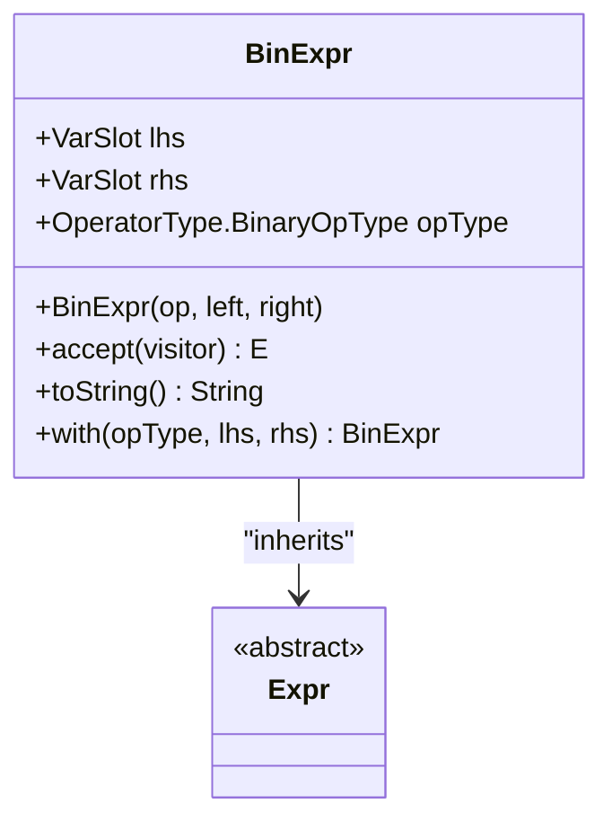
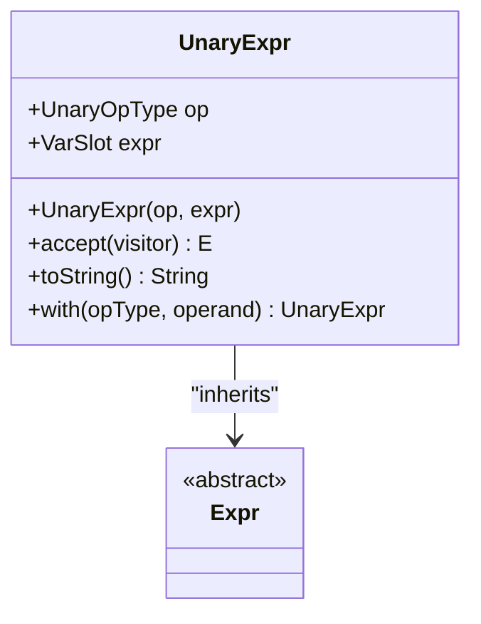
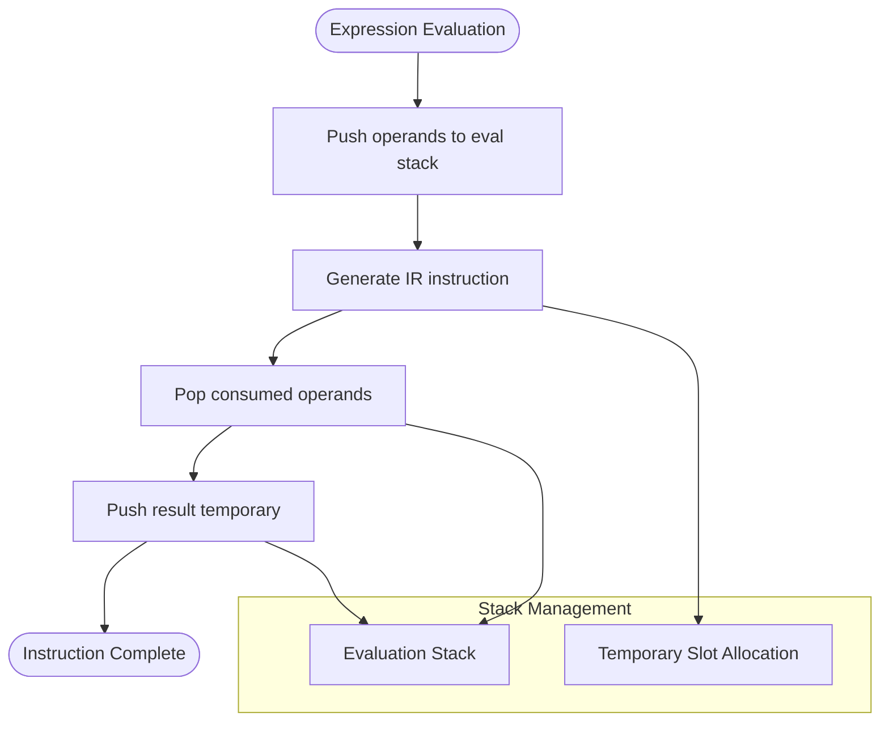
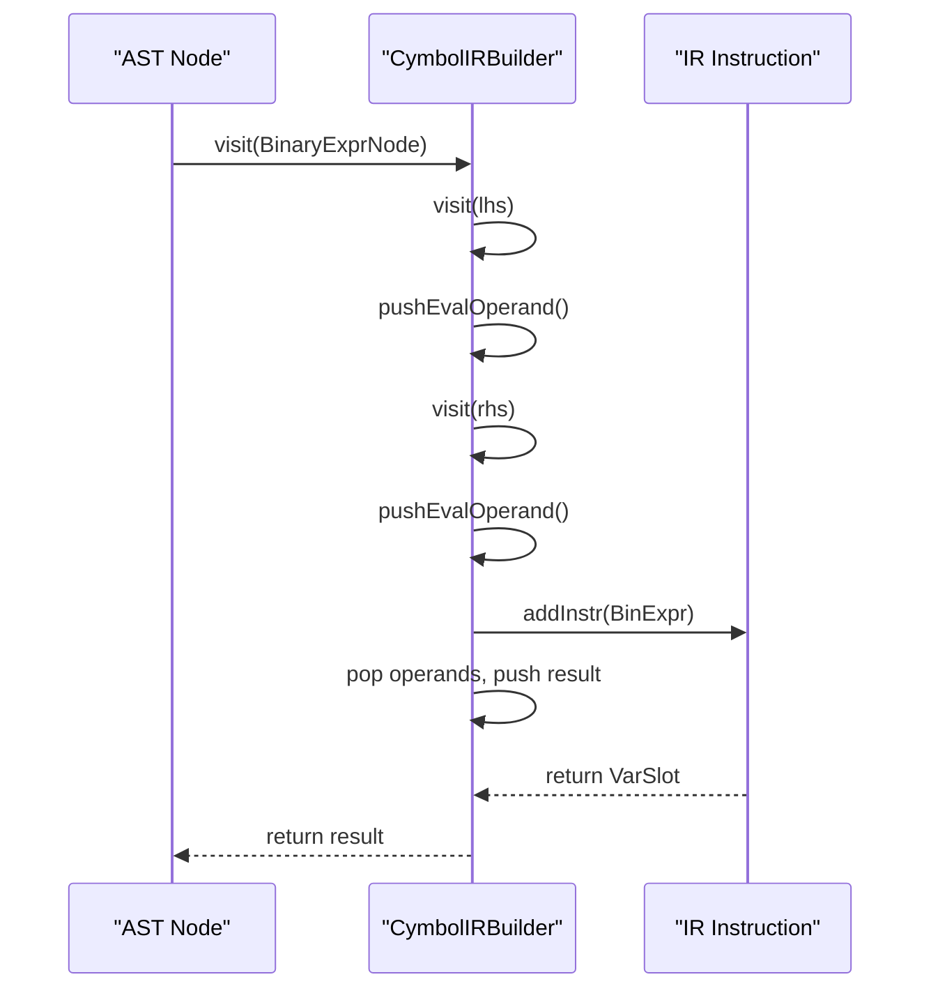

# Arithmetic Expressions in IR

<cite>
**Referenced Files in This Document**   
- [BinExpr.java](file://ep20/src/main/java/org/teachfx/antlr4/ep20/ir/expr/arith/BinExpr.java)
- [UnaryExpr.java](file://ep20/src/main/java/org/teachfx/antlr4/ep20/ir/expr/arith/UnaryExpr.java)
- [CymbolIRBuilder.java](file://ep20/src/main/java/org/teachfx/antlr4/ep20/pass/ir/CymbolIRBuilder.java)
- [BinaryExprNode.java](file://ep20/src/main/java/org/teachfx/antlr4/ep20/ast/expr/BinaryExprNode.java)
- [UnaryExprNode.java](file://ep20/src/main/java/org/teachfx/antlr4/ep20/ast/expr/UnaryExprNode.java)
</cite>

## Table of Contents
1. [Introduction](#introduction)
2. [Binary Expressions in IR](#binary-expressions-in-ir)
3. [Unary Expressions in IR](#unary-expressions-in-ir)
4. [Operand Handling and Temporary Allocation](#operand-handling-and-temporary-allocation)
5. [Operator Precedence and AST to IR Translation](#operator-precedence-and-ast-to-ir-translation)
6. [Type Checking and Arithmetic Safety](#type-checking-and-arithmetic-safety)
7. [Optimization Opportunities](#optimization-opportunities)
8. [Conclusion](#conclusion)

## Introduction
This document provides a comprehensive analysis of arithmetic expression handling in the Intermediate Representation (IR) of the compiler implementation. It details how binary and unary operations are represented in IR, how operands are managed, and how temporary values are allocated during code generation. The translation process from Abstract Syntax Tree (AST) nodes to IR expressions is explained, along with type checking considerations and potential optimization opportunities in subsequent compilation phases.

## Binary Expressions in IR

The `BinExpr` class in the IR layer represents binary arithmetic operations including addition, subtraction, multiplication, division, modulo, and logical AND/OR operations. Each binary expression contains two operands (left-hand side and right-hand side) and an operator type that specifies the operation to be performed.

Binary operations are implemented using three-address code format where the result of the operation is stored in a temporary location. The IR supports all standard arithmetic operators as well as logical operations, with operator types defined in the `OperatorType.BinaryOpType` enumeration. During IR generation, binary expressions are created with references to their operands as `VarSlot` instances, which represent either variables in the activation frame or temporary values on the operand stack.

**Diagram sources**
- [BinExpr.java](file://ep20/src/main/java/org/teachfx/antlr4/ep20/ir/expr/arith/BinExpr.java#L1-L60)

**Section sources**
- [BinExpr.java](file://ep20/src/main/java/org/teachfx/antlr4/ep20/ir/expr/arith/BinExpr.java#L1-L60)
- [BinaryExprNode.java](file://ep20/src/main/java/org/teachfx/antlr4/ep20/ast/expr/BinaryExprNode.java#L1-L97)

## Unary Expressions in IR

The `UnaryExpr` class represents unary operations such as negation and logical NOT in the IR. Unlike binary expressions, unary expressions have only one operand and one operator. The implementation follows the same three-address code principle, where the result is stored in a temporary location separate from the operand.

Unary expressions are commonly used for arithmetic negation (e.g., `-x`) and logical negation (e.g., `!condition`). The operator type is specified using the `OperatorType.UnaryOpType` enumeration, which distinguishes between different kinds of unary operations. The IR representation maintains the operand as a `VarSlot` reference, allowing for consistent handling of values regardless of whether they originate from variables or previous computations.

**Diagram sources**
- [UnaryExpr.java](file://ep20/src/main/java/org/teachfx/antlr4/ep20/ir/expr/arith/UnaryExpr.java#L1-L32)

**Section sources**
- [UnaryExpr.java](file://ep20/src/main/java/org/teachfx/antlr4/ep20/ir/expr/arith/UnaryExpr.java#L1-L32)
- [UnaryExprNode.java](file://ep20/src/main/java/org/teachfx/antlr4/ep20/ast/expr/UnaryExprNode.java#L1-L57)

## Operand Handling and Temporary Allocation

Operand management in the IR is handled through the `VarSlot` and `OperandSlot` classes, which represent locations for values in the generated code. The `CymbolIRBuilder` visitor implements a stack-based evaluation model where intermediate results are temporarily stored and managed during expression translation.

When processing arithmetic expressions, the IR builder uses an evaluation stack (`evalExprStack`) to manage intermediate values. For binary operations, both operands are evaluated and pushed onto the stack before the operation is generated. The `addInstr` method handles the creation of IR instructions and automatically manages stack balance by popping consumed operands and pushing the result temporary. Temporary values are allocated using `OperandSlot.pushStack()` which generates unique temporary slots for intermediate results.

The operand handling system ensures that complex nested expressions are correctly translated while maintaining proper value lifetimes and stack discipline. This approach enables the generation of correct three-address code even for deeply nested arithmetic expressions.

**Diagram sources**
- [CymbolIRBuilder.java](file://ep20/src/main/java/org/teachfx/antlr4/ep20/pass/ir/CymbolIRBuilder.java#L1-L474)

**Section sources**
- [CymbolIRBuilder.java](file://ep20/src/main/java/org/teachfx/antlr4/ep20/pass/ir/CymbolIRBuilder.java#L1-L474)

## Operator Precedence and AST to IR Translation

The translation from AST nodes to IR expressions preserves operator precedence through the recursive descent nature of the visitor pattern. The `CymbolIRBuilder` processes expressions in postfix order, ensuring that subexpressions are translated before their containing expressions, which naturally respects the precedence hierarchy defined in the grammar.

For binary expressions, the `visit(BinaryExprNode)` method first recursively processes the left and right operands, pushing their results onto the evaluation stack, before creating the corresponding `BinExpr` IR instruction. Similarly, unary expressions are handled by first evaluating the operand expression and then creating the `UnaryExpr` instruction. This approach ensures that the IR generation respects the syntactic structure of the original expression, including proper grouping and precedence.

The mapping between source language operators and IR instructions is maintained through the `OperatorType` enumeration, which provides a consistent representation of operators across different compilation phases. This allows the IR generator to accurately translate source operators like `+`, `-`, `*`, `/`, `%`, `&&`, and `||` into their corresponding IR representations.

**Diagram sources**
- [CymbolIRBuilder.java](file://ep20/src/main/java/org/teachfx/antlr4/ep20/pass/ir/CymbolIRBuilder.java#L1-L474)
- [BinaryExprNode.java](file://ep20/src/main/java/org/teachfx/antlr4/ep20/ast/expr/BinaryExprNode.java#L1-L97)

## Type Checking and Arithmetic Safety

While the IR generation phase primarily focuses on structural translation, type information from the AST is preserved and used to ensure arithmetic operations are applied to compatible types. The `BinaryExprNode` and `UnaryExprNode` classes maintain type information through their `getExprType()` methods, which are used by earlier compilation phases to validate operations.

The current implementation assumes type safety is verified during semantic analysis before IR generation. The IR itself does not perform type checking but relies on the frontend to ensure that operations are only applied to appropriate types. For arithmetic operations, this means verifying that operands are numeric types, while logical operations are restricted to boolean types.

Overflow and underflow handling is not explicitly implemented in the IR layer but would typically be addressed in later compilation phases or through runtime support. The IR provides the foundation for such checks by clearly representing each arithmetic operation as a distinct instruction that could be instrumented with overflow detection code during optimization or code generation.

**Section sources**
- [BinaryExprNode.java](file://ep20/src/main/java/org/teachfx/antlr4/ep20/ast/expr/BinaryExprNode.java#L1-L97)
- [UnaryExprNode.java](file://ep20/src/main/java/org/teachfx/antlr4/ep20/ast/expr/UnaryExprNode.java#L1-L57)

## Optimization Opportunities

The three-address code format used in the IR provides numerous opportunities for arithmetic expression optimization in subsequent compilation phases. The explicit representation of temporary values and individual operations enables various optimizations including:

- **Constant folding**: When both operands of a binary operation are compile-time constants, the operation can be evaluated during compilation.
- **Common subexpression elimination**: Identical expressions that produce the same result can be computed once and reused.
- **Algebraic simplification**: Expressions can be simplified using algebraic identities (e.g., `x + 0` → `x`, `x * 1` → `x`).
- **Strength reduction**: Expensive operations can be replaced with equivalent cheaper ones (e.g., `x * 2` → `x + x`).
- **Dead code elimination**: Unused arithmetic computations can be removed.

The CFG (Control Flow Graph) infrastructure, combined with liveness analysis, enables these optimizations by providing information about value usage and lifetime. The separation of expression evaluation from instruction generation in the IR builder facilitates these optimizations by maintaining a clear representation of data flow.

**Section sources**
- [CymbolIRBuilder.java](file://ep20/src/main/java/org/teachfx/antlr4/ep20/pass/ir/CymbolIRBuilder.java#L1-L474)
- [BinExpr.java](file://ep20/src/main/java/org/teachfx/antlr4/ep20/ir/expr/arith/BinExpr.java#L1-L60)
- [UnaryExpr.java](file://ep20/src/main/java/org/teachfx/antlr4/ep20/ir/expr/arith/UnaryExpr.java#L1-L32)

## Conclusion
The arithmetic expression system in the IR provides a robust foundation for representing and processing mathematical and logical operations. By using a three-address code format with explicit temporary allocation, the IR enables accurate translation of source expressions while supporting future optimization passes. The clear separation between AST representation and IR generation, combined with proper operand management and stack discipline, ensures correct handling of complex arithmetic expressions. The design supports all standard arithmetic and logical operations while providing the infrastructure needed for type safety and optimization in subsequent compilation phases.