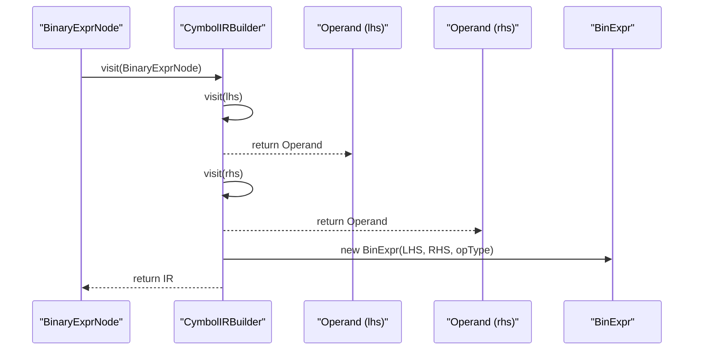
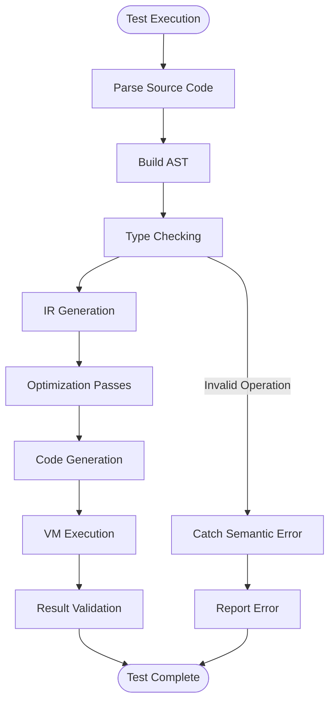

# Binary Expressions in IR

<cite>
**Referenced Files in This Document**  
- [BinExpr.java](file://ep20/src/main/java/org/teachfx/antlr4/ep20/ir/expr/arith/BinExpr.java)
- [OperatorType.java](file://ep20/src/main/java/org/teachfx/antlr4/ep20/symtab/type/OperatorType.java)
- [VarSlot.java](file://ep20/src/main/java/org/teachfx/antlr4/ep20/ir/expr/VarSlot.java)
- [CymbolIRBuilder.java](file://ep20/src/main/java/org/teachfx/antlr4/ep20/pass/ir/CymbolIRBuilder.java)
- [ThreeAddressCodeTest.java](file://ep20/src/test/java/org/teachfx/antlr4/ep20/ir/ThreeAddressCodeTest.java)
- [VMInstructionTest.java](file://ep20/src/test/java/org/teachfx/antlr4/ep20/pass/codegen/VMInstructionTest.java)
- [Expr.java](file://ep20/src/main/java/org/teachfx/antlr4/ep20/ir/expr/Expr.java)
- [Operand.java](file://ep20/src/main/java/org/teachfx/antlr4/ep20/ir/expr/Operand.java)
</cite>

## Table of Contents
1. [Introduction](#introduction)
2. [BinExpr Class Structure](#binexpr-class-structure)
3. [Operator Type System](#operator-type-system)
4. [Operand Representation and VarSlot Usage](#operand-representation-and-varslot-usage)
5. [IR Generation from AST](#ir-generation-from-ast)
6. [Type Checking and Promotion](#type-checking-and-promotion)
7. [Visitor Pattern and Code Generation](#visitor-pattern-and-code-generation)
8. [Test Case Validation](#test-case-validation)
9. [Conclusion](#conclusion)

## Introduction
This document provides a comprehensive analysis of binary arithmetic expressions in the Intermediate Representation (IR) of the Cymbol compiler framework. It details the implementation of binary operations in three-address code form, focusing on the `BinExpr` class, operand handling, type enforcement, and integration with the overall compilation pipeline. The analysis covers how high-level binary operations are translated into low-level IR constructs that enable efficient code generation and optimization.

## BinExpr Class Structure

The `BinExpr` class serves as the core representation of binary operations in the IR, extending the base `Expr` class and implementing the `Operand` interface. It encapsulates three fundamental components: left-hand side operand (`lhs`), right-hand side operand (`rhs`), and operation type (`opType`). The constructor enforces strict validation of operand types and operator validity, ensuring only compatible operands are combined with appropriate operators.

The class maintains immutability after construction, with all fields declared final to prevent modification during optimization passes. Each `BinExpr` instance represents a single three-address code instruction where the result of the binary operation is conceptually stored in a temporary location, following the SSA-like convention used in the IR.

**Section sources**
- [BinExpr.java](file://ep20/src/main/java/org/teachfx/antlr4/ep20/ir/expr/arith/BinExpr.java#L1-L50)
- [Expr.java](file://ep20/src/main/java/org/teachfx/antlr4/ep20/ir/expr/Expr.java#L1-L20)

## Operator Type System

Binary operations are governed by the `OperatorType.BinaryOpType` enum, which defines all supported arithmetic and logical operations: addition (`ADD`), subtraction (`SUB`), multiplication (`MUL`), division (`DIV`), modulo (`MOD`), logical AND (`AND`), and logical OR (`OR`). Each operator type carries metadata about operand compatibility, result type, and precedence rules.

The system enforces semantic constraints at the IR level, preventing invalid operations such as boolean arithmetic or string concatenation without explicit operator overloading. The enum serves as a central authority for operation validation, used both during IR construction and subsequent optimization passes to determine transformation possibilities.

```mermaid
classDiagram
class BinExpr {
+final Operand lhs
+final Operand rhs
+final OperatorType.BinaryOpType opType
+BinExpr(Operand, Operand, BinaryOpType)
+accept(IRVisitor) void
+getType() Type
}
class OperatorType$BinaryOpType {
+ADD
+SUB
+MUL
+DIV
+MOD
+AND
+OR
+isValidFor(Type, Type) boolean
+getResultType(Type, Type) Type
}
class Operand {
<<interface>>
+getType() Type
}
BinExpr --> Operand : "lhs, rhs"
BinExpr --> OperatorType$BinaryOpType : "opType"
Operand <|.. VarSlot
Operand <|.. ConstVal
Operand <|.. BinExpr
```

**Diagram sources**
- [BinExpr.java](file://ep20/src/main/java/org/teachfx/antlr4/ep20/ir/expr/arith/BinExpr.java#L1-L40)
- [OperatorType.java](file://ep20/src/main/java/org/teachfx/antlr4/ep20/symtab/type/OperatorType.java#L20-L50)

## Operand Representation and VarSlot Usage

Operands in binary expressions are represented through the `Operand` interface, with `VarSlot` being the primary implementation for variable references and temporaries. `VarSlot` encapsulates storage location information, including frame offset and register allocation hints, enabling efficient code generation.

During IR generation, AST variables are translated into `VarSlot` instances that reference symbol table entries, preserving type information and scope context. Temporary values generated from subexpressions are also assigned `VarSlot` identifiers, maintaining the three-address code structure where complex expressions are decomposed into simple binary operations.

The operand system supports both direct values (via `ImmValue`) and computed expressions (via `Expr` subclasses), allowing `BinExpr` to compose arbitrarily complex calculations while maintaining a uniform interface for code generation.

**Section sources**
- [VarSlot.java](file://ep20/src/main/java/org/teachfx/antlr4/ep20/ir/expr/VarSlot.java#L1-L35)
- [Operand.java](file://ep20/src/main/java/org/teachfx/antlr4/ep20/ir/expr/Operand.java#L1-L15)

## IR Generation from AST

The translation from AST binary nodes to `BinExpr` instances occurs in the `CymbolIRBuilder` class, which implements the visitor pattern to traverse the abstract syntax tree. When encountering a `BinaryExprNode`, the builder recursively processes left and right operands, then constructs a corresponding `BinExpr` with the appropriate `BinaryOpType`.

Result allocation follows a strict protocol: each binary operation produces a new `VarSlot` representing the temporary result, which can be used as an operand in subsequent operations. This approach enforces the single-assignment property of the IR, simplifying data flow analysis and optimization.

The builder validates operator-operand compatibility during translation, ensuring that only semantically valid operations are emitted to the IR. This early validation prevents type errors from propagating into later compilation stages.



**Diagram sources**
- [CymbolIRBuilder.java](file://ep20/src/main/java/org/teachfx/antlr4/ep20/pass/ir/CymbolIRBuilder.java#L45-L75)
- [BinExpr.java](file://ep20/src/main/java/org/teachfx/antlr4/ep20/ir/expr/arith/BinExpr.java#L20-L30)

## Type Checking and Promotion

Type checking is performed before IR generation using the `TypeChecker` pass, which validates binary operations against the language's type system. The checker enforces arithmetic operations only on numeric types (int, float) and logical operations on boolean types, rejecting invalid combinations.

Implicit type promotion is handled according to standard rules: integer operands in mixed-type expressions are promoted to float, with appropriate conversion instructions inserted in the IR. The `OperatorType` enum provides utility methods to determine result types and required promotions, ensuring consistent behavior across all compilation stages.

These checks occur during the semantic analysis phase, guaranteeing that the IR receives only type-correct expressions. This separation of concerns allows the IR generation and optimization phases to assume well-typed input, simplifying their implementation.

**Section sources**
- [OperatorType.java](file://ep20/src/main/java/org/teachfx/antlr4/ep20/symtab/type/OperatorType.java#L30-L60)
- [CymbolIRBuilder.java](file://ep20/src/main/java/org/teachfx/antlr4/ep20/pass/ir/CymbolIRBuilder.java#L60-L70)

## Visitor Pattern and Code Generation

The `IRVisitor` interface enables polymorphic processing of IR nodes, including `BinExpr` instances, supporting both code generation and optimization passes. Code generators implement the visitor to emit target-specific instructions for each binary operation, while optimizers use it to identify and transform expression patterns.

During code generation, the visitor dispatches to operation-specific methods that map `BinaryOpType` values to virtual machine instructions. For example, `ADD` operations become `iadd` or `fadd` bytecode depending on operand types, with the visitor having access to full type information through the `getType()` method.

Optimization passes use the same visitor infrastructure to perform algebraic simplification, constant folding, and strength reduction on binary expressions, leveraging the uniform interface to process all operation types consistently.

**Section sources**
- [IRVisitor.java](file://ep20/src/main/java/org/teachfx/antlr4/ep20/ir/IRVisitor.java#L1-L25)
- [BinExpr.java](file://ep20/src/main/java/org/teachfx/antlr4/ep20/ir/expr/arith/BinExpr.java#L35-L45)

## Test Case Validation

The correctness of binary expression handling is verified through multiple test suites. `ThreeAddressCodeTest` validates the structural integrity of IR generation, ensuring that complex expressions are properly decomposed into sequences of `BinExpr` instances with correct operand references and temporary allocations.

`VMInstructionTest` verifies the end-to-end behavior of binary operations, confirming that generated bytecode produces expected results for various operand types and edge cases (division by zero, overflow, etc.). These tests cover all supported operators and type combinations, serving as regression protection for the IR generation pipeline.

The test cases also validate error handling, ensuring that invalid binary operations are caught during semantic analysis rather than IR generation, maintaining the assumption of type-correct input in later stages.



**Diagram sources**
- [ThreeAddressCodeTest.java](file://ep20/src/test/java/org/teachfx/antlr4/ep20/ir/ThreeAddressCodeTest.java#L1-L40)
- [VMInstructionTest.java](file://ep20/src/test/java/org/teachfx/antlr4/ep20/pass/codegen/VMInstructionTest.java#L1-L50)

## Conclusion
The binary expression system in the IR provides a robust foundation for arithmetic and logical operations in the Cymbol compiler. Through the `BinExpr` class, `OperatorType` enum, and `VarSlot` operand system, it enables type-safe, optimizable three-address code generation. The integration with the visitor pattern allows flexible processing across compilation stages, while comprehensive testing ensures reliability. This design effectively bridges high-level language constructs with low-level code generation requirements.