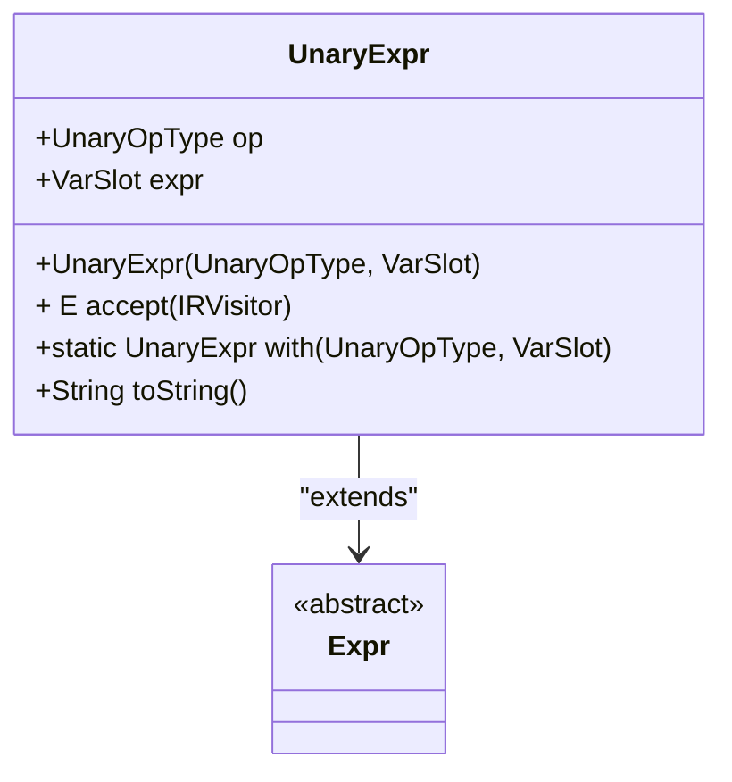
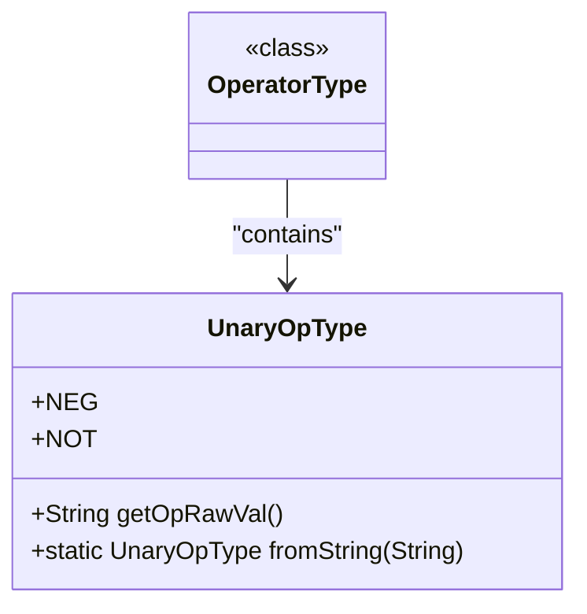
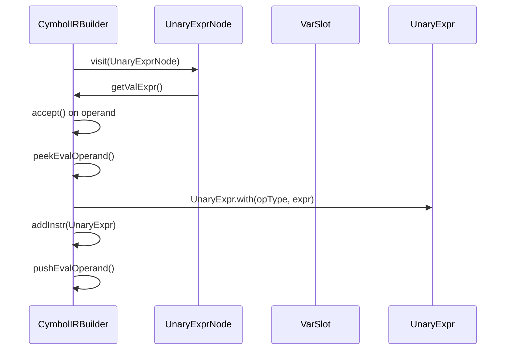
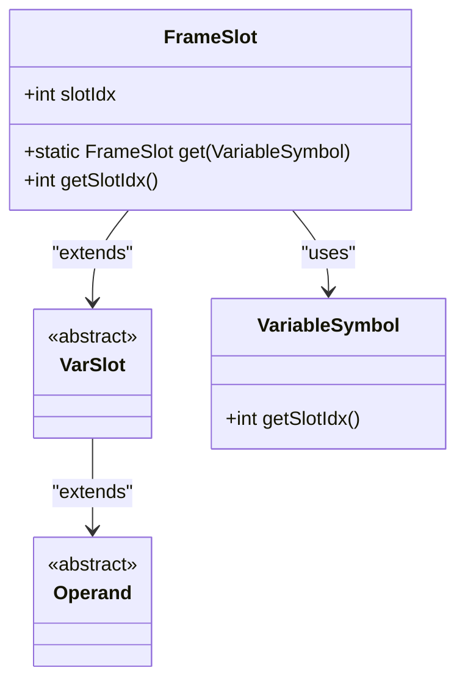
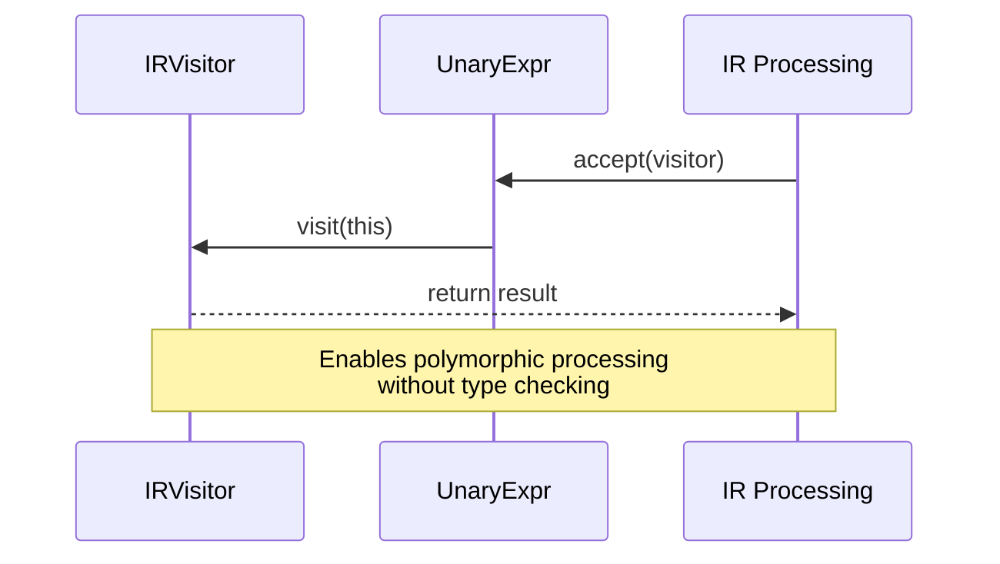
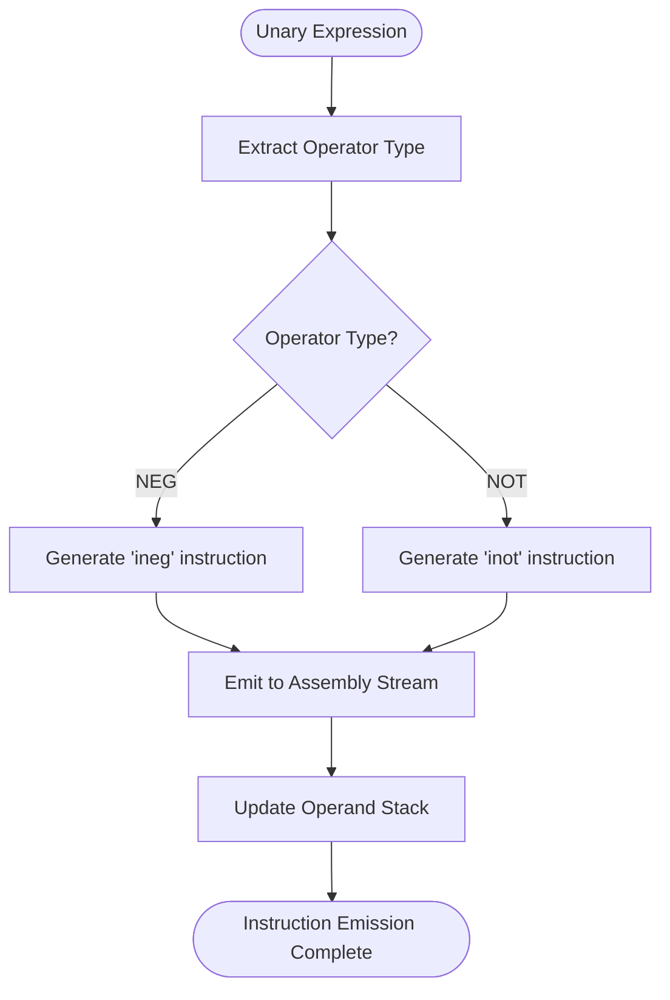
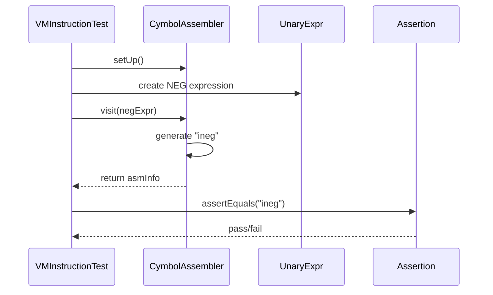

# Unary Expressions in IR

<cite>
**Referenced Files in This Document**   
- [UnaryExpr.java](file://ep20/src/main/java/org/teachfx/antlr4/ep20/ir/expr/arith/UnaryExpr.java)
- [OperatorType.java](file://ep20/src/main/java/org/teachfx/antlr4/ep20/symtab/type/OperatorType.java)
- [CymbolIRBuilder.java](file://ep20/src/main/java/org/teachfx/antlr4/ep20/pass/ir/CymbolIRBuilder.java)
- [UnaryExprNode.java](file://ep20/src/main/java/org/teachfx/antlr4/ep20/ast/expr/UnaryExprNode.java)
- [VMInstructionTest.java](file://ep20/src/test/java/org/teachfx/antlr4/ep20/pass/codegen/VMInstructionTest.java)
- [VarSlot.java](file://ep20/src/main/java/org/teachfx/antlr4/ep20/ir/expr/VarSlot.java)
- [FrameSlot.java](file://ep20/src/main/java/org/teachfx/antlr4/ep20/ir/expr/addr/FrameSlot.java)
</cite>

## Table of Contents
1. [Introduction](#introduction)
2. [UnaryExpr Class Implementation](#unaryexpr-class-implementation)
3. [Operator Type Enumeration](#operator-type-enumeration)
4. [AST to IR Translation Process](#ast-to-ir-translation-process)
5. [Operand Representation with VarSlot](#operand-representation-with-varslot)
6. [Visitor Pattern Integration](#visitor-pattern-integration)
7. [Code Generation and Instruction Emission](#code-generation-and-instruction-emission)
8. [Test Case Validation](#test-case-validation)

## Introduction
This document provides a comprehensive analysis of unary arithmetic expressions in the Intermediate Representation (IR) system. It details the implementation of the UnaryExpr class, its integration with the AST transformation pipeline, and the process of translating high-level unary operations into executable IR instructions. The documentation covers the data structures, design patterns, and execution flow involved in handling unary operations such as negation and logical NOT.

## UnaryExpr Class Implementation

The UnaryExpr class represents unary operations in the intermediate representation system. It extends the base Expr class and captures both the operator type and operand in a structured format.

The class contains two primary fields:
- **op**: Stores the unary operator type as defined in the OperatorType.UnaryOpType enum
- **expr**: Represents the operand using the VarSlot abstraction

The constructor `UnaryExpr(UnaryOpType op, VarSlot expr)` initializes these fields, creating a complete representation of a unary operation. The class also provides a static factory method `with(OperatorType.UnaryOpType opType, VarSlot operand)` for convenient instance creation.

**Diagram sources**
- [UnaryExpr.java](file://ep20/src/main/java/org/teachfx/antlr4/ep20/ir/expr/arith/UnaryExpr.java#L1-L30)

**Section sources**
- [UnaryExpr.java](file://ep20/src/main/java/org/teachfx/antlr4/ep20/ir/expr/arith/UnaryExpr.java#L1-L30)

## Operator Type Enumeration

The OperatorType class defines an inner enum UnaryOpType that represents the available unary operators in the language. This enumeration provides type safety and clear semantics for unary operations.

Currently, two unary operators are supported:
- **NEG ("-")**: Represents arithmetic negation
- **NOT ("!")**: Represents logical negation

Each enum constant stores its corresponding operator symbol through the opRawVal field and provides a getOpRawVal() method to retrieve it. The enum also includes a fromString() static method that enables operator lookup by symbol string, facilitating parsing and validation.

**Diagram sources**
- [OperatorType.java](file://ep20/src/main/java/org/teachfx/antlr4/ep20/symtab/type/OperatorType.java#L40-L55)

**Section sources**
- [OperatorType.java](file://ep20/src/main/java/org/teachfx/antlr4/ep20/symtab/type/OperatorType.java#L40-L55)

## AST to IR Translation Process

The translation from Abstract Syntax Tree (AST) nodes to IR expressions occurs in the CymbolIRBuilder class. When processing a UnaryExprNode from the AST, the builder follows a systematic process to generate the corresponding IR representation.

The visit method for UnaryExprNode first processes the operand expression by recursively visiting the valExpr node. It then retrieves the evaluated operand from the expression stack and creates a new UnaryExpr IR node using the static with factory method, passing both the operator type and the evaluated operand.

**Diagram sources**
- [CymbolIRBuilder.java](file://ep20/src/main/java/org/teachfx/antlr4/ep20/pass/ir/CymbolIRBuilder.java#L170-L178)
- [UnaryExprNode.java](file://ep20/src/main/java/org/teachfx/antlr4/ep20/ast/expr/UnaryExprNode.java#L1-L55)

**Section sources**
- [CymbolIRBuilder.java](file://ep20/src/main/java/org/teachfx/antlr4/ep20/pass/ir/CymbolIRBuilder.java#L170-L178)

## Operand Representation with VarSlot

The VarSlot class serves as the fundamental abstraction for representing values in the IR system. As an abstract class extending Operand, it provides a uniform interface for different types of value containers.

In the context of unary expressions, the expr field of UnaryExpr holds a VarSlot instance that represents the operand. This could be:
- **FrameSlot**: Represents a variable in the current stack frame
- **OperandSlot**: Represents a temporary value on the operand stack
- **ConstVal**: Represents a constant value

The FrameSlot implementation is particularly important as it maps directly to variables in the source code, using a slot index to identify the variable's location in the activation frame. The static get method creates FrameSlot instances from VariableSymbol objects, maintaining the connection between the symbol table and IR generation.

**Diagram sources**
- [VarSlot.java](file://ep20/src/main/java/org/teachfx/antlr4/ep20/ir/expr/VarSlot.java#L1-L5)
- [FrameSlot.java](file://ep20/src/main/java/org/teachfx/antlr4/ep20/ir/expr/addr/FrameSlot.java#L1-L30)

**Section sources**
- [VarSlot.java](file://ep20/src/main/java/org/teachfx/antlr4/ep20/ir/expr/VarSlot.java#L1-L5)
- [FrameSlot.java](file://ep20/src/main/java/org/teachfx/antlr4/ep20/ir/expr/addr/FrameSlot.java#L1-L30)

## Visitor Pattern Integration

The UnaryExpr class integrates with the visitor pattern through its accept method, which enables polymorphic processing of IR nodes without requiring type checks. This design supports extensibility, allowing new operations to be added to the IR system without modifying existing classes.

The accept method follows the classic visitor pattern implementation, taking an IRVisitor parameter and delegating to the visitor's visit method with this instance as the argument. This enables various downstream passes such as code generation, liveness analysis, and optimization to process unary expressions in a type-safe manner.

The visitor pattern facilitates separation of concerns, where the IR node structure remains independent of the algorithms that operate on it. This allows multiple different operations (code generation, analysis, transformation) to be implemented as separate visitor classes that can traverse the same IR structure.

**Diagram sources**
- [UnaryExpr.java](file://ep20/src/main/java/org/teachfx/antlr4/ep20/ir/expr/arith/UnaryExpr.java#L20-L24)

**Section sources**
- [UnaryExpr.java](file://ep20/src/main/java/org/teachfx/antlr4/ep20/ir/expr/arith/UnaryExpr.java#L20-L24)

## Code Generation and Instruction Emission

During code generation, unary expressions are translated into specific virtual machine instructions based on their operator type. The CymbolAssembler class handles this translation process, converting IR nodes into assembly-like instructions.

For the NEG operator, the system generates the "ineg" instruction, while other unary operations follow similar patterns. The instruction emission process maintains a stack-based model where operands are popped from the evaluation stack and results are pushed back onto it.

The code generation process preserves the semantics of the original expression while optimizing for the target execution model. Temporary results are managed through the operand stack mechanism, with the system automatically handling stack balance during instruction generation.

**Diagram sources**
- [UnaryExpr.java](file://ep20/src/main/java/org/teachfx/antlr4/ep20/ir/expr/arith/UnaryExpr.java#L1-L30)
- [CymbolAssembler.java](file://ep20/src/main/java/org/teachfx/antlr4/ep20/pass/codegen/CymbolAssembler.java)

**Section sources**
- [UnaryExpr.java](file://ep20/src/main/java/org/teachfx/antlr4/ep20/ir/expr/arith/UnaryExpr.java#L1-L30)

## Test Case Validation

The VMInstructionTest class contains comprehensive test cases that validate the correct emission of unary operation instructions. The testEmitUnaryOperationInstruction method specifically verifies that the NEG operator generates the expected "ineg" instruction.

The test creates a UnaryExpr instance with the NEG operator and a temporary operand, then processes it through the CymbolAssembler visitor. The resulting assembly output is compared against the expected instruction string, ensuring that the code generation process produces the correct output.

These tests also validate edge cases and error conditions, ensuring that the system handles various operand types and operator combinations correctly. The testing framework uses mocking and assertion libraries to verify both the instruction content and the overall behavior of the code generation process.

**Diagram sources**
- [VMInstructionTest.java](file://ep20/src/test/java/org/teachfx/antlr4/ep20/pass/codegen/VMInstructionTest.java#L60-L75)

**Section sources**
- [VMInstructionTest.java](file://ep20/src/test/java/org/teachfx/antlr4/ep20/pass/codegen/VMInstructionTest.java#L60-L75)