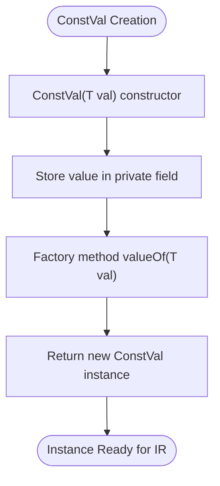

# Constant Value Representation

<cite>
**Referenced Files in This Document**   
- [ConstVal.java](file://ep20/src/main/java/org/teachfx/antlr4/ep20/ir/expr/val/ConstVal.java)
- [ImmValue.java](file://ep20/src/main/java/org/teachfx/antlr4/ep20/ir/expr/ImmValue.java)
- [CymbolIRBuilder.java](file://ep20/src/main/java/org/teachfx/antlr4/ep20/pass/ir/CymbolIRBuilder.java)
- [IntExprNode.java](file://ep20/src/main/java/org/teachfx/antlr4/ep20/ast/expr/IntExprNode.java)
- [BoolExprNode.java](file://ep20/src/main/java/org/teachfx/antlr4/ep20/ast/expr/BoolExprNode.java)
- [FloatExprNode.java](file://ep20/src/main/java/org/teachfx/antlr4/ep20/ast/expr/FloatExprNode.java)
- [StringExprNode.java](file://ep20/src/main/java/org/teachfx/antlr4/ep20/ast/expr/StringExprNode.java)
</cite>

## Table of Contents
1. [Introduction](#introduction)
2. [Core Classes Overview](#core-classes-overview)
3. [ConstVal Class Implementation](#constval-class-implementation)
4. [ImmValue Wrapper and Type Hierarchy](#immvalue-wrapper-and-type-hierarchy)
5. [AST to IR Conversion Process](#ast-to-ir-conversion-process)
6. [Integration with Type System](#integration-with-type-system)
7. [Constant Folding and Optimization](#constant-folding-and-optimization)
8. [Code Generation and Assembly Emission](#code-generation-and-assembly-emission)
9. [Memory Representation Considerations](#memory-representation-considerations)

## Introduction
This document details the representation of constant values in the Intermediate Representation (IR) of the compiler implementation. It focuses on the `ConstVal` class for representing literal constants and the `ImmValue` wrapper for immediate values used during code generation. The documentation covers how these representations facilitate constant folding, integrate with the type system, and contribute to optimization passes and final assembly output.

## Core Classes Overview
The constant value representation system consists of two primary components: the `ConstVal` class that encapsulates literal values of various types, and the `ImmValue` abstract class that serves as a wrapper for immediate operands in IR instructions. These classes work together to provide a type-safe and efficient mechanism for handling constants throughout the compilation pipeline.

**Diagram sources**
- [ConstVal.java](file://ep20/src/main/java/org/teachfx/antlr4/ep20/ir/expr/val/ConstVal.java#L5-L41)
- [ImmValue.java](file://ep20/src/main/java/org/teachfx/antlr4/ep20/ir/expr/ImmValue.java#L2-L4)

**Section sources**
- [ConstVal.java](file://ep20/src/main/java/org/teachfx/antlr4/ep20/ir/expr/val/ConstVal.java#L5-L41)
- [ImmValue.java](file://ep20/src/main/java/org/teachfx/antlr4/ep20/ir/expr/ImmValue.java#L2-L4)

## ConstVal Class Implementation
The `ConstVal<T>` class is a generic implementation that represents literal constants in the IR. It can hold values of various types including integers, floating-point numbers, booleans, and strings. The class provides type-safe access to the underlying value through its generic parameter T.

The implementation includes a factory method `valueOf()` that creates new instances, getter and setter methods for the value, and an overridden `toString()` method that formats the output according to the value type. The `toString()` method provides specialized formatting for strings (enclosed in single quotes), integers (formatted as decimal), and booleans (formatted as true/false).

**Diagram sources**
- [ConstVal.java](file://ep20/src/main/java/org/teachfx/antlr4/ep20/ir/expr/val/ConstVal.java#L5-L41)

**Section sources**
- [ConstVal.java](file://ep20/src/main/java/org/teachfx/antlr4/ep20/ir/expr/val/ConstVal.java#L5-L41)

## ImmValue Wrapper and Type Hierarchy
The `ImmValue` class serves as an abstract base class that extends `Operand` and provides a common interface for immediate values in the IR. This wrapper pattern allows constant values to be treated uniformly with other operands in IR instructions while maintaining their immediate nature.

The inheritance hierarchy places `ConstVal` as a concrete implementation of `ImmValue`, establishing a clear relationship between constant values and immediate operands. This design enables polymorphic handling of immediate values throughout the code generation and optimization phases.

**Diagram sources**
- [ImmValue.java](file://ep20/src/main/java/org/teachfx/antlr4/ep20/ir/expr/ImmValue.java#L2-L4)
- [ConstVal.java](file://ep20/src/main/java/org/teachfx/antlr4/ep20/ir/expr/val/ConstVal.java#L5-L41)

**Section sources**
- [ImmValue.java](file://ep20/src/main/java/org/teachfx/antlr4/ep20/ir/expr/ImmValue.java#L2-L4)
- [ConstVal.java](file://ep20/src/main/java/org/teachfx/antlr4/ep20/ir/expr/val/ConstVal.java#L5-L41)

## AST to IR Conversion Process
The conversion from AST literal nodes to `ConstVal` instances occurs during the IR generation phase, implemented in the `CymbolIRBuilder` class. When visiting literal expression nodes, the builder creates corresponding `ConstVal` instances using the `valueOf()` factory method and pushes them onto the evaluation stack.

Specific visitor methods handle different literal types: `visit(IntExprNode)` for integer literals, `visit(BoolExprNode)` for boolean literals, `visit(FloatExprNode)` for floating-point literals, and `visit(StringExprNode)` for string literals. Each method extracts the raw value from the AST node and wraps it in a `ConstVal` instance.

**Diagram sources**
- [CymbolIRBuilder.java](file://ep20/src/main/java/org/teachfx/antlr4/ep20/pass/ir/CymbolIRBuilder.java#L143-L193)
- [ConstVal.java](file://ep20/src/main/java/org/teachfx/antlr4/ep20/ir/expr/val/ConstVal.java#L15-L20)

**Section sources**
- [CymbolIRBuilder.java](file://ep20/src/main/java/org/teachfx/antlr4/ep20/pass/ir/CymbolIRBuilder.java#L143-L193)

## Integration with Type System
The constant value representation integrates with the compiler's type system through the generic parameter T in `ConstVal<T>`. This allows the type checker to verify that constant values are used in contexts appropriate to their types. The type information flows from the AST nodes, through the IR representation, and into the code generation phase.

During type checking, literal nodes are assigned appropriate types (int, float, bool, string), and these types are preserved in the `ConstVal` instances. This ensures type safety throughout the compilation process and enables type-based optimizations.

**Diagram sources**
- [CymbolIRBuilder.java](file://ep20/src/main/java/org/teachfx/antlr4/ep20/pass/ir/CymbolIRBuilder.java#L143-L193)
- [ConstVal.java](file://ep20/src/main/java/org/teachfx/antlr4/ep20/ir/expr/val/ConstVal.java#L5-L41)

**Section sources**
- [CymbolIRBuilder.java](file://ep20/src/main/java/org/teachfx/antlr4/ep20/pass/ir/CymbolIRBuilder.java#L143-L193)

## Constant Folding and Optimization
The `ConstVal` representation facilitates constant folding by providing easy access to the underlying values for compile-time evaluation. Optimization passes can examine `ConstVal` instances, perform arithmetic or logical operations on their values, and replace expressions with simplified constants.

The uniform interface provided by `ImmValue` allows optimization algorithms to handle constant operands alongside other immediate values without special cases. This enables optimizations such as constant propagation, dead code elimination, and algebraic simplification.

**Section sources**
- [CymbolIRBuilder.java](file://ep20/src/main/java/org/teachfx/antlr4/ep20/pass/ir/CymbolIRBuilder.java#L143-L193)
- [ConstVal.java](file://ep20/src/main/java/org/teachfx/antlr4/ep20/ir/expr/val/ConstVal.java#L5-L41)

## Code Generation and Assembly Emission
During code generation, `ConstVal` instances are translated into immediate operands in assembly instructions. The code generator examines the type and value of each `ConstVal` and emits appropriate assembly directives or instruction operands.

String constants may be stored in a separate data section with references in the code section, while numeric constants are typically embedded directly in instructions. The `toString()` method of `ConstVal` provides formatted output that can be used directly in assembly generation.

**Section sources**
- [CymbolIRBuilder.java](file://ep20/src/main/java/org/teachfx/antlr4/ep20/pass/ir/CymbolIRBuilder.java#L143-L193)
- [ConstVal.java](file://ep20/src/main/java/org/teachfx/antlr4/ep20/ir/expr/val/ConstVal.java#L30-L40)

## Memory Representation Considerations
The memory representation of constants depends on their type and usage context. Numeric constants are typically stored as immediate values in instruction operands, while string constants are stored in read-only data sections with pointers or offsets used in code.

The `ConstVal` class itself is a runtime object in the compiler, but its value is extracted and transformed into appropriate memory representations in the final executable. Large constants or arrays may be allocated in specific memory segments to optimize access patterns and memory usage.

**Section sources**
- [ConstVal.java](file://ep20/src/main/java/org/teachfx/antlr4/ep20/ir/expr/val/ConstVal.java#L5-L41)
- [CymbolIRBuilder.java](file://ep20/src/main/java/org/teachfx/antlr4/ep20/pass/ir/CymbolIRBuilder.java#L143-L193)