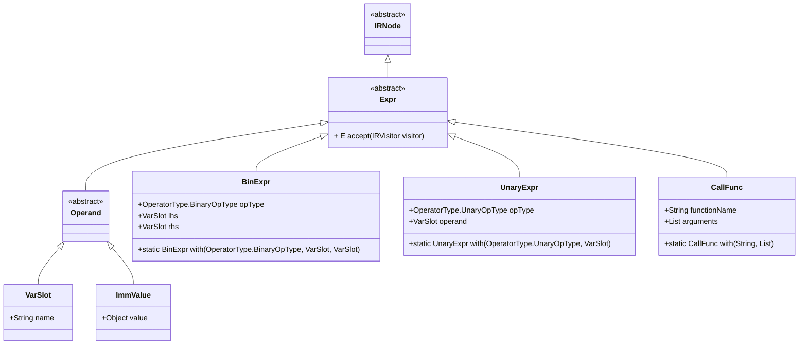
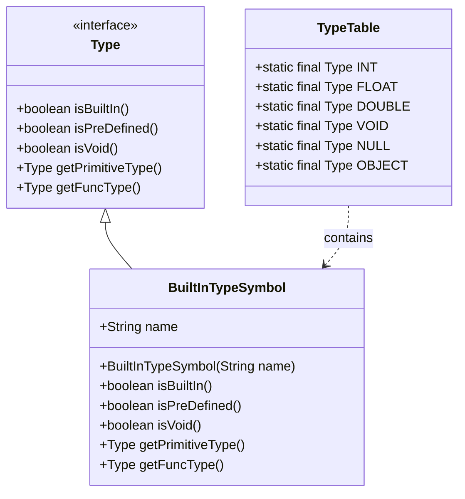

# IR Expression Class Hierarchy

<cite>
**Referenced Files in This Document**   
- [Expr.java](file://ep20/src/main/java/org/teachfx/antlr4/ep20/ir/expr/Expr.java)
- [IRNode.java](file://ep20/src/main/java/org/teachfx/antlr4/ep20/ir/IRNode.java)
- [BinExpr.java](file://ep20/src/main/java/org/teachfx/antlr4/ep20/ir/expr/arith/BinExpr.java)
- [UnaryExpr.java](file://ep20/src/main/java/org/teachfx/antlr4/ep20/ir/expr/arith/UnaryExpr.java)
- [CallFunc.java](file://ep20/src/main/java/org/teachfx/antlr4/ep20/ir/expr/CallFunc.java)
- [Operand.java](file://ep20/src/main/java/org/teachfx/antlr4/ep20/ir/expr/Operand.java)
- [ExprNode.java](file://ep20/src/main/java/org/teachfx/antlr4/ep20/ast/expr/ExprNode.java)
- [BuiltInTypeSymbol.java](file://ep20/src/main/java/org/teachfx/antlr4/ep20/symtab/type/BuiltInTypeSymbol.java)
</cite>

## Table of Contents
1. [Introduction](#introduction)
2. [Core Components](#core-components)
3. [Architecture Overview](#architecture-overview)
4. [Detailed Component Analysis](#detailed-component-analysis)
5. [Dependency Analysis](#dependency-analysis)

## Introduction
This document provides a comprehensive analysis of the Intermediate Representation (IR) expression class hierarchy in the Antlr4-based compiler implementation. It focuses on the foundational `Expr` class and its role in representing computational expressions within the compiler's intermediate representation. The documentation covers the inheritance structure, visitor pattern implementation, type integration, and common extension patterns used throughout the codebase.

## Core Components

The IR expression hierarchy is built around the abstract `Expr` class, which serves as the base for all expression types in the intermediate representation. This class extends `IRNode` and implements the visitor pattern through the `accept` method, enabling operations to be performed on expression nodes without modifying the class hierarchy. The expression system supports arithmetic operations, constant values, variable references, and function calls through specialized subclasses.

**Section sources**
- [Expr.java](file://ep20/src/main/java/org/teachfx/antlr4/ep20/ir/expr/Expr.java#L5-L7)
- [IRNode.java](file://ep20/src/main/java/org/teachfx/antlr4/ep20/ir/IRNode.java#L2-L4)

## Architecture Overview

The IR expression class hierarchy follows a classic object-oriented design pattern for representing abstract syntax trees in compiler construction. The architecture is organized around a base `Expr` class that inherits from `IRNode`, forming part of a larger IR node hierarchy. This design enables polymorphic behavior and supports the visitor pattern for traversing and transforming expression trees.



**Diagram sources**
- [Expr.java](file://ep20/src/main/java/org/teachfx/antlr4/ep20/ir/expr/Expr.java#L5-L7)
- [IRNode.java](file://ep20/src/main/java/org/teachfx/antlr4/ep20/ir/IRNode.java#L2-L4)
- [BinExpr.java](file://ep20/src/main/java/org/teachfx/antlr4/ep20/ir/expr/arith/BinExpr.java#L54-L56)
- [UnaryExpr.java](file://ep20/src/main/java/org/teachfx/antlr4/ep20/ir/expr/arith/UnaryExpr.java#L22-L24)
- [CallFunc.java](file://ep20/src/main/java/org/teachfx/antlr4/ep20/ir/expr/CallFunc.java)

## Detailed Component Analysis

### Base Expr Class Analysis
The `Expr` class serves as the foundation for all expression types in the Intermediate Representation. As an abstract class extending `IRNode`, it provides the basic structure for representing computational expressions while enforcing implementation of the visitor pattern through its abstract `accept` method. This design enables separation of algorithms from the object structure, allowing new operations to be added without modifying the existing class hierarchy.

The visitor pattern implementation uses Java generics with type parameters `<S,E>` to provide type safety while maintaining flexibility. The `accept` method returns a value of type `E` and takes a visitor of type `IRVisitor<S,E>`, where `S` typically represents the visitor's state and `E` represents the result type of the visit operation.

**Section sources**
- [Expr.java](file://ep20/src/main/java/org/teachfx/antlr4/ep20/ir/expr/Expr.java#L5-L7)

### Expression Typing Integration
The expression hierarchy integrates with the compiler's type system through the symbol table and type representation classes. While the IR expressions themselves may not directly contain type information, they interact with the type system during semantic analysis and code generation phases. The `BuiltInTypeSymbol` class represents fundamental types in the language and is used to validate expression types during compilation.

Expression typing is enforced through the compiler's semantic analysis phase, where type checking ensures that operations are performed on compatible types. The type system supports built-in types such as integers, floating-point numbers, and void, with methods like `isBuiltIn()` and `isPreDefined()` helping to identify special type categories.



**Diagram sources**
- [BuiltInTypeSymbol.java](file://ep20/src/main/java/org/teachfx/antlr4/ep20/symtab/type/BuiltInTypeSymbol.java#L0-L39)
- [ExprNode.java](file://ep20/src/main/java/org/teachfx/antlr4/ep20/ast/expr/ExprNode.java#L0-L40)

### Common Implementation Patterns
The expression hierarchy follows several consistent implementation patterns across its subclasses. Factory methods using the `with` naming convention provide convenient construction of expression instances, promoting immutability and reducing constructor complexity. These static factory methods, such as `BinExpr.with()` and `UnaryExpr.with()`, create and return new instances with the specified parameters.

The hierarchy distinguishes between different categories of expressions through inheritance. Arithmetic expressions are represented by `BinExpr` and `UnaryExpr` for binary and unary operations respectively, while function calls are handled by the `CallFunc` class. Value representations are managed through the `Operand` hierarchy, which includes `VarSlot` for variables and `ImmValue` for immediate (constant) values.

```mermaid
flowchart TD
Start([Expression Creation]) --> FactoryMethod["Use static with() factory method"]
FactoryMethod --> InstanceCreation["Create new expression instance"]
InstanceCreation --> SetOperands["Set operands/parameters"]
SetOperands --> ReturnInstance["Return immutable expression"]
ReturnInstance --> End([Expression Ready for IR])
subgraph "Example: Binary Addition"
FactoryMethod --> BinExprWith["BinExpr.with(ADD, varA, varB)"]
BinExprWith --> CreateBinExpr["new BinExpr(ADD, varA, varB)"]
end
subgraph "Example: Function Call"
FactoryMethod --> CallFuncWith["CallFunc.with(\"func\", args)"]
CallFuncWith --> CreateCallFunc["new CallFunc(\"func\", args)"]
end
```

**Diagram sources**
- [BinExpr.java](file://ep20/src/main/java/org/teachfx/antlr4/ep20/ir/expr/arith/BinExpr.java#L54-L56)
- [UnaryExpr.java](file://ep20/src/main/java/org/teachfx/antlr4/ep20/ir/expr/arith/UnaryExpr.java#L22-L24)
- [CallFunc.java](file://ep20/src/main/java/org/teachfx/antlr4/ep20/ir/expr/CallFunc.java)

## Dependency Analysis

The IR expression hierarchy is tightly integrated with the compiler's intermediate representation system, forming a critical part of the code generation pipeline. The `Expr` class and its subclasses depend on the `IRVisitor` interface for traversal operations and on various operand types for representing values and variables. The hierarchy is designed to be extensible, allowing new expression types to be added without modifying existing code.

The relationship between the expression hierarchy and the AST (Abstract Syntax Tree) is maintained through the compilation pipeline, where AST expression nodes are transformed into IR expressions during the IR generation phase. This separation allows the compiler to perform optimizations and transformations on the IR representation independently of the source syntax.

```mermaid
graph TD
subgraph "AST Layer"
ASTExprNode[ASTNode]
ASTExpr[ExprNode]
end
subgraph "IR Layer"
IRNode[IRNode]
Expr[Expr]
BinExpr[BinExpr]
UnaryExpr[UnaryExpr]
CallFunc[CallFunc]
Operand[Operand]
end
subgraph "Visitor System"
IRVisitor[IRVisitor]
CymbolIRBuilder[CymbolIRBuilder]
end
ASTExprNode --> IRNode : Transformation
ASTExpr --> Expr : Conversion
Expr --> BinExpr : Inheritance
Expr --> UnaryExpr : Inheritance
Expr --> CallFunc : Inheritance
Expr --> Operand : Inheritance
IRVisitor --> Expr : Accept Pattern
CymbolIRBuilder --> IRVisitor : Implementation
CymbolIRBuilder --> Expr : Generation
```

**Diagram sources**
- [Expr.java](file://ep20/src/main/java/org/teachfx/antlr4/ep20/ir/expr/Expr.java#L5-L7)
- [IRNode.java](file://ep20/src/main/java/org/teachfx/antlr4/ep20/ir/IRNode.java#L2-L4)
- [ExprNode.java](file://ep20/src/main/java/org/teachfx/antlr4/ep20/ast/expr/ExprNode.java#L0-L40)
- [CymbolIRBuilder.java](file://ep20/src/main/java/org/teachfx/antlr4/ep20/pass/ir/CymbolIRBuilder.java)

**Section sources**
- [Expr.java](file://ep20/src/main/java/org/teachfx/antlr4/ep20/ir/expr/Expr.java#L5-L7)
- [IRNode.java](file://ep20/src/main/java/org/teachfx/antlr4/ep20/ir/IRNode.java#L2-L4)
- [ExprNode.java](file://ep20/src/main/java/org/teachfx/antlr4/ep20/ast/expr/ExprNode.java#L0-L40)