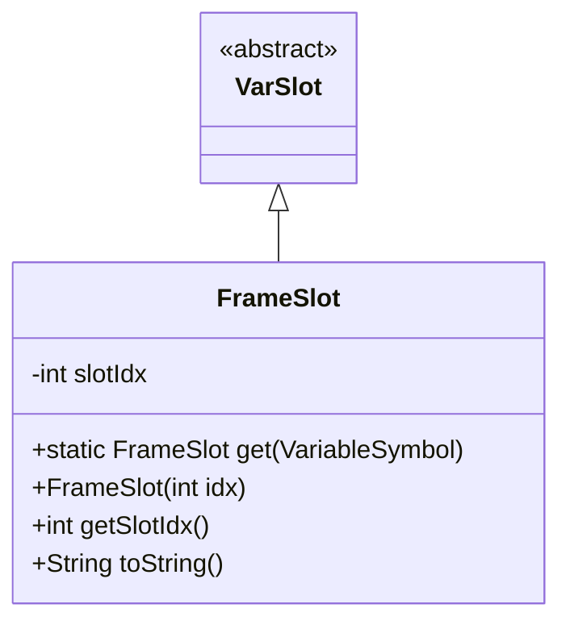
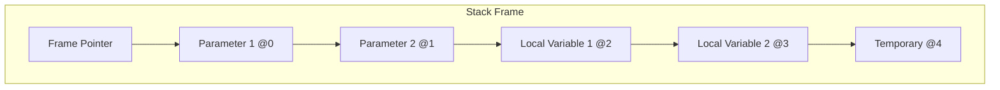
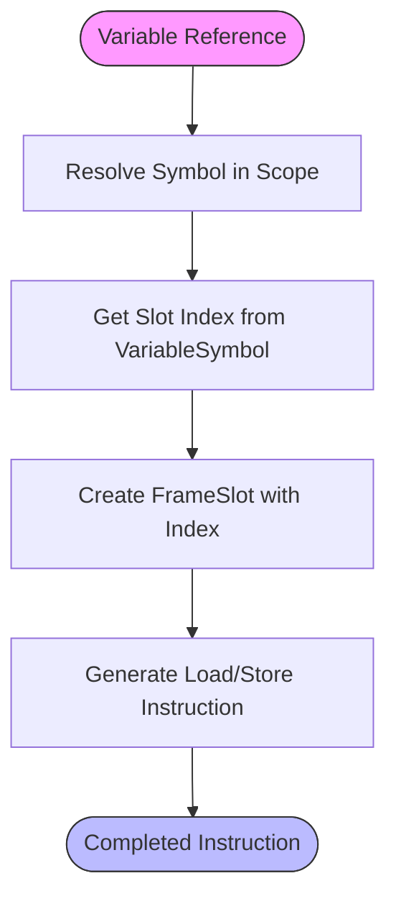
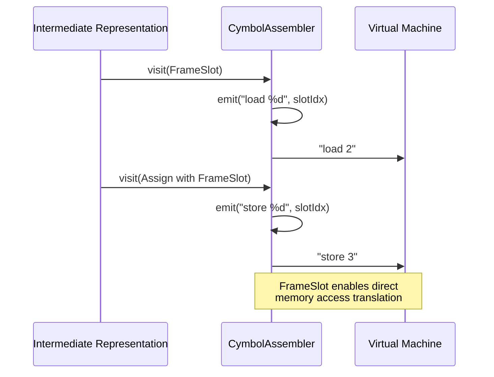

# FrameSlot - Stack Frame Location Management

<cite>
**Referenced Files in This Document**   
- [FrameSlot.java](file://ep20/src/main/java/org/teachfx/antlr4/ep20/ir/expr/addr/FrameSlot.java)
- [CymbolAssembler.java](file://ep20/src/main/java/org/teachfx/antlr4/ep20/pass/codegen/CymbolAssembler.java)
- [VariableSymbol.java](file://ep20/src/main/java/org/teachfx/antlr4/ep20/symtab/symbol/VariableSymbol.java)
- [StackFrame.java](file://ep18/src/main/java/org/teachfx/antlr4/ep18/stackvm/StackFrame.java)
- [FunctionSymbol.java](file://ep18/src/main/java/org/teachfx/antlr4/ep18/stackvm/FunctionSymbol.java)
</cite>

## Table of Contents
1. [Introduction](#introduction)
2. [FrameSlot Overview](#frameslot-overview)
3. [Memory Layout and Offset Calculation](#memory-layout-and-offset-calculation)
4. [Code Generation Process](#code-generation-process)
5. [Instruction Translation Examples](#instruction-translation-examples)
6. [Efficiency and Debugging Benefits](#efficiency-and-debugging-benefits)
7. [Conclusion](#conclusion)

## Introduction
FrameSlot is a critical component in the virtual machine's stack management system, representing fixed positions within a function's stack frame. It enables efficient access to local variables and parameters by maintaining known offsets from the frame pointer. This document explores the implementation and usage of FrameSlot in the context of the Cymbol compiler and virtual machine, detailing its role in memory management, code generation, and debugging support.

## FrameSlot Overview
FrameSlot serves as a symbolic representation of memory locations within a function's stack frame. It extends the VarSlot class and provides a mechanism to reference variables at specific offsets from the frame pointer.

**Diagram sources**
- [FrameSlot.java](file://ep20/src/main/java/org/teachfx/antlr4/ep20/ir/expr/addr/FrameSlot.java#L6-L30)

**Section sources**
- [FrameSlot.java](file://ep20/src/main/java/org/teachfx/antlr4/ep20/ir/expr/addr/FrameSlot.java#L6-L30)

## Memory Layout and Offset Calculation
The FrameSlot mechanism works in conjunction with the stack frame structure to manage memory layout. Each function's stack frame contains space for parameters and local variables, with FrameSlot providing the indexing mechanism.

The offset calculation follows a systematic approach:
1. Parameters are assigned sequential slot indices starting from 0
2. Local variables are assigned indices following the parameters
3. The total number of slots is determined by the function signature and local variable declarations

**Diagram sources**
- [StackFrame.java](file://ep18/src/main/java/org/teachfx/antlr4/ep18/stackvm/StackFrame.java#L1-L12)
- [FunctionSymbol.java](file://ep18/src/main/java/org/teachfx/antlr4/ep18/stackvm/FunctionSymbol.java#L1-L39)

**Section sources**
- [StackFrame.java](file://ep18/src/main/java/org/teachfx/antlr4/ep18/stackvm/StackFrame.java#L1-L12)
- [FunctionSymbol.java](file://ep18/src/main/java/org/teachfx/antlr4/ep18/stackvm/FunctionSymbol.java#L1-L39)

## Code Generation Process
During code generation, FrameSlot plays a crucial role in translating high-level variable references into low-level memory operations. The process involves:

1. Symbol resolution to determine variable scope and type
2. Slot index assignment based on variable position in the stack frame
3. Instruction generation using the assigned slot indices

**Section sources**
- [VariableSymbol.java](file://ep20/src/main/java/org/teachfx/antlr4/ep20/symtab/symbol/VariableSymbol.java#L4-L18)

## Instruction Translation Examples
The CymbolAssembler class demonstrates how FrameSlot operands are translated into virtual machine instructions. The translation process handles both loading and storing operations.

**Diagram sources**
- [CymbolAssembler.java](file://ep20/src/main/java/org/teachfx/antlr4/ep20/pass/codegen/CymbolAssembler.java#L17-L153)

**Section sources**
- [CymbolAssembler.java](file://ep20/src/main/java/org/teachfx/antlr4/ep20/pass/codegen/CymbolAssembler.java#L17-L153)

## Efficiency and Debugging Benefits
FrameSlot provides significant advantages in both runtime efficiency and debugging capabilities. By maintaining a clear mapping between source variables and runtime memory locations, it enables:

- **Efficient Memory Access**: Direct offset-based access eliminates the need for hash table lookups
- **Predictable Performance**: Fixed offsets ensure consistent access times
- **Enhanced Debugging**: Clear variable-to-memory mapping simplifies debugging
- **Optimization Opportunities**: Enables various compiler optimizations

The following table summarizes the benefits:

| Benefit | Description | Implementation |
|--------|-------------|----------------|
| **Memory Efficiency** | Minimizes memory overhead | Fixed-size slot indexing |
| **Access Speed** | Provides O(1) access time | Direct offset calculation |
| **Debugging Support** | Maintains source-variable mapping | Consistent slot assignment |
| **Code Generation** | Simplifies instruction emission | Direct load/store translation |

**Section sources**
- [FrameSlot.java](file://ep20/src/main/java/org/teachfx/antlr4/ep20/ir/expr/addr/FrameSlot.java#L6-L30)
- [CymbolAssembler.java](file://ep20/src/main/java/org/teachfx/antlr4/ep20/pass/codegen/CymbolAssembler.java#L17-L153)

## Conclusion
FrameSlot is a fundamental component in the virtual machine's stack management system, providing an efficient mechanism for accessing local variables and parameters. By representing fixed positions within a function's stack frame, it enables direct memory access through known offsets from the frame pointer. The integration between FrameSlot, VariableSymbol, and the code generation process ensures efficient translation of high-level variable references into low-level memory operations. This design not only improves runtime performance but also enhances debugging capabilities by maintaining clear mappings between source variables and their runtime memory locations.