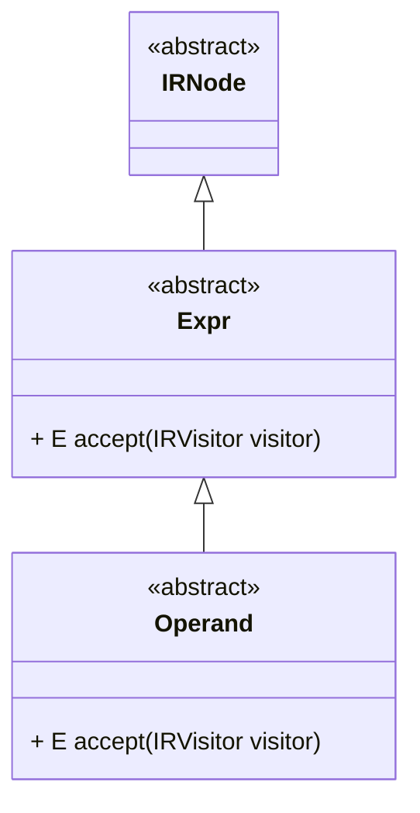
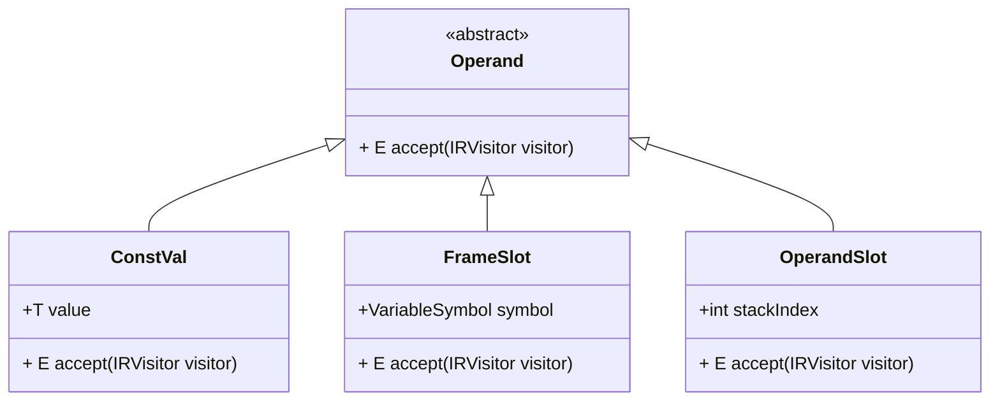
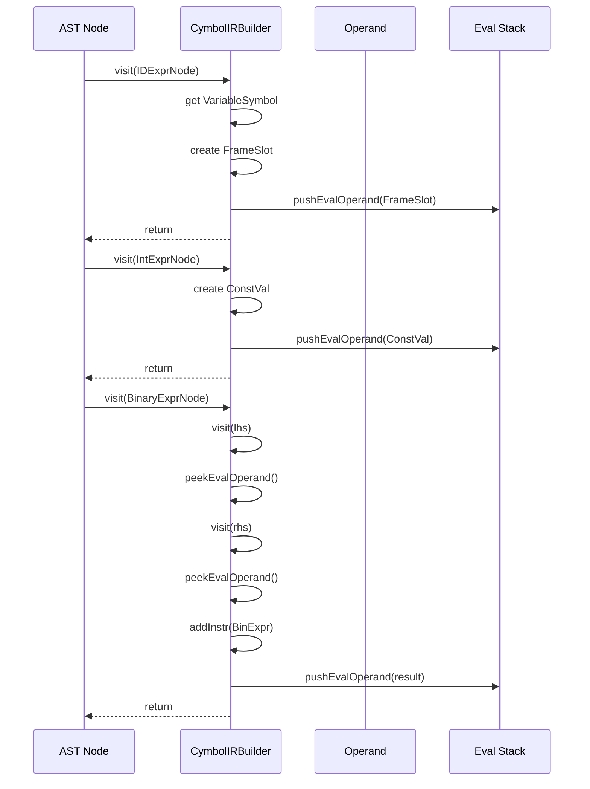
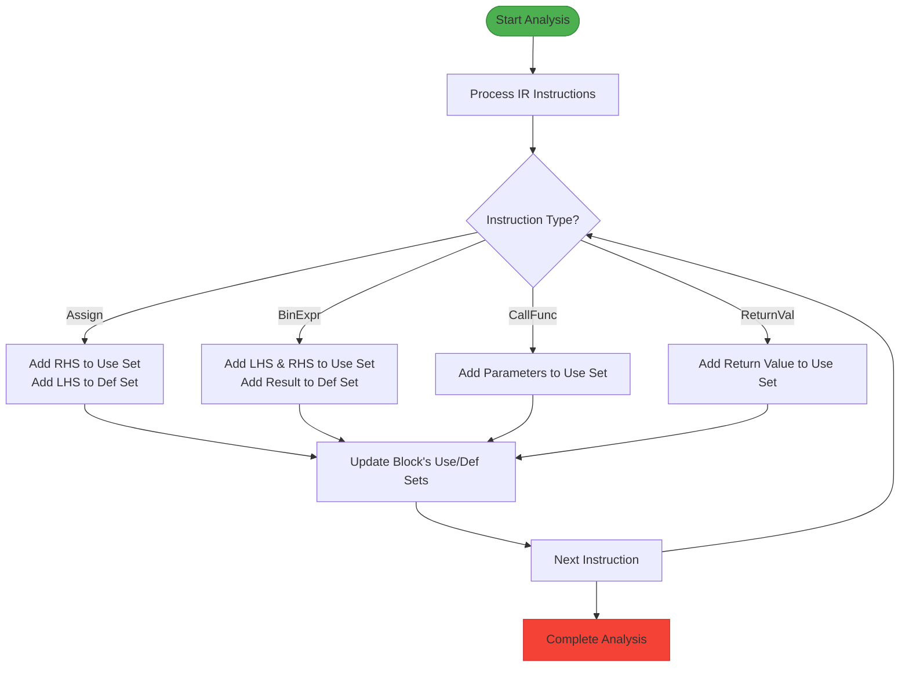

# Operand Interface and Base Abstraction

<cite>
**Referenced Files in This Document**   
- [Operand.java](file://ep20/src/main/java/org/teachfx/antlr4/ep20/ir/expr/Operand.java)
- [Expr.java](file://ep20/src/main/java/org/teachfx/antlr4/ep20/ir/expr/Expr.java)
- [IRVisitor.java](file://ep20/src/main/java/org/teachfx/antlr4/ep20/ir/IRVisitor.java)
- [CymbolIRBuilder.java](file://ep20/src/main/java/org/teachfx/antlr4/ep20/pass/ir/CymbolIRBuilder.java)
- [LivenessAnalysis.java](file://ep20/src/main/java/org/teachfx/antlr4/ep20/pass/cfg/LivenessAnalysis.java)
</cite>

## Table of Contents
1. [Introduction](#introduction)
2. [Core Inheritance and Visitor Pattern](#core-inheritance-and-visitor-pattern)
3. [Operand Subtype Hierarchy](#operand-subtype-hierarchy)
4. [Integration with IR Generation](#integration-with-ir-generation)
5. [Role in Data Flow Analysis](#role-in-data-flow-analysis)
6. [Conclusion](#conclusion)

## Introduction
The `Operand` abstract class serves as the foundational abstraction for all operand types in the Intermediate Representation (IR) system of the Cymbol compiler. It provides a uniform interface for representing values such as variables, constants, and temporary storage locations during code generation and optimization phases. By extending the `Expr` base class and implementing the visitor pattern through `accept(IRVisitor<S,E>)`, `Operand` enables polymorphic processing of value expressions across different compiler passes. This abstraction is critical for supporting advanced compiler optimizations including liveness analysis and register allocation by providing a consistent way to track value usage and lifetime across basic blocks.

## Core Inheritance and Visitor Pattern

The `Operand` class is defined as an abstract class that extends `Expr`, which itself inherits from `IRNode`. This inheritance chain establishes a hierarchical structure for IR components where all operands are expressions, and all expressions are IR nodes. The key method in this abstraction is the generic `accept` method that implements the visitor pattern, allowing extensible processing without modifying the operand classes themselves.

**Diagram sources**
- [Expr.java](file://ep20/src/main/java/org/teachfx/antlr4/ep20/ir/expr/Expr.java#L5-L7)
- [Operand.java](file://ep20/src/main/java/org/teachfx/antlr4/ep20/ir/expr/Operand.java#L4-L6)

The visitor pattern implementation allows compiler passes to define specialized behavior for different operand types through the `IRVisitor<S,E>` interface. The type parameters `S` and `E` enable visitors to return different types for statements (`S`) and expressions/operands (`E`), providing flexibility in how visitor results are handled across different compiler phases.

**Section sources**
- [Operand.java](file://ep20/src/main/java/org/teachfx/antlr4/ep20/ir/expr/Operand.java#L4-L6)
- [Expr.java](file://ep20/src/main/java/org/teachfx/antlr4/ep20/ir/expr/Expr.java#L5-L7)
- [IRVisitor.java](file://ep20/src/main/java/org/teachfx/antlr4/ep20/ir/IRVisitor.java#L10-L40)

## Operand Subtype Hierarchy

The `Operand` abstraction is realized through several concrete implementations that represent different kinds of values in the IR:

- `ConstVal<T>`: Represents constant values of various types (integers, floats, booleans, etc.)
- `FrameSlot`: Represents variables stored in the function's stack frame (local variables and parameters)
- `OperandSlot`: Represents temporary values in the operand evaluation stack

These subtypes allow the IR to uniformly handle different value sources while maintaining type safety through generics. Each subtype implements the `accept` method to dispatch to the appropriate visitor method, enabling operations like code generation, constant folding, and liveness analysis to process operands polymorphically.

**Diagram sources**
- [Operand.java](file://ep20/src/main/java/org/teachfx/antlr4/ep20/ir/expr/Operand.java#L4-L6)
- [IRVisitor.java](file://ep20/src/main/java/org/teachfx/antlr4/ep20/ir/IRVisitor.java#L10-L40)

## Integration with IR Generation

The `CymbolIRBuilder` class demonstrates how the `Operand` abstraction is used during IR construction from the AST. When processing expressions, the builder creates appropriate operand instances and manages them through an evaluation stack. For example, when visiting an identifier expression (`IDExprNode`), it creates a `FrameSlot` operand representing the variable and pushes it onto the evaluation stack if it's being used as an r-value.

The builder uses helper methods like `pushEvalOperand`, `popEvalOperand`, and `peekEvalOperand` to manage the operand stack during expression evaluation. When generating instructions like `BinExpr` or `Assign`, it retrieves operands from the stack and creates IR nodes that reference them. This approach ensures that complex expressions are broken down into simple three-address code instructions with explicit operand references.

**Diagram sources**
- [CymbolIRBuilder.java](file://ep20/src/main/java/org/teachfx/antlr4/ep20/pass/ir/CymbolIRBuilder.java#L37-L472)

**Section sources**
- [CymbolIRBuilder.java](file://ep20/src/main/java/org/teachfx/antlr4/ep20/pass/ir/CymbolIRBuilder.java#L37-L472)

## Role in Data Flow Analysis

The `Operand` abstraction plays a crucial role in data flow analyses such as liveness analysis, which is essential for register allocation. The `LivenessAnalysis` class implements the `IRVisitor<Void, Void>` interface to traverse IR instructions and identify which operands are used and defined at each program point.

During liveness analysis, the visitor examines each instruction to determine:
- Which operands are *used* (read) by the instruction
- Which operands are *defined* (written) by the instruction

For example, in an assignment instruction (`Assign`), the right-hand side operand is considered *used* while the left-hand side is *defined*. This information is collected for each basic block and used to compute live-in and live-out sets, which determine when values are live and need to be preserved in registers or memory.

The uniform `Operand` interface allows the liveness analysis to handle different operand types consistently, whether they represent constants, stack variables, or temporary values. This abstraction enables the analysis to focus on data flow patterns rather than operand-specific details.

**Diagram sources**
- [LivenessAnalysis.java](file://ep20/src/main/java/org/teachfx/antlr4/ep20/pass/cfg/LivenessAnalysis.java#L16-L146)

**Section sources**
- [LivenessAnalysis.java](file://ep20/src/main/java/org/teachfx/antlr4/ep20/pass/cfg/LivenessAnalysis.java#L16-L146)

## Conclusion
The `Operand` abstract class serves as a critical foundation in the Cymbol compiler's intermediate representation system. By extending `Expr` and implementing the visitor pattern through `accept(IRVisitor<S,E>)`, it provides a flexible and extensible abstraction for all value types in the IR. This design enables polymorphic handling of variables, constants, and temporary values during code generation and optimization phases. The integration with `CymbolIRBuilder` demonstrates how operands are created and managed during IR construction, while the use in `LivenessAnalysis` shows how the abstraction supports advanced compiler optimizations by providing a uniform way to track value usage and lifetime across basic blocks. This cohesive design facilitates the implementation of register allocation and other optimization passes that depend on precise data flow information.