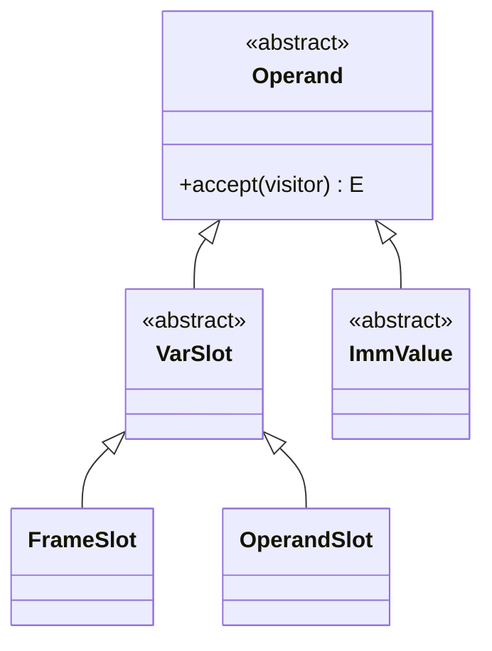
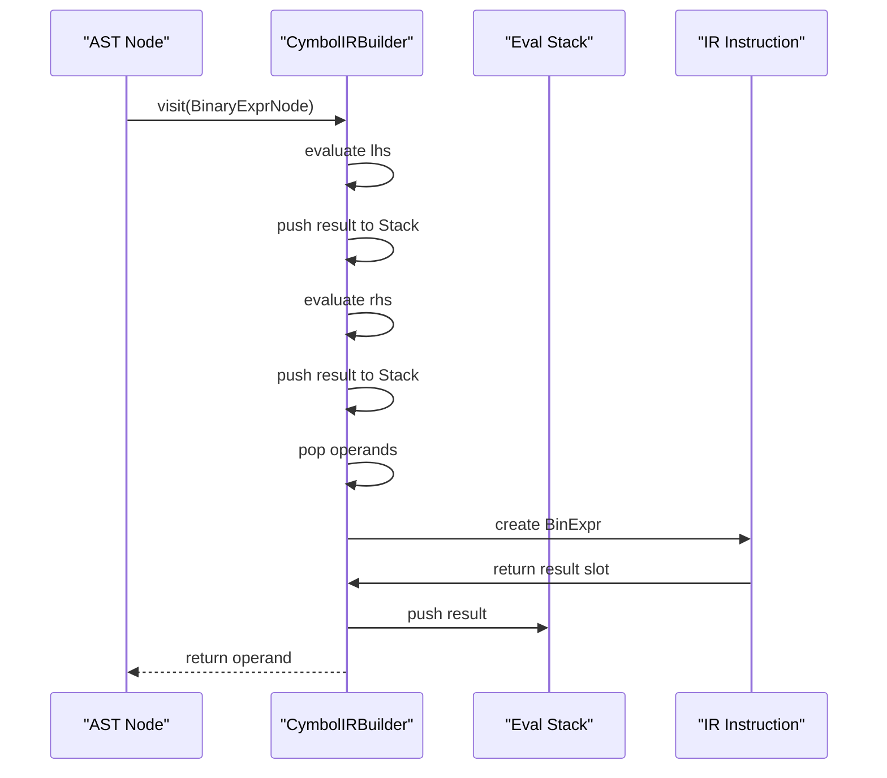
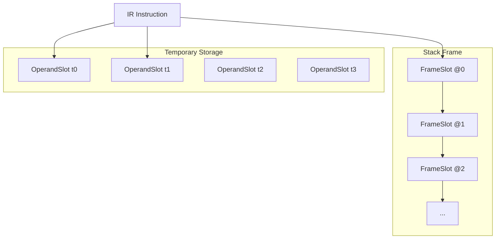
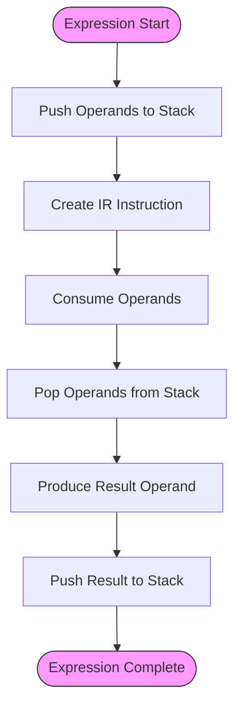

# Operand Management in Expressions

<cite>
**Referenced Files in This Document**   
- [Operand.java](file://ep20/src/main/java/org/teachfx/antlr4/ep20/ir/expr/Operand.java)
- [VarSlot.java](file://ep20/src/main/java/org/teachfx/antlr4/ep20/ir/expr/VarSlot.java)
- [FrameSlot.java](file://ep20/src/main/java/org/teachfx/antlr4/ep20/ir/expr/addr/FrameSlot.java)
- [OperandSlot.java](file://ep20/src/main/java/org/teachfx/antlr4/ep20/ir/expr/addr/OperandSlot.java)
- [ImmValue.java](file://ep20/src/main/java/org/teachfx/antlr4/ep20/ir/expr/ImmValue.java)
- [CymbolIRBuilder.java](file://ep20/src/main/java/org/teachfx/antlr4/ep20/pass/ir/CymbolIRBuilder.java)
- [Assign.java](file://ep20/src/main/java/org/teachfx/antlr4/ep20/ir/stmt/Assign.java)
- [BinExpr.java](file://ep20/src/main/java/org/teachfx/antlr4/ep20/ir/expr/arith/BinExpr.java)
- [ThreeAddressCodeTest.java](file://ep20/src/test/java/org/teachfx/antlr4/ep20/ir/ThreeAddressCodeTest.java)
- [LivenessAnalysis.java](file://ep20/src/main/java/org/teachfx/antlr4/ep20/pass/cfg/LivenessAnalysis.java)
</cite>

## Table of Contents
1. [Introduction](#introduction)
2. [Operand Interface and Hierarchy](#operand-interface-and-hierarchy)
3. [Operand Implementations](#operand-implementations)
4. [IR Generation and Operand Creation](#ir-generation-and-operand-creation)
5. [Memory Layout and Target VM Relationship](#memory-layout-and-target-vm-relationship)
6. [Operand Lifetime Management](#operand-lifetime-management)
7. [Optimization Support](#optimization-support)
8. [Conclusion](#conclusion)

## Introduction
This document provides a comprehensive analysis of operand management within the intermediate representation (IR) system of the compiler. The operand system serves as a unified abstraction for various data entities involved in expression evaluation, enabling consistent handling of variables, temporaries, frame locations, and immediate values. The design supports three-address code generation, facilitates optimization passes, and maintains clear relationships between high-level source constructs and low-level virtual machine operations.

## Operand Interface and Hierarchy

The Operand interface forms the foundation of the expression system, providing a polymorphic abstraction for all entities that can participate in IR expressions. As defined in the codebase, Operand extends the Expr class and declares an accept method for the visitor pattern, enabling type-safe traversal and transformation of IR nodes.



**Diagram sources**
- [Operand.java](file://ep20/src/main/java/org/teachfx/antlr4/ep20/ir/expr/Operand.java#L1-L7)
- [VarSlot.java](file://ep20/src/main/java/org/teachfx/antlr4/ep20/ir/expr/VarSlot.java#L1-L6)
- [ImmValue.java](file://ep20/src/main/java/org/teachfx/antlr4/ep20/ir/expr/ImmValue.java#L1-L6)

**Section sources**
- [Operand.java](file://ep20/src/main/java/org/teachfx/antlr4/ep20/ir/expr/Operand.java#L1-L7)

## Operand Implementations

### FrameSlot for Variable References
FrameSlot represents variables stored in the stack frame, typically corresponding to local variables in the source program. Each FrameSlot is associated with a specific slot index in the activation record, providing direct access to the variable's storage location. The implementation includes factory methods that integrate with the symbol table to create FrameSlot instances from VariableSymbol objects.

### OperandSlot for Intermediate Results
OperandSlot represents temporary values generated during expression evaluation. These slots correspond to intermediate calculation results in three-address code and are managed through a static sequence counter that ensures unique identifiers. The implementation includes stack-like operations (pushStack and popStack) that maintain the evaluation stack during IR generation.

### Immediate Values
Immediate values are represented through the ImmValue abstract class, which serves as a base for constant values of various types (integer, floating-point, boolean, etc.). These operands represent literal values from the source code that can be directly embedded in instructions.

```mermaid
classDiagram
class FrameSlot {
+getSlotIdx() int
+toString() String
+get(symbol) FrameSlot
}
class OperandSlot {
+getOrd() int
+genTemp() OperandSlot
+pushStack() OperandSlot
+popStack() void
+toString() String
}
FrameSlot --> VariableSymbol : "references"
OperandSlot --> "static ordSeq" : "uses"
```

**Diagram sources**
- [FrameSlot.java](file://ep20/src/main/java/org/teachfx/antlr4/ep20/ir/expr/addr/FrameSlot.java#L1-L32)
- [OperandSlot.java](file://ep20/src/main/java/org/teachfx/antlr4/ep20/ir/expr/addr/OperandSlot.java#L1-L38)

**Section sources**
- [FrameSlot.java](file://ep20/src/main/java/org/teachfx/antlr4/ep20/ir/expr/addr/FrameSlot.java#L1-L32)
- [OperandSlot.java](file://ep20/src/main/java/org/teachfx/antlr4/ep20/ir/expr/addr/OperandSlot.java#L1-L38)

## IR Generation and Operand Creation

### Expression Evaluation Workflow
The CymbolIRBuilder implements the visitor pattern to traverse the abstract syntax tree and generate corresponding IR instructions. During expression evaluation, operands are created and managed through an evaluation stack that tracks intermediate results. When processing binary operations, the builder first evaluates both operands, pops them from the stack, creates the appropriate IR instruction, and pushes the result operand back onto the stack.

### Three-Address Code Generation
The system generates three-address code where each instruction has at most one operator and three operands (two sources and one destination). For example, the expression `a + b * c` is translated into a sequence of assignments using temporary slots, with each operation producing a new OperandSlot that serves as input for subsequent operations.



**Diagram sources**
- [CymbolIRBuilder.java](file://ep20/src/main/java/org/teachfx/antlr4/ep20/pass/ir/CymbolIRBuilder.java#L1-L474)
- [BinExpr.java](file://ep20/src/main/java/org/teachfx/antlr4/ep20/ir/expr/arith/BinExpr.java#L1-L60)

**Section sources**
- [CymbolIRBuilder.java](file://ep20/src/main/java/org/teachfx/antlr4/ep20/pass/ir/CymbolIRBuilder.java#L1-L474)

## Memory Layout and Target VM Relationship

### Stack Frame Organization
FrameSlot instances directly correspond to positions in the target virtual machine's stack frame. The slot index in FrameSlot maps to a specific offset in the activation record, enabling direct memory access operations. This design ensures that variable storage is organized contiguously within the frame, facilitating efficient access patterns.

### Temporary Storage Management
OperandSlot instances represent virtual registers or temporary storage locations in the target VM. The sequential numbering of operand slots (t0, t1, t2, etc.) provides a simple abstraction that can be mapped to physical registers or stack locations during code generation. The static sequence counter ensures that temporaries are uniquely identified throughout the compilation unit.



**Diagram sources**
- [FrameSlot.java](file://ep20/src/main/java/org/teachfx/antlr4/ep20/ir/expr/addr/FrameSlot.java#L1-L32)
- [OperandSlot.java](file://ep20/src/main/java/org/teachfx/antlr4/ep20/ir/expr/addr/OperandSlot.java#L1-L38)

## Operand Lifetime Management

### Evaluation Stack Discipline
The CymbolIRBuilder maintains an explicit evaluation stack (evalExprStack) that tracks the lifetime of operands during IR generation. Operands are pushed onto the stack when created and popped when consumed by instructions. This stack-based approach ensures that operand lifetimes are properly managed and that the evaluation context is preserved across nested expressions.

### Stack Balance and Cleanup
The system enforces stack balance through coordinated push and pop operations. Each IR instruction that consumes operands also pops them from the evaluation stack, while instructions that produce results push the new operand. The popStack method in OperandSlot decrements the global sequence counter, ensuring that temporary slot numbers are reused appropriately and preventing memory leaks in the IR representation.



**Diagram sources**
- [CymbolIRBuilder.java](file://ep20/src/main/java/org/teachfx/antlr4/ep20/pass/ir/CymbolIRBuilder.java#L1-L474)
- [OperandSlot.java](file://ep20/src/main/java/org/teachfx/antlr4/ep20/ir/expr/addr/OperandSlot.java#L1-L38)

**Section sources**
- [CymbolIRBuilder.java](file://ep20/src/main/java/org/teachfx/antlr4/ep20/pass/ir/CymbolIRBuilder.java#L1-L474)

## Optimization Support

### Liveness Analysis Foundation
The operand system provides the foundation for liveness analysis by clearly defining when values are produced and consumed. Each operand has a well-defined lifetime from its creation (push) to its consumption (pop), enabling precise tracking of live ranges. The LivenessAnalysis pass uses this information to determine which operands are live at each program point, supporting register allocation and dead code elimination.

### Register Allocation Readiness
The uniform operand abstraction enables straightforward register allocation. Since all operands (variables, temporaries, immediates) are represented through the same interface, the allocator can treat them uniformly when assigning physical registers. The sequential numbering of OperandSlot instances provides a natural ordering that can be used in graph-coloring or linear-scan allocation algorithms.

```mermaid
classDiagram
class LivenessAnalysis {
+visit(Assign) void
+visit(BinExpr) void
+visit(ReturnVal) void
}
class CymbolIRBuilder {
+pushEvalOperand(operand) VarSlot
+popEvalOperand() VarSlot
+peekEvalOperand() VarSlot
}
LivenessAnalysis --> Operand : "analyzes"
CymbolIRBuilder --> Operand : "manages"
Operand --> "IR Instructions" : "used in"
```

**Diagram sources**
- [LivenessAnalysis.java](file://ep20/src/main/java/org/teachfx/antlr4/ep20/pass/cfg/LivenessAnalysis.java#L1-L200)
- [CymbolIRBuilder.java](file://ep20/src/main/java/org/teachfx/antlr4/ep20/pass/ir/CymbolIRBuilder.java#L1-L474)

**Section sources**
- [LivenessAnalysis.java](file://ep20/src/main/java/org/teachfx/antlr4/ep20/pass/cfg/LivenessAnalysis.java#L1-L200)

## Conclusion
The operand management system provides a robust and extensible foundation for expression evaluation in the compiler's IR. By unifying various data entities under a common abstraction, the system enables consistent handling of variables, temporaries, and constants while supporting advanced optimization techniques. The integration with the symbol table, stack frame management, and evaluation stack ensures that high-level source constructs are accurately represented in the intermediate representation, paving the way for efficient code generation and optimization.