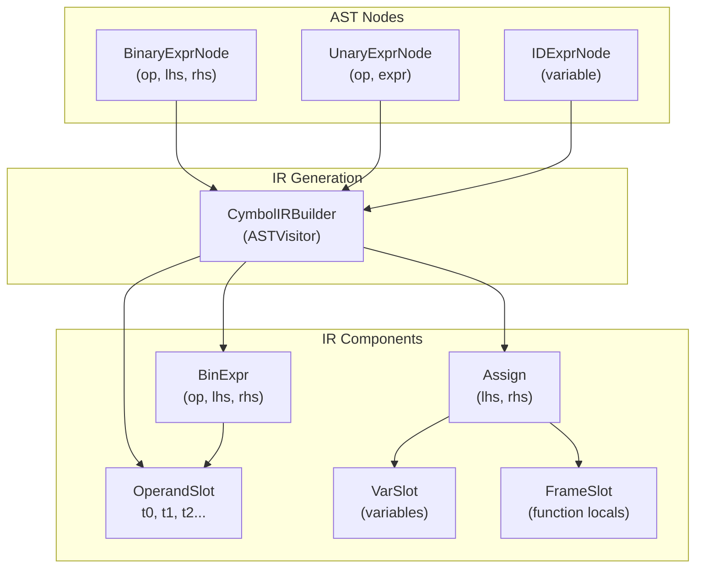
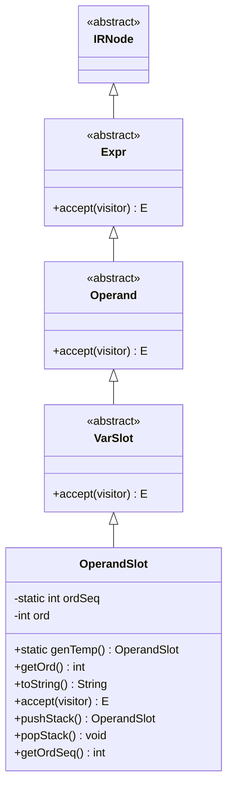
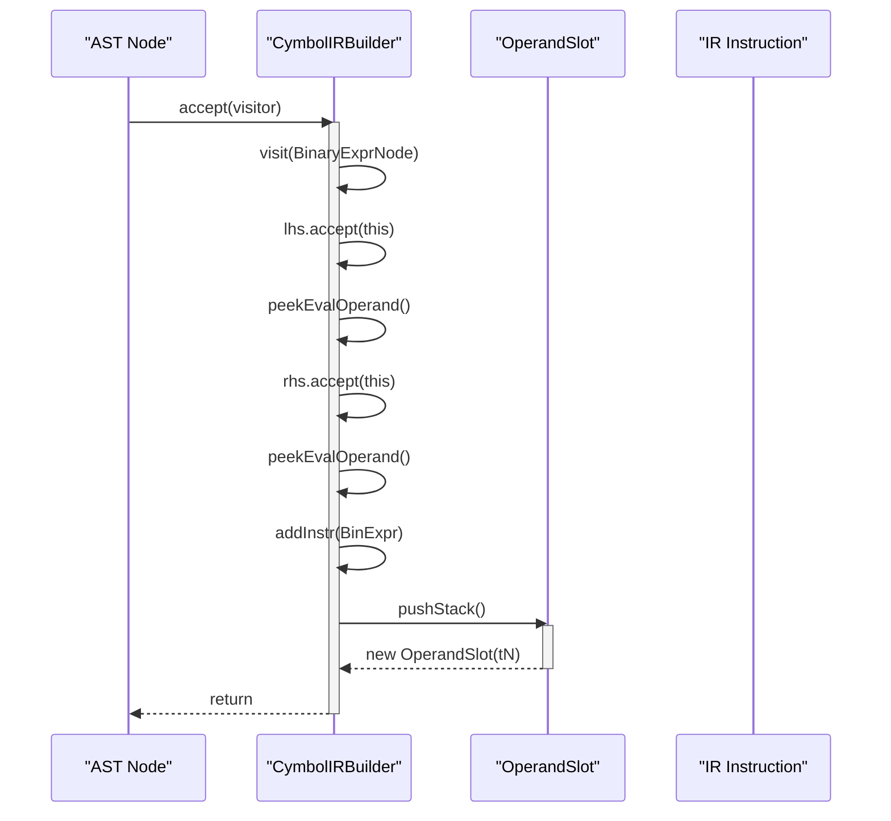

# OperandSlot - Intermediate Calculation Results

<cite>
**Referenced Files in This Document**   
- [OperandSlot.java](file://ep20/src/main/java/org/teachfx/antlr4/ep20/ir/expr/addr/OperandSlot.java)
- [VarSlot.java](file://ep20/src/main/java/org/teachfx/antlr4/ep20/ir/expr/VarSlot.java)
- [CymbolIRBuilder.java](file://ep20/src/main/java/org/teachfx/antlr4/ep20/pass/ir/CymbolIRBuilder.java)
- [Expr.java](file://ep20/src/main/java/org/teachfx/antlr4/ep20/ir/expr/Expr.java)
- [IRNode.java](file://ep20/src/main/java/org/teachfx/antlr4/ep20/ir/IRNode.java)
</cite>

## Table of Contents
1. [Introduction](#introduction)
2. [Core Components](#core-components)
3. [Architecture Overview](#architecture-overview)
4. [Detailed Component Analysis](#detailed-component-analysis)
5. [Expression Construction and OperandSlot Generation](#expression-construction-and-operandslot-generation)
6. [Optimization Support](#optimization-support)
7. [Relationship with Register Allocation](#relationship-with-register-allocation)
8. [Conclusion](#conclusion)

## Introduction
OperandSlot represents temporary storage locations for intermediate calculation results in the Intermediate Representation (IR) of a compiler. It plays a critical role in transforming complex expressions into sequences of simple three-address code instructions suitable for stack-based virtual machines. By explicitly representing temporary values, OperandSlot enables advanced compiler optimizations and facilitates the transition from high-level expressions to executable bytecode.

## Core Components

The OperandSlot mechanism is implemented as part of a larger IR system that includes expression nodes, statement representations, and control flow structures. The core components work together to decompose source code expressions into manageable operations that can be efficiently processed by a stack-based VM.

**Section sources**
- [OperandSlot.java](file://ep20/src/main/java/org/teachfx/antlr4/ep20/ir/expr/addr/OperandSlot.java#L1-L38)
- [VarSlot.java](file://ep20/src/main/java/org/teachfx/antlr4/ep20/ir/expr/VarSlot.java#L1-L6)
- [Expr.java](file://ep20/src/main/java/org/teachfx/antlr4/ep20/ir/expr/Expr.java#L1-L9)

## Architecture Overview

The IR architecture uses OperandSlot as a fundamental building block for representing temporary values generated during expression evaluation. These slots are created during the IR generation phase and serve as explicit placeholders for intermediate results that would otherwise be implicit in the source code.

**Diagram sources**
- [OperandSlot.java](file://ep20/src/main/java/org/teachfx/antlr4/ep20/ir/expr/addr/OperandSlot.java#L1-L38)
- [CymbolIRBuilder.java](file://ep20/src/main/java/org/teachfx/antlr4/ep20/pass/ir/CymbolIRBuilder.java#L1-L474)
- [VarSlot.java](file://ep20/src/main/java/org/teachfx/antlr4/ep20/ir/expr/VarSlot.java#L1-L6)

## Detailed Component Analysis

### OperandSlot Class Analysis

OperandSlot is implemented as a subclass of VarSlot, which itself extends the Operand hierarchy in the IR system. Each OperandSlot instance represents a unique temporary variable in the three-address code representation, with a sequential ordinal number that ensures uniqueness.

**Diagram sources**
- [OperandSlot.java](file://ep20/src/main/java/org/teachfx/antlr4/ep20/ir/expr/addr/OperandSlot.java#L1-L38)
- [VarSlot.java](file://ep20/src/main/java/org/teachfx/antlr4/ep20/ir/expr/VarSlot.java#L1-L6)
- [Expr.java](file://ep20/src/main/java/org/teachfx/antlr4/ep20/ir/expr/Expr.java#L1-L9)
- [IRNode.java](file://ep20/src/main/java/org/teachfx/antlr4/ep20/ir/IRNode.java#L1-L6)

**Section sources**
- [OperandSlot.java](file://ep20/src/main/java/org/teachfx/antlr4/ep20/ir/expr/addr/OperandSlot.java#L1-L38)

### IR Generation Process

The CymbolIRBuilder class implements the visitor pattern to traverse the Abstract Syntax Tree (AST) and generate corresponding IR instructions. During this process, OperandSlot instances are created to hold intermediate results from binary and unary operations.

**Diagram sources**
- [CymbolIRBuilder.java](file://ep20/src/main/java/org/teachfx/antlr4/ep20/pass/ir/CymbolIRBuilder.java#L1-L474)
- [OperandSlot.java](file://ep20/src/main/java/org/teachfx/antlr4/ep20/ir/expr/addr/OperandSlot.java#L1-L38)

**Section sources**
- [CymbolIRBuilder.java](file://ep20/src/main/java/org/teachfx/antlr4/ep20/pass/ir/CymbolIRBuilder.java#L1-L474)

## Expression Construction and OperandSlot Generation

When constructing IR for complex expressions, the compiler breaks down operations into simple instructions where each binary operation produces a result stored in an OperandSlot. For example, an expression like `a + b * c` is decomposed into:

1. `t0 = b * c` (multiplication result stored in t0)
2. `t1 = a + t0` (addition result stored in t1)

This transformation is handled by the visit method for BinaryExprNode in CymbolIRBuilder, which processes both operands, then creates a BinExpr instruction with a newly generated OperandSlot as the target.

The evaluation stack mechanism in CymbolIRBuilder manages these temporary slots, pushing results onto the stack when operations complete and popping them when they're consumed by subsequent operations. The static counter `ordSeq` in OperandSlot ensures each temporary has a unique identifier (t0, t1, t2, etc.).

**Section sources**
- [CymbolIRBuilder.java](file://ep20/src/main/java/org/teachfx/antlr4/ep20/pass/ir/CymbolIRBuilder.java#L1-L474)
- [OperandSlot.java](file://ep20/src/main/java/org/teachfx/antlr4/ep20/ir/expr/addr/OperandSlot.java#L1-L38)

## Optimization Support

OperandSlot plays a crucial role in enabling compiler optimizations by making temporary values explicitly trackable. Since each intermediate result has a named slot, optimization passes can analyze data flow and identify opportunities for:

- **Common Subexpression Elimination**: When identical expressions produce the same OperandSlot, redundant calculations can be eliminated
- **Dead Code Removal**: If an OperandSlot is generated but never used, the corresponding instruction can be safely removed
- **Constant Folding**: When operands are constants, the result can be computed at compile time and the OperandSlot updated accordingly
- **Copy Propagation**: Values in OperandSlots can be propagated to subsequent uses, potentially eliminating assignment instructions

The explicit nature of OperandSlots allows optimization algorithms to build accurate use-def chains and perform sophisticated data flow analysis that would be difficult with implicit intermediate values.

**Section sources**
- [CymbolIRBuilder.java](file://ep20/src/main/java/org/teachfx/antlr4/ep20/pass/ir/CymbolIRBuilder.java#L1-L474)
- [OperandSlot.java](file://ep20/src/main/java/org/teachfx/antlr4/ep20/ir/expr/addr/OperandSlot.java#L1-L38)

## Relationship with Register Allocation

In later compilation stages, OperandSlot serves as input to register allocation algorithms. The sequence of temporary slots generated during IR construction provides a clear picture of variable lifetimes and dependencies, which is essential for effective register allocation.

The ordinal numbers assigned to OperandSlots can inform register allocation strategies, with lower-numbered slots potentially prioritized for physical registers based on their usage patterns. The stack-like management of OperandSlots (pushStack/popStack) mirrors register stack behavior in some architectures.

During code generation, OperandSlots may be mapped directly to virtual registers in the target VM, or they may be spilled to memory if register pressure is high. The explicit tracking of each temporary's lifetime enables both linear scan and graph-coloring register allocation algorithms to make informed decisions about resource allocation.

**Section sources**
- [OperandSlot.java](file://ep20/src/main/java/org/teachfx/antlr4/ep20/ir/expr/addr/OperandSlot.java#L1-L38)
- [CymbolIRBuilder.java](file://ep20/src/main/java/org/teachfx/antlr4/ep20/pass/ir/CymbolIRBuilder.java#L1-L474)

## Conclusion

OperandSlot is a fundamental component of the IR system that enables the transformation of complex expressions into simple, executable instructions. By providing explicit storage locations for intermediate results, it facilitates both code generation for stack-based VMs and advanced compiler optimizations. The design effectively bridges high-level language constructs with low-level execution requirements, serving as a critical abstraction in the compilation pipeline.