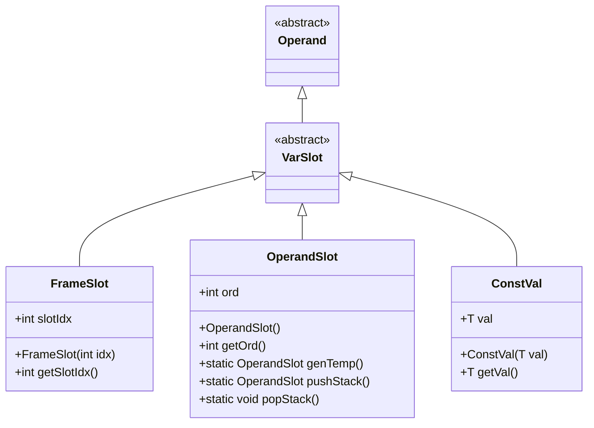
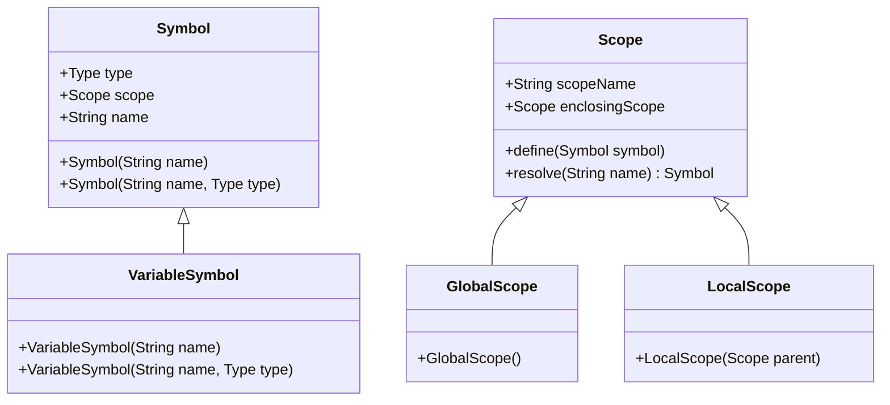
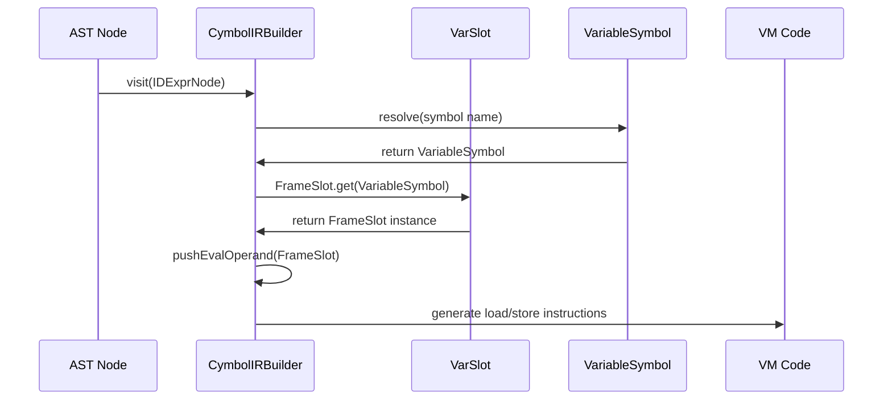
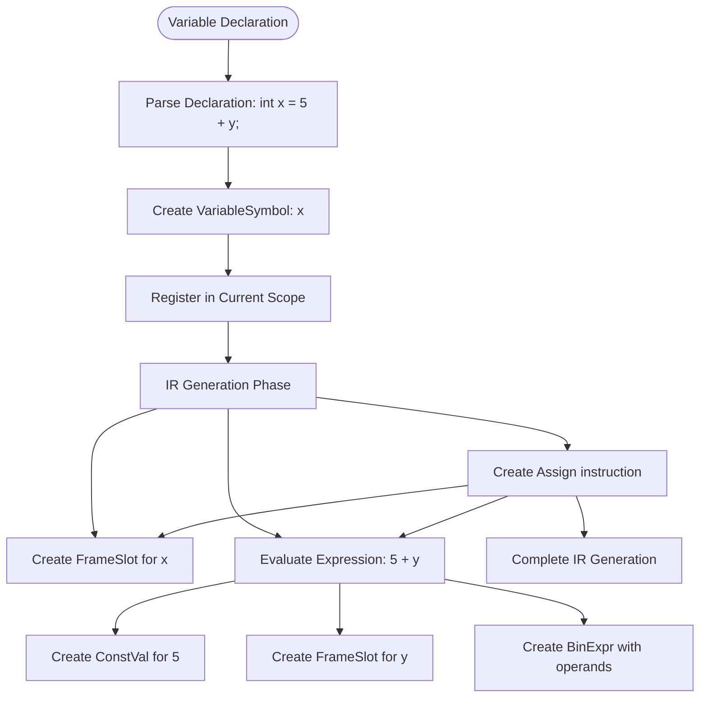
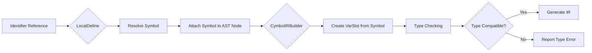
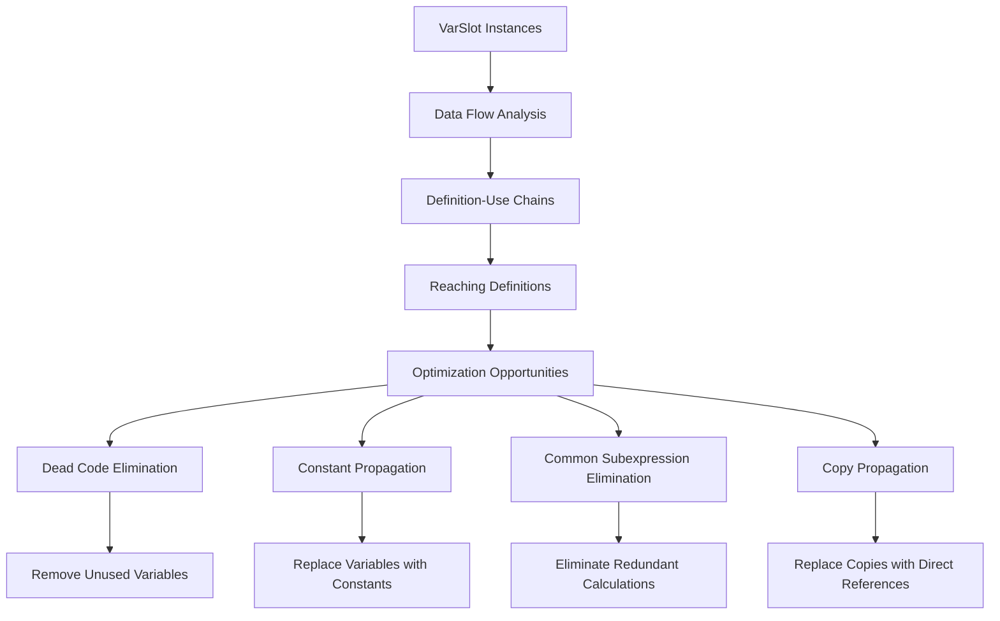

# VarSlot - Variable Reference Management

<cite>
**Referenced Files in This Document**   
- [VarSlot.java](file://ep20/src/main/java/org/teachfx/antlr4/ep20/ir/expr/VarSlot.java)
- [FrameSlot.java](file://ep20/src/main/java/org/teachfx/antlr4/ep20/ir/expr/addr/FrameSlot.java)
- [OperandSlot.java](file://ep20/src/main/java/org/teachfx/antlr4/ep20/ir/expr/addr/OperandSlot.java)
- [LocalDefine.java](file://ep20/src/main/java/org/teachfx/antlr4/ep20/pass/symtab/LocalDefine.java)
- [CymbolIRBuilder.java](file://ep20/src/main/java/org/teachfx/antlr4/ep20/pass/ir/CymbolIRBuilder.java)
- [VariableSymbol.java](file://ep20/src/main/java/org/teachfx/antlr4/ep20/symtab/symbol/VariableSymbol.java)
- [Symbol.java](file://ep20/src/main/java/org/teachfx/antlr4/ep20/symtab/symbol/Symbol.java)
</cite>

## Table of Contents
1. [Introduction](#introduction)
2. [VarSlot Architecture and Inheritance](#varslot-architecture-and-inheritance)
3. [Symbol Table Integration](#symbol-table-integration)
4. [Memory Addressing and Value Retrieval](#memory-addressing-and-value-retrieval)
5. [Variable Declaration Translation](#variable-declaration-translation)
6. [Scope Resolution and Type Checking](#scope-resolution-and-type-checking)
7. [Optimization Support](#optimization-support)
8. [Conclusion](#conclusion)

## Introduction
VarSlot serves as a fundamental abstraction in the intermediate representation (IR) system for managing references to named variables. It acts as a bridge between the high-level source code constructs and the low-level IR operations by encapsulating Symbol objects from the symbol table. This documentation details how VarSlot maintains semantic connections between the IR and source code, facilitates memory addressing and value retrieval during code generation, and supports optimization through variable alias and dependency analysis.

**Section sources**
- [VarSlot.java](file://ep20/src/main/java/org/teachfx/antlr4/ep20/ir/expr/VarSlot.java)

## VarSlot Architecture and Inheritance
VarSlot is implemented as an abstract class that extends the Operand class, establishing its role in the IR expression hierarchy. This inheritance structure enables VarSlot to participate in arithmetic, logical, and assignment operations within the three-address code framework. The design follows a composite pattern where VarSlot serves as the base for concrete addressing modes, including FrameSlot for local variables and OperandSlot for temporary values.

**Diagram sources**
- [VarSlot.java](file://ep20/src/main/java/org/teachfx/antlr4/ep20/ir/expr/VarSlot.java)
- [FrameSlot.java](file://ep20/src/main/java/org/teachfx/antlr4/ep20/ir/expr/addr/FrameSlot.java)
- [OperandSlot.java](file://ep20/src/main/java/org/teachfx/antlr4/ep20/ir/expr/addr/OperandSlot.java)
- [ConstVal.java](file://ep20/src/main/java/org/teachfx/antlr4/ep20/ir/expr/val/ConstVal.java)

**Section sources**
- [VarSlot.java](file://ep20/src/main/java/org/teachfx/antlr4/ep20/ir/expr/VarSlot.java)
- [FrameSlot.java](file://ep20/src/main/java/org/teachfx/antlr4/ep20/ir/expr/addr/FrameSlot.java)
- [OperandSlot.java](file://ep20/src/main/java/org/teachfx/antlr4/ep20/ir/expr/addr/OperandSlot.java)

## Symbol Table Integration
VarSlot maintains semantic connections between the IR and source code by encapsulating Symbol objects from the symbol table. During the compilation process, the LocalDefine visitor establishes these connections by resolving identifiers to their corresponding Symbol instances. The VariableSymbol class, which extends the base Symbol class, represents variable declarations in the symbol table and contains metadata such as type information, scope, and memory layout.

**Diagram sources**
- [Symbol.java](file://ep20/src/main/java/org/teachfx/antlr4/ep20/symtab/symbol/Symbol.java)
- [VariableSymbol.java](file://ep20/src/main/java/org/teachfx/antlr4/ep20/symtab/symbol/VariableSymbol.java)
- [LocalDefine.java](file://ep20/src/main/java/org/teachfx/antlr4/ep20/pass/symtab/LocalDefine.java)

**Section sources**
- [Symbol.java](file://ep20/src/main/java/org/teachfx/antlr4/ep20/symtab/symbol/Symbol.java)
- [VariableSymbol.java](file://ep20/src/main/java/org/teachfx/antlr4/ep20/symtab/symbol/VariableSymbol.java)
- [LocalDefine.java](file://ep20/src/main/java/org/teachfx/antlr4/ep20/pass/symtab/LocalDefine.java)

## Memory Addressing and Value Retrieval
VarSlot enables efficient memory addressing and value retrieval during code generation through its concrete implementations. The FrameSlot class represents variables stored in the function's stack frame, using a slot index to identify the variable's position. When a variable is referenced in an expression, the CymbolIRBuilder creates a FrameSlot instance that references the corresponding VariableSymbol's slot index.

The value retrieval process follows a two-phase approach: during IR generation, variable references are translated into FrameSlot operands, and during code emission, these operands are converted into appropriate VM instructions. For example, when generating code for a variable access, the IR builder pushes the FrameSlot onto the evaluation stack, which is later consumed by arithmetic or assignment operations.

**Diagram sources**
- [CymbolIRBuilder.java](file://ep20/src/main/java/org/teachfx/antlr4/ep20/pass/ir/CymbolIRBuilder.java)
- [FrameSlot.java](file://ep20/src/main/java/org/teachfx/antlr4/ep20/ir/expr/addr/FrameSlot.java)
- [VariableSymbol.java](file://ep20/src/main/java/org/teachfx/antlr4/ep20/symtab/symbol/VariableSymbol.java)

**Section sources**
- [CymbolIRBuilder.java](file://ep20/src/main/java/org/teachfx/antlr4/ep20/pass/ir/CymbolIRBuilder.java)
- [FrameSlot.java](file://ep20/src/main/java/org/teachfx/antlr4/ep20/ir/expr/addr/FrameSlot.java)

## Variable Declaration Translation
The translation of variable declarations into VarSlot operands occurs during the IR generation phase, coordinated by the CymbolIRBuilder and LocalDefine components. When processing a variable declaration, the LocalDefine visitor first creates a VariableSymbol instance and registers it in the current scope. The CymbolIRBuilder then uses this symbol information to create appropriate VarSlot instances when the variable is referenced in expressions.

For variable declarations with initializers, the IR builder generates assignment instructions that use VarSlot operands for both the left-hand side (LHS) and right-hand side (RHS) of the assignment. The LHS is represented by a FrameSlot derived from the VariableSymbol, while the RHS may involve other VarSlot instances, constant values, or complex expressions.

**Diagram sources**
- [LocalDefine.java](file://ep20/src/main/java/org/teachfx/antlr4/ep20/pass/symtab/LocalDefine.java)
- [CymbolIRBuilder.java](file://ep20/src/main/java/org/teachfx/antlr4/ep20/pass/ir/CymbolIRBuilder.java)
- [Assign.java](file://ep20/src/main/java/org/teachfx/antlr4/ep20/ir/stmt/Assign.java)

**Section sources**
- [LocalDefine.java](file://ep20/src/main/java/org/teachfx/antlr4/ep20/pass/symtab/LocalDefine.java)
- [CymbolIRBuilder.java](file://ep20/src/main/java/org/teachfx/antlr4/ep20/pass/ir/CymbolIRBuilder.java)

## Scope Resolution and Type Checking
VarSlot interacts with scope resolution and type checking through the coordinated efforts of the LocalDefine and CymbolIRBuilder components. During the symbol definition phase, LocalDefine establishes the scope hierarchy by creating nested Scope instances for functions, blocks, and loops. When an identifier is encountered, the LocalDefine visitor resolves it to the appropriate VariableSymbol by searching through the scope chain.

The type checking process leverages the type information stored in the VariableSymbol to validate operations involving VarSlot operands. For example, when generating code for an assignment operation, the IR builder ensures that the types of the source and destination VarSlots are compatible. This type information is also used to generate appropriate type conversion instructions when necessary.

**Diagram sources**
- [LocalDefine.java](file://ep20/src/main/java/org/teachfx/antlr4/ep20/pass/symtab/LocalDefine.java)
- [CymbolIRBuilder.java](file://ep20/src/main/java/org/teachfx/antlr4/ep20/pass/ir/CymbolIRBuilder.java)
- [Symbol.java](file://ep20/src/main/java/org/teachfx/antlr4/ep20/symtab/symbol/Symbol.java)

**Section sources**
- [LocalDefine.java](file://ep20/src/main/java/org/teachfx/antlr4/ep20/pass/symtab/LocalDefine.java)
- [CymbolIRBuilder.java](file://ep20/src/main/java/org/teachfx/antlr4/ep20/pass/ir/CymbolIRBuilder.java)

## Optimization Support
VarSlot enables optimization by providing a uniform interface for identifying variable aliases and dependencies. The use of symbolic references rather than direct memory addresses allows optimization passes to analyze data flow and identify opportunities for transformation. For example, the control flow graph (CFG) construction can track variable definitions and uses across basic blocks, enabling optimizations such as dead code elimination and constant propagation.

The distinction between FrameSlot and OperandSlot provides additional optimization opportunities. FrameSlot instances represent variables with fixed memory locations, while OperandSlot instances represent temporary values that can be optimized away. This separation allows the optimizer to track which values must be preserved across control flow boundaries and which can be eliminated.

**Diagram sources**
- [VarSlot.java](file://ep20/src/main/java/org/teachfx/antlr4/ep20/ir/expr/VarSlot.java)
- [FrameSlot.java](file://ep20/src/main/java/org/teachfx/antlr4/ep20/ir/expr/addr/FrameSlot.java)
- [OperandSlot.java](file://ep20/src/main/java/org/teachfx/antlr4/ep20/ir/expr/addr/OperandSlot.java)
- [CymbolIRBuilder.java](file://ep20/src/main/java/org/teachfx/antlr4/ep20/pass/ir/CymbolIRBuilder.java)

**Section sources**
- [CymbolIRBuilder.java](file://ep20/src/main/java/org/teachfx/antlr4/ep20/pass/ir/CymbolIRBuilder.java)
- [VarSlot.java](file://ep20/src/main/java/org/teachfx/antlr4/ep20/ir/expr/VarSlot.java)

## Conclusion
VarSlot serves as a critical component in the Cymbol compiler's intermediate representation system, providing a robust mechanism for managing variable references across compilation phases. By encapsulating Symbol objects from the symbol table, VarSlot maintains semantic connections between the IR and source code, enabling accurate code generation and optimization. Its role in memory addressing and value retrieval is essential for translating high-level variable operations into efficient VM instructions. The integration with scope resolution and type checking ensures semantic correctness, while its design supports advanced optimization techniques through variable alias and dependency analysis.