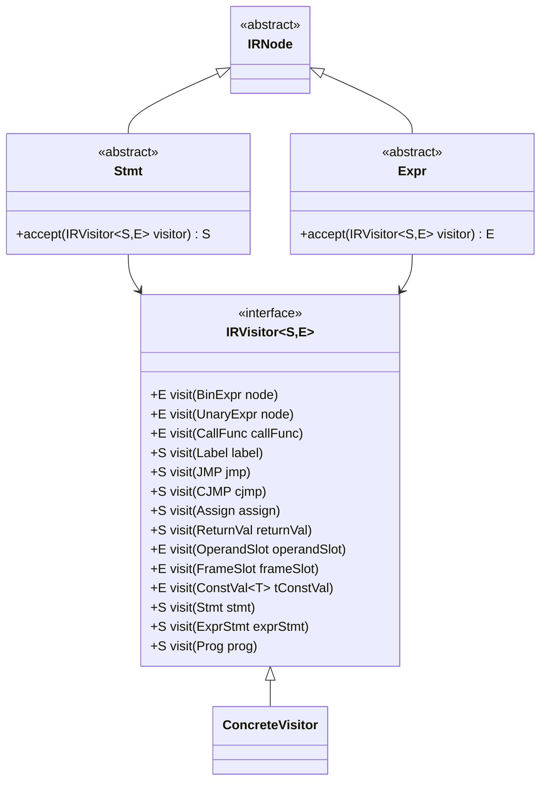
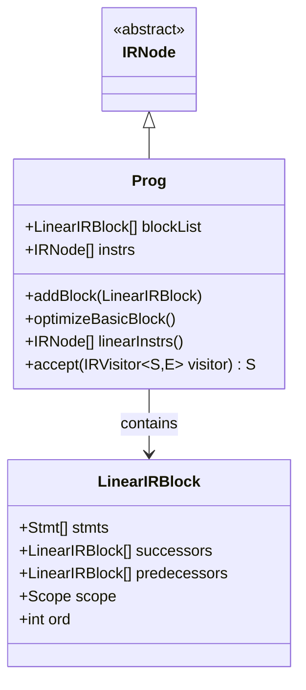
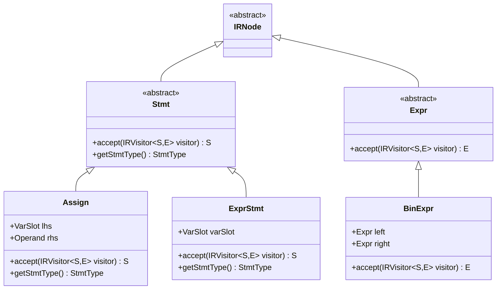

# IR Node Hierarchy and Base Classes

<cite>
**Referenced Files in This Document**   
- [IRNode.java](file://ep20/src/main/java/org/teachfx/antlr4/ep20/ir/IRNode.java)
- [IRVisitor.java](file://ep20/src/main/java/org/teachfx/antlr4/ep20/ir/IRVisitor.java)
- [Prog.java](file://ep20/src/main/java/org/teachfx/antlr4/ep20/ir/Prog.java)
- [Stmt.java](file://ep20/src/main/java/org/teachfx/antlr4/ep20/ir/stmt/Stmt.java)
- [Expr.java](file://ep20/src/main/java/org/teachfx/antlr4/ep20/ir/expr/Expr.java)
- [Assign.java](file://ep20/src/main/java/org/teachfx/antlr4/ep20/ir/stmt/Assign.java)
- [ExprStmt.java](file://ep20/src/main/java/org/teachfx/antlr4/ep20/ir/stmt/ExprStmt.java)
</cite>

## Table of Contents
1. [Introduction](#introduction)
2. [IRNode Base Class](#irnode-base-class)
3. [IRVisitor Interface](#irvisitor-interface)
4. [Prog Class as Root Container](#prog-class-as-root-container)
5. [Inheritance and Visitor Pattern Implementation](#inheritance-and-visitor-pattern-implementation)
6. [Extending the IR Hierarchy](#extending-the-ir-hierarchy)
7. [Conclusion](#conclusion)

## IRNode Base Class

The `IRNode` class serves as the abstract base class for all intermediate representation (IR) nodes in the compiler's IR hierarchy. As defined in the codebase, `IRNode` is a simple abstract class that forms the foundation of the entire IR structure, enabling polymorphic behavior and type safety across different IR components.

All IR elements inherit from `IRNode`, establishing a common type hierarchy that facilitates uniform processing, traversal, and transformation of the IR tree. This inheritance relationship allows the compiler to treat diverse IR constructs—such as expressions, statements, and program units—through a unified interface while preserving their specific behaviors.

The `IRNode` class itself does not define any methods for operand access or type information directly, but it enables these capabilities through its derived classes and the visitor pattern. By serving as a common ancestor, it allows container structures like `Prog` to hold heterogeneous collections of IR nodes and enables visitor-based algorithms to process them uniformly.

**Section sources**
- [IRNode.java](file://ep20/src/main/java/org/teachfx/antlr4/ep20/ir/IRNode.java#L1-L4)

## IRVisitor Interface

The `IRVisitor` interface defines the visitor pattern implementation for traversing and transforming IR nodes. It uses a generic two-type parameter system (`<S,E>`) where `S` typically represents the return type for statement nodes and `E` for expression nodes, enabling type-safe traversal with appropriate return types for different node categories.

The interface declares visit methods for various concrete IR node types including arithmetic expressions (`BinExpr`, `UnaryExpr`), function calls (`CallFunc`), control flow statements (`Label`, `JMP`, `CJMP`), and assignments (`Assign`). It also includes methods for handling operands (`OperandSlot`, `FrameSlot`) and constant values (`ConstVal`).

Default implementations are provided for certain visit methods, such as `visit(Stmt stmt)` and `visit(ExprStmt exprStmt)`, which delegate to the node's `accept` method. This default delegation enables extensibility while maintaining the visitor pattern contract. The interface also includes a default `visit(Prog prog)` method that returns null, which can be overridden by concrete visitors when program-level processing is needed.

This visitor interface enables separation of algorithms from the IR structure itself, allowing multiple operations (such as code generation, optimization, and analysis) to be implemented without modifying the IR node classes.

**Diagram sources**
- [IRVisitor.java](file://ep20/src/main/java/org/teachfx/antlr4/ep20/ir/IRVisitor.java#L10-L40)
- [IRNode.java](file://ep20/src/main/java/org/teachfx/antlr4/ep20/ir/IRNode.java#L1-L4)
- [Stmt.java](file://ep20/src/main/java/org/teachfx/antlr4/ep20/ir/stmt/Stmt.java#L1-L19)
- [Expr.java](file://ep20/src/main/java/org/teachfx/antlr4/ep20/ir/expr/Expr.java#L1-L8)

**Section sources**
- [IRVisitor.java](file://ep20/src/main/java/org/teachfx/antlr4/ep20/ir/IRVisitor.java#L10-L40)

## Prog Class as Root Container

The `Prog` class represents the root container of the entire IR program, serving as the top-level structure that holds all intermediate representation elements. It extends `IRNode` and acts as the entry point for IR traversal and processing operations.

`Prog` maintains a list of `LinearIRBlock` objects in its `blockList` field, representing the basic blocks of the program. These blocks contain the actual IR instructions and are organized to represent the control flow structure of the compiled program. The class provides methods to add blocks to this list, enabling incremental construction of the IR during compilation.

The class implements several key functionalities for IR optimization and linearization. The `optimizeBasicBlock()` method performs basic block optimization, including elimination of empty blocks and insertion of necessary labels. The `linearInstrs()` method produces a flattened list of all IR instructions in execution order, which is essential for code generation and analysis phases.

`Prog` also implements the visitor pattern through its `accept()` method, allowing visitor implementations to process the entire program. This makes it possible to apply transformations, analyses, or code generation algorithms to the complete IR in a structured manner.

**Diagram sources**
- [Prog.java](file://ep20/src/main/java/org/teachfx/antlr4/ep20/ir/Prog.java#L14-L136)
- [IRNode.java](file://ep20/src/main/java/org/teachfx/antlr4/ep20/ir/IRNode.java#L1-L4)

**Section sources**
- [Prog.java](file://ep20/src/main/java/org/teachfx/antlr4/ep20/ir/Prog.java#L14-L136)

## Inheritance and Visitor Pattern Implementation

The IR hierarchy demonstrates a clear inheritance structure where all IR components derive from the `IRNode` base class. This hierarchy branches into two main categories: `Stmt` (statements) and `Expr` (expressions), both of which are abstract classes extending `IRNode` and defining their own specialized behaviors.

Concrete IR nodes such as `Assign` and `ExprStmt` inherit from these abstract base classes and implement the visitor pattern by overriding the `accept()` method to delegate to the appropriate `visit()` method on the visitor. For example, the `Assign` class implements `accept()` to call `visitor.visit(this)`, enabling double dispatch and ensuring that the correct overloaded visit method is invoked based on the concrete type.

The visitor pattern implementation follows the classic structure where each concrete node class provides an `accept()` method that takes an `IRVisitor` parameter and calls the corresponding `visit()` method on that visitor. This allows algorithms to be defined externally to the IR class hierarchy, promoting separation of concerns and enabling multiple operations to be performed on the IR without modifying the node classes.

This design supports extensibility, as new visitor implementations can be created to add new operations (such as optimization passes or code generators) without requiring changes to the existing IR node classes.

**Diagram sources**
- [IRNode.java](file://ep20/src/main/java/org/teachfx/antlr4/ep20/ir/IRNode.java#L1-L4)
- [Stmt.java](file://ep20/src/main/java/org/teachfx/antlr4/ep20/ir/stmt/Stmt.java#L1-L19)
- [Expr.java](file://ep20/src/main/java/org/teachfx/antlr4/ep20/ir/expr/Expr.java#L1-L8)
- [Assign.java](file://ep20/src/main/java/org/teachfx/antlr4/ep20/ir/stmt/Assign.java#L1-L64)
- [ExprStmt.java](file://ep20/src/main/java/org/teachfx/antlr4/ep20/ir/stmt/ExprStmt.java#L1-L35)

**Section sources**
- [Stmt.java](file://ep20/src/main/java/org/teachfx/antlr4/ep20/ir/stmt/Stmt.java#L1-L19)
- [Expr.java](file://ep20/src/main/java/org/teachfx/antlr4/ep20/ir/expr/Expr.java#L1-L8)
- [Assign.java](file://ep20/src/main/java/org/teachfx/antlr4/ep20/ir/stmt/Assign.java#L1-L64)
- [ExprStmt.java](file://ep20/src/main/java/org/teachfx/antlr4/ep20/ir/stmt/ExprStmt.java#L1-L35)

## Extending the IR Hierarchy

Extending the IR hierarchy with custom node types follows a consistent pattern that maintains compatibility with the existing visitor infrastructure. To add a new IR node type, developers should create a class that extends either `Stmt` or `Expr` (or directly `IRNode` for specialized cases), depending on whether the new node represents a statement or expression.

The new class must implement the `accept()` method to support the visitor pattern, typically with a one-line implementation that delegates to the visitor's corresponding `visit()` method. It should also provide appropriate constructors, accessors for its fields, and override `toString()` for debugging and visualization purposes.

To integrate with the visitor infrastructure, the `IRVisitor` interface must be extended to include a new `visit()` method for the custom node type. This maintains type safety and ensures that all visitors must account for the new node type, preventing遗漏 during traversal operations.

When designing new IR nodes, developers should consider the existing type system and operand handling mechanisms. For example, expression nodes should return values that can be used as operands, while statement nodes should represent executable operations that may have side effects but do not produce values.

This extensible design allows the compiler to evolve with new language features and optimization opportunities while maintaining a consistent and type-safe IR representation.

**Section sources**
- [IRNode.java](file://ep20/src/main/java/org/teachfx/antlr4/ep20/ir/IRNode.java#L1-L4)
- [IRVisitor.java](file://ep20/src/main/java/org/teachfx/antlr4/ep20/ir/IRVisitor.java#L10-L40)
- [Prog.java](file://ep20/src/main/java/org/teachfx/antlr4/ep20/ir/Prog.java#L14-L136)

## Conclusion

The IR node hierarchy in this compiler framework is built on a solid foundation of object-oriented design principles and the visitor pattern. The `IRNode` base class provides a common type for all IR elements, enabling polymorphic processing and container operations. The `IRVisitor` interface facilitates separation of algorithms from data structures, allowing multiple operations to traverse and transform the IR without modifying the node classes.

The `Prog` class serves as the root container for the entire IR program, managing basic blocks and providing methods for optimization and linearization. The inheritance hierarchy clearly distinguishes between statements and expressions, with concrete implementations like `Assign` and `ExprStmt` demonstrating how specific IR operations are represented.

This design supports extensibility, type safety, and maintainability, making it well-suited for a compiler that may need to support additional language features, optimization passes, or target architectures. The consistent application of the visitor pattern throughout the hierarchy ensures that new operations can be added with minimal impact on existing code.