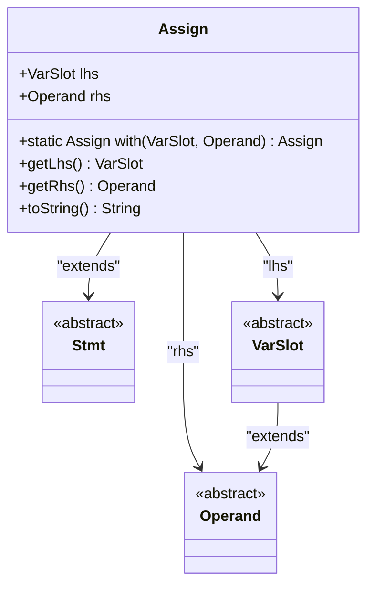
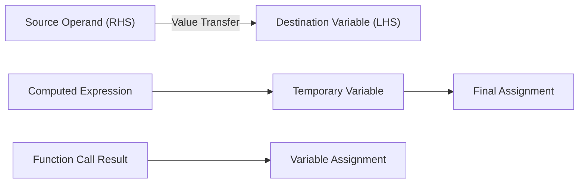
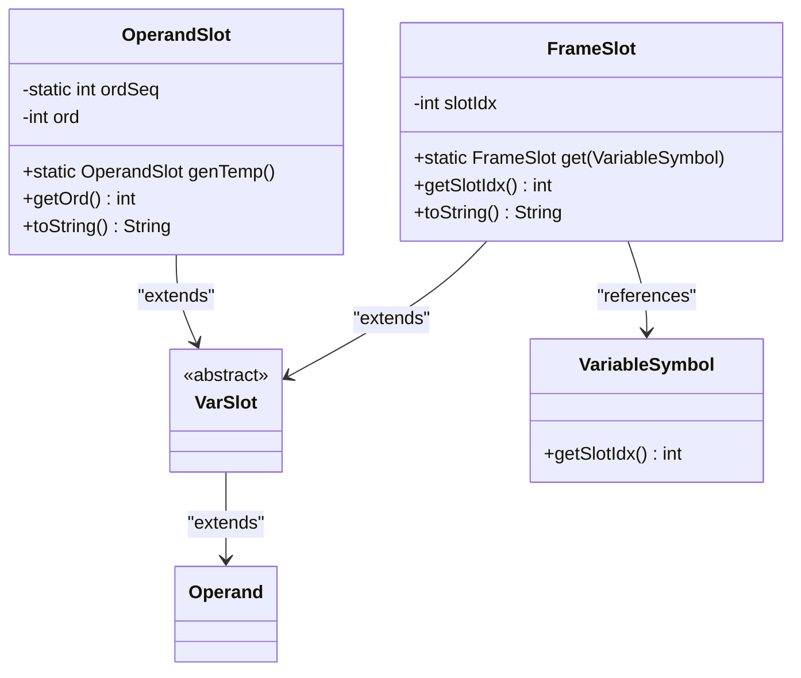
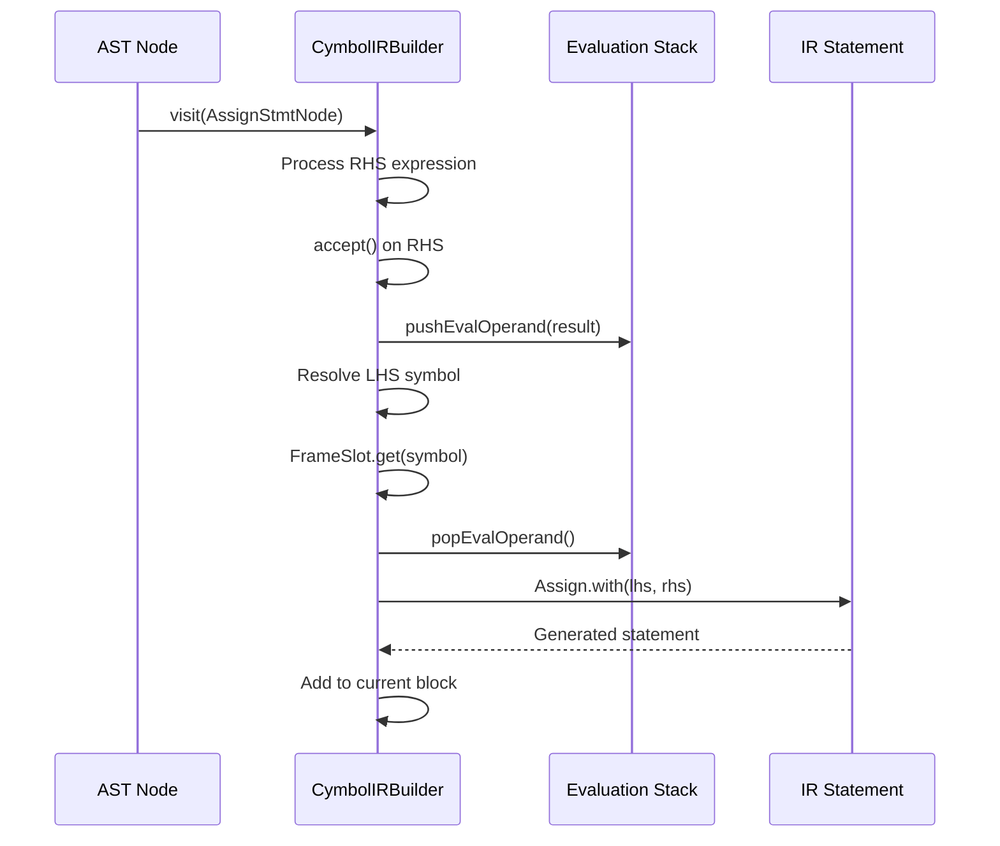
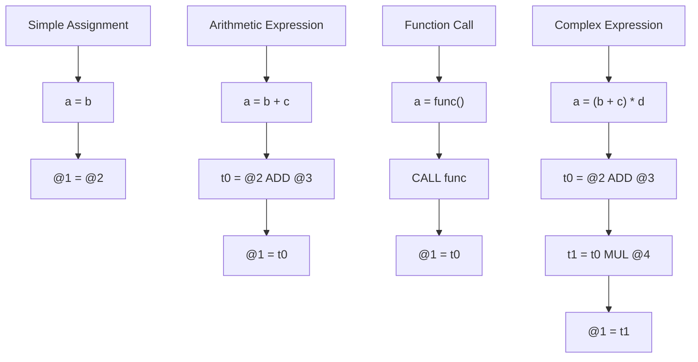
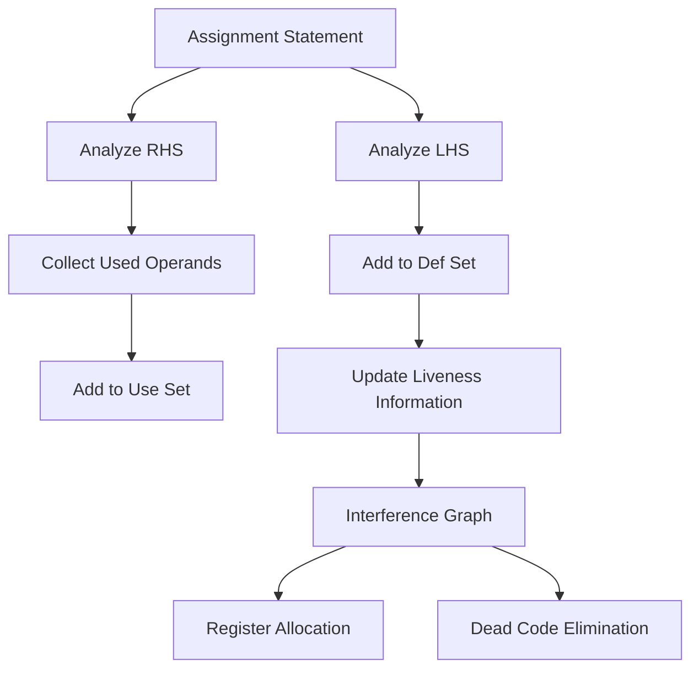
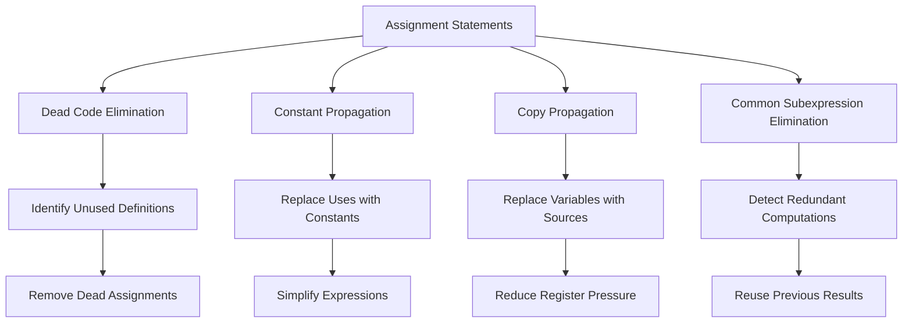

# Assignment Statements

<cite>
**Referenced Files in This Document**   
- [Assign.java](file://ep20/src/main/java/org/teachfx/antlr4/ep20/ir/stmt/Assign.java)
- [VarSlot.java](file://ep20/src/main/java/org/teachfx/antlr4/ep20/ir/expr/VarSlot.java)
- [OperandSlot.java](file://ep20/src/main/java/org/teachfx/antlr4/ep20/ir/expr/addr/OperandSlot.java)
- [FrameSlot.java](file://ep20/src/main/java/org/teachfx/antlr4/ep20/ir/expr/addr/FrameSlot.java)
- [CymbolIRBuilder.java](file://ep20/src/main/java/org/teachfx/antlr4/ep20/pass/ir/CymbolIRBuilder.java)
- [LivenessAnalysis.java](file://ep20/src/main/java/org/teachfx/antlr4/ep20/pass/cfg/LivenessAnalysis.java)
- [AssignStmtNode.java](file://ep21/src/main/java/org/teachfx/antlr4/ep21/ast/stmt/AssignStmtNode.java)
</cite>

## Table of Contents
1. [Introduction](#introduction)
2. [Structure of Assign Statements](#structure-of-assign-statements)
3. [Data Flow in Three-Address Code](#data-flow-in-three-address-code)
4. [VarSlot and OperandSlot Representation](#varslot-and-operandslot-representation)
5. [Assignment Statement Generation](#assignment-statement-generation)
6. [Examples of Assign Statements](#examples-of-assign-statements)
7. [Role in Data Dependency Analysis](#role-in-data-dependency-analysis)
8. [Optimization Opportunities](#optimization-opportunities)
9. [Conclusion](#conclusion)

## Introduction
Assignment statements are fundamental constructs in compiler design that represent value assignment operations. They play a crucial role in intermediate representation (IR) by modeling data flow through three-address code. This document explains the structure and functionality of Assign statements, focusing on their implementation in the Antlr4-based compiler framework. The analysis covers how assignments are represented using VarSlot and OperandSlot abstractions, how they model data flow, and their significance in optimization processes.

## Structure of Assign Statements
Assign statements follow a three-address code format where a destination operand receives a value from a source operand. The structure consists of two primary components: a left-hand side (LHS) destination and a right-hand side (RHS) source. The LHS is always a VarSlot representing a variable location, while the RHS can be any Operand including constants, computed values, or other variables.

The Assign class implements this structure with two protected fields: `lhs` of type VarSlot and `rhs` of type Operand. Factory methods `with(VarSlot lhs, Operand rhs)` provide convenient construction of assignment statements. The string representation follows the format "%s = %s" where the first placeholder is the LHS and the second is the RHS.

**Diagram sources**
- [Assign.java](file://ep20/src/main/java/org/teachfx/antlr4/ep20/ir/stmt/Assign.java#L1-L64)
- [VarSlot.java](file://ep20/src/main/java/org/teachfx/antlr4/ep20/ir/expr/VarSlot.java#L1-L4)

**Section sources**
- [Assign.java](file://ep20/src/main/java/org/teachfx/antlr4/ep20/ir/stmt/Assign.java#L1-L64)

## Data Flow in Three-Address Code
Three-address code represents assignments as operations with at most three operands, typically in the form of `x = y op z`. This format simplifies data flow analysis by breaking complex expressions into atomic operations. Each Assign statement explicitly shows the flow of data from source to destination, making dependencies between operations transparent.

The implementation uses a linear sequence of IR statements where each assignment represents a single data transfer. This linearization enables straightforward control flow analysis and optimization. The data flow is unidirectional: values flow from the RHS expression to the LHS variable, with no implicit side effects.

**Diagram sources**
- [Assign.java](file://ep20/src/main/java/org/teachfx/antlr4/ep20/ir/stmt/Assign.java#L1-L64)

## VarSlot and OperandSlot Representation
VarSlot and OperandSlot are specialized classes that represent different types of operands in the IR. VarSlot is an abstract class extending Operand, serving as a base for variable representations. Two concrete implementations exist: FrameSlot and OperandSlot.

FrameSlot represents variables allocated in the stack frame, identified by a slot index. It is constructed using `FrameSlot.get(VariableSymbol)` which retrieves the slot index from the symbol table. The string representation uses the format "@n" where n is the slot index.

OperandSlot represents temporary values generated during expression evaluation. It maintains a static sequence counter (ordSeq) to ensure unique identifiers. The factory method `genTemp()` creates new temporary slots with incrementing ordinals, represented as "t0", "t1", etc. This system ensures that each temporary has a unique identifier within the scope of a function.

**Diagram sources**
- [VarSlot.java](file://ep20/src/main/java/org/teachfx/antlr4/ep20/ir/expr/VarSlot.java#L1-L4)
- [OperandSlot.java](file://ep20/src/main/java/org/teachfx/antlr4/ep20/ir/expr/addr/OperandSlot.java#L1-L37)
- [FrameSlot.java](file://ep20/src/main/java/org/teachfx/antlr4/ep20/ir/expr/addr/FrameSlot.java#L1-L30)

**Section sources**
- [VarSlot.java](file://ep20/src/main/java/org/teachfx/antlr4/ep20/ir/expr/VarSlot.java#L1-L4)
- [OperandSlot.java](file://ep20/src/main/java/org/teachfx/antlr4/ep20/ir/expr/addr/OperandSlot.java#L1-L37)
- [FrameSlot.java](file://ep20/src/main/java/org/teachfx/antlr4/ep20/ir/expr/addr/FrameSlot.java#L1-L30)

## Assignment Statement Generation
Assignment statements are generated during the IR construction phase by the CymbolIRBuilder visitor. When processing an AssignStmtNode from the AST, the builder first evaluates the RHS expression, which pushes the resulting operand onto an evaluation stack. The LHS is resolved to a FrameSlot using the variable's symbol from the symbol table.

The actual assignment is created using `Assign.with(lhs, rhs)` where lhs is the FrameSlot and rhs is the popped operand from the evaluation stack. This process ensures that complex expressions are broken down into multiple three-address code statements, with temporary variables holding intermediate results.

For variable declarations with initializers, the IR builder generates assignment statements during VarDeclNode processing. The initialization expression is evaluated and assigned to the variable's frame slot, following the same pattern as explicit assignment statements.

**Diagram sources**
- [CymbolIRBuilder.java](file://ep20/src/main/java/org/teachfx/antlr4/ep20/pass/ir/CymbolIRBuilder.java#L105-L151)
- [AssignStmtNode.java](file://ep21/src/main/java/org/teachfx/antlr4/ep21/ast/stmt/AssignStmtNode.java#L1-L55)

**Section sources**
- [CymbolIRBuilder.java](file://ep20/src/main/java/org/teachfx/antlr4/ep20/pass/ir/CymbolIRBuilder.java#L1-L473)

## Examples of Assign Statements
The implementation supports various types of assignment statements, each demonstrating different aspects of three-address code generation. Simple variable assignments directly transfer values between variables. Arithmetic expressions are decomposed into multiple statements with temporary variables. Function call results are assigned through intermediate temporaries.

For simple assignments like `a = b`, the IR generates a single statement `@1 = @2` where the frame slots represent the variables. Arithmetic expressions like `a = b + c` generate multiple statements: a temporary holds the addition result (`t0 = @2 ADD @3`), followed by assignment to the destination (`@1 = t0`). Function calls like `a = func()` generate a call instruction followed by assignment from the return value temporary.

The test cases demonstrate these patterns with predictable temporary numbering when the sequence is reset. This ensures consistent output for verification purposes, showing how `@1 = t0` represents an assignment from temporary t0 to variable at slot 1.

**Section sources**
- [ThreeAddressCodeTest.java](file://ep20/src/test/java/org/teachfx/antlr4/ep20/ir/ThreeAddressCodeTest.java#L1-L105)

## Role in Data Dependency Analysis
Assign statements are fundamental to data dependency analysis, particularly in liveness analysis. The LivenessAnalysis visitor identifies which variables are live (will be used) at each program point by tracking uses and definitions. In an assignment statement, the LHS variable is considered defined, while the RHS operands are considered used.

This distinction enables precise tracking of variable lifetimes. When visiting an Assign node, the analysis first processes the RHS to collect all used operands, then adds the LHS to the definition set. This information is crucial for register allocation and dead code elimination, as it reveals which variables must be preserved and which can be safely overwritten.

The separation of use and def sets allows the compiler to construct interference graphs and perform optimizations based on variable lifetimes. Variables with non-overlapping live ranges can share the same storage location, enabling more efficient memory usage.

**Diagram sources**
- [LivenessAnalysis.java](file://ep20/src/main/java/org/teachfx/antlr4/ep20/pass/cfg/LivenessAnalysis.java#L90-L146)

**Section sources**
- [LivenessAnalysis.java](file://ep20/src/main/java/org/teachfx/antlr4/ep20/pass/cfg/LivenessAnalysis.java#L1-L147)

## Optimization Opportunities
Assign statements enable several optimization opportunities, with dead code elimination being particularly significant. By analyzing the use-def chains established by assignments, the compiler can identify statements that compute values which are never subsequently used. These dead assignments can be safely removed without affecting program behavior.

The evaluation stack management in CymbolIRBuilder provides additional optimization potential. The pushEvalOperand and popEvalOperand methods track temporary usage, allowing detection of unused computation results. When a temporary is pushed but never used before being popped, the corresponding computation can be eliminated.

Other optimizations include constant propagation, where assignments of constant values enable replacement of subsequent uses with the constant itself, and copy propagation, where assignments of the form `x = y` allow replacement of `x` with `y` in subsequent statements. These optimizations rely on the explicit data flow modeling provided by three-address code assignments.

**Section sources**
- [CymbolIRBuilder.java](file://ep20/src/main/java/org/teachfx/antlr4/ep20/pass/ir/CymbolIRBuilder.java#L1-L473)
- [LivenessAnalysis.java](file://ep20/src/main/java/org/teachfx/antlr4/ep20/pass/cfg/LivenessAnalysis.java#L1-L147)

## Conclusion
Assignment statements serve as the foundation of three-address code in the compiler's intermediate representation. By explicitly modeling data flow between source and destination operands, they enable sophisticated analysis and optimization. The implementation using VarSlot and OperandSlot abstractions provides a flexible framework for representing both named variables and temporary values. Through systematic generation from high-level constructs and integration with data flow analysis, assignment statements play a crucial role in transforming source code into optimized executable form.