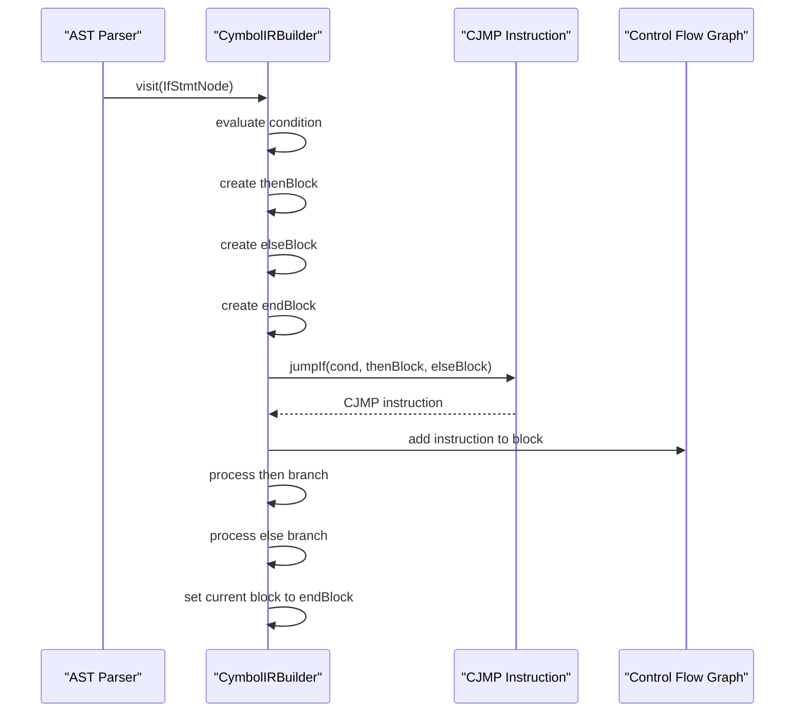
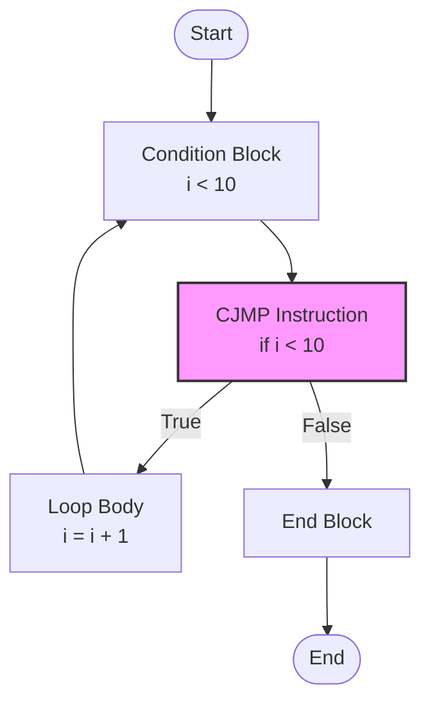
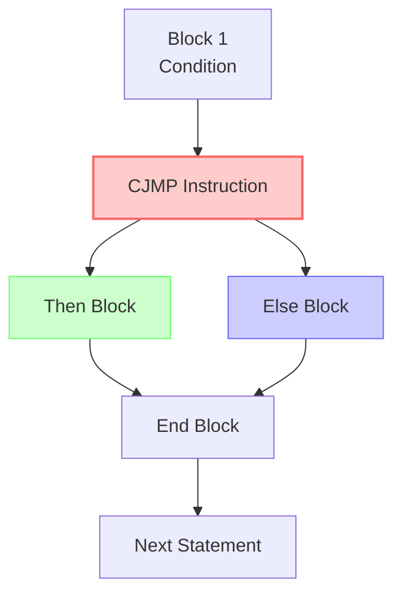
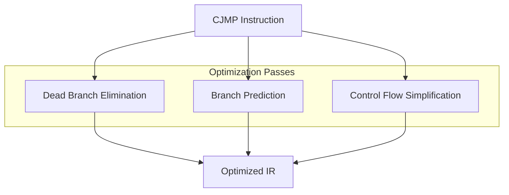

# Conditional Jump Instructions

<cite>
**Referenced Files in This Document**   
- [CJMP.java](file://ep20/src/main/java/org/teachfx/antlr4/ep20/ir/stmt/CJMP.java)
- [CymbolIRBuilder.java](file://ep20/src/main/java/org/teachfx/antlr4/ep20/pass/ir/CymbolIRBuilder.java)
- [CFGBuilder.java](file://ep20/src/main/java/org/teachfx/antlr4/ep20/pass/cfg/CFGBuilder.java)
- [BasicBlockTest.java](file://ep20/src/test/java/org/teachfx/antlr4/ep20/pass/cfg/BasicBlockTest.java)
</cite>

## Table of Contents
1. [Introduction](#introduction)
2. [CJMP Statement Structure](#cjmp-statement-structure)
3. [Control Flow Generation](#control-flow-generation)
4. [Boolean Expression Evaluation](#boolean-expression-evaluation)
5. [Usage Examples](#usage-examples)
6. [Control Flow Graph Formation](#control-flow-graph-formation)
7. [Optimization Opportunities](#optimization-opportunities)
8. [Conclusion](#conclusion)

## Introduction
The CJMP (Conditional Jump) instruction is a fundamental component in the intermediate representation (IR) of the Cymbol compiler, serving as the primary mechanism for implementing conditional control flow. This document provides a comprehensive analysis of the CJMP statement, its role in translating high-level language constructs, and its significance in program optimization. The CJMP instruction enables the compiler to represent branching decisions from high-level constructs such as if-else statements and while loops in a low-level, executable format.

## CJMP Statement Structure

The CJMP statement is implemented as a class that extends the base Stmt class and implements the JMPInstr interface. It contains three essential fields that define its behavior in control flow execution:

- **cond**: A VarSlot representing the boolean condition that determines the branch direction
- **thenBlock**: A LinearIRBlock representing the target block when the condition evaluates to true
- **elseBlock**: A LinearIRBlock representing the target block when the condition evaluates to false

The CJMP constructor initializes these fields and establishes bidirectional references between the instruction and its target blocks through the refJMP method, ensuring proper linkage in the control flow graph. The instruction's string representation follows the format "jmpIf %s,%s,%s", displaying the condition and both target blocks.

```mermaid
classDiagram
class CJMP {
+VarSlot cond
-LinearIRBlock thenBlock
-LinearIRBlock elseBlock
+CJMP(VarSlot, LinearIRBlock, LinearIRBlock)
+getTarget() Label
+accept(IRVisitor) S
+getStmtType() StmtType
+toString() String
+setElseBlock(LinearIRBlock) void
+setThenBlock(LinearIRBlock) void
+getElseBlock() LinearIRBlock
+getThenBlock() LinearIRBlock
}
class Stmt {
<<abstract>>
+enum StmtType { JMP, CJMP, ASSIGN, LABEL, RETURN, EXPR }
+accept(IRVisitor) S
+getStmtType() StmtType
}
class JMPInstr {
<<interface>>
+getTarget() Label
}
CJMP --|> Stmt : "extends"
CJMP ..|> JMPInstr : "implements"
CJMP --> LinearIRBlock : "thenBlock"
CJMP --> LinearIRBlock : "elseBlock"
CJMP --> VarSlot : "cond"
```

**Diagram sources**
- [CJMP.java](file://ep20/src/main/java/org/teachfx/antlr4/ep20/ir/stmt/CJMP.java#L8-L59)
- [Stmt.java](file://ep20/src/main/java/org/teachfx/antlr4/ep20/ir/stmt/Stmt.java#L8-L8)

**Section sources**
- [CJMP.java](file://ep20/src/main/java/org/teachfx/antlr4/ep20/ir/stmt/CJMP.java#L8-L59)

## Control Flow Generation

The generation of CJMP statements occurs during the IR construction phase, primarily within the CymbolIRBuilder visitor. When processing high-level conditional constructs, the builder creates appropriate basic blocks and inserts CJMP instructions to represent the branching logic.

For if-else statements, the IR builder follows a systematic approach:
1. Evaluate the condition expression and store the result
2. Create separate basic blocks for the then and else branches
3. Generate a CJMP instruction that branches to the appropriate block based on the condition
4. Create an end block to merge control flow after the conditional

The same pattern applies to while loops, where the CJMP instruction forms the loop termination condition, branching either to the loop body or the exit block.



**Diagram sources**
- [CymbolIRBuilder.java](file://ep20/src/main/java/org/teachfx/antlr4/ep20/pass/ir/CymbolIRBuilder.java#L271-L315)

**Section sources**
- [CymbolIRBuilder.java](file://ep20/src/main/java/org/teachfx/antlr4/ep20/pass/ir/CymbolIRBuilder.java#L228-L315)

## Boolean Expression Evaluation

Boolean expressions serve as the conditions for CJMP instructions, translating high-level logical operations into IR-compatible boolean values. The compiler processes various types of boolean expressions, including comparisons, logical operators, and boolean literals.

During IR generation, boolean expressions are evaluated and their results stored in VarSlot instances, which are then used as the condition parameter in CJMP instructions. The evaluation process involves:
1. Processing the boolean expression through the appropriate visitor method
2. Generating necessary arithmetic or logical operations
3. Storing the boolean result in a temporary variable or stack slot
4. Using this result as the condition for the CJMP instruction

The IR builder handles different boolean expression types through specialized visit methods, ensuring proper translation of logical operations like equality checks, relational comparisons, and boolean logic (AND, OR, NOT).

## Usage Examples

### If-Else Statement Translation
When translating an if-else statement, the compiler generates a CJMP instruction that branches based on the evaluation of the condition. For a simple if-else construct:

```cymbol
if (x > 5) {
    y = 10;
} else {
    y = 0;
}
```

The IR generation creates three basic blocks: one for the then branch, one for the else branch, and one for the continuation after the conditional. The CJMP instruction directs execution to either the then or else block based on whether x > 5 evaluates to true.

### Loop Termination Conditions
In while loops, CJMP instructions implement the loop continuation logic. For a while loop:

```cymbol
while (i < 10) {
    i = i + 1;
}
```

The compiler generates a CJMP instruction that checks whether i < 10. If true, execution continues to the loop body; if false, it branches to the exit block, terminating the loop.



**Diagram sources**
- [CymbolIRBuilder.java](file://ep20/src/main/java/org/teachfx/antlr4/ep20/pass/ir/CymbolIRBuilder.java#L228-L273)

**Section sources**
- [CymbolIRBuilder.java](file://ep20/src/main/java/org/teachfx/antlr4/ep20/pass/ir/CymbolIRBuilder.java#L228-L273)

## Control Flow Graph Formation

CJMP instructions play a crucial role in forming the control flow graph (CFG) of a program. During CFG construction, each CJMP instruction creates two outgoing edges from its containing basic block: one to the then block and one to the else block.

The CFGBuilder processes CJMP instructions by:
1. Identifying the CJMP as the last instruction in a basic block
2. Creating an edge from the current block to the else block (using getTarget())
3. Automatically creating an edge to the then block through the successor relationship
4. Recursively processing all successor blocks to complete the graph

This process ensures that all possible execution paths are represented in the CFG, enabling subsequent analysis and optimization passes to understand the complete control flow of the program.



**Diagram sources**
- [CFGBuilder.java](file://ep20/src/main/java/org/teachfx/antlr4/ep20/pass/cfg/CFGBuilder.java#L20-L30)

**Section sources**
- [CFGBuilder.java](file://ep20/src/main/java/org/teachfx/antlr4/ep20/pass/cfg/CFGBuilder.java#L20-L30)

## Optimization Opportunities

CJMP instructions enable several important optimization opportunities in the compilation process:

### Dead Branch Elimination
When the compiler can determine that a condition always evaluates to true or false (constant folding), it can eliminate the unnecessary branch. Instead of generating a CJMP instruction, the optimizer replaces it with an unconditional JMP to the appropriate block, removing the dead code entirely.

### Branch Prediction
The structure of CJMP instructions allows for branch prediction optimizations. By analyzing the control flow patterns, the compiler can reorder basic blocks to improve instruction cache performance and enable better pipelining in the target architecture.

### Control Flow Simplification
CJMP instructions facilitate control flow simplification by enabling the identification of unreachable code. If a path analysis determines that a particular block cannot be reached due to the conditions in preceding CJMP instructions, that block and its contents can be safely removed from the IR.

The test suite verifies the correct handling of CJMP instructions in basic block construction, ensuring that conditional jumps are properly recognized and integrated into the control flow graph structure.



**Section sources**
- [BasicBlockTest.java](file://ep20/src/test/java/org/teachfx/antlr4/ep20/pass/cfg/BasicBlockTest.java#L65-L97)

## Conclusion
The CJMP instruction is a critical component in the intermediate representation of the Cymbol compiler, serving as the foundation for conditional control flow. By representing branching decisions with a condition and two target blocks, CJMP enables the translation of high-level constructs like if-else statements and while loops into executable IR code. Its role extends beyond simple branching, as it forms the basis for control flow graph construction and enables important optimizations such as dead branch elimination and branch prediction. The design of CJMP as part of a structured IR system demonstrates how high-level programming concepts can be systematically transformed into low-level executable representations while preserving the program's logical structure and enabling sophisticated analysis and optimization.