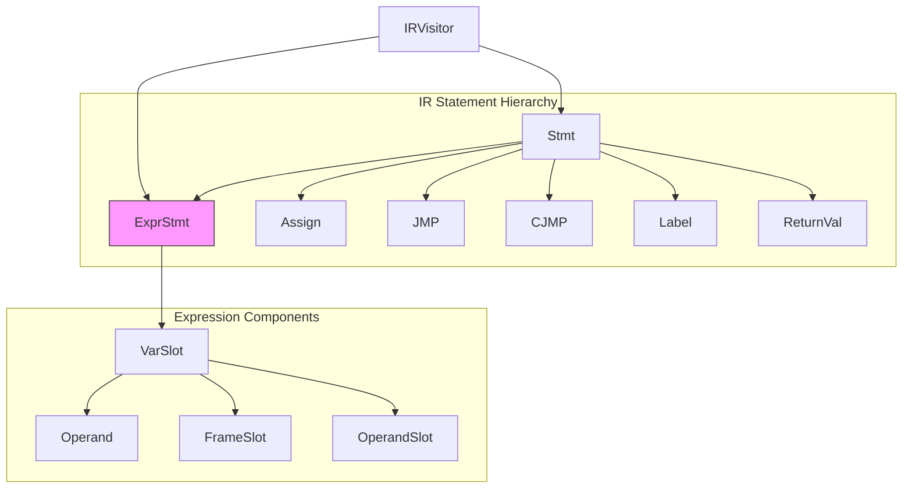
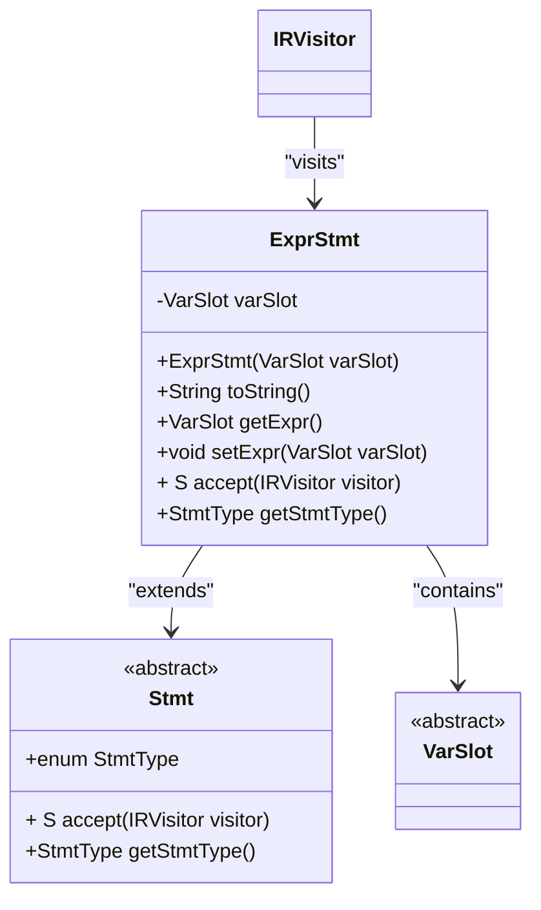
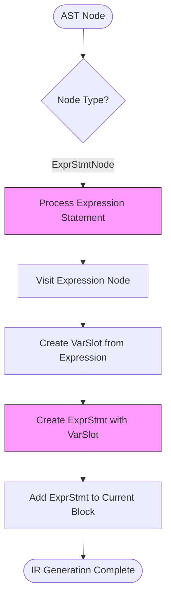
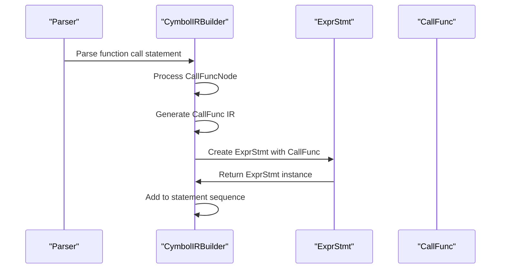
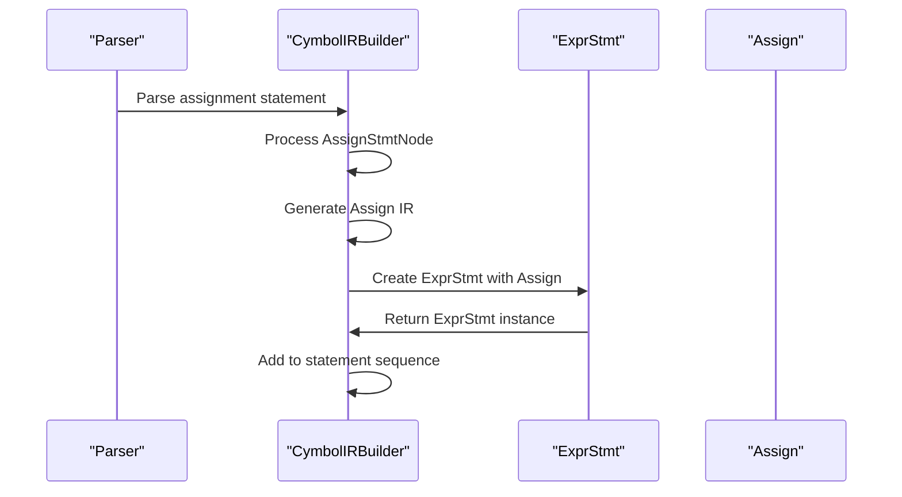
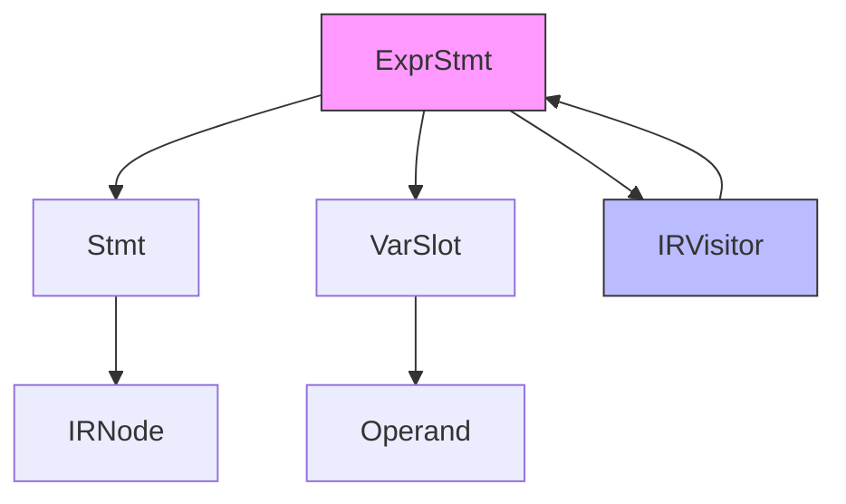

# Expression Statements

<cite>
**Referenced Files in This Document**   
- [ExprStmt.java](file://ep20/src/main/java/org/teachfx/antlr4/ep20/ir/stmt/ExprStmt.java)
- [CymbolIRBuilder.java](file://ep20/src/main/java/org/teachfx/antlr4/ep20/pass/ir/CymbolIRBuilder.java)
- [IRVisitor.java](file://ep20/src/main/java/org/teachfx/antlr4/ep20/ir/IRVisitor.java)
- [Stmt.java](file://ep20/src/main/java/org/teachfx/antlr4/ep20/ir/stmt/Stmt.java)
- [VarSlot.java](file://ep20/src/main/java/org/teachfx/antlr4/ep20/ir/expr/VarSlot.java)
</cite>

## Table of Contents
1. [Introduction](#introduction)
2. [Core Components](#core-components)
3. [Architecture Overview](#architecture-overview)
4. [Detailed Component Analysis](#detailed-component-analysis)
5. [Dependency Analysis](#dependency-analysis)
6. [Performance Considerations](#performance-considerations)
7. [Troubleshooting Guide](#troubleshooting-guide)
8. [Conclusion](#conclusion)

## Introduction
This document provides a comprehensive analysis of the ExprStmt Intermediate Representation (IR) statement used in the Cymbol compiler implementation. The ExprStmt serves as a critical component for handling expressions that are used as statements with side effects, such as function calls, method invocations, and assignment operations. This documentation details how ExprStmt wraps expression IR nodes and integrates them into the statement sequence, preserving computational side effects during optimization passes.

## Core Components
The ExprStmt IR statement is designed to represent expressions used as statements with side effects. It encapsulates expression nodes that don't produce values but have computational effects, ensuring these side effects are preserved during compilation and optimization. The component works by wrapping VarSlot instances that represent various expression types, allowing them to be integrated into the statement sequence while maintaining their computational impact.

**Section sources**
- [ExprStmt.java](file://ep20/src/main/java/org/teachfx/antlr4/ep20/ir/stmt/ExprStmt.java#L5-L35)
- [Stmt.java](file://ep20/src/main/java/org/teachfx/antlr4/ep20/ir/stmt/Stmt.java#L5-L19)

## Architecture Overview
The ExprStmt component is part of a larger intermediate representation system that translates high-level expression statements into IR instances. It operates within the compiler's IR generation phase, working in conjunction with other statement types to form a complete representation of program logic. The architecture follows a visitor pattern for traversal and processing of IR nodes.

**Diagram sources **
- [ExprStmt.java](file://ep20/src/main/java/org/teachfx/antlr4/ep20/ir/stmt/ExprStmt.java#L5-L35)
- [Stmt.java](file://ep20/src/main/java/org/teachfx/antlr4/ep20/ir/stmt/Stmt.java#L5-L19)
- [VarSlot.java](file://ep20/src/main/java/org/teachfx/antlr4/ep20/ir/expr/VarSlot.java#L5-L6)

## Detailed Component Analysis

### ExprStmt Class Analysis
The ExprStmt class extends the base Stmt class and represents expressions used as statements with side effects. It wraps a VarSlot instance that contains the expression to be evaluated, providing methods to access and modify the wrapped expression. The class implements the visitor pattern through the accept method, allowing for traversal and processing by IR visitors.

#### Class Structure

**Diagram sources **
- [ExprStmt.java](file://ep20/src/main/java/org/teachfx/antlr4/ep20/ir/stmt/ExprStmt.java#L5-L35)
- [Stmt.java](file://ep20/src/main/java/org/teachfx/antlr4/ep20/ir/stmt/Stmt.java#L5-L19)
- [VarSlot.java](file://ep20/src/main/java/org/teachfx/antlr4/ep20/ir/expr/VarSlot.java#L5-L6)

### IR Generation Process
The translation of high-level expression statements into ExprStmt instances occurs during the IR generation phase. The CymbolIRBuilder processes AST nodes and creates corresponding IR statements, including ExprStmt instances for expression statements.

#### IR Generation Flow

**Diagram sources **
- [CymbolIRBuilder.java](file://ep20/src/main/java/org/teachfx/antlr4/ep20/pass/ir/CymbolIRBuilder.java#L194-L237)
- [ExprStmt.java](file://ep20/src/main/java/org/teachfx/antlr4/ep20/ir/stmt/ExprStmt.java#L5-L35)

### Usage Examples
The ExprStmt component is used to represent various types of expression statements that have side effects but don't produce values for assignment. These include function calls, method invocations, and assignment expressions used as standalone statements.

#### Function Call Example

**Diagram sources **
- [CymbolIRBuilder.java](file://ep20/src/main/java/org/teachfx/antlr4/ep20/pass/ir/CymbolIRBuilder.java#L194-L237)
- [ExprStmt.java](file://ep20/src/main/java/org/teachfx/antlr4/ep20/ir/stmt/ExprStmt.java#L5-L35)

#### Assignment as Statement Example

**Diagram sources **
- [CymbolIRBuilder.java](file://ep20/src/main/java/org/teachfx/antlr4/ep20/pass/ir/CymbolIRBuilder.java#L271-L315)
- [ExprStmt.java](file://ep20/src/main/java/org/teachfx/antlr4/ep20/ir/stmt/ExprStmt.java#L5-L35)

## Dependency Analysis
The ExprStmt component has dependencies on several key classes in the IR system, forming a cohesive architecture for representing and processing expression statements.

**Diagram sources **
- [ExprStmt.java](file://ep20/src/main/java/org/teachfx/antlr4/ep20/ir/stmt/ExprStmt.java#L5-L35)
- [IRVisitor.java](file://ep20/src/main/java/org/teachfx/antlr4/ep20/ir/IRVisitor.java#L0-L40)
- [Stmt.java](file://ep20/src/main/java/org/teachfx/antlr4/ep20/ir/stmt/Stmt.java#L5-L19)

**Section sources**
- [ExprStmt.java](file://ep20/src/main/java/org/teachfx/antlr4/ep20/ir/stmt/ExprStmt.java#L5-L35)
- [CymbolIRBuilder.java](file://ep20/src/main/java/org/teachfx/antlr4/ep20/pass/ir/CymbolIRBuilder.java#L194-L237)
- [IRVisitor.java](file://ep20/src/main/java/org/teachfx/antlr4/ep20/ir/IRVisitor.java#L0-L40)

## Performance Considerations
The ExprStmt implementation is designed for efficient processing during compilation. By using the visitor pattern and maintaining a simple structure with a single VarSlot field, the class minimizes memory overhead and processing time. The implementation ensures that side effects from expression statements are preserved without unnecessary computational overhead during optimization passes.

## Troubleshooting Guide
When working with ExprStmt instances, ensure that:
1. The wrapped VarSlot is properly initialized and not null
2. The expression being wrapped actually has side effects that need preservation
3. The IR visitor implementation properly handles ExprStmt nodes
4. The statement sequence maintains proper ordering of ExprStmt instances

Common issues include null pointer exceptions when accessing uninitialized VarSlot instances and incorrect handling of expression statements during optimization that may eliminate necessary side effects.

**Section sources**
- [ExprStmt.java](file://ep20/src/main/java/org/teachfx/antlr4/ep20/ir/stmt/ExprStmt.java#L5-L35)
- [CymbolIRBuilder.java](file://ep20/src/main/java/org/teachfx/antlr4/ep20/pass/ir/CymbolIRBuilder.java#L194-L237)

## Conclusion
The ExprStmt IR statement plays a crucial role in the Cymbol compiler by representing expressions used as statements with side effects. It effectively wraps expression IR nodes and integrates them into the statement sequence, ensuring that computational side effects from function calls, method invocations, and assignment expressions are preserved during optimization passes. The implementation follows clean design principles with proper encapsulation and adherence to the visitor pattern, making it an integral part of the compiler's intermediate representation system.