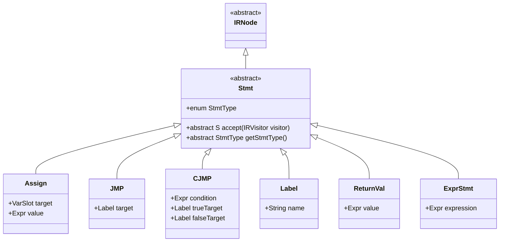
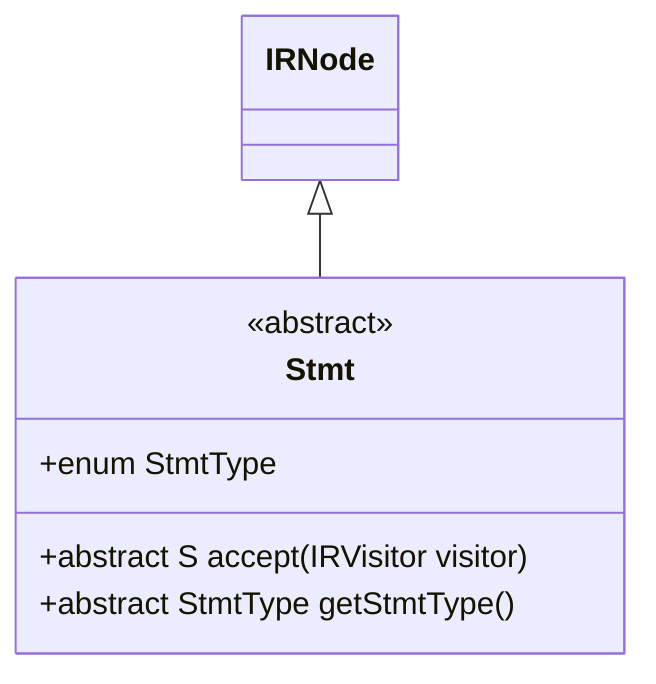
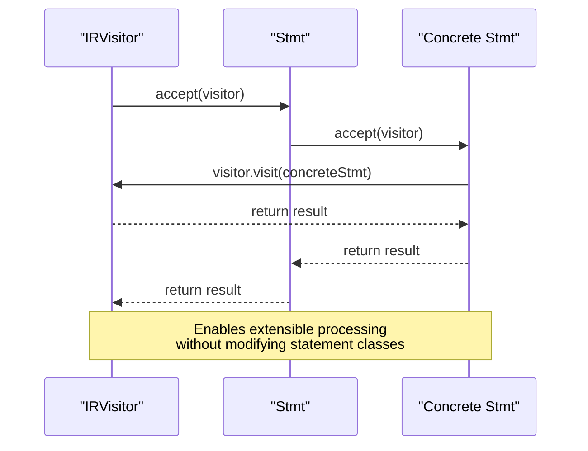
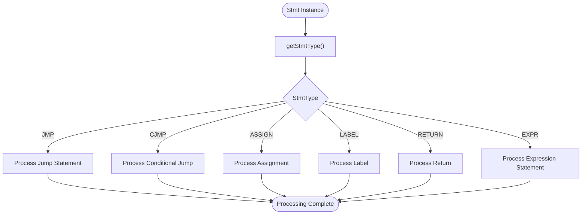
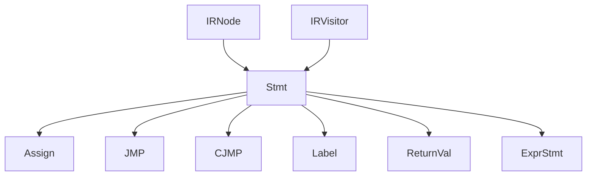

# IR Statement Base Class

<cite>
**Referenced Files in This Document**   
- [Stmt.java](file://ep20/src/main/java/org/teachfx/antlr4/ep20/ir/stmt/Stmt.java)
- [IRNode.java](file://ep20/src/main/java/org/teachfx/antlr4/ep20/ir/IRNode.java)
- [IRVisitor.java](file://ep20/src/main/java/org/teachfx/antlr4/ep20/ir/IRVisitor.java)
- [Assign.java](file://ep20/src/main/java/org/teachfx/antlr4/ep20/ir/stmt/Assign.java)
- [JMP.java](file://ep20/src/main/java/org/teachfx/antlr4/ep20/ir/stmt/JMP.java)
- [CJMP.java](file://ep20/src/main/java/org/teachfx/antlr4/ep20/ir/stmt/CJMP.java)
- [Label.java](file://ep20/src/main/java/org/teachfx/antlr4/ep20/ir/stmt/Label.java)
</cite>

## Table of Contents
1. [Introduction](#introduction)
2. [Core Components](#core-components)
3. [Architecture Overview](#architecture-overview)
4. [Detailed Component Analysis](#detailed-component-analysis)
5. [Dependency Analysis](#dependency-analysis)
6. [Performance Considerations](#performance-considerations)
7. [Troubleshooting Guide](#troubleshooting-guide)
8. [Conclusion](#conclusion)

## Introduction
The Stmt base class serves as the foundational element for all intermediate representation (IR) statements in the compiler's IR hierarchy. As an abstract class extending IRNode, it provides a uniform interface for representing executable statements in the three-address code format. This document details the design and implementation of the Stmt class, its role in the visitor pattern, and its relationship with concrete statement types.

## Core Components
The Stmt class is central to the IR statement hierarchy, providing the foundation for all executable statements in the intermediate representation. It implements the visitor pattern through the accept() method and defines a common interface for statement type identification.

**Section sources**
- [Stmt.java](file://ep20/src/main/java/org/teachfx/antlr4/ep20/ir/stmt/Stmt.java#L5-L18)
- [IRNode.java](file://ep20/src/main/java/org/teachfx/antlr4/ep20/ir/IRNode.java#L2-L4)

## Architecture Overview
The Stmt class is part of a hierarchical structure where all IR statements inherit from a common base. This design enables polymorphic behavior and consistent processing across different statement types through the visitor pattern.

**Diagram sources**
- [Stmt.java](file://ep20/src/main/java/org/teachfx/antlr4/ep20/ir/stmt/Stmt.java#L5-L18)
- [Assign.java](file://ep20/src/main/java/org/teachfx/antlr4/ep20/ir/stmt/Assign.java#L1-L10)
- [JMP.java](file://ep20/src/main/java/org/teachfx/antlr4/ep20/ir/stmt/JMP.java#L1-L10)
- [CJMP.java](file://ep20/src/main/java/org/teachfx/antlr4/ep20/ir/stmt/CJMP.java#L1-L10)
- [Label.java](file://ep20/src/main/java/org/teachfx/antlr4/ep20/ir/stmt/Label.java#L1-L10)

## Detailed Component Analysis
The Stmt base class provides the foundation for all IR statements, enabling consistent processing and type identification across the intermediate representation.

### Stmt Base Class Analysis
The Stmt class serves as the abstract base for all statement types in the IR hierarchy. It extends IRNode and defines the essential contract that all statements must fulfill.

#### Class Structure and Inheritance

**Diagram sources**
- [Stmt.java](file://ep20/src/main/java/org/teachfx/antlr4/ep20/ir/stmt/Stmt.java#L5-L18)
- [IRNode.java](file://ep20/src/main/java/org/teachfx/antlr4/ep20/ir/IRNode.java#L2-L4)

#### Visitor Pattern Implementation
The accept() method in the Stmt class enables the visitor pattern, allowing external processors to traverse the IR tree without modifying the statement classes themselves. This separation of concerns is crucial for maintaining extensibility in the compiler architecture.

**Diagram sources**
- [Stmt.java](file://ep20/src/main/java/org/teachfx/antlr4/ep20/ir/stmt/Stmt.java#L5-L18)
- [IRVisitor.java](file://ep20/src/main/java/org/teachfx/antlr4/ep20/ir/IRVisitor.java#L10-L40)

#### Statement Type Enumeration
The StmtType enum provides a type-safe way to identify the specific kind of statement at runtime, enabling switch-based dispatch when the visitor pattern is not appropriate.

**Diagram sources**
- [Stmt.java](file://ep20/src/main/java/org/teachfx/antlr4/ep20/ir/stmt/Stmt.java#L5-L18)

**Section sources**
- [Stmt.java](file://ep20/src/main/java/org/teachfx/antlr4/ep20/ir/stmt/Stmt.java#L5-L18)

## Dependency Analysis
The Stmt class forms the foundation of the IR statement hierarchy, with dependencies on the IRNode base class and the IRVisitor interface.

**Diagram sources**
- [IRNode.java](file://ep20/src/main/java/org/teachfx/antlr4/ep20/ir/IRNode.java#L2-L4)
- [Stmt.java](file://ep20/src/main/java/org/teachfx/antlr4/ep20/ir/stmt/Stmt.java#L5-L18)
- [IRVisitor.java](file://ep20/src/main/java/org/teachfx/antlr4/ep20/ir/IRVisitor.java#L10-L40)

**Section sources**
- [IRNode.java](file://ep20/src/main/java/org/teachfx/antlr4/ep20/ir/IRNode.java#L2-L4)
- [IRVisitor.java](file://ep20/src/main/java/org/teachfx/antlr4/ep20/ir/IRVisitor.java#L10-L40)

## Performance Considerations
The abstract nature of the Stmt class and its use of the visitor pattern introduce minimal runtime overhead. The polymorphic dispatch through the accept() method is optimized by the JVM, and the StmtType enum enables efficient type checking when needed.

## Troubleshooting Guide
When extending the Stmt hierarchy or implementing visitor methods, ensure that:
- All concrete statement classes properly implement the accept() method
- The getStmtType() method returns the correct StmtType enum value
- Visitor implementations handle all relevant statement types
- New statement types are added to the StmtType enum

**Section sources**
- [Stmt.java](file://ep20/src/main/java/org/teachfx/antlr4/ep20/ir/stmt/Stmt.java#L5-L18)
- [IRVisitor.java](file://ep20/src/main/java/org/teachfx/antlr4/ep20/ir/IRVisitor.java#L10-L40)

## Conclusion
The Stmt base class provides a robust foundation for the IR statement hierarchy, enabling extensible and maintainable compiler design through the visitor pattern. Its abstract interface ensures consistent behavior across all statement types while allowing for specialized implementations. The combination of the accept() method and StmtType enum provides both flexible traversal capabilities and efficient type identification, making it a critical component in the compiler's intermediate representation system.