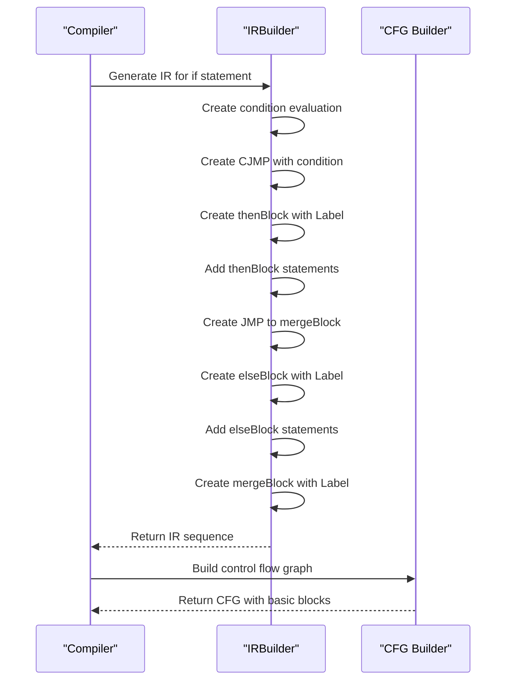
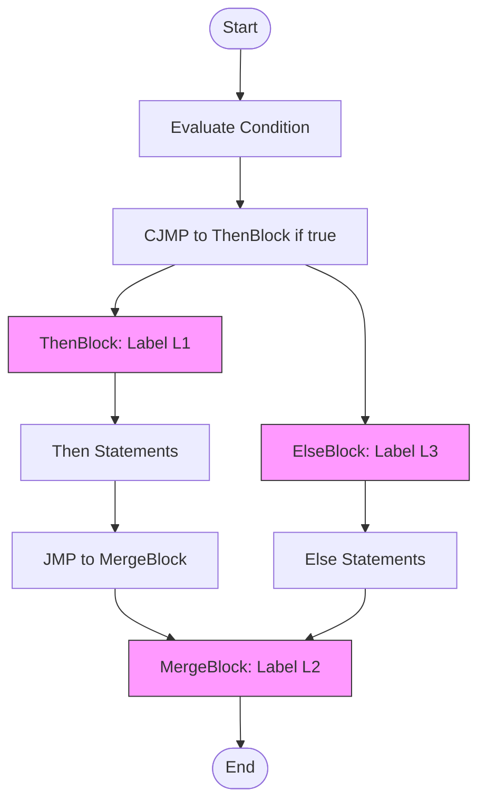

# IR Statements and Control Flow Instructions

<cite>
**Referenced Files in This Document**   
- [Stmt.java](file://ep20/src/main/java/org/teachfx/antlr4/ep20/ir/stmt/Stmt.java)
- [Assign.java](file://ep20/src/main/java/org/teachfx/antlr4/ep20/ir/stmt/Assign.java)
- [JMP.java](file://ep20/src/main/java/org/teachfx/antlr4/ep20/ir/stmt/JMP.java)
- [CJMP.java](file://ep20/src/main/java/org/teachfx/antlr4/ep20/ir/stmt/CJMP.java)
- [Label.java](file://ep20/src/main/java/org/teachfx/antlr4/ep20/ir/stmt/Label.java)
- [FuncEntryLabel.java](file://ep20/src/main/java/org/teachfx/antlr4/ep20/ir/stmt/FuncEntryLabel.java)
- [ReturnVal.java](file://ep20/src/main/java/org/teachfx/antlr4/ep20/ir/stmt/ReturnVal.java)
- [ExprStmt.java](file://ep20/src/main/java/org/teachfx/antlr4/ep20/ir/stmt/ExprStmt.java)
- [JMPInstr.java](file://ep20/src/main/java/org/teachfx/antlr4/ep20/ir/JMPInstr.java)
</cite>

## Table of Contents
1. [Introduction](#introduction)
2. [Stmt Class Hierarchy](#stmt-class-hierarchy)
3. [Assignment Statements](#assignment-statements)
4. [Control Flow Instructions](#control-flow-instructions)
5. [Function Entry and Return Instructions](#function-entry-and-return-instructions)
6. [Expression Statements](#expression-statements)
7. [JMPInstr Utility Interface](#jmpinstr-utility-interface)
8. [Translation of High-Level Control Structures](#translation-of-high-level-control-structures)
9. [Basic Block Formation](#basic-block-formation)
10. [Conclusion](#conclusion)

## Introduction
This document provides a comprehensive analysis of the Intermediate Representation (IR) statements and control flow instructions in the compiler implementation. The IR layer serves as a crucial abstraction between the high-level source code and the target machine code, enabling various optimizations and transformations. The focus is on the Stmt class hierarchy and its role in representing executable operations, with particular attention to assignment statements, control flow instructions, function entry points, return instructions, and expression statements.

**Section sources**
- [Stmt.java](file://ep20/src/main/java/org/teachfx/antlr4/ep20/ir/stmt/Stmt.java#L5-L18)

## Stmt Class Hierarchy
The Stmt class serves as the abstract base class for all IR statements, providing a common interface for statement processing and type identification. It defines an enumeration StmtType that categorizes different types of statements, including JMP, CJMP, ASSIGN, LABEL, RETURN, and EXPR. The class implements the visitor pattern through the accept method, allowing for flexible processing of statements by different visitors. Each concrete statement class must implement the getStmtType method to specify its type.

```mermaid
classDiagram
class Stmt {
<<abstract>>
+enum StmtType { JMP, CJMP, ASSIGN, LABEL, RETURN, EXPR }
+accept(visitor) S
+getStmtType() StmtType
}
Stmt <|-- Assign
Stmt <|-- JMP
Stmt <|-- CJMP
Stmt <|-- Label
Stmt <|-- FuncEntryLabel
Stmt <|-- ReturnVal
Stmt <|-- ExprStmt
class Assign {
+getLhs() VarSlot
+getRhs() Operand
+setLhs(lhs) void
+setRhs(rhs) void
+toString() String
}
class JMP {
+getNext() LinearIRBlock
+setNext(block) void
+toString() String
}
class CJMP {
+getCond() VarSlot
+getThenBlock() LinearIRBlock
+getElseBlock() LinearIRBlock
+setThenBlock(block) void
+setElseBlock(block) void
+toString() String
}
class Label {
+getRawLabel() String
+getScope() Scope
+getSeq() int
+toSource() String
+toString() String
}
class FuncEntryLabel {
+FuncEntryLabel(funcName, args, locals, scope)
+toSource() String
+toString() String
}
class ReturnVal {
+getRetVal() VarSlot
+setRetVal(val) void
+isMainEntry() boolean
+setMainEntry(main) void
+toString() String
}
class ExprStmt {
+getExpr() VarSlot
+setExpr(expr) void
+toString() String
}
```

**Diagram sources**
- [Stmt.java](file://ep20/src/main/java/org/teachfx/antlr4/ep20/ir/stmt/Stmt.java#L5-L18)
- [Assign.java](file://ep20/src/main/java/org/teachfx/antlr4/ep20/ir/stmt/Assign.java#L6-L64)
- [JMP.java](file://ep20/src/main/java/org/teachfx/antlr4/ep20/ir/stmt/JMP.java#L7-L44)
- [CJMP.java](file://ep20/src/main/java/org/teachfx/antlr4/ep20/ir/stmt/CJMP.java#L8-L59)
- [Label.java](file://ep20/src/main/java/org/teachfx/antlr4/ep20/ir/stmt/Label.java#L8-L112)
- [FuncEntryLabel.java](file://ep20/src/main/java/org/teachfx/antlr4/ep20/ir/stmt/FuncEntryLabel.java#L4-L20)
- [ReturnVal.java](file://ep20/src/main/java/org/teachfx/antlr4/ep20/ir/stmt/ReturnVal.java#L9-L55)
- [ExprStmt.java](file://ep20/src/main/java/org/teachfx/antlr4/ep20/ir/stmt/ExprStmt.java#L5-L35)

**Section sources**
- [Stmt.java](file://ep20/src/main/java/org/teachfx/antlr4/ep20/ir/stmt/Stmt.java#L5-L18)

## Assignment Statements
The Assign class represents assignment operations in the IR, where a value is assigned to a variable. It contains two operands: lhs (left-hand side) representing the destination variable (VarSlot), and rhs (right-hand side) representing the source value (Operand). The class provides static factory methods with that simplify the creation of assignment statements. The toString method formats the assignment as "lhs = rhs", providing a human-readable representation. The accept method enables visitor pattern processing, while getStmtType returns StmtType.ASSIGN to identify the statement type.

**Section sources**
- [Assign.java](file://ep20/src/main/java/org/teachfx/antlr4/ep20/ir/stmt/Assign.java#L6-L64)

## Control Flow Instructions
Control flow instructions manage the execution flow in the IR. The JMP class represents unconditional jumps, containing a reference to the target LinearIRBlock. The CJMP class represents conditional jumps, containing a condition variable (cond) and references to both then and else target blocks. The Label class serves as a marker for basic block boundaries, containing a raw label name and scope information. These instructions work together to implement branching and looping constructs from high-level code.



**Diagram sources**
- [JMP.java](file://ep20/src/main/java/org/teachfx/antlr4/ep20/ir/stmt/JMP.java#L7-L44)
- [CJMP.java](file://ep20/src/main/java/org/teachfx/antlr4/ep20/ir/stmt/CJMP.java#L8-L59)
- [Label.java](file://ep20/src/main/java/org/teachfx/antlr4/ep20/ir/stmt/Label.java#L8-L112)

**Section sources**
- [JMP.java](file://ep20/src/main/java/org/teachfx/antlr4/ep20/ir/stmt/JMP.java#L7-L44)
- [CJMP.java](file://ep20/src/main/java/org/teachfx/antlr4/ep20/ir/stmt/CJMP.java#L8-L59)
- [Label.java](file://ep20/src/main/java/org/teachfx/antlr4/ep20/ir/stmt/Label.java#L8-L112)

## Function Entry and Return Instructions
Function entry points are marked by the FuncEntryLabel class, which extends Label and provides metadata about the function, including its name, number of arguments, and number of local variables. The ReturnVal class represents return statements, containing a reference to the return value (retVal) and a label for the return function (retFuncLabel). The isMainEntry flag distinguishes between regular function returns and the main function exit, which uses "halt" instead of "ret" in the generated output.

**Section sources**
- [FuncEntryLabel.java](file://ep20/src/main/java/org/teachfx/antlr4/ep20/ir/stmt/FuncEntryLabel.java#L4-L20)
- [ReturnVal.java](file://ep20/src/main/java/org/teachfx/antlr4/ep20/ir/stmt/ReturnVal.java#L9-L55)

## Expression Statements
The ExprStmt class handles expression statements that have side effects but do not produce a value for assignment. It wraps a single VarSlot representing the expression to be evaluated. This is particularly useful for function calls and other expressions that modify state but whose return values are not used. The class implements the standard Stmt interface, allowing it to be processed uniformly with other statement types.

**Section sources**
- [ExprStmt.java](file://ep20/src/main/java/org/teachfx/antlr4/ep20/ir/stmt/ExprStmt.java#L5-L35)

## JMPInstr Utility Interface
The JMPInstr interface provides a common contract for jump instructions, defining the getTarget method that returns the target label of the jump. Both JMP and CJMP classes implement this interface, enabling uniform handling of jump targets in control flow analysis and optimization passes. This abstraction simplifies the implementation of algorithms that need to work with jump instructions without knowing their specific type.

**Section sources**
- [JMPInstr.java](file://ep20/src/main/java/org/teachfx/antlr4/ep20/ir/JMPInstr.java#L4-L6)

## Translation of High-Level Control Structures
High-level control structures such as if and while statements are translated into sequences of IR statements. An if statement becomes a CJMP followed by two basic blocks (then and else) connected by JMP instructions to a merge block. A while loop becomes a CJMP at the end of the loop body that jumps back to the loop header if the condition is true, with the loop exit path leading to the code after the loop. This translation preserves the semantics of the original code while enabling optimization at the IR level.



**Diagram sources**
- [CJMP.java](file://ep20/src/main/java/org/teachfx/antlr4/ep20/ir/stmt/CJMP.java#L8-L59)
- [JMP.java](file://ep20/src/main/java/org/teachfx/antlr4/ep20/ir/stmt/JMP.java#L7-L44)
- [Label.java](file://ep20/src/main/java/org/teachfx/antlr4/ep20/ir/stmt/Label.java#L8-L112)

## Basic Block Formation
Basic blocks are formed by grouping IR statements between labels and jump instructions. The CFG (Control Flow Graph) class manages the collection of basic blocks and their connections. Each basic block contains a sequence of IR statements that are executed sequentially, with control flow entering at the beginning and exiting at the end. The formation of basic blocks is essential for control flow analysis, optimization, and code generation, as it provides a structured representation of the program's execution paths.

**Section sources**
- [CFG.java](file://ep20/src/main/java/org/teachfx/antlr4/ep20/pass/cfg/CFG.java#L17-L157)

## Conclusion
The IR statement hierarchy and control flow instructions provide a robust foundation for compiler implementation. The Stmt class and its subclasses enable the representation of all executable operations in a uniform manner, while the control flow instructions facilitate the translation of high-level constructs into executable sequences. The integration of these components into basic blocks and control flow graphs enables sophisticated analysis and optimization, ultimately leading to efficient target code generation.