# Label and Function Entry Instructions

<cite>
**Referenced Files in This Document**   
- [Label.java](file://ep20/src/main/java/org/teachfx/antlr4/ep20/ir/stmt/Label.java)
- [FuncEntryLabel.java](file://ep20/src/main/java/org/teachfx/antlr4/ep20/ir/stmt/FuncEntryLabel.java)
- [CymbolIRBuilder.java](file://ep20/src/main/java/org/teachfx/antlr4/ep20/pass/ir/CymbolIRBuilder.java)
- [LinearIRBlock.java](file://ep20/src/main/java/org/teachfx/antlr4/ep20/pass/cfg/LinearIRBlock.java)
- [BasicBlock.java](file://ep20/src/main/java/org/teachfx/antlr4/ep20/pass/cfg/BasicBlock.java)
- [JMP.java](file://ep20/src/main/java/org/teachfx/antlr4/ep20/ir/stmt/JMP.java)
- [CJMP.java](file://ep20/src/main/java/org/teachfx/antlr4/ep20/ir/stmt/CJMP.java)
- [CFGBuilder.java](file://ep20/src/main/java/org/teachfx/antlr4/ep20/pass/cfg/CFGBuilder.java)
</cite>

## Table of Contents
1. [Introduction](#introduction)
2. [Label Statements and Control Flow](#label-statements-and-control-flow)
3. [Function Entry Label Specialization](#function-entry-label-specialization)
4. [IR Construction from High-Level Constructs](#ir-construction-from-high-level-constructs)
5. [Label Usage Examples](#label-usage-examples)
6. [Basic Block Identification and Control Flow Analysis](#basic-block-identification-and-control-flow-analysis)
7. [Conclusion](#conclusion)

## Introduction
This document provides a comprehensive analysis of Label and FuncEntryLabel intermediate representation (IR) statements that represent control flow destinations in a compiler implementation. The documentation explains how Label statements mark basic block boundaries and serve as jump targets for JMP and CJMP instructions. It details the specialized FuncEntryLabel that marks function entry points with additional metadata about function parameters and local variables. The document describes the process of label generation during IR construction from high-level language constructs and how labels enable structured control flow. Examples illustrate label usage in function prologues, loop bodies, and exception handling blocks. The role of labels in basic block identification and control flow analysis is also thoroughly explained.

## Label Statements and Control Flow

Label statements serve as fundamental control flow destinations in the intermediate representation, marking the boundaries of basic blocks and providing targets for jump instructions. The `Label` class extends the base `Stmt` class and implements `Comparable<Label>`, allowing labels to be ordered and compared based on their sequence numbers.

Labels are created in multiple ways: with a specific raw label name and scope, with a scope and explicit sequence number, or with just a scope (which automatically assigns the next available sequence number from the scope). When no raw label is provided, the label is generated using the scope name and sequence number in the format "scopeName_seq".

Labels function as jump targets for both unconditional jumps (JMP) and conditional jumps (CJMP). The `Label` class maintains a reference to the next entry statement, which enables traversal through consecutive labels without intervening instructions. The `fetchNextJumpEntry()` method recursively navigates through chains of labels to find the actual non-label instruction that follows, which is essential for control flow analysis.

In the control flow graph (CFG), labels serve as the entry points to basic blocks. Each `LinearIRBlock` contains a sequence of IR instructions and maintains a reference to its label, which is typically the first instruction in the block. This relationship between labels and basic blocks is crucial for structuring the program's control flow.

```mermaid
flowchart TD
Start["Label Creation"] --> Method1["Label(String rawLabel, Scope scope)"]
Start --> Method2["Label(Scope scope, Integer ord)"]
Start --> Method3["Label(Scope scope)"]
Method1 --> |Raw label provided| AssignRaw["Set rawLabel directly"]
Method2 --> |Explicit sequence| FormatLabel["Format as L{seq}"]
Method3 --> |Auto-sequence| GetFromScope["Get sequence from scope"]
AssignRaw --> Store["Store label and scope"]
FormatLabel --> Store
GetFromScope --> Store
Store --> Return["Return Label instance"]
Return --> Usage["Label Usage"]
Usage --> JumpTarget["Serve as JMP/CJMP target"]
Usage --> BlockBoundary["Mark basic block boundary"]
Usage --> CFGNode["Represent node in CFG"]
```



**Diagram sources**
- [Label.java](file://ep20/src/main/java/org/teachfx/antlr4/ep20/ir/stmt/Label.java#L8-L112)
- [LinearIRBlock.java](file://ep20/src/main/java/org/teachfx/antlr4/ep20/pass/cfg/LinearIRBlock.java#L100-L120)

**Section sources**
- [Label.java](file://ep20/src/main/java/org/teachfx/antlr4/ep20/ir/stmt/Label.java#L8-L112)
- [LinearIRBlock.java](file://ep20/src/main/java/org/teachfx/antlr4/ep20/pass/cfg/LinearIRBlock.java#L100-L120)

## Function Entry Label Specialization

The `FuncEntryLabel` class extends the base `Label` class to provide specialized functionality for marking function entry points in the intermediate representation. This specialization includes additional metadata about the function's parameters and local variables, which is critical for function prologue generation and stack frame management.

When a `FuncEntryLabel` is created, it takes the function name, number of arguments, number of local variables, and the associated scope as parameters. The constructor formats this information into a descriptive string in the format ".def functionName: args=N, locals=M", which serves as the raw label. This format provides immediate visibility into the function's signature and resource requirements directly in the IR.

Unlike regular labels, `FuncEntryLabel` overrides the `toSource()` and `toString()` methods to return the raw label directly rather than potentially generating a different label format based on the scope and sequence number. This ensures that the function metadata remains visible and consistent throughout the compilation process.

The specialized nature of `FuncEntryLabel` makes it easily distinguishable from regular labels during code generation and optimization phases. This distinction allows the compiler to apply function-specific optimizations and generate appropriate prologue and epilogue code for each function.

```mermaid
classDiagram
class Label {
+String rawLabel
+Scope scope
+int seq
+Label(String, Scope)
+Label(Scope, Integer)
+Label(Scope)
+toSource() String
+getRawLabel() String
+getScope() Scope
+getSeq() int
}
class FuncEntryLabel {
+FuncEntryLabel(String, int, int, Scope)
+toSource() String
+toString() String
}
Label <|-- FuncEntryLabel : "extends"
note right of FuncEntryLabel
Specialized label for function entry points
Contains metadata about function parameters
and local variables in format :
.def functionName : args=N, locals=M
end note
```

**Diagram sources**
- [Label.java](file://ep20/src/main/java/org/teachfx/antlr4/ep20/ir/stmt/Label.java#L8-L112)
- [FuncEntryLabel.java](file://ep20/src/main/java/org/teachfx/antlr4/ep20/ir/stmt/FuncEntryLabel.java#L4-L20)

**Section sources**
- [FuncEntryLabel.java](file://ep20/src/main/java/org/teachfx/antlr4/ep20/ir/stmt/FuncEntryLabel.java#L4-L20)
- [Label.java](file://ep20/src/main/java/org/teachfx/antlr4/ep20/ir/stmt/Label.java#L8-L112)

## IR Construction from High-Level Constructs

The process of generating intermediate representation from high-level language constructs involves systematic label creation and placement to represent the program's control flow structure. The `CymbolIRBuilder` class implements the `ASTVisitor` interface to traverse the abstract syntax tree and generate corresponding IR instructions, including appropriate labels for control flow destinations.

During function declaration processing, the IR builder creates a `FuncEntryLabel` with metadata about the function's parameters and local variables. This label is added to the beginning of the function's entry block, marking the function's entry point in the IR. The builder maintains a current block pointer that tracks where new instructions should be added.

For control flow constructs like loops and conditionals, the IR builder creates labels for each control flow destination. In a while loop, for example, labels are created for the condition check block, the loop body block, and the loop exit block. The builder uses the `jump()` and `jumpIf()` methods to create JMP and CJMP instructions that reference these labeled blocks.

The IR construction process carefully manages the control flow by maintaining stacks for break and continue statements, allowing proper targeting of loop exit and continuation points. When a break statement is encountered, it generates a jump to the top of the break stack, which contains the label for the loop's exit block.


**Diagram sources**
- [CymbolIRBuilder.java](file://ep20/src/main/java/org/teachfx/antlr4/ep20/pass/ir/CymbolIRBuilder.java#L100-L473)
- [FuncEntryLabel.java](file://ep20/src/main/java/org/teachfx/antlr4/ep20/ir/stmt/FuncEntryLabel.java#L4-L20)

**Section sources**
- [CymbolIRBuilder.java](file://ep20/src/main/java/org/teachfx/antlr4/ep20/pass/ir/CymbolIRBuilder.java#L100-L473)
- [LinearIRBlock.java](file://ep20/src/main/java/org/teachfx/antlr4/ep20/pass/cfg/LinearIRBlock.java#L50-L80)

## Label Usage Examples

Labels play critical roles in various program constructs, serving as control flow destinations in function prologues, loop bodies, and conditional statements. In function prologues, the `FuncEntryLabel` marks the entry point with metadata about the function's parameters and local variables, enabling proper stack frame setup.

In loop constructs, labels define the structure of the loop's control flow. For a while loop, a condition label marks the beginning of the condition evaluation, a body label marks the start of the loop body, and an exit label marks where control transfers when the loop condition fails. The CJMP instruction at the end of the condition block branches to either the body label (if the condition is true) or the exit label (if the condition is false).

For conditional statements like if-else constructs, labels define the branches of the conditional logic. The condition evaluation block ends with a CJMP that branches to either the "then" block label or the "else" block label (or directly to the exit label if there is no else branch). This labeling pattern creates a clear control flow structure that can be easily analyzed and optimized.

The use of labels in exception handling follows a similar pattern, where try blocks are followed by labels that mark exception handler entry points. This allows the runtime system to transfer control directly to the appropriate handler label when an exception occurs.


**Diagram sources**
- [CymbolIRBuilder.java](file://ep20/src/main/java/org/teachfx/antlr4/ep20/pass/ir/CymbolIRBuilder.java#L300-L350)
- [LinearIRBlock.java](file://ep20/src/main/java/org/teachfx/antlr4/ep20/pass/cfg/LinearIRBlock.java#L100-L120)

**Section sources**
- [CymbolIRBuilder.java](file://ep20/src/main/java/org/teachfx/antlr4/ep20/pass/ir/CymbolIRBuilder.java#L300-L350)
- [JMP.java](file://ep20/src/main/java/org/teachfx/antlr4/ep20/ir/stmt/JMP.java#L10-L45)
- [CJMP.java](file://ep20/src/main/java/org/teachfx/antlr4/ep20/ir/stmt/CJMP.java#L10-L60)

## Basic Block Identification and Control Flow Analysis

Labels are fundamental to basic block identification and control flow analysis in the intermediate representation. A basic block is a sequence of instructions with a single entry point (marked by a label) and a single exit point, with no internal branches. The presence of labels determines the boundaries of these basic blocks.

The `BasicBlock` class represents a basic block in the control flow graph and contains a reference to its entry label. During CFG construction, the `CFGBuilder` analyzes the `LinearIRBlock` instances and uses the labels to establish the graph structure. Each basic block's label serves as its identifier in the control flow graph.

Control flow analysis relies heavily on labels to trace the possible execution paths through the program. The `getJumpEntries()` method in `LinearIRBlock` returns the target blocks for jump instructions, which are identified by their labels. For a CJMP instruction, this includes both the "then" and "else" target blocks, while for a JMP instruction, it includes the single target block.

The control flow graph builder processes each linear IR block and establishes edges between blocks based on the jump instructions they contain. When a JMP instruction is encountered, an edge is created from the current block to the target block specified by the jump. For CJMP instructions, edges are created to both the "then" and "else" target blocks, representing the two possible execution paths.

This analysis enables various compiler optimizations, such as dead code elimination, loop optimization, and register allocation, by providing a complete picture of the program's control flow structure.


**Diagram sources**
- [CFGBuilder.java](file://ep20/src/main/java/org/teachfx/antlr4/ep20/pass/cfg/CFGBuilder.java#L0-L63)
- [BasicBlock.java](file://ep20/src/main/java/org/teachfx/antlr4/ep20/pass/cfg/BasicBlock.java#L0-L130)
- [LinearIRBlock.java](file://ep20/src/main/java/org/teachfx/antlr4/ep20/pass/cfg/LinearIRBlock.java#L150-L200)

**Section sources**
- [CFGBuilder.java](file://ep20/src/main/java/org/teachfx/antlr4/ep20/pass/cfg/CFGBuilder.java#L0-L63)
- [BasicBlock.java](file://ep20/src/main/java/org/teachfx/antlr4/ep20/pass/cfg/BasicBlock.java#L0-L130)
- [LinearIRBlock.java](file://ep20/src/main/java/org/teachfx/antlr4/ep20/pass/cfg/LinearIRBlock.java#L150-L200)

## Conclusion
Labels and function entry labels are essential components of the intermediate representation that enable structured control flow in compiled programs. The `Label` class provides the foundation for marking basic block boundaries and serving as jump targets for JMP and CJMP instructions, while the specialized `FuncEntryLabel` extends this functionality to include metadata about function parameters and local variables at function entry points.

The IR construction process systematically generates labels from high-level language constructs, creating a clear control flow structure that supports optimization and code generation. Labels are used extensively in function prologues, loop bodies, and conditional statements to define the program's execution paths.

In control flow analysis, labels play a critical role in basic block identification and control flow graph construction. The relationship between labels and basic blocks enables comprehensive analysis of the program's structure, supporting various compiler optimizations. The implementation demonstrates a well-designed approach to representing control flow in intermediate representation, balancing expressiveness with efficiency.

The design patterns observed in this implementation provide valuable insights into compiler construction, particularly in the areas of intermediate representation, control flow management, and program analysis.