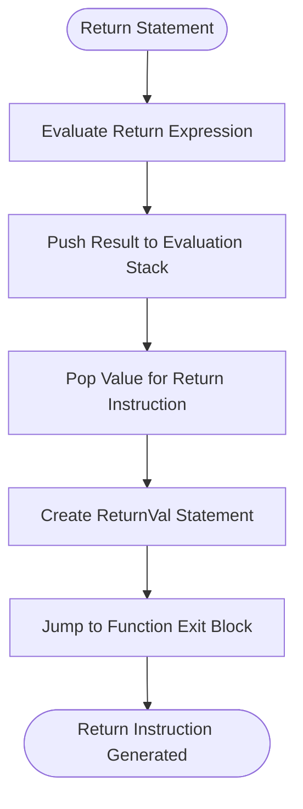

# Return Instructions

<cite>
**Referenced Files in This Document**   
- [ReturnVal.java](file://ep20/src/main/java/org/teachfx/antlr4/ep20/ir/stmt/ReturnVal.java)
- [CymbolIRBuilder.java](file://ep20/src/main/java/org/teachfx/antlr4/ep20/pass/ir/CymbolIRBuilder.java)
- [ReturnStmtNode.java](file://ep20/src/main/java/org/teachfx/antlr4/ep20/ast/stmt/ReturnStmtNode.java)
- [VarSlot.java](file://ep20/src/main/java/org/teachfx/antlr4/ep20/ir/expr/VarSlot.java)
- [Stmt.java](file://ep20/src/main/java/org/teachfx/antlr4/ep20/ir/stmt/Stmt.java)
</cite>

## Table of Contents
1. [Introduction](#introduction)
2. [ReturnVal IR Statement Structure](#returnval-ir-statement-structure)
3. [Value Field and Return Expression Handling](#value-field-and-return-expression-handling)
4. [Void vs Value-Returning Functions](#void-vs-value-returning-functions)
5. [Return Statement Generation Process](#return-statement-generation-process)
6. [Return Expression Translation to IR](#return-expression-translation-to-ir)
7. [Control Flow Integration](#control-flow-integration)
8. [Function Epilogue Role](#function-epilogue-role)
9. [Stack Management Interaction](#stack-management-interaction)
10. [Examples of ReturnVal Usage](#examples-of-returnval-usage)

## Introduction
The ReturnVal instruction represents function return operations in the intermediate representation (IR) of the Cymbol compiler. This document details the implementation and behavior of the ReturnVal statement, which serves as a critical component in the function termination process. The instruction handles both value-returning and void functions, managing the return value field and coordinating with the virtual machine's stack management system. The ReturnVal statement is generated from source code return statements and plays a vital role in function epilogues, ensuring proper control flow transfer and stack state maintenance.

## ReturnVal IR Statement Structure
The ReturnVal class extends the Stmt base class and implements the core functionality for representing return operations in the IR. It contains several key fields that manage the return process:

- **retFuncLabel**: A Label object that marks the return point in the function
- **retVal**: A VarSlot reference containing the return expression value
- **isMainEntry**: A boolean flag indicating if this is the main function entry point

The constructor initializes the return label with the function's scope and establishes the connection between the label and the return statement. The class implements the visitor pattern through the accept method, allowing traversal by IR visitors, and identifies its statement type as RETURN through the getStmtType method.

**Section sources**
- [ReturnVal.java](file://ep20/src/main/java/org/teachfx/antlr4/ep20/ir/stmt/ReturnVal.java#L9-L25)

## Value Field and Return Expression Handling
The value field in the ReturnVal statement, represented by the retVal variable of type VarSlot, contains the return expression from the source code. This field is optional and may be null for void functions or return statements without expressions. When a return statement includes an expression, the IR generator evaluates the expression and stores the result in a temporary VarSlot, which is then assigned to the retVal field.

The getRetVal and setRetVal methods provide access to this value field, allowing other components of the compiler to query or modify the return value reference. The presence of a non-null retVal indicates that the function returns a value, while a null value indicates a void return or empty return statement.

**Section sources**
- [ReturnVal.java](file://ep20/src/main/java/org/teachfx/antlr4/ep20/ir/stmt/ReturnVal.java#L27-L38)

## Void vs Value-Returning Functions
The ReturnVal statement handles both void and value-returning functions through its flexible design. For void functions, the retVal field remains null, and the generated assembly code outputs a simple "ret" instruction. For value-returning functions, the retVal field contains a reference to the computed return value, and the assembly generation includes a "load" instruction to place the return value on the stack before the return operation.

The toString method implements this conditional behavior by checking if retVal is non-null. When a return value exists, it generates a "load" instruction followed by the return value representation, followed by the "ret" instruction. For the main function, the return instruction is rendered as "halt" instead of "ret" to signal program termination.

**Section sources**
- [ReturnVal.java](file://ep20/src/main/java/org/teachfx/antlr4/ep20/ir/stmt/ReturnVal.java#L48-L55)

## Return Statement Generation Process
The generation of ReturnVal statements occurs during the IR construction phase, specifically when processing return statements from the abstract syntax tree (AST). The CymbolIRBuilder visitor processes ReturnStmtNode instances from the AST and converts them into corresponding ReturnVal IR statements.

When encountering a return statement, the IR builder first processes the return expression (if present) by visiting the expression node, which generates the necessary IR instructions to compute the return value. The builder then creates a ReturnVal statement and links it to the function's exit block through a jump instruction. This process ensures that all return statements in a function converge to a single exit point, simplifying control flow analysis and optimization.

**Section sources**
- [CymbolIRBuilder.java](file://ep20/src/main/java/org/teachfx/antlr4/ep20/pass/ir/CymbolIRBuilder.java#L230-L240)
- [ReturnStmtNode.java](file://ep20/src/main/java/org/teachfx/antlr4/ep20/ast/stmt/ReturnStmtNode.java#L9-L15)

## Return Expression Translation to IR
The translation of return expressions into IR follows the standard expression evaluation process. When a return statement contains an expression, the IR builder visits the expression node, which generates the appropriate sequence of IR instructions to compute the expression's value. These instructions may include arithmetic operations, function calls, or memory accesses, depending on the complexity of the expression.

The result of the expression evaluation is stored in the evaluation stack (evalExprStack) within the IR builder. Before creating the ReturnVal statement, the builder pops the computed value from the evaluation stack and uses it to create the return instruction. This ensures that the return value is properly computed and available when the function returns.

**Diagram sources**
- [CymbolIRBuilder.java](file://ep20/src/main/java/org/teachfx/antlr4/ep20/pass/ir/CymbolIRBuilder.java#L230-L240)
- [ReturnVal.java](file://ep20/src/main/java/org/teachfx/antlr4/ep20/ir/stmt/ReturnVal.java#L15-L25)

**Section sources**
- [CymbolIRBuilder.java](file://ep20/src/main/java/org/teachfx/antlr4/ep20/pass/ir/CymbolIRBuilder.java#L230-L240)

## Control Flow Integration
The ReturnVal statement integrates with the function's control flow by serving as the terminal instruction in the function's exit block. During IR generation, all return statements in a function are connected to a common exit block that contains the ReturnVal instruction. This design simplifies control flow analysis and enables optimizations such as dead code elimination.

The IR builder uses jump instructions to transfer control from each return statement location to the exit block. For conditional returns (such as those in if-else statements), the control flow uses conditional jump (CJMP) instructions to determine whether to proceed to the exit block. This approach ensures that all execution paths through the function properly terminate with the return instruction.

**Section sources**
- [CymbolIRBuilder.java](file://ep20/src/main/java/org/teachfx/antlr4/ep20/pass/ir/CymbolIRBuilder.java#L235-L240)

## Function Epilogue Role
The ReturnVal statement plays a crucial role in the function epilogue by marking the final operation before function termination. In the IR representation, it serves as the anchor point for the function's cleanup operations, including stack frame deallocation and register restoration (in more advanced implementations).

The exit block containing the ReturnVal statement is designed to be the single point of function termination, which simplifies exception handling and resource cleanup. When the virtual machine executes the ReturnVal instruction, it triggers the function epilogue sequence, which restores the caller's execution context and transfers control back to the calling function.

**Section sources**
- [ReturnVal.java](file://ep20/src/main/java/org/teachfx/antlr4/ep20/ir/stmt/ReturnVal.java#L15-L25)
- [CymbolIRBuilder.java](file://ep20/src/main/java/org/teachfx/antlr4/ep20/pass/ir/CymbolIRBuilder.java#L100-L120)

## Stack Management Interaction
The ReturnVal statement interacts with the virtual machine's stack management system in several ways. For functions that return values, the return value must be placed on the stack before the return instruction executes, ensuring that the caller can access the returned value. The "load" instruction generated by the toString method accomplishes this by pushing the return value onto the operand stack.

The IR builder maintains an evaluation stack (evalExprStack) during IR generation, which tracks temporary values including return values. When processing a return statement, the builder ensures stack balance by properly managing the push and pop operations associated with the return value. The OperandSlot.popStack() method is called to maintain the stack depth counter, preventing stack underflow or overflow conditions.

**Section sources**
- [ReturnVal.java](file://ep20/src/main/java/org/teachfx/antlr4/ep20/ir/stmt/ReturnVal.java#L48-L55)
- [CymbolIRBuilder.java](file://ep20/src/main/java/org/teachfx/antlr4/ep20/pass/ir/CymbolIRBuilder.java#L380-L395)

## Examples of ReturnVal Usage
The ReturnVal statement is used in various contexts depending on the function's return type and the presence of return expressions. For integer-returning functions, the return value is computed through arithmetic operations and stored in a VarSlot before being assigned to the ReturnVal statement. For void functions, the ReturnVal is created with a null return value, generating only the return instruction without any value loading.

In the main function, the ReturnVal statement is marked with the isMainEntry flag, causing it to generate a "halt" instruction instead of "ret". This distinction ensures proper program termination when the main function completes execution. The flexibility of the ReturnVal design allows it to handle all these cases uniformly while generating the appropriate assembly code for each scenario.

**Section sources**
- [ReturnVal.java](file://ep20/src/main/java/org/teachfx/antlr4/ep20/ir/stmt/ReturnVal.java#L40-L47)
- [CymbolIRBuilder.java](file://ep20/src/main/java/org/teachfx/antlr4/ep20/pass/ir/CymbolIRBuilder.java#L180-L195)