# Unconditional Jump Instructions

<cite>
**Referenced Files in This Document**  
- [JMP.java](file://ep20/src/main/java/org/teachfx/antlr4/ep20/ir/stmt/JMP.java)
- [JMPInstr.java](file://ep20/src/main/java/org/teachfx/antlr4/ep20/ir/JMPInstr.java)
- [Label.java](file://ep20/src/main/java/org/teachfx/antlr4/ep20/ir/stmt/Label.java)
- [BasicBlock.java](file://ep20/src/main/java/org/teachfx/antlr4/ep20/pass/cfg/BasicBlock.java)
- [CFGBuilder.java](file://ep20/src/main/java/org/teachfx/antlr4/ep20/pass/cfg/CFGBuilder.java)
- [CymbolIRBuilder.java](file://ep20/src/main/java/org/teachfx/antlr4/ep20/pass/ir/CymbolIRBuilder.java)
- [ControlFlowAnalysis.java](file://ep20/src/main/java/org/teachfx/antlr4/ep20/pass/cfg/ControlFlowAnalysis.java)
</cite>

## Table of Contents
1. [Introduction](#introduction)
2. [JMP IR Statement Overview](#jmp-ir-statement-overview)
3. [Target Field and Label Reference](#target-field-and-label-reference)
4. [JMPInstr Utility Class](#jmpinstr-utility-class)
5. [Control Flow Constructs Using JMP](#control-flow-constructs-using-jmp)
6. [Basic Block Chaining Mechanism](#basic-block-chaining-mechanism)
7. [Usage Examples](#usage-examples)
8. [Role in Control Flow Graph Construction](#role-in-control-flow-graph-construction)
9. [Optimization Techniques: Jump Threading](#optimization-techniques-jump-threading)
10. [Conclusion](#conclusion)

## Introduction
The JMP instruction in the Intermediate Representation (IR) layer of the compiler serves as the fundamental mechanism for implementing unconditional control flow transfers. This document provides a comprehensive analysis of the JMP statement, its integration with label-based control flow, and its role in enabling structured program execution, basic block chaining, and optimization. The analysis is based on the implementation found in the ep20 compiler project, which demonstrates a robust approach to control flow management in a modern compiler pipeline.

## JMP IR Statement Overview
The JMP instruction represents an unconditional branch in the IR, transferring execution control directly to a target label without any condition evaluation. It is a key component in the compiler's intermediate representation system, enabling the translation of high-level control structures into linear sequences of instructions that can be further processed during code generation and optimization.


**Diagram sources**  
- [JMP.java](file://ep20/src/main/java/org/teachfx/antlr4/ep20/ir/stmt/JMP.java#L1-L30)
- [Label.java](file://ep20/src/main/java/org/teachfx/antlr4/ep20/ir/stmt/Label.java#L1-L25)

**Section sources**  
- [JMP.java](file://ep20/src/main/java/org/teachfx/antlr4/ep20/ir/stmt/JMP.java#L1-L50)

## Target Field and Label Reference
The JMP instruction contains a target field that holds a reference to a Label statement, establishing a direct link between the jump source and destination. This target field is implemented as a strong reference to a Label object, ensuring that the control flow destination is explicitly defined and type-safe within the IR system. The Label class encapsulates a symbolic name that uniquely identifies a position in the instruction stream, allowing multiple JMP instructions to target the same location.

This reference mechanism enables the compiler to maintain a clear mapping between jump instructions and their destinations during various compilation phases, including control flow analysis, optimization, and code generation. The label-based approach abstracts away physical memory addresses during IR construction, allowing for flexible instruction reordering and optimization before final code emission.

**Section sources**  
- [JMP.java](file://ep20/src/main/java/org/teachfx/antlr4/ep20/ir/stmt/JMP.java#L15-L40)
- [Label.java](file://ep20/src/main/java/org/teachfx/antlr4/ep20/ir/stmt/Label.java#L10-L30)

## JMPInstr Utility Class
The JMPInstr utility class provides static helper methods for creating, manipulating, and resolving jump instructions within the compiler's intermediate representation. This class serves as a factory and utility interface for JMP operations, encapsulating common patterns and reducing code duplication across different compiler passes.

Key functionalities provided by JMPInstr include:
- Factory methods for creating JMP instructions with specified targets
- Utilities for jump target resolution and validation
- Helper methods for jump instruction analysis and transformation
- Integration with the broader IR manipulation framework

The utility class abstracts low-level details of jump instruction construction, allowing other compiler components to work with high-level operations rather than manipulating IR nodes directly. This promotes consistency and reduces the potential for errors in jump instruction handling across different phases of compilation.


**Diagram sources**  
- [JMPInstr.java](file://ep20/src/main/java/org/teachfx/antlr4/ep20/ir/JMPInstr.java#L1-L40)

**Section sources**  
- [JMPInstr.java](file://ep20/src/main/java/org/teachfx/antlr4/ep20/ir/JMPInstr.java#L1-L60)

## Control Flow Constructs Using JMP
JMP statements serve as the foundation for implementing various control flow constructs in the compiled code. By strategically placing JMP instructions and labels, the compiler can represent complex control structures using simple unconditional branches.

### Unconditional Branches
The most direct use of JMP is for implementing goto-like unconditional branches, where execution transfers immediately to a labeled section of code without any condition evaluation.

### Loop Continuations
In while and for loops, JMP instructions are used to create the backward branch that returns control to the loop condition at the end of each iteration. This forms the loop back-edge in the control flow graph.

### Switch Statements
Switch constructs are typically lowered into a series of conditional jumps (CJMP) followed by unconditional JMP instructions that transfer control to the appropriate case block. The default case is often reached via an unconditional JMP after all conditions have been evaluated.

These constructs demonstrate how high-level language features are systematically decomposed into primitive control flow operations during IR generation, with JMP serving as the workhorse for unconditional transfers.

**Section sources**  
- [CymbolIRBuilder.java](file://ep20/src/main/java/org/teachfx/antlr4/ep20/pass/ir/CymbolIRBuilder.java#L100-L300)
- [ControlFlowAnalysis.java](file://ep20/src/main/java/org/teachfx/antlr4/ep20/pass/cfg/ControlFlowAnalysis.java#L50-L150)

## Basic Block Chaining Mechanism
JMP instructions play a crucial role in the basic block chaining mechanism, which is fundamental to control flow graph construction. A basic block is a sequence of instructions with a single entry point and a single exit point, and JMP statements are used to connect these blocks in the control flow graph.

When the CFGBuilder processes the linear IR stream, it uses JMP instructions to establish edges between basic blocks. Each JMP creates a control flow edge from the current block to the block containing its target label. This chaining mechanism allows the compiler to reconstruct the program's control flow structure from the linear instruction sequence.

The basic block chaining process involves:
1. Identifying block boundaries based on labels and control flow instructions
2. Creating CFG nodes for each basic block
3. Using JMP instructions to establish directed edges between blocks
4. Building a complete graph representation of program flow

This structured representation enables subsequent optimization passes to analyze and transform the program's control flow efficiently.


**Diagram sources**  
- [BasicBlock.java](file://ep20/src/main/java/org/teachfx/antlr4/ep20/pass/cfg/BasicBlock.java#L1-L50)
- [CFGBuilder.java](file://ep20/src/main/java/org/teachfx/antlr4/ep20/pass/cfg/CFGBuilder.java#L20-L80)

**Section sources**  
- [BasicBlock.java](file://ep20/src/main/java/org/teachfx/antlr4/ep20/pass/cfg/BasicBlock.java#L1-L100)
- [CFGBuilder.java](file://ep20/src/main/java/org/teachfx/antlr4/ep20/pass/cfg/CFGBuilder.java#L1-L150)

## Usage Examples

### While Loop Implementation
In a while loop, the JMP instruction creates the backward branch that forms the loop structure. After executing the loop body, an unconditional JMP transfers control back to the loop condition check, creating the iterative behavior.

```mermaid
sequenceDiagram
participant Condition as "Condition Check"
participant Body as "Loop Body"
participant Jump as "JMP Instruction"
Condition->>Condition : Evaluate condition
Condition-->>Body : True → Enter loop
Body->>Body : Execute loop statements
Body->>Jump : Execute JMP
Jump->>Condition : Transfer to condition
Note over Condition,Jump : Loop continues until condition false
```



**Diagram sources**  
- [CymbolIRBuilder.java](file://ep20/src/main/java/org/teachfx/antlr4/ep20/pass/ir/CymbolIRBuilder.java#L200-L250)

### Function Epilogue
In function epilogues, JMP instructions are used to implement early returns and exception handling paths. When a return statement is encountered, a JMP transfers control to the function's exit block, where cleanup code and the actual return instruction are located.

This pattern allows multiple exit points in a function to converge on a single cleanup and return sequence, reducing code duplication and ensuring consistent resource management.

**Section sources**  
- [CymbolIRBuilder.java](file://ep20/src/main/java/org/teachfx/antlr4/ep20/pass/ir/CymbolIRBuilder.java#L150-L200)

## Role in Control Flow Graph Construction
JMP statements are instrumental in the construction of the Control Flow Graph (CFG), serving as the primary mechanism for establishing edges between basic blocks. During CFG construction, each JMP instruction is processed to create a directed edge from the current block to the target block identified by the label.

The CFGBuilder pass analyzes the linear IR sequence, identifying basic blocks and using JMP instructions to connect them. Unconditional jumps create single outgoing edges from their source blocks, contributing to the graph's structure. This graph representation is essential for subsequent analyses such as liveness analysis, register allocation, and optimization.

The presence of JMP instructions also affects the classification of basic blocks and the determination of dominator relationships within the CFG. Backward JMPs (those that target a previously seen label) identify loop headers and influence the overall control flow structure of the program.

```mermaid
graph TD
A[Entry Block] --> B[Condition Check]
B --> C[Loop Body]
C --> D[Update Statement]
D --> E[JMP to Condition]
E --> B
B --> F[Exit Block]
style A fill:#f0f0f0,stroke:#333
style F fill:#f0f0f0,stroke:#333
style B fill:#e6f3ff,stroke:#333
style C fill:#e6ffe6,stroke:#333
style D fill:#e6ffe6,stroke:#333
style E fill:#ffebcc,stroke:#333
Note over C,D: Loop Body Blocks
Note over E: Unconditional JMP
```

**Diagram sources**  
- [CFGBuilder.java](file://ep20/src/main/java/org/teachfx/antlr4/ep20/pass/cfg/CFGBuilder.java#L30-L100)
- [ControlFlowAnalysis.java](file://ep20/src/main/java/org/teachfx/antlr4/ep20/pass/cfg/ControlFlowAnalysis.java#L1-L40)

**Section sources**  
- [CFGBuilder.java](file://ep20/src/main/java/org/teachfx/antlr4/ep20/pass/cfg/CFGBuilder.java#L1-L200)
- [ControlFlowAnalysis.java](file://ep20/src/main/java/org/teachfx/antlr4/ep20/pass/cfg/ControlFlowAnalysis.java#L1-L200)

## Optimization Techniques: Jump Threading
Jump threading is a key optimization technique that leverages JMP instructions to improve code efficiency by eliminating unnecessary control flow hops. This optimization identifies sequences where a JMP instruction targets another JMP instruction and replaces the original jump with a direct jump to the final destination.

For example, if block A contains a JMP to label L1, and block B (containing L1) contains a JMP to label L2, jump threading can modify block A to jump directly to L2, eliminating the intermediate hop through block B. This reduces execution overhead and can enable further optimizations by simplifying the control flow graph.

The optimization process involves:
1. Analyzing the CFG to identify jump-to-jump patterns
2. Validating that the transformation preserves program semantics
3. Updating the JMP targets to point to the final destination
4. Removing unreachable intermediate blocks when possible

Jump threading can significantly improve performance in code with complex control flow or generated code that contains redundant jumps, making it an important optimization in modern compilers.


**Diagram sources**  
- [ControlFlowAnalysis.java](file://ep20/src/main/java/org/teachfx/antlr4/ep20/pass/cfg/ControlFlowAnalysis.java#L100-L180)
- [IFlowOptimizer.java](file://ep20/src/main/java/org/teachfx/antlr4/ep20/pass/cfg/IFlowOptimizer.java#L1-L50)

**Section sources**  
- [ControlFlowAnalysis.java](file://ep20/src/main/java/org/teachfx/antlr4/ep20/pass/cfg/ControlFlowAnalysis.java#L50-L200)
- [IFlowOptimizer.java](file://ep20/src/main/java/org/teachfx/antlr4/ep20/pass/cfg/IFlowOptimizer.java#L1-L100)

## Conclusion
The JMP instruction is a fundamental component of the compiler's intermediate representation, serving as the primary mechanism for unconditional control flow transfers. Through its target field that references Label statements, JMP enables the construction of complex control structures and facilitates basic block chaining in the control flow graph. The JMPInstr utility class provides essential functionality for managing jump instructions throughout the compilation process.

JMP statements are critical for implementing various control flow constructs, including loops, switch statements, and function exits. They play a central role in CFG construction and enable powerful optimizations like jump threading. The design demonstrated in the ep20 compiler project shows a clean, modular approach to control flow management that balances simplicity with functionality, providing a solid foundation for code generation and optimization.

Understanding the role and implementation of JMP instructions is essential for anyone working with compiler intermediate representations, as they form the backbone of program control flow and influence many aspects of code analysis and transformation.