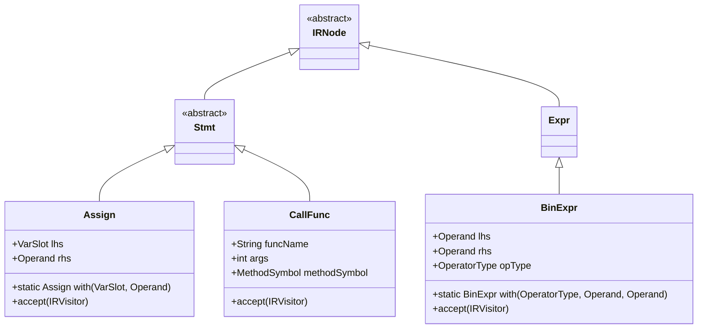
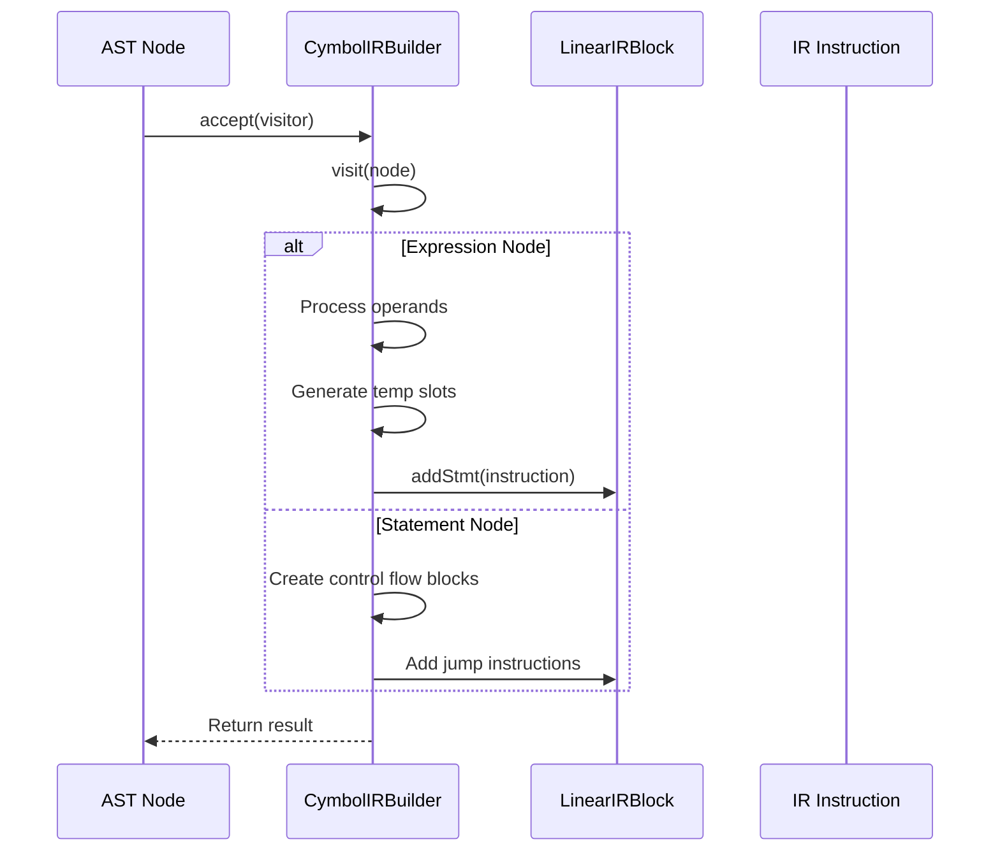
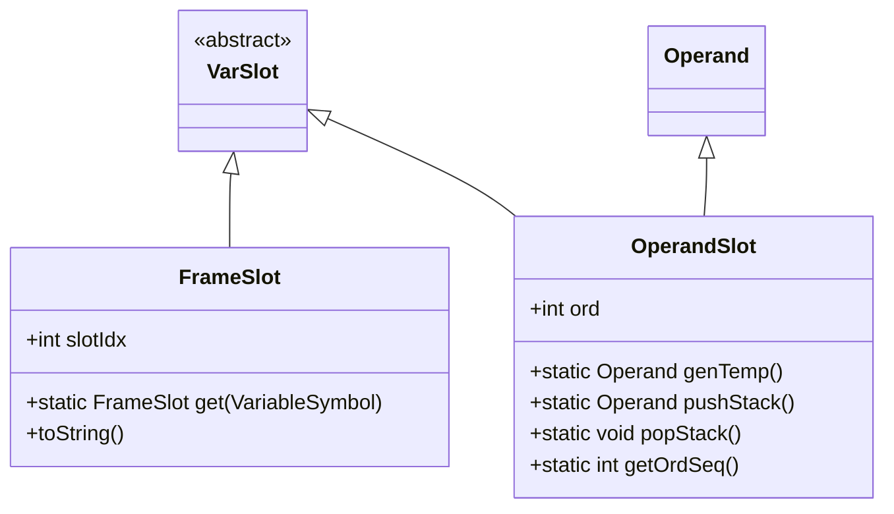

# Intermediate Representation (IR)

<cite>
**Referenced Files in This Document**   
- [IRNode.java](file://ep20\src\main\java\org\teachfx\antlr4\ep20\ir\IRNode.java)
- [CymbolIRBuilder.java](file://ep20\src\main\java\org\teachfx\antlr4\ep20\pass\ir\CymbolIRBuilder.java)
- [VarSlot.java](file://ep20\src\main\java\org\teachfx\antlr4\ep20\ir\expr\VarSlot.java)
- [Assign.java](file://ep20\src\main\java\org\teachfx\antlr4\ep20\ir\stmt\Assign.java)
- [ThreeAddressCodeTest.java](file://ep20\src\test\java\org\teachfx\antlr4\ep20\ir\ThreeAddressCodeTest.java)
- [AddressingTest.java](file://ep20\src\test\java\org\teachfx\antlr4\ep20\ir\expr\addr\AddressingTest.java)
</cite>

## Table of Contents
1. [Introduction](#introduction)
2. [Three-Address Code Format](#three-address-code-format)
3. [IRNode Hierarchy](#irnode-hierarchy)
4. [Instruction Types](#instruction-types)
5. [CymbolIRBuilder: AST to IR Translation](#cymbolirbuilder-ast-to-ir-translation)
6. [IR Examples for Common Constructs](#ir-examples-for-common-constructs)
7. [Basic Blocks and Linear Structure](#basic-blocks-and-linear-structure)
8. [Variable and Temporary Representation](#variable-and-temporary-representation)
9. [Platform-Independent Optimizations](#platform-independent-optimizations)

## Introduction
The Intermediate Representation (IR) system serves as a crucial abstraction layer between the Abstract Syntax Tree (AST) and the final code generation phase. It provides a simplified, linearized form of the program that facilitates optimization and platform-independent code generation. This document details the structure and functionality of the IR system, focusing on its three-address code format, node hierarchy, instruction types, and translation mechanisms.

## Three-Address Code Format
The IR employs a three-address code format, where each instruction typically has at most three operands: two source operands and one destination operand. This format simplifies instruction semantics and enables straightforward optimization passes. Each operation is broken down into elementary steps, making complex expressions easier to analyze and transform. The three-address code format enhances readability and supports efficient data flow analysis, which is essential for optimization.

**Section sources**
- [ThreeAddressCodeTest.java](file://ep20\src\test\java\org\teachfx\antlr4\ep20\ir\ThreeAddressCodeTest.java#L0-L131)

## IRNode Hierarchy
The IRNode class serves as the abstract base class for all IR nodes, establishing a common interface for traversal and processing. Derived classes represent specific IR constructs such as statements, expressions, and control flow instructions. This hierarchical structure enables polymorphic processing through the visitor pattern, allowing different operations to be applied uniformly across the IR tree. The inheritance relationship supports extensibility, making it easy to add new IR node types as needed.

**Diagram sources**
- [IRNode.java](file://ep20\src\main\java\org\teachfx\antlr4\ep20\ir\IRNode.java#L1-L6)
- [Assign.java](file://ep20\src\main\java\org\teachfx\antlr4\ep20\ir\stmt\Assign.java#L1-L65)

## Instruction Types
The IR system defines several instruction types to represent different programming constructs. Arithmetic operations are represented by BinExpr nodes, which encapsulate binary operations like addition and multiplication. Assignments are handled by Assign nodes that specify the target variable and source value. Control flow is managed through CJMP (conditional jump) and JMP (unconditional jump) instructions, while function calls are represented by CallFunc nodes. Return statements are implemented using ReturnVal nodes, completing the set of essential instruction types.

**Section sources**
- [IRNode.java](file://ep20\src\main\java\org\teachfx\antlr4\ep20\ir\IRNode.java#L1-L6)
- [Assign.java](file://ep20\src\main\java\org\teachfx\antlr4\ep20\ir\stmt\Assign.java#L1-L65)

## CymbolIRBuilder: AST to IR Translation
The CymbolIRBuilder class implements the ASTVisitor interface to traverse the AST and generate corresponding IR instructions. It maintains a stack-based evaluation model where intermediate results are stored in temporary slots. During traversal, expression nodes generate IR instructions that are added to the current basic block. The builder handles scoping information and manages control flow constructs by creating appropriate jump instructions and basic blocks. Function declarations initiate new IR generation contexts with proper entry and exit points.

**Diagram sources**
- [CymbolIRBuilder.java](file://ep20\src\main\java\org\teachfx\antlr4\ep20\pass\ir\CymbolIRBuilder.java#L0-L473)

## IR Examples for Common Constructs
For arithmetic expressions, the IR breaks down operations into sequential three-address instructions. For example, the expression `a + b * c` generates instructions to load operands, perform multiplication, and then addition. Assignment statements translate directly to Assign nodes with frame slots for variables and appropriate source operands. Control flow constructs like if-else statements generate conditional jump instructions that direct execution to corresponding basic blocks. Function calls create CallFunc instructions with argument counts and symbol references.

**Section sources**
- [ThreeAddressCodeTest.java](file://ep20\src\test\java\org\teachfx\antlr4\ep20\ir\ThreeAddressCodeTest.java#L0-L131)

## Basic Blocks and Linear Structure
Basic blocks in the IR are represented by LinearIRBlock objects that contain a sequence of IR instructions. Each block has a single entry point and exit point, forming a linear control flow within the block. Blocks are linked through jump instructions to form a control flow graph (CFG). The linear structure simplifies instruction scheduling and enables efficient traversal during optimization passes. Entry and exit blocks are specially designated to mark function boundaries and control flow endpoints.

**Section sources**
- [CymbolIRBuilder.java](file://ep20\src\main\java\org\teachfx\antlr4\ep20\pass\ir\CymbolIRBuilder.java#L0-L473)

## Variable and Temporary Representation
Variables are represented through FrameSlot objects that reference specific memory locations within a function's stack frame. The FrameSlot.get() method retrieves slots based on variable symbols from the symbol table. Temporary values are managed using OperandSlot, which generates unique temporary identifiers for intermediate computations. The ordSeq counter ensures temporaries are uniquely numbered. This separation between named variables and temporary operands enables efficient register allocation and optimization.

**Diagram sources**
- [VarSlot.java](file://ep20\src\main\java\org\teachfx\antlr4\ep20\ir\expr\VarSlot.java#L1-L6)
- [AddressingTest.java](file://ep20\src\test\java\org\teachfx\antlr4\ep20\ir\expr\addr\AddressingTest.java#L0-L47)

## Platform-Independent Optimizations
The IR serves as the foundation for platform-independent optimizations by providing a stable, architecture-agnostic representation of the program. Optimization passes can analyze and transform the IR without concern for target-specific details. Data flow analysis, constant propagation, and dead code elimination operate on the three-address code format to improve efficiency. The linear structure of basic blocks enables straightforward traversal and modification. By performing optimizations at the IR level, the compiler can apply improvements uniformly across different target platforms.

**Section sources**
- [CymbolIRBuilder.java](file://ep20\src\main\java\org\teachfx\antlr4\ep20\pass\ir\CymbolIRBuilder.java#L0-L473)