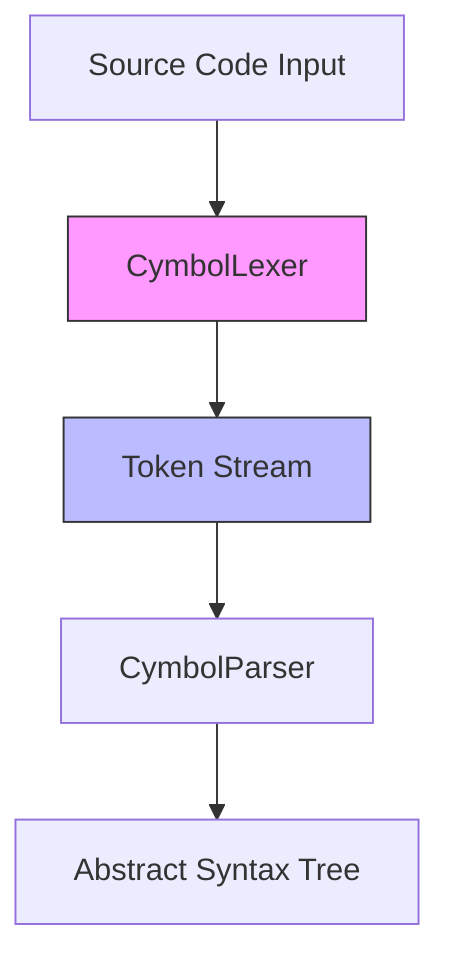
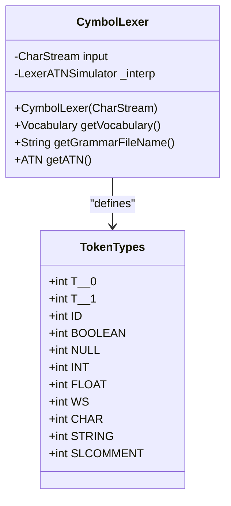
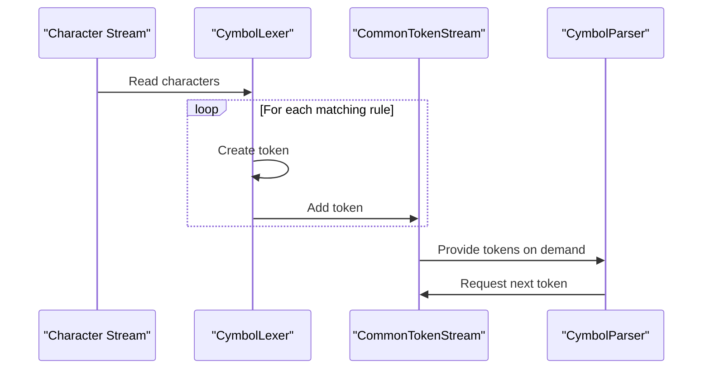
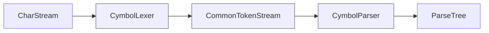

# Lexical Analysis

<cite>
**Referenced Files in This Document**   
- [CymbolLexer.java](file://ep16/src/main/java/org/teachfx/antlr4/ep16/parser/CymbolLexer.java)
- [Cymbol.g4](file://ep16/src/main/antlr4/Cymbol.g4)
- [Compiler.java](file://ep16/src/main/java/org/teachfx/antlr4/ep16/Compiler.java)
</cite>

## Table of Contents
1. [Introduction](#introduction)
2. [Lexer Role in Compilation](#lexer-role-in-compilation)
3. [Token Definition and Classification](#token-definition-and-classification)
4. [Lexical Rules Implementation](#lexical-rules-implementation)
5. [Whitespace and Comment Handling](#whitespace-and-comment-handling)
6. [Token Stream Generation](#token-stream-generation)
7. [Error Handling in Lexical Analysis](#error-handling-in-lexical-analysis)
8. [Performance Considerations](#performance-considerations)
9. [Integration with Parser](#integration-with-parser)
10. [Example Input and Output](#example-input-and-output)

## Introduction
The lexical analysis phase is the first stage in the compilation process, responsible for converting raw character streams from source code into meaningful tokens. This document details the implementation of the `CymbolLexer.java` class using ANTLR4, focusing on how it performs tokenization for the Cymbol programming language. The lexer identifies keywords, identifiers, literals, operators, and other language constructs according to defined lexical rules.

**Section sources**
- [CymbolLexer.java](file://ep16/src/main/java/org/teachfx/antlr4/ep16/parser/CymbolLexer.java)
- [Cymbol.g4](file://ep16/src/main/antlr4/Cymbol.g4)

## Lexer Role in Compilation
The `CymbolLexer` class extends ANTLR4's `Lexer` base class and serves as the lexical analyzer for the Cymbol language. It processes input character streams and produces a sequence of tokens that represent the fundamental building blocks of the language. These tokens are then consumed by the parser to construct an abstract syntax tree (AST). The lexer operates by matching patterns defined in the grammar file against the input stream, categorizing each matched pattern into appropriate token types.



**Diagram sources**
- [CymbolLexer.java](file://ep16/src/main/java/org/teachfx/antlr4/ep16/parser/CymbolLexer.java)
- [CymbolParser.java](file://ep16/src/main/java/org/teachfx/antlr4/ep16/parser/CymbolParser.java)

**Section sources**
- [CymbolLexer.java](file://ep16/src/main/java/org/teachfx/antlr4/ep16/parser/CymbolLexer.java)
- [Compiler.java](file://ep16/src/main/java/org/teachfx/antlr4/ep16/Compiler.java)

## Token Definition and Classification
The `CymbolLexer` defines a comprehensive set of tokens that categorize all valid elements in the Cymbol language. These include:

- **Keywords**: Reserved words such as 'float', 'int', 'void', 'return', 'if', 'else', 'while'
- **Identifiers**: User-defined names following the pattern of a letter followed by letters or digits
- **Literals**: Integer, floating-point, character, string, boolean, and null values
- **Operators**: Arithmetic (+, -, *, /), assignment (=), comparison (==, !=, >, >=, <, <=), and logical (!) operators
- **Punctuation**: Brackets, parentheses, braces, semicolons, and commas

Each token type is assigned a unique integer constant in the lexer, enabling efficient identification during parsing.



**Diagram sources**
- [CymbolLexer.java](file://ep16/src/main/java/org/teachfx/antlr4/ep16/parser/CymbolLexer.java)

**Section sources**
- [CymbolLexer.java](file://ep16/src/main/java/org/teachfx/antlr4/ep16/parser/CymbolLexer.java)

## Lexical Rules Implementation
The lexical rules are defined in both the `Cymbol.g4` grammar file and implemented in the generated `CymbolLexer.java`. Key rules include:

- **ID**: Matches identifiers starting with a letter followed by any combination of letters and digits
- **INT**: Matches one or more digits
- **FLOAT**: Matches an optional integer part, decimal point, and required fractional part
- **CHAR**: Matches a single character enclosed in single quotes
- **STRING**: Matches a sequence of characters enclosed in double quotes, excluding newlines
- **WS**: Matches whitespace characters (space, tab, newline, carriage return)
- **SLCOMMENT**: Matches single-line comments starting with // and ending with newline

These rules are implemented using regular expressions and ANTLR4's lexer rule syntax, ensuring precise pattern matching.

**Section sources**
- [Cymbol.g4](file://ep16/src/main/antlr4/Cymbol.g4)
- [CymbolLexer.java](file://ep16/src/main/java/org/teachfx/antlr4/ep16/parser/CymbolLexer.java)

## Whitespace and Comment Handling
The lexer handles whitespace and comments by explicitly defining rules that match these patterns and directing them to be skipped. The `WS` rule matches any sequence of space, tab, newline, or carriage return characters and uses the `-> skip` action to exclude them from the token stream. Similarly, the `SLCOMMENT` rule matches single-line comments starting with // and continuing to the end of the line, also using `-> skip` to remove comments from the token stream. This ensures that only meaningful tokens are passed to the parser.

**Section sources**
- [Cymbol.g4](file://ep16/src/main/antlr4/Cymbol.g4)
- [CymbolLexer.java](file://ep16/src/main/java/org/teachfx/antlr4/ep16/parser/CymbolLexer.java)

## Token Stream Generation
The lexer generates a token stream by sequentially processing the input character stream and applying the defined lexical rules. When a rule matches a portion of the input, a token is created with the appropriate type and text value. The `CommonTokenStream` class from ANTLR4 manages this stream, providing buffering and lookahead capabilities for the parser. The lexer maintains state information to handle context-sensitive cases and ensures that overlapping patterns are resolved according to rule precedence.



**Diagram sources**
- [CymbolLexer.java](file://ep16/src/main/java/org/teachfx/antlr4/ep16/parser/CymbolLexer.java)
- [Compiler.java](file://ep16/src/main/java/org/teachfx/antlr4/ep16/Compiler.java)

## Error Handling in Lexical Analysis
The lexer handles lexical errors by detecting invalid character sequences that do not match any defined token rules. When such an error occurs, ANTLR4's default error recovery mechanisms attempt to synchronize the lexer state and continue processing. The lexer can report unrecognized input through exception handling or by generating special error tokens that the parser can handle. While the current implementation relies primarily on ANTLR4's built-in error handling, custom error reporting could be added by overriding error notification methods in the lexer class.

**Section sources**
- [CymbolLexer.java](file://ep16/src/main/java/org/teachfx/antlr4/ep16/parser/CymbolLexer.java)

## Performance Considerations
The lexer's performance is optimized through several mechanisms:
- **DFA-based matching**: ANTLR4 generates a deterministic finite automaton (DFA) for efficient pattern matching
- **Single-pass processing**: The lexer processes input in a single forward pass with O(n) complexity
- **Minimal backtracking**: The generated lexer minimizes backtracking through careful rule ordering
- **Efficient data structures**: Token storage and retrieval use optimized collections

The use of fragment rules (like LETTER) helps reduce redundancy in pattern definitions while maintaining readability. The lexer's performance is generally not a bottleneck in the compilation process, as lexical analysis is typically much faster than subsequent parsing and semantic analysis stages.

**Section sources**
- [CymbolLexer.java](file://ep16/src/main/java/org/teachfx/antlr4/ep16/parser/CymbolLexer.java)

## Integration with Parser
The lexer integrates with the parser through the token stream interface provided by ANTLR4. The `CymbolLexer` produces tokens that are consumed by the `CymbolParser` via a `CommonTokenStream`. This decoupled design allows the lexer and parser to operate independently while maintaining a clean separation of concerns. The integration is established in the compiler's main method, where the lexer is instantiated with a character stream, and its output is connected to the parser through the token stream.



**Diagram sources**
- [Compiler.java](file://ep16/src/main/java/org/teachfx/antlr4/ep16/Compiler.java)

**Section sources**
- [Compiler.java](file://ep16/src/main/java/org/teachfx/antlr4/ep16/Compiler.java)
- [CymbolLexer.java](file://ep16/src/main/java/org/teachfx/antlr4/ep16/parser/CymbolLexer.java)

## Example Input and Output
Consider the following Cymbol source code:
```
int x = 42;
float y = 3.14;
if (x > y) {
    x = x + 1;
}
```

The lexer would produce the following token stream:
- `INT` (keyword)
- `ID` with text "x"
- `=` (operator)
- `INT` with value 42
- `;` (punctuation)
- `FLOAT` (keyword)
- `ID` with text "y"
- `=` (operator)
- `FLOAT` with value 3.14
- `;` (punctuation)
- `if` (keyword)
- `(` (punctuation)
- `ID` with text "x"
- `>` (operator)
- `ID` with text "y"
- `)` (punctuation)
- `{` (punctuation)
- `ID` with text "x"
- `=` (operator)
- `ID` with text "x"
- `+` (operator)
- `INT` with value 1
- `;` (punctuation)
- `}` (punctuation)

This token stream preserves the essential structure of the source code while eliminating whitespace and comments, providing a clean input for the parser.

**Section sources**
- [Cymbol.g4](file://ep16/src/main/antlr4/Cymbol.g4)
- [CymbolLexer.java](file://ep16/src/main/java/org/teachfx/antlr4/ep16/parser/CymbolLexer.java)