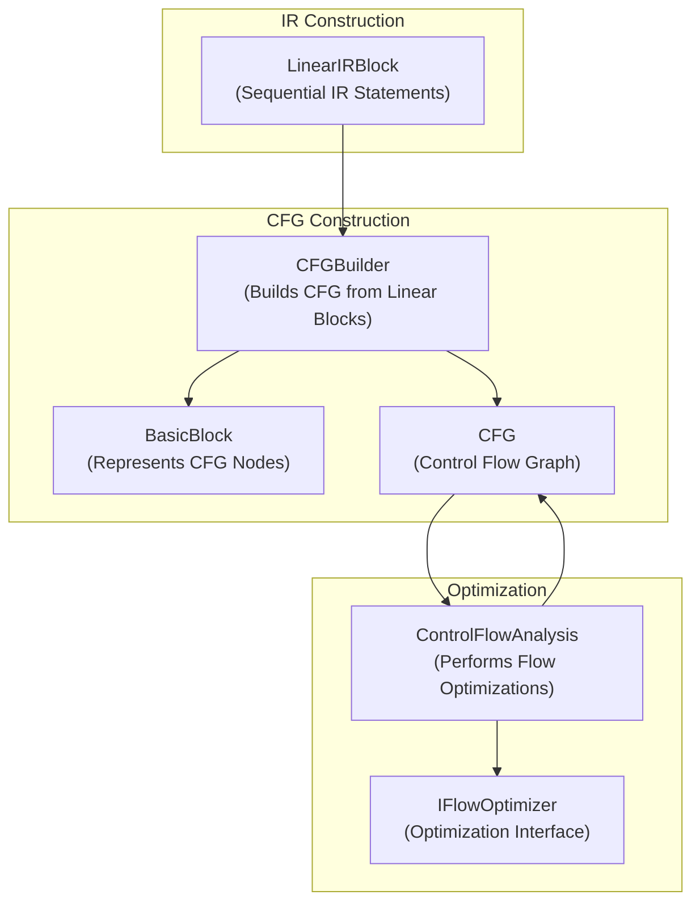
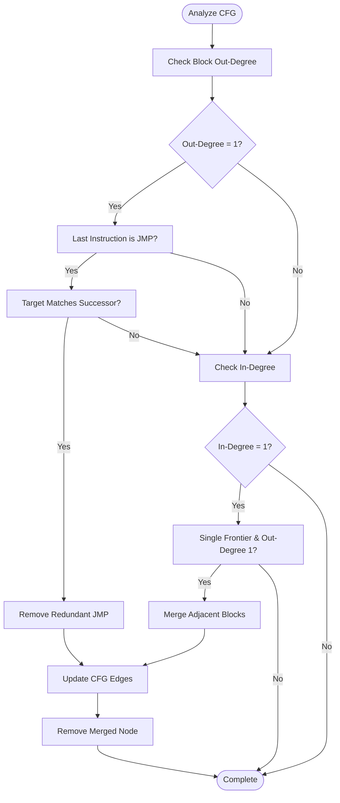
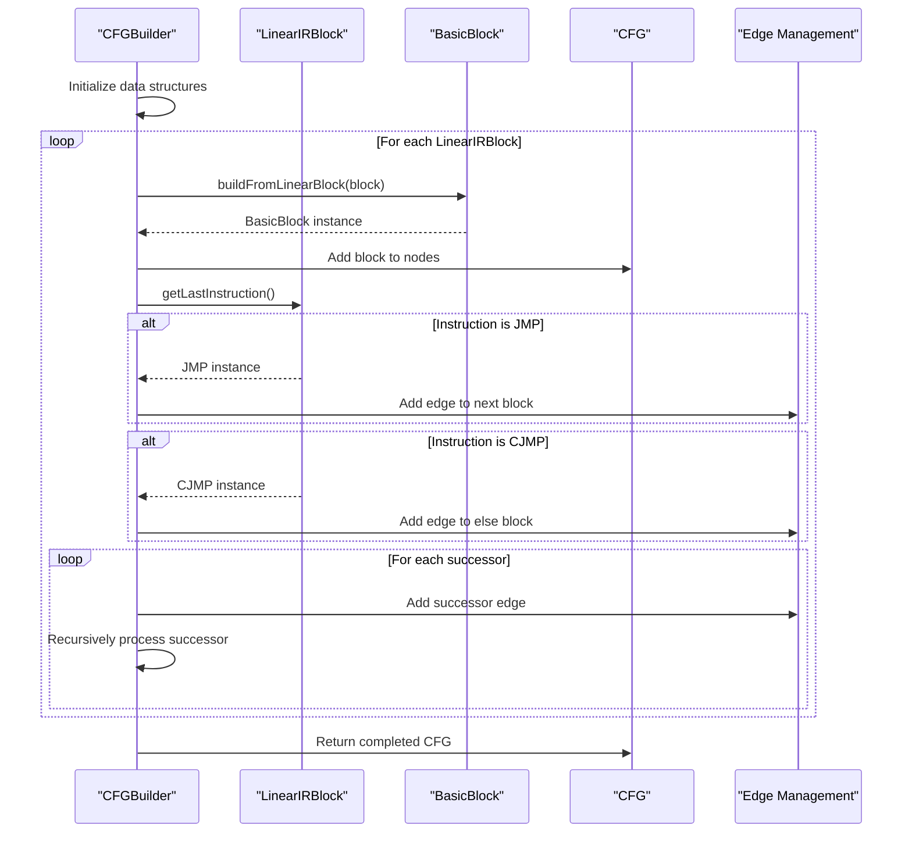
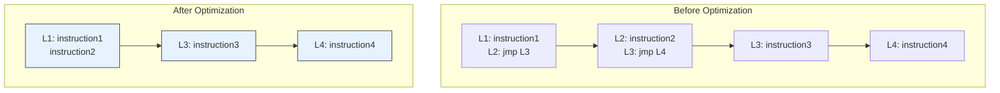
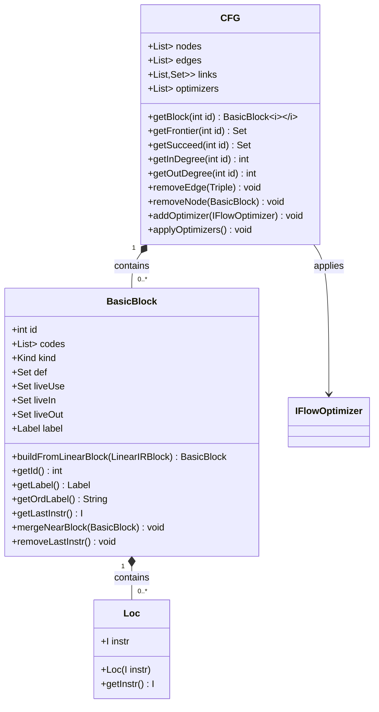
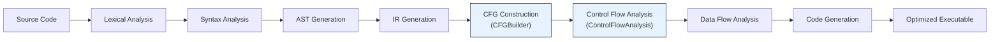
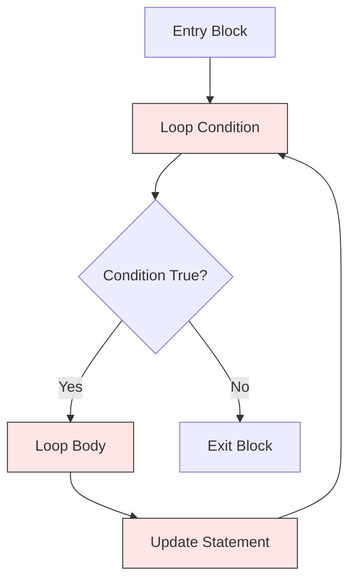

# Control Flow Analysis

<cite>
**Referenced Files in This Document**   
- [ControlFlowAnalysis.java](file://ep20/src/main/java/org/teachfx/antlr4/ep20/pass/cfg/ControlFlowAnalysis.java)
- [CFGBuilder.java](file://ep20/src/main/java/org/teachfx/antlr4/ep20/pass/cfg/CFGBuilder.java)
- [BasicBlock.java](file://ep20/src/main/java/org/teachfx/antlr4/ep20/pass/cfg/BasicBlock.java)
- [CFG.java](file://ep20/src/main/java/org/teachfx/antlr4/ep20/pass/cfg/CFG.java)
- [JMP.java](file://ep20/src/main/java/org/teachfx/antlr4/ep20/ir/stmt/JMP.java)
- [CJMP.java](file://ep20/src/main/java/org/teachfx/antlr4/ep20/ir/stmt/CJMP.java)
</cite>

## Table of Contents
1. [Introduction](#introduction)
2. [Core Components](#core-components)
3. [Architecture Overview](#architecture-overview)
4. [Detailed Component Analysis](#detailed-component-analysis)
5. [Control Flow Graph Construction](#control-flow-graph-construction)
6. [Optimization Opportunities](#optimization-opportunities)
7. [Data Structures](#data-structures)
8. [Usage in Compilation Pipeline](#usage-in-compilation-pipeline)
9. [Common Challenges](#common-challenges)
10. [Conclusion](#conclusion)

## Introduction
Control Flow Analysis (CFA) is a fundamental phase in compiler optimization that examines the flow of execution through a program's intermediate representation (IR). This document focuses on the implementation of ControlFlowAnalysis.java, which identifies optimization opportunities within the Control Flow Graph (CFG). The analysis detects unreachable code, redundant jumps, and enables downstream optimizations like jump threading and dead code elimination. The system integrates closely with CFGBuilder to construct the CFG from linear IR blocks, forming the foundation for advanced optimization passes.

## Core Components
The control flow analysis system consists of several key components that work together to analyze and optimize program flow. These include the ControlFlowAnalysis class for optimization, CFG and BasicBlock classes for representing control flow structures, and IR instruction types like JMP and CJMP for modeling control transfer. The integration between these components enables comprehensive analysis of program execution paths and identification of optimization opportunities.

**Section sources**
- [ControlFlowAnalysis.java](file://ep20/src/main/java/org/teachfx/antlr4/ep20/pass/cfg/ControlFlowAnalysis.java#L1-L68)
- [CFG.java](file://ep20/src/main/java/org/teachfx/antlr4/ep20/pass/cfg/CFG.java#L1-L159)
- [BasicBlock.java](file://ep20/src/main/java/org/teachfx/antlr4/ep20/pass/cfg/BasicBlock.java#L1-L131)

## Architecture Overview
The control flow analysis system follows a modular architecture where CFGBuilder constructs the initial control flow graph from linear IR blocks, and ControlFlowAnalysis performs optimization passes on the constructed graph. The architecture separates graph construction from optimization, allowing multiple optimization passes to be applied sequentially. This design enables extensibility and supports various analysis techniques on the same underlying graph structure.

**Diagram sources**
- [CFGBuilder.java](file://ep20/src/main/java/org/teachfx/antlr4/ep20/pass/cfg/CFGBuilder.java#L1-L64)
- [ControlFlowAnalysis.java](file://ep20/src/main/java/org/teachfx/antlr4/ep20/pass/cfg/ControlFlowAnalysis.java#L1-L68)
- [CFG.java](file://ep20/src/main/java/org/teachfx/antlr4/ep20/pass/cfg/CFG.java#L1-L159)

## Detailed Component Analysis

### ControlFlowAnalysis Implementation
The ControlFlowAnalysis class implements the IFlowOptimizer interface and performs two primary optimization passes on the CFG. First, it eliminates redundant jump instructions when a basic block ends with an unconditional jump (JMP) and the jump target matches the natural flow successor. Second, it merges basic blocks when there is a single-entry, single-exit relationship between adjacent blocks, reducing graph complexity and enabling further optimizations.

#### Optimization Logic

**Diagram sources**
- [ControlFlowAnalysis.java](file://ep20/src/main/java/org/teachfx/antlr4/ep20/pass/cfg/ControlFlowAnalysis.java#L15-L68)

**Section sources**
- [ControlFlowAnalysis.java](file://ep20/src/main/java/org/teachfx/antlr4/ep20/pass/cfg/ControlFlowAnalysis.java#L1-L68)

## Control Flow Graph Construction
The CFGBuilder class is responsible for constructing the Control Flow Graph from linear IR blocks. It processes each LinearIRBlock and creates corresponding BasicBlock instances, establishing control flow edges based on jump instructions and block successors. The builder handles both unconditional jumps (JMP) and conditional jumps (CJMP), creating appropriate edges in the CFG to represent all possible execution paths.

### CFG Construction Process

**Diagram sources**
- [CFGBuilder.java](file://ep20/src/main/java/org/teachfx/antlr4/ep20/pass/cfg/CFGBuilder.java#L1-L64)
- [LinearIRBlock.java](file://ep20/src/main/java/org/teachfx/antlr4/ep20/pass/cfg/LinearIRBlock.java)

**Section sources**
- [CFGBuilder.java](file://ep20/src/main/java/org/teachfx/antlr4/ep20/pass/cfg/CFGBuilder.java#L1-L64)

## Optimization Opportunities
The ControlFlowAnalysis implementation identifies several key optimization opportunities in the control flow graph. By analyzing basic block relationships and jump patterns, it enables significant code size reduction and performance improvements. The primary optimization opportunities include redundant jump elimination, basic block merging, and preparation for downstream optimizations like dead code elimination.

### Jump Analysis Examples

**Diagram sources**
- [ControlFlowAnalysis.java](file://ep20/src/main/java/org/teachfx/antlr4/ep20/pass/cfg/ControlFlowAnalysis.java#L15-L68)
- [BasicBlock.java](file://ep20/src/main/java/org/teachfx/antlr4/ep20/pass/cfg/BasicBlock.java#L1-L131)

**Section sources**
- [ControlFlowAnalysis.java](file://ep20/src/main/java/org/teachfx/antlr4/ep20/pass/cfg/ControlFlowAnalysis.java#L15-L68)

## Data Structures
The control flow analysis system employs several key data structures to represent and manipulate the control flow graph. These structures are designed to efficiently support graph traversal, modification, and analysis operations required for optimization.

### CFG Data Structure

**Diagram sources**
- [CFG.java](file://ep20/src/main/java/org/teachfx/antlr4/ep20/pass/cfg/CFG.java#L1-L159)
- [BasicBlock.java](file://ep20/src/main/java/org/teachfx/antlr4/ep20/pass/cfg/BasicBlock.java#L1-L131)

**Section sources**
- [CFG.java](file://ep20/src/main/java/org/teachfx/antlr4/ep20/pass/cfg/CFG.java#L1-L159)
- [BasicBlock.java](file://ep20/src/main/java/org/teachfx/antlr4/ep20/pass/cfg/BasicBlock.java#L1-L131)

## Usage in Compilation Pipeline
The control flow analysis components are integrated into the compilation pipeline as part of the optimization phase. After IR generation and CFG construction, the ControlFlowAnalysis pass is applied to optimize the control flow structure before proceeding to data flow analysis and code generation.

### Pipeline Integration

**Diagram sources**
- [ControlFlowAnalysis.java](file://ep20/src/main/java/org/teachfx/antlr4/ep20/pass/cfg/ControlFlowAnalysis.java)
- [CFGBuilder.java](file://ep20/src/main/java/org/teachfx/antlr4/ep20/pass/cfg/CFGBuilder.java)

**Section sources**
- [ControlFlowAnalysis.java](file://ep20/src/main/java/org/teachfx/antlr4/ep20/pass/cfg/ControlFlowAnalysis.java#L1-L68)
- [CFGBuilder.java](file://ep20/src/main/java/org/teachfx/antlr4/ep20/pass/cfg/CFGBuilder.java#L1-L64)

## Common Challenges
Implementing control flow analysis presents several challenges, particularly when dealing with complex program structures. The system must handle various edge cases and maintain correctness while performing optimizations.

### Loop Structure Handling

The control flow analysis must carefully handle loop structures to avoid incorrect optimizations. In particular, backward edges in loops must be preserved to maintain program semantics. The current implementation focuses on forward flow optimizations and may require enhancement to handle loop-specific optimizations like loop invariant code motion.

**Diagram sources**
- [ControlFlowAnalysis.java](file://ep20/src/main/java/org/teachfx/antlr4/ep20/pass/cfg/ControlFlowAnalysis.java#L15-L68)

**Section sources**
- [ControlFlowAnalysis.java](file://ep20/src/main/java/org/teachfx/antlr4/ep20/pass/cfg/ControlFlowAnalysis.java#L15-L68)

## Conclusion
The ControlFlowAnalysis implementation provides a solid foundation for control flow optimization in the compiler pipeline. By analyzing basic block relationships and jump patterns, it effectively identifies and eliminates redundant control flow structures. The integration with CFGBuilder enables systematic construction and optimization of the control flow graph from linear IR. While the current implementation focuses on basic optimizations like jump elimination and block merging, the architecture supports extension to more sophisticated analyses. Future enhancements could include loop analysis, dominance computation, and integration with data flow analysis for comprehensive optimization.