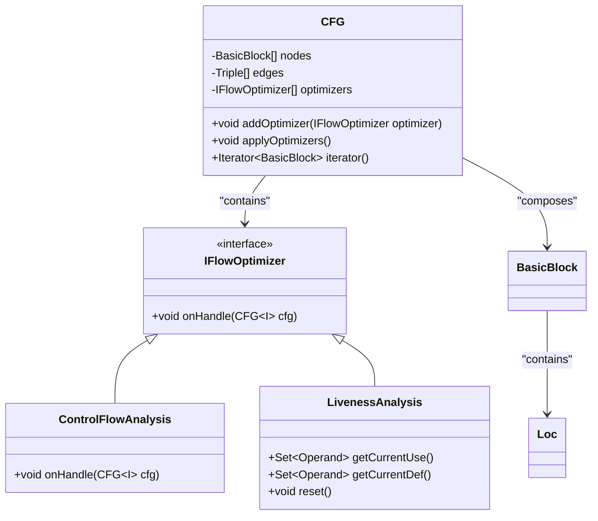
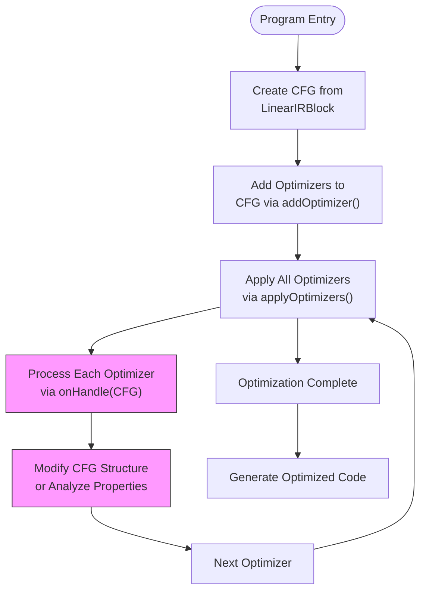
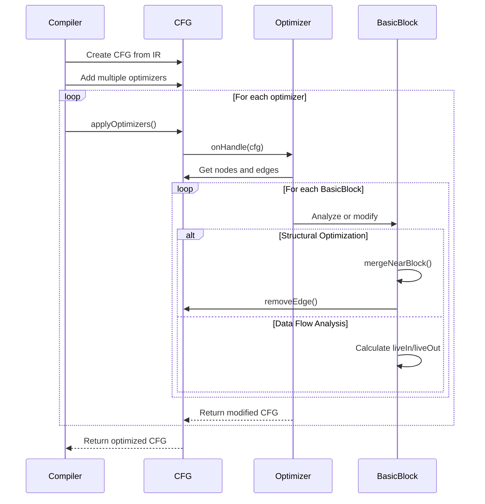

# Flow Optimizer Interface

<cite>
**Referenced Files in This Document**   
- [IFlowOptimizer.java](file://ep20/src/main/java/org/teachfx/antlr4/ep20/pass/cfg/IFlowOptimizer.java)
- [CFG.java](file://ep20/src/main/java/org/teachfx/antlr4/ep20/pass/cfg/CFG.java)
- [ControlFlowAnalysis.java](file://ep20/src/main/java/org/teachfx/antlr4/ep20/pass/cfg/ControlFlowAnalysis.java)
- [LivenessAnalysis.java](file://ep20/src/main/java/org/teachfx/antlr4/ep20/pass/cfg/LivenessAnalysis.java)
- [BasicBlock.java](file://ep20/src/main/java/org/teachfx/antlr4/ep20/pass/cfg/BasicBlock.java)
- [LinearIRBlock.java](file://ep20/src/main/java/org/teachfx/antlr4/ep20/pass/cfg/LinearIRBlock.java)
</cite>

## Table of Contents
1. [Introduction](#introduction)
2. [Core Components](#core-components)
3. [Architecture Overview](#architecture-overview)
4. [Detailed Component Analysis](#detailed-component-analysis)
5. [Dependency Analysis](#dependency-analysis)
6. [Performance Considerations](#performance-considerations)
7. [Troubleshooting Guide](#troubleshooting-guide)
8. [Conclusion](#conclusion)

## Introduction
The IFlowOptimizer interface serves as the foundation for control flow optimizations in the compiler's intermediate representation (IR) processing pipeline. This document provides comprehensive documentation for the IFlowOptimizer interface and its ecosystem, detailing how optimization passes interact with control flow graphs (CFGs), how multiple optimizers are chained together, and best practices for implementing custom optimization passes. The interface enables extensible optimization capabilities while maintaining a clean separation between the optimization logic and the underlying CFG structure.

## Core Components

The core components of the control flow optimization system include the IFlowOptimizer interface, CFG class for representing control flow structures, and various optimization implementations like ControlFlowAnalysis and LivenessAnalysis. These components work together to enable sophisticated program analysis and transformation capabilities during compilation.

**Section sources**
- [IFlowOptimizer.java](file://ep20/src/main/java/org/teachfx/antlr4/ep20/pass/cfg/IFlowOptimizer.java#L1-L8)
- [CFG.java](file://ep20/src/main/java/org/teachfx/antlr4/ep20/pass/cfg/CFG.java#L1-L159)

## Architecture Overview

The control flow optimization architecture is built around the visitor pattern, where optimization passes implement the IFlowOptimizer interface to process CFG structures. The design enables multiple optimization passes to be chained together and applied sequentially to the same CFG, allowing for complex optimization pipelines.

```mermaid
graph TD
subgraph "Optimization Pipeline"
Optimizer[IFlowOptimizer Interface]
CFG[Control Flow Graph]
Pass1[ControlFlowAnalysis]
Pass2[LivenessAnalysis]
Custom[Custom Optimizer]
end
Compiler --> CFG
CFG --> Optimizer
Optimizer --> Pass1
Optimizer --> Pass2
Optimizer --> Custom
Pass1 --> CFG : Modifies
Pass2 --> CFG : Analyzes
Custom --> CFG : Extends
```

**Diagram sources **
- [IFlowOptimizer.java](file://ep20/src/main/java/org/teachfx/antlr4/ep20/pass/cfg/IFlowOptimizer.java#L4-L6)
- [CFG.java](file://ep20/src/main/java/org/teachfx/antlr4/ep20/pass/cfg/CFG.java#L1-L159)

## Detailed Component Analysis

### IFlowOptimizer Interface Analysis
The IFlowOptimizer interface defines the contract for all control flow optimization passes in the system. It provides a standardized way for optimization algorithms to interact with control flow graphs, enabling a modular and extensible optimization framework.



**Diagram sources **
- [IFlowOptimizer.java](file://ep20/src/main/java/org/teachfx/antlr4/ep20/pass/cfg/IFlowOptimizer.java#L4-L6)
- [CFG.java](file://ep20/src/main/java/org/teachfx/antlr4/ep20/pass/cfg/CFG.java#L1-L159)

**Section sources**
- [IFlowOptimizer.java](file://ep20/src/main/java/org/teachfx/antlr4/ep20/pass/cfg/IFlowOptimizer.java#L1-L8)

### Control Flow Graph Structure
The CFG class represents the control flow structure of a program as a directed graph where nodes represent basic blocks of code and edges represent possible control flow transitions. This structure serves as the primary data structure for all control flow optimizations.



**Diagram sources **
- [CFG.java](file://ep20/src/main/java/org/teachfx/antlr4/ep20/pass/cfg/CFG.java#L1-L159)
- [LinearIRBlock.java](file://ep20/src/main/java/org/teachfx/antlr4/ep20/pass/cfg/LinearIRBlock.java#L1-L237)

**Section sources**
- [CFG.java](file://ep20/src/main/java/org/teachfx/antlr4/ep20/pass/cfg/CFG.java#L1-L159)
- [LinearIRBlock.java](file://ep20/src/main/java/org/teachfx/antlr4/ep20/pass/cfg/LinearIRBlock.java#L1-L237)

### Optimization Implementation Patterns
The system demonstrates several key patterns for implementing control flow optimizations, including structural simplification, data flow analysis, and code transformation. These patterns are exemplified by the ControlFlowAnalysis and LivenessAnalysis classes.



**Diagram sources **
- [ControlFlowAnalysis.java](file://ep20/src/main/java/org/teachfx/antlr4/ep20/pass/cfg/ControlFlowAnalysis.java#L1-L69)
- [LivenessAnalysis.java](file://ep20/src/main/java/org/teachfx/antlr4/ep20/pass/cfg/LivenessAnalysis.java#L1-L148)
- [BasicBlock.java](file://ep20/src/main/java/org/teachfx/antlr4/ep20/pass/cfg/BasicBlock.java#L1-L131)

**Section sources**
- [ControlFlowAnalysis.java](file://ep20/src/main/java/org/teachfx/antlr4/ep20/pass/cfg/ControlFlowAnalysis.java#L1-L69)
- [LivenessAnalysis.java](file://ep20/src/main/java/org/teachfx/antlr4/ep20/pass/cfg/LivenessAnalysis.java#L1-L148)

## Dependency Analysis

The control flow optimization system has a well-defined dependency structure where higher-level components depend on lower-level abstractions. The IFlowOptimizer interface serves as a dependency inversion point, allowing concrete optimization implementations to depend on the abstract interface rather than concrete CFG details.

```mermaid
graph TD
IFlowOptimizer --> CFG : "parameter"
CFG --> BasicBlock : "composes"
BasicBlock --> Loc : "contains"
ControlFlowAnalysis --> IFlowOptimizer : "implements"
LivenessAnalysis --> IRVisitor : "implements"
CFG --> IFlowOptimizer : "contains"
LinearIRBlock --> BasicBlock : "transforms to"
style IFlowOptimizer fill:#e6f3ff,stroke:#0066cc
style CFG fill:#e6f3ff,stroke:#0066cc
style BasicBlock fill:#e6f3ff,stroke:#0066cc
```

**Diagram sources **
- [IFlowOptimizer.java](file://ep20/src/main/java/org/teachfx/antlr4/ep20/pass/cfg/IFlowOptimizer.java#L1-L8)
- [CFG.java](file://ep20/src/main/java/org/teachfx/antlr4/ep20/pass/cfg/CFG.java#L1-L159)
- [BasicBlock.java](file://ep20/src/main/java/org/teachfx/antlr4/ep20/pass/cfg/BasicBlock.java#L1-L131)
- [LinearIRBlock.java](file://ep20/src/main/java/org/teachfx/antlr4/ep20/pass/cfg/LinearIRBlock.java#L1-L237)

**Section sources**
- [IFlowOptimizer.java](file://ep20/src/main/java/org/teachfx/antlr4/ep20/pass/cfg/IFlowOptimizer.java#L1-L8)
- [CFG.java](file://ep20/src/main/java/org/teachfx/antlr4/ep20/pass/cfg/CFG.java#L1-L159)

## Performance Considerations
The optimization framework is designed with performance in mind, using efficient data structures and algorithms for control flow analysis. The CFG class uses adjacency lists for edges and maintains forward and backward links for efficient traversal in both directions. Optimization passes are applied sequentially to minimize memory overhead, and the system avoids unnecessary object creation during the optimization process.

## Troubleshooting Guide

When implementing or debugging control flow optimizers, consider the following common issues and solutions:

**Section sources**
- [ControlFlowAnalysis.java](file://ep20/src/main/java/org/teachfx/antlr4/ep20/pass/cfg/ControlFlowAnalysis.java#L1-L69)
- [LivenessAnalysis.java](file://ep20/src/main/java/org/teachfx/antlr4/ep20/pass/cfg/LivenessAnalysis.java#L1-L148)

## Conclusion

The IFlowOptimizer interface provides a robust foundation for implementing control flow optimizations in the compiler framework. By defining a clear contract through the onHandle method, it enables extensible optimization capabilities while maintaining separation of concerns. The integration with the CFG structure allows optimizers to analyze and transform program control flow effectively. The system supports chaining multiple optimizers together, enabling sophisticated optimization pipelines that can perform both structural simplifications and data flow analyses. This architecture facilitates the implementation of custom optimizers for specific optimization goals while ensuring consistency and reliability across the optimization process.