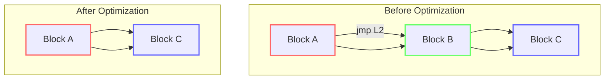
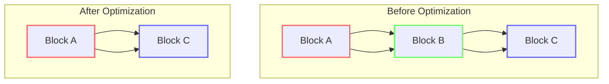
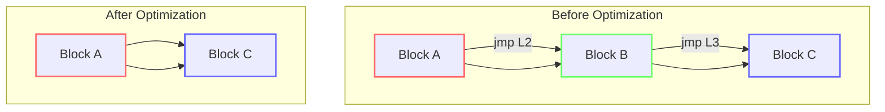
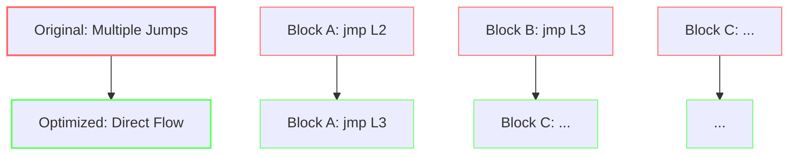

# Jump Optimization

<cite>
**Referenced Files in This Document**   
- [ControlFlowAnalysis.java](file://ep20/src/main/java/org/teachfx/antlr4/ep20/pass/cfg/ControlFlowAnalysis.java)
- [Prog.java](file://ep20/src/main/java/org/teachfx/antlr4/ep20/ir/Prog.java)
- [JMP.java](file://ep20/src/main/java/org/teachfx/antlr4/ep20/ir/stmt/JMP.java)
- [CJMP.java](file://ep20/src/main/java/org/teachfx/antlr4/ep20/ir/stmt/CJMP.java)
- [LinearIRBlock.java](file://ep20/src/main/java/org/teachfx/antlr4/ep20/pass/cfg/LinearIRBlock.java)
- [BasicBlock.java](file://ep20/src/main/java/org/teachfx/antlr4/ep20/pass/cfg/BasicBlock.java)
- [CFG.java](file://ep20/src/main/java/org/teachfx/antlr4/ep20/pass/cfg/CFG.java)
</cite>

## Table of Contents
1. [Introduction](#introduction)
2. [Jump Optimization Techniques](#jump-optimization-techniques)
3. [Control Flow Analysis](#control-flow-analysis)
4. [Jump Threading and Fall-Through Optimization](#jump-threading-and-fall-through-optimization)
5. [Jump-to-Jump Patterns and Unreachable Code](#jump-to-jump-patterns-and-unreachable-code)
6. [Impact on Code Size and Execution Speed](#impact-on-code-size-and-execution-speed)
7. [Relationship with Other Optimization Passes](#relationship-with-other-optimization-passes)
8. [Correctness and Validation](#correctness-and-validation)
9. [Before-and-After Examples](#before-and-after-examples)
10. [Conclusion](#conclusion)

## Introduction
Jump optimization is a critical compiler optimization technique that improves code efficiency by eliminating redundant jumps and simplifying control flow structures. This document details the implementation of jump optimization in the compiler, focusing on how redundant jumps are identified and eliminated through ControlFlowAnalysis. The optimization process transforms conditional jump sequences into more efficient forms, applies jump threading and fall-through optimization, and handles jump-to-jump patterns while removing unreachable code. These optimizations significantly reduce code size and improve execution speed by streamlining the control flow graph.

## Jump Optimization Techniques
The compiler implements several jump optimization techniques to enhance code efficiency. These optimizations operate on the intermediate representation (IR) and focus on simplifying control flow structures. The primary techniques include elimination of redundant jumps, transformation of conditional jump sequences, jump threading, fall-through optimization, and handling of jump-to-jump patterns. These optimizations work together to create a more streamlined control flow that reduces unnecessary branching and improves code locality.

**Section sources**
- [ControlFlowAnalysis.java](file://ep20/src/main/java/org/teachfx/antlr4/ep20/pass/cfg/ControlFlowAnalysis.java#L13-L67)

## Control Flow Analysis
Control flow analysis is the foundation of jump optimization, enabling the identification of redundant jumps and optimization opportunities. The ControlFlowAnalysis class implements the IFlowOptimizer interface and processes the control flow graph (CFG) to identify optimization opportunities. The analysis examines basic blocks and their relationships, focusing on nodes with specific in-degree and out-degree characteristics.

The algorithm first identifies nodes with out-degree of 1 that end with a jump instruction (JMPInstr). When the target of the jump instruction matches the single successor of the block, the redundant jump instruction is removed. This optimization eliminates unnecessary jump instructions that simply transfer control to the next sequential block.

**Diagram sources**
- [ControlFlowAnalysis.java](file://ep20/src/main/java/org/teachfx/antlr4/ep20/pass/cfg/ControlFlowAnalysis.java#L13-L30)
- [CFG.java](file://ep20/src/main/java/org/teachfx/antlr4/ep20/pass/cfg/CFG.java#L0-L158)

**Section sources**
- [ControlFlowAnalysis.java](file://ep20/src/main/java/org/teachfx/antlr4/ep20/pass/cfg/ControlFlowAnalysis.java#L13-L67)
- [CFG.java](file://ep20/src/main/java/org/teachfx/antlr4/ep20/pass/cfg/CFG.java#L0-L158)

## Jump Threading and Fall-Through Optimization
Jump threading and fall-through optimization are advanced techniques that further streamline control flow. Jump threading connects distant basic blocks by eliminating intermediate jump blocks, while fall-through optimization removes unnecessary jump instructions when control naturally flows to the next block.

The implementation in ControlFlowAnalysis identifies blocks with in-degree of 1 where both the predecessor and successor have out-degree of 1. In such cases, the current block is merged with its predecessor, effectively threading the jump and creating a fall-through path. This optimization reduces the number of basic blocks and eliminates redundant control flow edges.

**Diagram sources**
- [ControlFlowAnalysis.java](file://ep20/src/main/java/org/teachfx/antlr4/ep20/pass/cfg/ControlFlowAnalysis.java#L45-L67)
- [BasicBlock.java](file://ep20/src/main/java/org/teachfx/antlr4/ep20/pass/cfg/BasicBlock.java#L0-L130)

**Section sources**
- [ControlFlowAnalysis.java](file://ep20/src/main/java/org/teachfx/antlr4/ep20/pass/cfg/ControlFlowAnalysis.java#L45-L67)
- [BasicBlock.java](file://ep20/src/main/java/org/teachfx/antlr4/ep20/pass/cfg/BasicBlock.java#L0-L130)

## Jump-to-Jump Patterns and Unreachable Code
The compiler handles jump-to-jump patterns and removes unreachable code through systematic analysis of the control flow graph. When a block contains only a jump instruction and has successors, the jump targets are updated to point directly to the successor blocks, effectively eliminating the intermediate jump block.

The Prog class implements optimization for empty blocks, which may result from previous optimization passes. When an empty block is encountered, the algorithm updates all references to the block (both JMP and CJMP instructions) to point directly to the block's successor. This optimization eliminates chains of jump instructions and removes unreachable code paths.

**Diagram sources**
- [Prog.java](file://ep20/src/main/java/org/teachfx/antlr4/ep20/ir/Prog.java#L36-L70)
- [LinearIRBlock.java](file://ep20/src/main/java/org/teachfx/antlr4/ep20/pass/cfg/LinearIRBlock.java#L0-L236)

**Section sources**
- [Prog.java](file://ep20/src/main/java/org/teachfx/antlr4/ep20/ir/Prog.java#L36-L70)
- [LinearIRBlock.java](file://ep20/src/main/java/org/teachfx/antlr4/ep20/pass/cfg/LinearIRBlock.java#L0-L236)

## Impact on Code Size and Execution Speed
Jump optimization significantly reduces code size and improves execution speed by eliminating redundant control flow instructions. By removing unnecessary jump instructions and merging basic blocks, the optimized code has fewer instructions to execute and better instruction cache locality.

The elimination of redundant jumps reduces the number of branch instructions, which can improve pipeline efficiency and reduce branch prediction misses. The merging of basic blocks creates longer sequences of straight-line code, enabling better instruction prefetching and reducing the overhead of basic block dispatch.

These optimizations are particularly effective in code with complex control flow structures, such as nested conditionals and loops, where multiple layers of jump instructions can be collapsed into simpler, more direct control flow paths.

**Section sources**
- [ControlFlowAnalysis.java](file://ep20/src/main/java/org/teachfx/antlr4/ep20/pass/cfg/ControlFlowAnalysis.java#L13-L67)
- [Prog.java](file://ep20/src/main/java/org/teachfx/antlr4/ep20/ir/Prog.java#L36-L70)

## Relationship with Other Optimization Passes
Jump optimization is closely related to other compiler optimization passes, particularly liveness analysis. The control flow graph constructed for jump optimization provides the foundation for data flow analyses like liveness analysis, which determines which variables are live at each program point.

The order of optimization passes is crucial for achieving optimal results. Jump optimization typically occurs after initial code generation and before more advanced optimizations like register allocation. By simplifying the control flow early in the optimization pipeline, subsequent passes can operate on a cleaner, more efficient intermediate representation.

The LinearIRBlock and BasicBlock classes serve as the bridge between different optimization passes, providing a common representation that can be analyzed and transformed by various optimization algorithms.

**Section sources**
- [ControlFlowAnalysis.java](file://ep20/src/main/java/org/teachfx/antlr4/ep20/pass/cfg/ControlFlowAnalysis.java#L13-L67)
- [LinearIRBlock.java](file://ep20/src/main/java/org/teachfx/antlr4/ep20/pass/cfg/LinearIRBlock.java#L0-L236)
- [BasicBlock.java](file://ep20/src/main/java/org/teachfx/antlr4/ep20/pass/cfg/BasicBlock.java#L0-L130)

## Correctness and Validation
Ensuring correctness during jump optimization is critical, as improper transformations can alter program behavior. The compiler employs several validation mechanisms to ensure that optimizations preserve program semantics.

The ControlFlowAnalysis algorithm carefully checks the conditions for each optimization, ensuring that merges and eliminations only occur when they are semantically equivalent to the original code. The use of atomic operations and careful edge management in the CFG class prevents race conditions and maintains graph integrity during transformations.

The optimization process preserves all necessary control flow relationships while eliminating only redundant jumps. The algorithm verifies that jump targets are correctly updated and that all predecessor-successor relationships are maintained after block removal or merging.

**Section sources**
- [ControlFlowAnalysis.java](file://ep20/src/main/java/org/teachfx/antlr4/ep20/pass/cfg/ControlFlowAnalysis.java#L13-L67)
- [CFG.java](file://ep20/src/main/java/org/teachfx/antlr4/ep20/pass/cfg/CFG.java#L0-L158)

## Before-and-After Examples
The effectiveness of jump optimization can be demonstrated through before-and-after examples of intermediate representation code. Consider a sequence of three basic blocks where the first block unconditionally jumps to the second, and the second unconditionally jumps to the third. After optimization, this chain is reduced to a direct connection from the first to the third block, eliminating the intermediate jump.

Another example involves conditional jumps with redundant fall-through paths. When a conditional jump's "then" branch immediately jumps to the same target as the fall-through path, the conditional jump can be simplified or eliminated, reducing the number of branches and improving code clarity.

These transformations are systematically applied across the entire control flow graph, resulting in significantly streamlined code that maintains the original program semantics while executing more efficiently.

**Diagram sources**
- [ControlFlowAnalysis.java](file://ep20/src/main/java/org/teachfx/antlr4/ep20/pass/cfg/ControlFlowAnalysis.java#L13-L67)
- [Prog.java](file://ep20/src/main/java/org/teachfx/antlr4/ep20/ir/Prog.java#L36-L70)

**Section sources**
- [ControlFlowAnalysis.java](file://ep20/src/main/java/org/teachfx/antlr4/ep20/pass/cfg/ControlFlowAnalysis.java#L13-L67)
- [Prog.java](file://ep20/src/main/java/org/teachfx/antlr4/ep20/ir/Prog.java#L36-L70)

## Conclusion
Jump optimization is a fundamental compiler optimization that significantly improves code efficiency by eliminating redundant jumps and simplifying control flow structures. Through systematic control flow analysis, the compiler identifies and removes unnecessary jump instructions, applies jump threading and fall-through optimization, and handles jump-to-jump patterns while removing unreachable code.

These optimizations reduce code size and improve execution speed by creating more direct control flow paths and enhancing instruction cache locality. The implementation is carefully designed to preserve program correctness while maximizing optimization opportunities. The relationship with other optimization passes, particularly liveness analysis, highlights the importance of optimization ordering in the compilation pipeline.

The documented techniques demonstrate how sophisticated control flow transformations can be systematically applied to create more efficient code without altering program semantics, making jump optimization an essential component of modern compiler design.