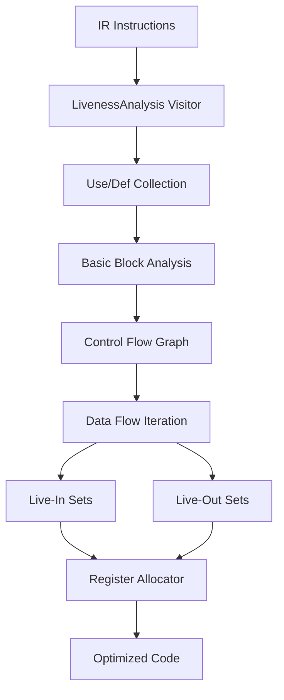
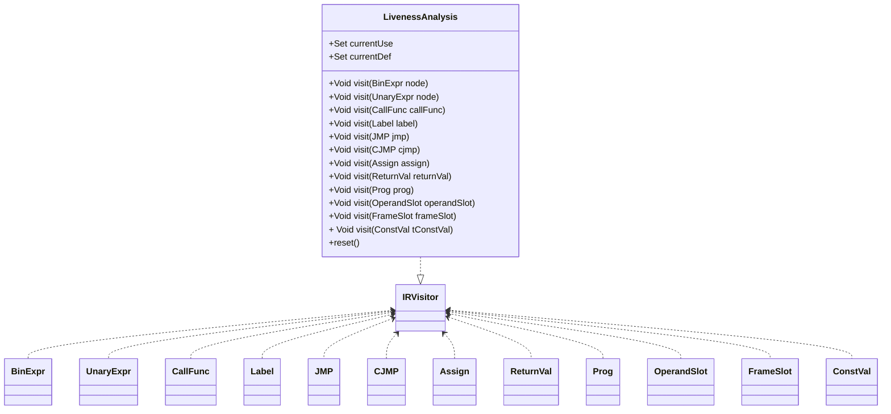
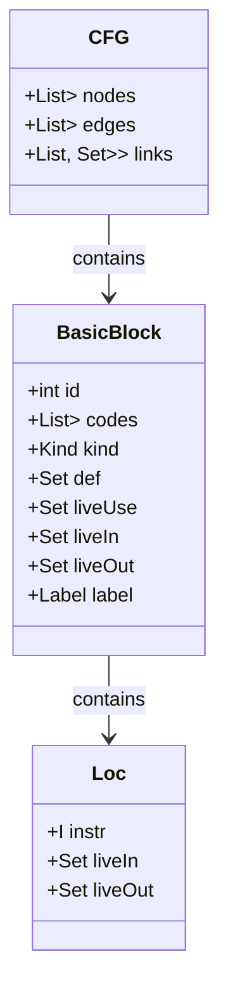
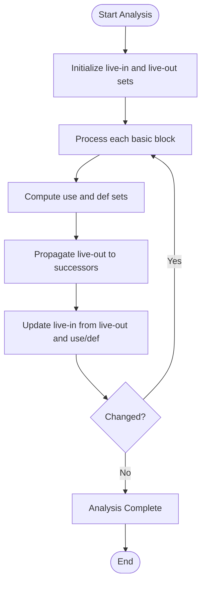
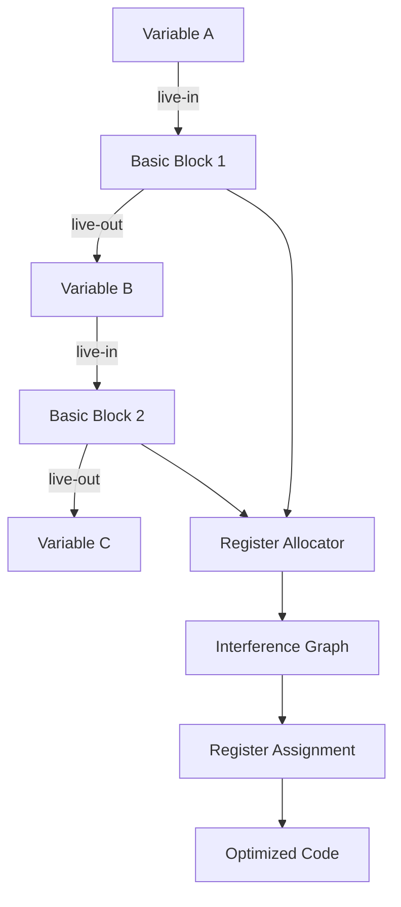
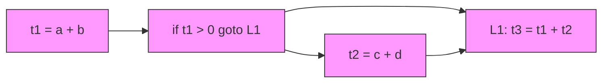
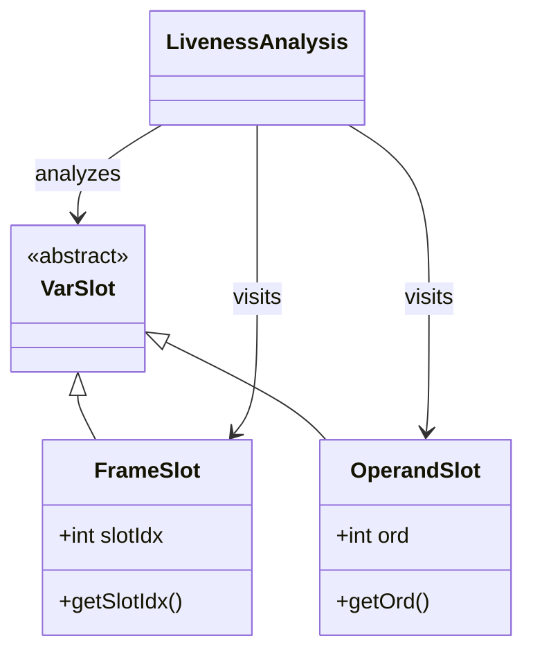

# Liveness Analysis

<cite>
**Referenced Files in This Document**   
- [LivenessAnalysis.java](file://ep20/src/main/java/org/teachfx/antlr4/ep20/pass/cfg/LivenessAnalysis.java)
- [BasicBlock.java](file://ep20/src/main/java/org/teachfx/antlr4/ep20/pass/cfg/BasicBlock.java)
- [CFG.java](file://ep20/src/main/java/org/teachfx/antlr4/ep20/pass/cfg/CFG.java)
- [VarSlot.java](file://ep20/src/main/java/org/teachfx/antlr4/ep20/ir/expr/VarSlot.java)
- [OperandSlot.java](file://ep20/src/main/java/org/teachfx/antlr4/ep20/ir/expr/addr/OperandSlot.java)
- [FrameSlot.java](file://ep20/src/main/java/org/teachfx/antlr4/ep20/ir/expr/addr/FrameSlot.java)
- [LivenessAnalysisTest.java](file://ep20/src/test/java/org/teachfx/antlr4/ep20/pass/cfg/LivenessAnalysisTest.java)
</cite>

## Table of Contents
1. [Introduction](#introduction)
2. [Core Components](#core-components)
3. [Architecture Overview](#architecture-overview)
4. [Detailed Component Analysis](#detailed-component-analysis)
5. [Data Flow Equations and Algorithm](#data-flow-equations-and-algorithm)
6. [Register Allocation Support](#register-allocation-support)
7. [Code Examples Before and After Analysis](#code-examples-before-and-after-analysis)
8. [Relationship with VarSlot Representation](#relationship-with-varslot-representation)
9. [Performance Considerations](#performance-considerations)
10. [Edge Cases Handling](#edge-cases-handling)
11. [Conclusion](#conclusion)

## Introduction
Liveness Analysis is a fundamental data-flow analysis technique used in compiler optimization to determine the points at which variables hold values that may be needed in the future. This document provides a comprehensive analysis of the LivenessAnalysis.java implementation, focusing on its role in determining variable lifetime across basic blocks. The analysis computes live-in and live-out sets for each basic block using iterative data-flow equations, which are essential for effective register allocation. By identifying non-overlapping variable lifetimes, this analysis enables optimal use of limited register resources. The implementation is tightly integrated with the Intermediate Representation's (IR) VarSlot system, which represents variables in the three-address code.

## Core Components
The liveness analysis system consists of several key components that work together to compute variable liveness information across control flow boundaries. The primary component is the LivenessAnalysis class, which implements the IRVisitor interface to traverse the intermediate representation and collect use and definition information for operands. This class maintains currentUse and currentDef sets that are updated during the visitor pattern traversal of IR nodes. The BasicBlock class contains fields for def, liveUse, liveIn, and liveOut sets that store the results of the analysis at the block level. The CFG (Control Flow Graph) class provides the structural framework for the analysis, maintaining nodes (basic blocks) and edges that represent control flow between blocks. The analysis is designed to work with the IR's operand system, particularly VarSlot derivatives like FrameSlot and OperandSlot, which represent different types of variable storage locations.

**Section sources**
- [LivenessAnalysis.java](file://ep20/src/main/java/org/teachfx/antlr4/ep20/pass/cfg/LivenessAnalysis.java#L1-L147)
- [BasicBlock.java](file://ep20/src/main/java/org/teachfx/antlr4/ep20/pass/cfg/BasicBlock.java#L1-L130)
- [CFG.java](file://ep20/src/main/java/org/teachfx/antlr4/ep20/pass/cfg/CFG.java#L1-L158)

## Architecture Overview
The liveness analysis architecture follows a visitor pattern implementation that integrates with the compiler's intermediate representation and control flow graph. The analysis operates on the CFG structure, where each node represents a basic block of sequential instructions. The LivenessAnalysis visitor traverses individual IR instructions to determine which operands are used and defined at each point. This information is then used in a fixed-point iteration algorithm that propagates liveness information across basic block boundaries until convergence is reached. The architecture is designed to be modular, allowing it to be integrated into the compiler's optimization pipeline as part of the control flow analysis phase.



**Diagram sources**
- [LivenessAnalysis.java](file://ep20/src/main/java/org/teachfx/antlr4/ep20/pass/cfg/LivenessAnalysis.java#L1-L147)
- [BasicBlock.java](file://ep20/src/main/java/org/teachfx/antlr4/ep20/pass/cfg/BasicBlock.java#L1-L130)
- [CFG.java](file://ep20/src/main/java/org/teachfx/antlr4/ep20/pass/cfg/CFG.java#L1-L158)

## Detailed Component Analysis

### LivenessAnalysis Class
The LivenessAnalysis class implements the core logic for determining operand usage and definitions within IR instructions. It extends the IRVisitor interface, allowing it to traverse the intermediate representation in a type-safe manner. The class maintains two key sets: currentUse and currentDef, which are reset at the beginning of each visit operation. For each IR node type, the visitor method determines which operands are used (read) and which are defined (written). The implementation handles various instruction types including arithmetic expressions, assignments, control flow statements, and function calls.

#### Visitor Pattern Implementation


**Diagram sources**
- [LivenessAnalysis.java](file://ep20/src/main/java/org/teachfx/antlr4/ep20/pass/cfg/LivenessAnalysis.java#L1-L147)

**Section sources**
- [LivenessAnalysis.java](file://ep20/src/main/java/org/teachfx/antlr4/ep20/pass/cfg/LivenessAnalysis.java#L1-L147)
- [LivenessAnalysisTest.java](file://ep20/src/test/java/org/teachfx/antlr4/ep20/pass/cfg/LivenessAnalysisTest.java#L1-L179)

### Basic Block and Control Flow Integration
The liveness analysis results are stored in the BasicBlock class, which contains fields for def (definitions), liveUse (uses), liveIn, and liveOut sets. These sets are populated during the analysis and represent the data flow information at the boundaries of each basic block. The CFG class provides the structural context for the analysis, maintaining the relationships between basic blocks through its edges list and links structure. The analysis algorithm iterates over the CFG, propagating liveness information until a fixed point is reached.



**Diagram sources**
- [BasicBlock.java](file://ep20/src/main/java/org/teachfx/antlr4/ep20/pass/cfg/BasicBlock.java#L1-L130)
- [CFG.java](file://ep20/src/main/java/org/teachfx/antlr4/ep20/pass/cfg/CFG.java#L1-L158)
- [Loc.java](file://ep20/src/main/java/org/teachfx/antlr4/ep20/pass/cfg/Loc.java#L1-L30)

**Section sources**
- [BasicBlock.java](file://ep20/src/main/java/org/teachfx/antlr4/ep20/pass/cfg/BasicBlock.java#L1-L130)
- [CFG.java](file://ep20/src/main/java/org/teachfx/antlr4/ep20/pass/cfg/CFG.java#L1-L158)
- [Loc.java](file://ep20/src/main/java/org/teachfx/antlr4/ep20/pass/cfg/Loc.java#L1-L30)

## Data Flow Equations and Algorithm
The liveness analysis implements the standard data-flow equations for liveness using an iterative worklist algorithm. For each basic block B, the analysis computes two sets: live-in[B] and live-out[B], representing the variables that are live at the entry and exit of the block, respectively. The algorithm follows these equations:

- live-out[B] = ∪(live-in[S]) for all successors S of B
- live-in[B] = (live-out[B] - def[B]) ∪ use[B]

The implementation processes each basic block by first determining which operands are used and defined within the block. The use set contains all operands that are read within the block, while the def set contains all operands that are written to. The algorithm then iteratively propagates this information across control flow edges until no changes occur, indicating that a fixed point has been reached.



**Diagram sources**
- [LivenessAnalysis.java](file://ep20/src/main/java/org/teachfx/antlr4/ep20/pass/cfg/LivenessAnalysis.java#L1-L147)
- [BasicBlock.java](file://ep20/src/main/java/org/teachfx/antlr4/ep20/pass/cfg/BasicBlock.java#L1-L130)

**Section sources**
- [LivenessAnalysis.java](file://ep20/src/main/java/org/teachfx/antlr4/ep20/pass/cfg/LivenessAnalysis.java#L1-L147)
- [BasicBlock.java](file://ep20/src/main/java/org/teachfx/antlr4/ep20/pass/cfg/BasicBlock.java#L1-L130)

## Register Allocation Support
The liveness analysis directly supports register allocation by identifying non-overlapping variable lifetimes that can share the same register. When two variables are never live at the same time, they can be assigned to the same physical register, reducing the total number of registers needed. This is particularly important for architectures with limited register sets. The live-in and live-out sets computed by the analysis provide the necessary information for the register allocator to build an interference graph, where nodes represent variables and edges represent conflicts (simultaneous liveness). Variables without edges between them can be coalesced into the same register.



**Diagram sources**
- [LivenessAnalysis.java](file://ep20/src/main/java/org/teachfx/antlr4/ep20/pass/cfg/LivenessAnalysis.java#L1-L147)
- [BasicBlock.java](file://ep20/src/main/java/org/teachfx/antlr4/ep20/pass/cfg/BasicBlock.java#L1-L130)

**Section sources**
- [LivenessAnalysis.java](file://ep20/src/main/java/org/teachfx/antlr4/ep20/pass/cfg/LivenessAnalysis.java#L1-L147)

## Code Examples Before and After Analysis
The liveness analysis transforms code by providing information about variable usage across control flow boundaries. Consider a simple example with conditional execution:

Before analysis, the IR might contain:
```
t1 = a + b
if t1 > 0 goto L1
t2 = c + d
L1: t3 = t1 + t2
```

After liveness analysis, the live-in and live-out sets would show that:
- t1 is live-out from the first block and live-in to L1
- t2 is live-out from the conditional block and live-in to L1
- Both t1 and t2 are needed at the merge point L1

This information allows the register allocator to ensure both variables are available at L1, either in registers or memory.



**Diagram sources**
- [LivenessAnalysis.java](file://ep20/src/main/java/org/teachfx/antlr4/ep20/pass/cfg/LivenessAnalysis.java#L1-L147)
- [BasicBlock.java](file://ep20/src/main/java/org/teachfx/antlr4/ep20/pass/cfg/BasicBlock.java#L1-L130)

**Section sources**
- [LivenessAnalysis.java](file://ep20/src/main/java/org/teachfx/antlr4/ep20/pass/cfg/LivenessAnalysis.java#L1-L147)

## Relationship with VarSlot Representation
The liveness analysis is closely tied to the IR's VarSlot representation, which serves as the base class for all variable-like operands in the three-address code. VarSlot is an abstract class extended by specific implementations like FrameSlot and OperandSlot. FrameSlot represents variables stored in the stack frame at a specific offset, while OperandSlot represents temporary values used during expression evaluation. The analysis treats all VarSlot derivatives uniformly, tracking their liveness regardless of their specific storage mechanism. This abstraction allows the liveness analysis to work with both user variables and compiler-generated temporaries in a consistent manner.



**Diagram sources**
- [VarSlot.java](file://ep20/src/main/java/org/teachfx/antlr4/ep20/ir/expr/VarSlot.java#L1-L5)
- [FrameSlot.java](file://ep20/src/main/java/org/teachfx/antlr4/ep20/ir/expr/addr/FrameSlot.java#L1-L31)
- [OperandSlot.java](file://ep20/src/main/java/org/teachfx/antlr4/ep20/ir/expr/addr/OperandSlot.java#L1-L38)

**Section sources**
- [VarSlot.java](file://ep20/src/main/java/org/teachfx/antlr4/ep20/ir/expr/VarSlot.java#L1-L5)
- [FrameSlot.java](file://ep20/src/main/java/org/teachfx/antlr4/ep20/ir/expr/addr/FrameSlot.java#L1-L31)
- [OperandSlot.java](file://ep20/src/main/java/org/teachfx/antlr4/ep20/ir/expr/addr/OperandSlot.java#L1-L38)

## Performance Considerations
The liveness analysis implementation includes several performance optimizations for handling large functions. The algorithm uses a worklist approach that only reprocesses blocks when their live-out sets change, avoiding unnecessary iterations. The use of efficient data structures like HashSet for operand sets ensures O(1) average-case complexity for set operations. For large functions with complex control flow, the analysis may require multiple iterations to reach a fixed point, but the convergence is guaranteed due to the monotonic nature of the data-flow equations. The visitor pattern implementation allows for efficient traversal of IR instructions without recursion overhead. Additionally, the separation of use/def collection from the iterative data-flow computation enables better cache locality during the fixed-point iteration.

**Section sources**
- [LivenessAnalysis.java](file://ep20/src/main/java/org/teachfx/antlr4/ep20/pass/cfg/LivenessAnalysis.java#L1-L147)
- [BasicBlock.java](file://ep20/src/main/java/org/teachfx/antlr4/ep20/pass/cfg/BasicBlock.java#L1-L130)

## Edge Cases Handling
The liveness analysis handles several edge cases that commonly occur in real programs. For variables in loops, the analysis correctly identifies that variables used in the loop body are live across the back edge, ensuring they remain available for subsequent iterations. The implementation properly handles exception handling paths by treating them as additional control flow edges in the CFG, ensuring that variables live at potential exception points are correctly identified. For variables that are only conditionally defined, the analysis conservatively assumes they may be live, preventing incorrect optimizations. The treatment of function call parameters ensures that arguments are considered live until the call completes, even if they are not explicitly used in subsequent instructions.

**Section sources**
- [LivenessAnalysis.java](file://ep20/src/main/java/org/teachfx/antlr4/ep20/pass/cfg/LivenessAnalysis.java#L1-L147)
- [BasicBlock.java](file://ep20/src/main/java/org/teachfx/antlr4/ep20/pass/cfg/BasicBlock.java#L1-L130)
- [CFG.java](file://ep20/src/main/java/org/teachfx/antlr4/ep20/pass/cfg/CFG.java#L1-L158)

## Conclusion
The LivenessAnalysis.java implementation provides a robust foundation for variable lifetime determination in the compiler's optimization pipeline. By computing live-in and live-out sets for each basic block using iterative data-flow equations, it enables effective register allocation through the identification of non-overlapping variable lifetimes. The integration with the IR's VarSlot system allows for uniform handling of both user variables and compiler-generated temporaries. The analysis correctly handles complex control flow patterns, including loops and conditional execution, ensuring accurate liveness information across the entire function. This information is crucial for subsequent optimization phases, particularly register allocation, where it enables optimal use of limited hardware resources. The implementation demonstrates good performance characteristics through efficient data structures and a worklist-based fixed-point iteration algorithm.