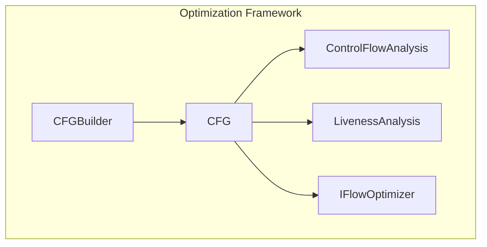
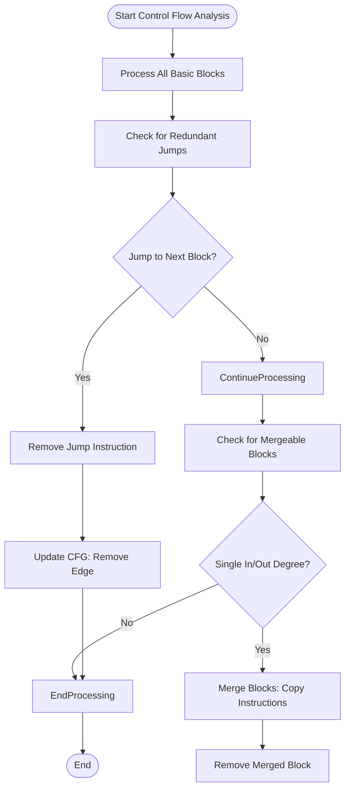
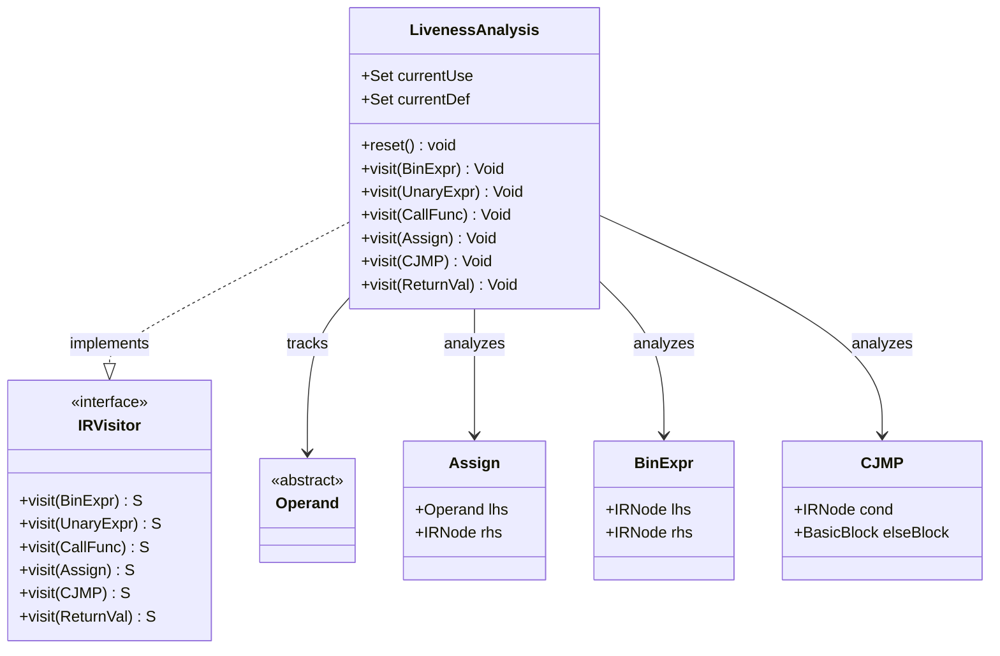
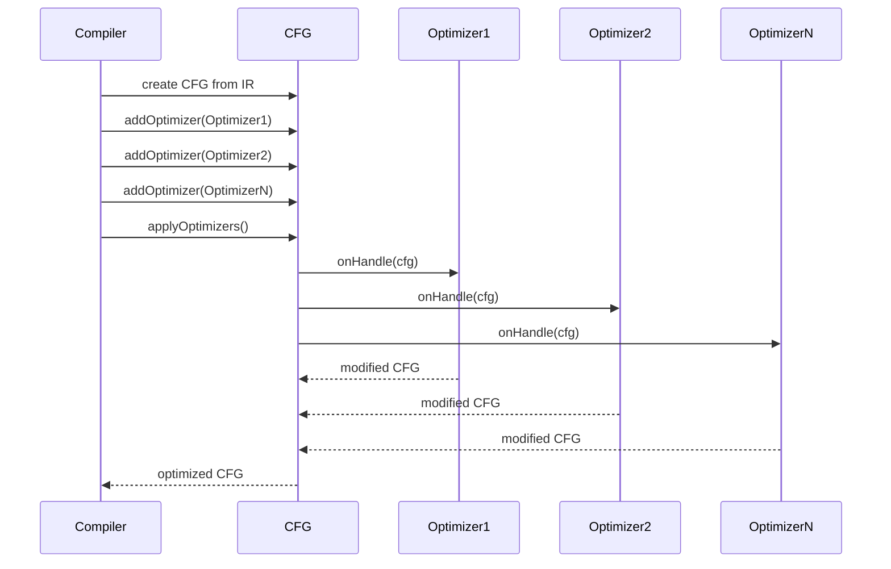
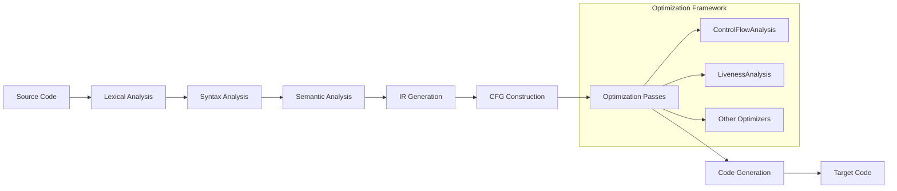

# Optimization

<cite>
**Referenced Files in This Document**   
- [ControlFlowAnalysis.java](file://ep20/src/main/java/org/teachfx/antlr4/ep20/pass/cfg/ControlFlowAnalysis.java)
- [LivenessAnalysis.java](file://ep20/src/main/java/org/teachfx/antlr4/ep20/pass/cfg/LivenessAnalysis.java)
- [IFlowOptimizer.java](file://ep20/src/main/java/org/teachfx/antlr4/ep20/pass/cfg/IFlowOptimizer.java)
- [CFG.java](file://ep20/src/main/java/org/teachfx/antlr4/ep20/pass/cfg/CFG.java)
- [BasicBlock.java](file://ep20/src/main/java/org/teachfx/antlr4/ep20/pass/cfg/BasicBlock.java)
- [CFGBuilder.java](file://ep20/src/main/java/org/teachfx/antlr4/ep20/pass/cfg/CFGBuilder.java)
</cite>

## Table of Contents
1. [Introduction](#introduction)
2. [Optimization Framework Overview](#optimization-framework-overview)
3. [Control Flow Optimization](#control-flow-optimization)
4. [Liveness Analysis for Register Allocation](#liveness-analysis-for-register-allocation)
5. [Extensible Optimization Architecture](#extensible-optimization-architecture)
6. [Optimization Examples](#optimization-examples)
7. [Trade-offs in Optimization](#trade-offs-in-optimization)
8. [Integration in Compilation Pipeline](#integration-in-compilation-pipeline)
9. [Conclusion](#conclusion)

## Introduction
The optimization framework in the Cymbol compiler is designed to improve the efficiency of generated code through systematic analysis and transformation of the intermediate representation (IR). This document details the key optimization passes implemented in the framework, including control flow optimization, dead code elimination, and liveness analysis. The framework operates on the control flow graph (CFG) representation of programs and enables extensible optimization through a well-defined interface. The optimizations aim to reduce code size, eliminate unnecessary operations, and prepare the IR for efficient register allocation and code generation.

## Optimization Framework Overview
The optimization framework is built around the control flow graph (CFG) data structure, which represents the program's control flow as a directed graph of basic blocks. Each basic block contains a sequence of IR instructions that execute sequentially. The framework provides infrastructure for analyzing and transforming the CFG to improve code quality. The core components include the CFG builder, which constructs the graph from linear IR, and the optimization engine, which applies various optimization passes. The framework supports multiple optimization techniques that work together to enhance code efficiency while maintaining correctness.

**Diagram sources**
- [CFGBuilder.java](file://ep20/src/main/java/org/teachfx/antlr4/ep20/pass/cfg/CFGBuilder.java)
- [CFG.java](file://ep20/src/main/java/org/teachfx/antlr4/ep20/pass/cfg/CFG.java)

**Section sources**
- [CFGBuilder.java](file://ep20/src/main/java/org/teachfx/antlr4/ep20/pass/cfg/CFGBuilder.java#L1-L63)
- [CFG.java](file://ep20/src/main/java/org/teachfx/antlr4/ep20/pass/cfg/CFG.java#L1-L158)

## Control Flow Optimization
The ControlFlowAnalysis class implements key control flow optimizations that simplify the program structure and eliminate redundant operations. Two primary optimizations are performed: jump optimization and basic block merging. Jump optimization removes unnecessary jump instructions when a jump target is the immediate successor of the current block, reducing code size and improving execution efficiency. Basic block merging combines consecutive blocks when one block has a single predecessor and successor, creating longer straight-line code sequences that are more amenable to further optimization. These optimizations are applied during the onHandle method, which processes the CFG to identify and eliminate optimization opportunities.

**Diagram sources**
- [ControlFlowAnalysis.java](file://ep20/src/main/java/org/teachfx/antlr4/ep20/pass/cfg/ControlFlowAnalysis.java#L13-L67)

**Section sources**
- [ControlFlowAnalysis.java](file://ep20/src/main/java/org/teachfx/antlr4/ep20/pass/cfg/ControlFlowAnalysis.java#L13-L67)
- [BasicBlock.java](file://ep20/src/main/java/org/teachfx/antlr4/ep20/pass/cfg/BasicBlock.java#L1-L130)

## Liveness Analysis for Register Allocation
LivenessAnalysis implements a data flow analysis that determines which variables are live at each point in the program, providing essential information for register allocation. The analysis tracks variable usage and definitions by visiting each IR node and maintaining use and def sets. For assignment statements, the left-hand side is recorded as a definition while the right-hand side expressions are analyzed for variable uses. Control flow instructions like CJMP analyze their condition expressions for variable uses. The liveness information helps identify opportunities for dead code elimination and enables efficient register allocation by determining when registers can be reused. The analysis is implemented as an IRVisitor that processes different types of IR nodes according to their semantics.

**Diagram sources**
- [LivenessAnalysis.java](file://ep20/src/main/java/org/teachfx/antlr4/ep20/pass/cfg/LivenessAnalysis.java#L16-L146)
- [IRVisitor.java](file://ep20/src/main/java/org/teachfx/antlr4/ep20/ir/IRVisitor.java)

**Section sources**
- [LivenessAnalysis.java](file://ep20/src/main/java/org/teachfx/antlr4/ep20/pass/cfg/LivenessAnalysis.java#L16-L146)
- [IRVisitor.java](file://ep20/src/main/java/org/teachfx/antlr4/ep20/ir/IRVisitor.java)

## Extensible Optimization Architecture
The optimization framework employs the IFlowOptimizer interface to enable extensible optimization capabilities. This interface defines a contract for optimization passes, requiring implementations to provide an onHandle method that processes a CFG. The extensibility is achieved through the addOptimizer method in the CFG class, which allows multiple optimization passes to be registered and applied sequentially. This design enables new optimization techniques to be added without modifying the core framework. Each optimizer operates on the same CFG representation, allowing optimizations to build upon the transformations performed by previous passes. The modular design promotes code reuse and simplifies the implementation of new optimization algorithms.

**Diagram sources**
- [IFlowOptimizer.java](file://ep20/src/main/java/org/teachfx/antlr4/ep20/pass/cfg/IFlowOptimizer.java#L4-L6)
- [CFG.java](file://ep20/src/main/java/org/teachfx/antlr4/ep20/pass/cfg/CFG.java#L1-L158)

**Section sources**
- [IFlowOptimizer.java](file://ep20/src/main/java/org/teachfx/antlr4/ep20/pass/cfg/IFlowOptimizer.java#L4-L6)
- [CFG.java](file://ep20/src/main/java/org/teachfx/antlr4/ep20/pass/cfg/CFG.java#L1-L158)

## Optimization Examples
The optimization framework transforms code in several ways to improve efficiency. For jump optimization, consider a basic block ending with a jump to its immediate successor - this jump instruction is redundant and can be removed, as control would naturally flow to the next block. For block merging, when two consecutive blocks each have a single predecessor and successor, they can be combined into a single block, eliminating the jump between them and creating a longer sequence of straight-line code. These transformations reduce the number of instructions and control flow edges, leading to more compact and efficient code. The optimizations preserve program semantics while improving performance characteristics.

**Section sources**
- [ControlFlowAnalysis.java](file://ep20/src/main/java/org/teachfx/antlr4/ep20/pass/cfg/ControlFlowAnalysis.java#L13-L67)
- [BasicBlock.java](file://ep20/src/main/java/org/teachfx/antlr4/ep20/pass/cfg/BasicBlock.java#L1-L130)

## Trade-offs in Optimization
The optimization framework balances several competing factors, including optimization effectiveness, compilation time, and code quality. More aggressive optimizations can produce smaller and faster code but require additional analysis time and complexity. The current implementation focuses on lightweight optimizations that provide significant benefits with minimal overhead. Jump optimization and block merging are relatively inexpensive to implement and can be applied quickly, making them suitable for inclusion in the standard compilation pipeline. The extensible design allows users to enable or disable specific optimizations based on their requirements, providing flexibility to prioritize compilation speed versus code efficiency. Future enhancements could include more sophisticated optimizations with configurable aggressiveness levels.

**Section sources**
- [ControlFlowAnalysis.java](file://ep20/src/main/java/org/teachfx/antlr4/ep20/pass/cfg/ControlFlowAnalysis.java#L13-L67)
- [CFG.java](file://ep20/src/main/java/org/teachfx/antlr4/ep20/pass/cfg/CFG.java#L1-L158)

## Integration in Compilation Pipeline
The optimization framework is integrated into the compilation pipeline after IR generation and before code generation. The process begins with the construction of the CFG from the linear IR using CFGBuilder. Once the CFG is created, optimization passes are registered with the CFG and applied through the applyOptimizers method. The optimized CFG is then used for code generation, producing more efficient target code. The integration is seamless, with the optimization phase acting as a transformation step between high-level IR and low-level code generation. The framework's design allows optimizations to be easily enabled or disabled through configuration, providing flexibility in the compilation process.

**Diagram sources**
- [CFGBuilder.java](file://ep20/src/main/java/org/teachfx/antlr4/ep20/pass/cfg/CFGBuilder.java#L1-L63)
- [CFG.java](file://ep20/src/main/java/org/teachfx/antlr4/ep20/pass/cfg/CFG.java#L1-L158)

**Section sources**
- [CFGBuilder.java](file://ep20/src/main/java/org/teachfx/antlr4/ep20/pass/cfg/CFGBuilder.java#L1-L63)
- [CFG.java](file://ep20/src/main/java/org/teachfx/antlr4/ep20/pass/cfg/CFG.java#L1-L158)

## Conclusion
The optimization framework provides essential capabilities for improving the efficiency of generated code in the Cymbol compiler. Through control flow analysis, jump optimization, and liveness analysis, the framework identifies and eliminates redundancies while preparing the IR for effective register allocation. The extensible design based on the IFlowOptimizer interface allows for the addition of new optimization techniques without modifying the core infrastructure. The integration of these optimizations into the compilation pipeline enhances code quality with minimal impact on compilation time. Future work could expand the framework with additional optimization passes and provide more granular control over optimization aggressiveness, further improving the compiler's ability to generate efficient target code.