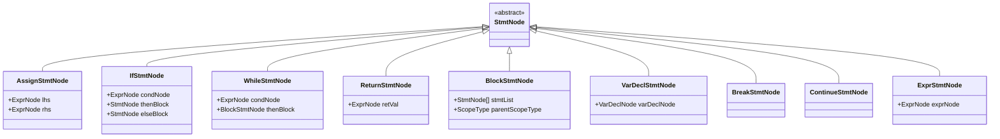

# AST Construction Phase

<cite>
**Referenced Files in This Document**   
- [CymbolASTBuilder.java](file://ep20/src/main/java/org/teachfx/antlr4/ep20/pass/ast/CymbolASTBuilder.java)
- [ASTNode.java](file://ep20/src/main/java/org/teachfx/antlr4/ep20/ast/ASTNode.java)
- [ExprNode.java](file://ep20/src/main/java/org/teachfx/antlr4/ep20/ast/expr/ExprNode.java)
- [StmtNode.java](file://ep20/src/main/java/org/teachfx/antlr4/ep20/ast/stmt/StmtNode.java)
- [DeclNode.java](file://ep20/src/main/java/org/teachfx/antlr4/ep20/ast/decl/DeclNode.java)
- [TypeNode.java](file://ep20/src/main/java/org/teachfx/antlr4/ep20/ast/type/TypeNode.java)
- [CompileUnit.java](file://ep20/src/main/java/org/teachfx/antlr4/ep20/ast/CompileUnit.java)
- [ASTVisitor.java](file://ep20/src/main/java/org/teachfx/antlr4/ep20/ast/ASTVisitor.java)
- [ASTBaseVisitor.java](file://ep20/src/main/java/org/teachfx/antlr4/ep20/pass/ast/ASTBaseVisitor.java)
</cite>

## Table of Contents
1. [Introduction](#introduction)
2. [ASTNode Hierarchy](#astnode-hierarchy)
3. [AST Construction Process](#ast-construction-process)
4. [Expression Node Types](#expression-node-types)
5. [Statement Node Types](#statement-node-types)
6. [Declaration Node Types](#declaration-node-types)
7. [Source Location Preservation](#source-location-preservation)
8. [AST Benefits Over ParseTree](#ast-benefits-over-parsetree)
9. [AST Visitor Pattern Implementation](#ast-visitor-pattern-implementation)
10. [Code Generation Examples](#code-generation-examples)
11. [Future Transformations and Optimizations](#future-transformations-and-optimizations)

## Introduction
The AST construction phase transforms ANTLR4's ParseTree into a typed Abstract Syntax Tree (AST) using the visitor pattern. This process creates a structured representation of the source code that is optimized for semantic analysis and code generation. The CymbolASTBuilder.java class implements this transformation, visiting each node of the ParseTree and constructing corresponding AST nodes that preserve type information and source location data.

**Section sources**
- [CymbolASTBuilder.java](file://ep20/src/main/java/org/teachfx/antlr4/ep20/pass/ast/CymbolASTBuilder.java#L1-L319)

## ASTNode Hierarchy
The AST node hierarchy is organized around a base ASTNode class that serves as the foundation for all AST elements. This hierarchy includes specialized node types for expressions, statements, declarations, and types, each inheriting from the base class and adding specific functionality.


**Diagram sources**
- [ASTNode.java](file://ep20/src/main/java/org/teachfx/antlr4/ep20/ast/ASTNode.java#L1-L49)
- [ExprNode.java](file://ep20/src/main/java/org/teachfx/antlr4/ep20/ast/expr/ExprNode.java#L1-L42)
- [StmtNode.java](file://ep20/src/main/java/org/teachfx/antlr4/ep20/ast/stmt/StmtNode.java#L1-L23)
- [DeclNode.java](file://ep20/src/main/java/org/teachfx/antlr4/ep20/ast/decl/DeclNode.java#L1-L37)
- [TypeNode.java](file://ep20/src/main/java/org/teachfx/antlr4/ep20/ast/type/TypeNode.java#L1-L71)

**Section sources**
- [ASTNode.java](file://ep20/src/main/java/org/teachfx/antlr4/ep20/ast/ASTNode.java#L1-L49)
- [ExprNode.java](file://ep20/src/main/java/org/teachfx/antlr4/ep20/ast/expr/ExprNode.java#L1-L42)
- [StmtNode.java](file://ep20/src/main/java/org/teachfx/antlr4/ep20/ast/stmt/StmtNode.java#L1-L23)
- [DeclNode.java](file://ep20/src/main/java/org/teachfx/antlr4/ep20/ast/decl/DeclNode.java#L1-L37)
- [TypeNode.java](file://ep20/src/main/java/org/teachfx/antlr4/ep20/ast/type/TypeNode.java#L1-L71)

## AST Construction Process
The AST construction process is implemented in the CymbolASTBuilder class, which extends ANTLR4's CymbolBaseVisitor and implements the CymbolVisitor interface. The builder traverses the ParseTree and creates corresponding AST nodes for each grammar rule encountered. The process begins with the compilation unit and recursively processes all child nodes, building a complete AST representation of the source code.


**Diagram sources**
- [CymbolASTBuilder.java](file://ep20/src/main/java/org/teachfx/antlr4/ep20/pass/ast/CymbolASTBuilder.java#L1-L319)

**Section sources**
- [CymbolASTBuilder.java](file://ep20/src/main/java/org/teachfx/antlr4/ep20/pass/ast/CymbolASTBuilder.java#L1-L319)

## Expression Node Types
The AST supports various expression node types that represent different kinds of expressions in the source language. These include binary expressions, unary expressions, function calls, array access, field access, and literal expressions. Each expression node type contains specific fields and methods relevant to its operation.


**Diagram sources**
- [CymbolASTBuilder.java](file://ep20/src/main/java/org/teachfx/antlr4/ep20/pass/ast/CymbolASTBuilder.java#L1-L319)
- [ExprNode.java](file://ep20/src/main/java/org/teachfx/antlr4/ep20/ast/expr/ExprNode.java#L1-L42)

**Section sources**
- [CymbolASTBuilder.java](file://ep20/src/main/java/org/teachfx/antlr4/ep20/pass/ast/CymbolASTBuilder.java#L1-L319)
- [ExprNode.java](file://ep20/src/main/java/org/teachfx/antlr4/ep20/ast/expr/ExprNode.java#L1-L42)

## Statement Node Types
Statement nodes represent executable statements in the source code. The AST includes various statement types such as assignment statements, control flow statements (if, while), return statements, and block statements. Each statement node type captures the specific structure and components of the corresponding language construct.



**Diagram sources**
- [CymbolASTBuilder.java](file://ep20/src/main/java/org/teachfx/antlr4/ep20/pass/ast/CymbolASTBuilder.java#L1-L319)
- [StmtNode.java](file://ep20/src/main/java/org/teachfx/antlr4/ep20/ast/stmt/StmtNode.java#L1-L23)

**Section sources**
- [CymbolASTBuilder.java](file://ep20/src/main/java/org/teachfx/antlr4/ep20/pass/ast/CymbolASTBuilder.java#L1-L319)
- [StmtNode.java](file://ep20/src/main/java/org/teachfx/antlr4/ep20/ast/stmt/StmtNode.java#L1-L23)

## Declaration Node Types
Declaration nodes represent various declarations in the source code, including variable declarations, function declarations, struct declarations, and typedef declarations. These nodes capture the structure and components of declarations, including type information, names, and initialization expressions.


**Diagram sources**
- [CymbolASTBuilder.java](file://ep20/src/main/java/org/teachfx/antlr4/ep20/pass/ast/CymbolASTBuilder.java#L1-L319)
- [DeclNode.java](file://ep20/src/main/java/org/teachfx/antlr4/ep20/ast/decl/DeclNode.java#L1-L37)

**Section sources**
- [CymbolASTBuilder.java](file://ep20/src/main/java/org/teachfx/antlr4/ep20/pass/ast/CymbolASTBuilder.java#L1-L319)
- [DeclNode.java](file://ep20/src/main/java/org/teachfx/antlr4/ep20/ast/decl/DeclNode.java#L1-L37)

## Source Location Preservation
The AST preserves source location information by storing the ParserRuleContext for each node. This context contains information about the token range in the original source code, enabling accurate error reporting and debugging. The getLocation() method extracts line and column information from the context to provide precise source positioning.


**Diagram sources**
- [ASTNode.java](file://ep20/src/main/java/org/teachfx/antlr4/ep20/ast/ASTNode.java#L1-L49)

**Section sources**
- [ASTNode.java](file://ep20/src/main/java/org/teachfx/antlr4/ep20/ast/ASTNode.java#L1-L49)

## AST Benefits Over ParseTree
The AST provides several advantages over the raw ParseTree for semantic analysis and code generation. It eliminates syntactic noise, preserves only essential semantic information, includes type information, and provides a cleaner structure for traversal and transformation. The typed nature of the AST enables more efficient and accurate semantic analysis compared to the generic ParseTree.


**Diagram sources**
- [CymbolASTBuilder.java](file://ep20/src/main/java/org/teachfx/antlr4/ep20/pass/ast/CymbolASTBuilder.java#L1-L319)
- [ASTNode.java](file://ep20/src/main/java/org/teachfx/antlr4/ep20/ast/ASTNode.java#L1-L49)

## AST Visitor Pattern Implementation
The AST uses the visitor pattern to enable traversal and operations on the tree structure. The ASTVisitor interface defines visit methods for each node type, allowing for type-safe processing of AST nodes. The ASTBaseVisitor provides default implementations that can be overridden for specific processing needs.


**Diagram sources**
- [ASTVisitor.java](file://ep20/src/main/java/org/teachfx/antlr4/ep20/ast/ASTVisitor.java#L1-L40)
- [ASTBaseVisitor.java](file://ep20/src/main/java/org/teachfx/antlr4/ep20/pass/ast/ASTBaseVisitor.java#L1-L94)

**Section sources**
- [ASTVisitor.java](file://ep20/src/main/java/org/teachfx/antlr4/ep20/ast/ASTVisitor.java#L1-L40)
- [ASTBaseVisitor.java](file://ep20/src/main/java/org/teachfx/antlr4/ep20/pass/ast/ASTBaseVisitor.java#L1-L94)

## Code Generation Examples
The AST construction process handles various language constructs, creating appropriate node types for each. Examples include function definitions, control flow statements, and expressions, each transformed into their corresponding AST representations with preserved type and location information.

```mermaid
flowchart TD
subgraph Function Definition
FD[functionDecl] --> RT[retType]
FD --> FN[funcName]
FD --> PP[params]
FD --> BD[blockDef]
RT --> TypeNode
PP --> VarDeclListNode
BD --> BlockStmtNode
end
subgraph Control Flow
IF[stateCondition] --> COND[cond]
IF --> THEN[then]
IF --> ELSE[elseDo]
COND --> ExprNode
THEN --> StmtNode
ELSE --> StmtNode
WHILE[stateWhile] --> WCOND[cond]
WHILE --> WTHEN[then]
WCOND --> ExprNode
WTHEN --> BlockStmtNode
end
subgraph Expressions
BIN[exprBinary] --> LHS[expr(0)]
BIN --> OP[o]
BIN --> RHS[expr(1)]
LHS --> ExprNode
RHS --> ExprNode
UNARY[exprUnary] --> UOP[o]
UNARY --> UEXPR[expr]
UEXPR --> ExprNode
CALL[exprFuncCall] --> FUNC[expr(0)]
CALL --> ARGS[expr(1..n)]
FUNC --> IDExprNode
ARGS --> ExprNode
end
style FD fill:#f9f,stroke:#333
style IF fill:#f9f,stroke:#333
style WHILE fill:#f9f,stroke:#333
style BIN fill:#f9f,stroke:#333
style UNARY fill:#f9f,stroke:#333
style CALL fill:#f9f,stroke:#333
```

**Diagram sources**
- [CymbolASTBuilder.java](file://ep20/src/main/java/org/teachfx/antlr4/ep20/pass/ast/CymbolASTBuilder.java#L1-L319)

**Section sources**
- [CymbolASTBuilder.java](file://ep20/src/main/java/org/teachfx/antlr4/ep20/pass/ast/CymbolASTBuilder.java#L1-L319)

## Future Transformations and Optimizations
The AST structure supports future transformations and optimizations by providing a clean, typed representation of the source code. This enables various analysis and transformation passes, including type checking, constant folding, dead code elimination, and other optimizations that require semantic understanding of the code structure.


**Diagram sources**
- [CymbolASTBuilder.java](file://ep20/src/main/java/org/teachfx/antlr4/ep20/pass/ast/CymbolASTBuilder.java#L1-L319)
- [ASTNode.java](file://ep20/src/main/java/org/teachfx/antlr4/ep20/ast/ASTNode.java#L1-L49)

**Section sources**
- [CymbolASTBuilder.java](file://ep20/src/main/java/org/teachfx/antlr4/ep20/pass/ast/CymbolASTBuilder.java#L1-L319)
- [ASTNode.java](file://ep20/src/main/java/org/teachfx/antlr4/ep20/ast/ASTNode.java#L1-L49)