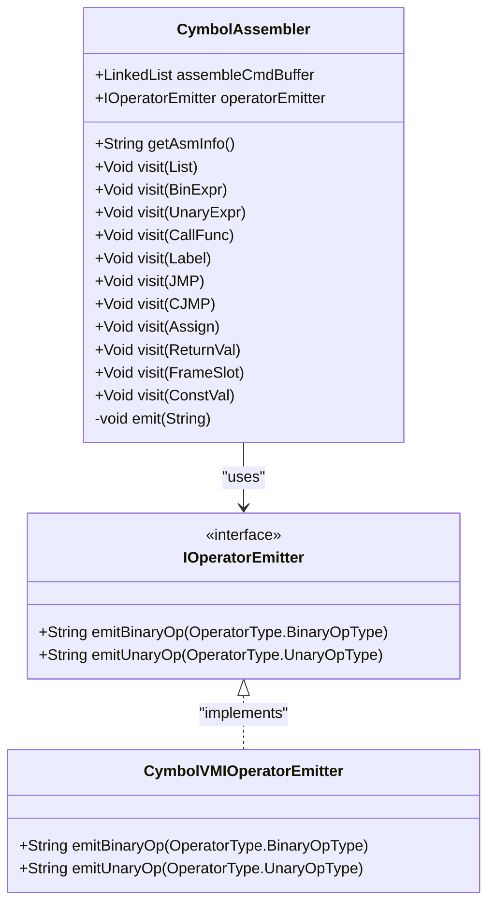
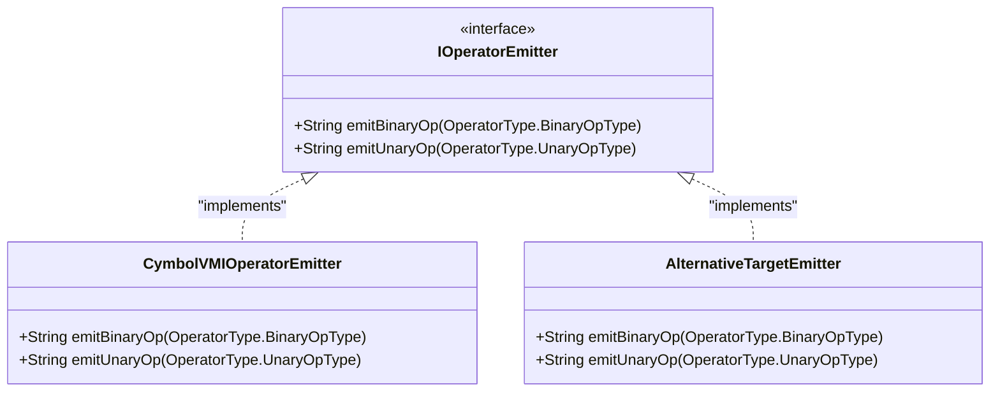
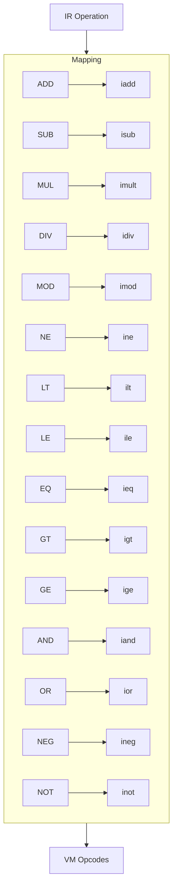
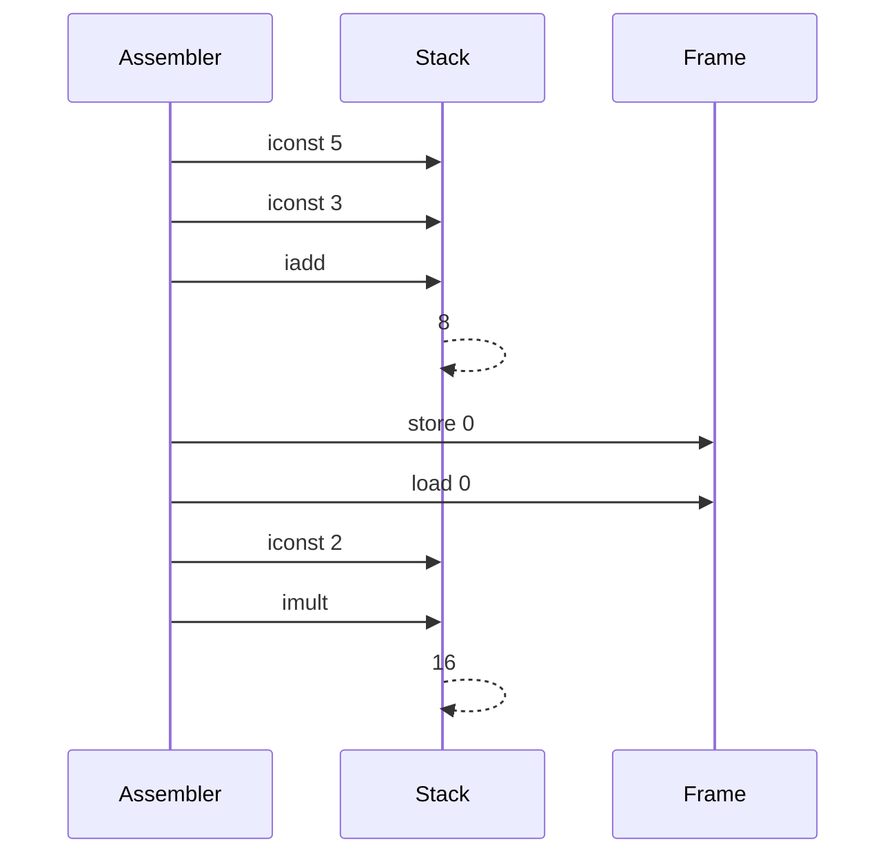
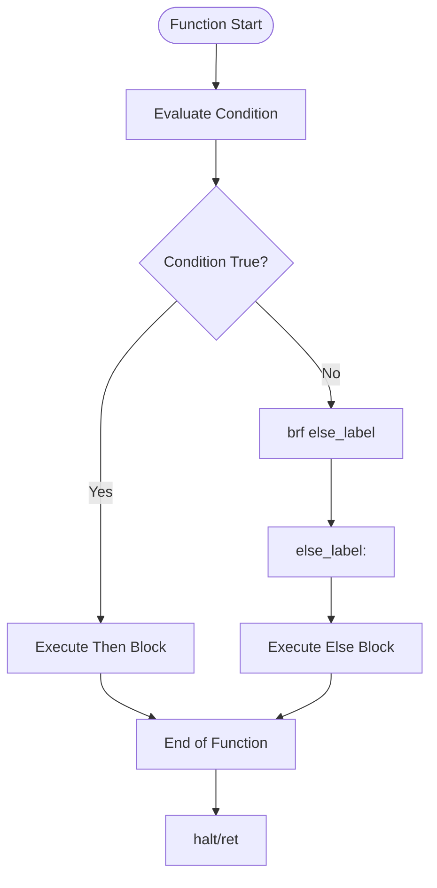
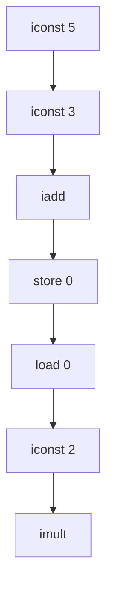

# Code Generation Phase

<cite>
**Referenced Files in This Document**   
- [CymbolAssembler.java](file://ep20/src/main/java/org/teachfx/antlr4/ep20/pass/codegen/CymbolAssembler.java)
- [IOperatorEmitter.java](file://ep20/src/main/java/org/teachfx/antlr4/ep20/pass/codegen/IOperatorEmitter.java)
- [CymbolVMIOperatorEmitter.java](file://ep20/src/main/java/org/teachfx/antlr4/ep20/pass/codegen/CymbolVMIOperatorEmitter.java)
- [BytecodeDefinition.java](file://ep18/src/main/java/org/teachfx/antlr4/ep18/stackvm/BytecodeDefinition.java)
- [ByteCodeAssembler.java](file://ep18/src/main/java/org/teachfx/antlr4/ep18/stackvm/ByteCodeAssembler.java)
</cite>

## Table of Contents
1. [Introduction](#introduction)
2. [CymbolAssembler Implementation](#cymbolassembler-implementation)
3. [IOperatorEmitter Interface Abstraction](#ioperatoremitter-interface-abstraction)
4. [IR to VM Opcode Mapping](#ir-to-vm-opcode-mapping)
5. [Stack Management Strategies](#stack-management-strategies)
6. [Label Resolution for Control Flow](#label-resolution-for-control-flow)
7. [Generated Assembly Examples](#generated-assembly-examples)
8. [Instruction Selection and Code Efficiency](#instruction-selection-and-code-efficiency)
9. [Conclusion](#conclusion)

## Introduction
This document details the code generation phase in the Cymbol compiler implementation, focusing on how optimized Intermediate Representation (IR) is translated into stack-based virtual machine instructions. The process involves the CymbolAssembler component, which traverses the IR and emits corresponding VM opcodes through an abstraction layer provided by the IOperatorEmitter interface. The design supports target-specific instruction emission while maintaining a clean separation between IR processing and code generation concerns.

## CymbolAssembler Implementation

The CymbolAssembler class serves as the primary code generator, implementing the IRVisitor pattern to traverse and transform optimized IR into stack-based assembly instructions. It maintains an instruction buffer and manages indentation levels for readable output formatting.

The assembler processes both expression and statement nodes in the IR, emitting appropriate VM instructions based on the operation type. It handles arithmetic operations, function calls, control flow constructs, and variable access through frame slot management.

**Diagram sources**
- [CymbolAssembler.java](file://ep20/src/main/java/org/teachfx/antlr4/ep20/pass/codegen/CymbolAssembler.java#L1-L154)
- [IOperatorEmitter.java](file://ep20/src/main/java/org/teachfx/antlr4/ep20/pass/codegen/IOperatorEmitter.java#L1-L10)
- [CymbolVMIOperatorEmitter.java](file://ep20/src/main/java/org/teachfx/antlr4/ep20/pass/codegen/CymbolVMIOperatorEmitter.java#L1-L64)

**Section sources**
- [CymbolAssembler.java](file://ep20/src/main/java/org/teachfx/antlr4/ep20/pass/codegen/CymbolAssembler.java#L1-L154)

## IOperatorEmitter Interface Abstraction

The IOperatorEmitter interface provides an abstraction layer for instruction emission, allowing the code generator to remain independent of specific target VM instruction sets. This design enables support for multiple backends through different implementations of the interface.

The interface defines two core methods: emitBinaryOp for binary operations and emitUnaryOp for unary operations. These methods take operator type enums as parameters and return the corresponding opcode string for the target VM.

This abstraction facilitates code reuse and simplifies adding support for new targets by implementing the interface for different instruction sets without modifying the core assembler logic.

**Diagram sources**
- [IOperatorEmitter.java](file://ep20/src/main/java/org/teachfx/antlr4/ep20/pass/codegen/IOperatorEmitter.java#L1-L10)
- [CymbolVMIOperatorEmitter.java](file://ep20/src/main/java/org/teachfx/antlr4/ep20/pass/codegen/CymbolVMIOperatorEmitter.java#L1-L64)

**Section sources**
- [IOperatorEmitter.java](file://ep20/src/main/java/org/teachfx/antlr4/ep20/pass/codegen/IOperatorEmitter.java#L1-L10)

## IR to VM Opcode Mapping

The code generation process maps IR operations to specific VM opcodes defined in the BytecodeDefinition class. The CymbolVMIOperatorEmitter implementation translates high-level operator types to their corresponding stack machine instructions.

Binary operations such as addition, subtraction, multiplication, and division are mapped to iadd, isub, imult, and idiv opcodes respectively. Comparison operations (less than, equal, etc.) are translated to ilt, ieq, and related conditional opcodes. Logical operations AND and OR map to iand and ior instructions.

Unary operations like negation and logical NOT are converted to ineg and inot opcodes. The mapping ensures that the semantic meaning of the IR operations is preserved in the generated assembly code.

**Diagram sources**
- [CymbolVMIOperatorEmitter.java](file://ep20/src/main/java/org/teachfx/antlr4/ep20/pass/codegen/CymbolVMIOperatorEmitter.java#L4-L63)
- [BytecodeDefinition.java](file://ep18/src/main/java/org/teachfx/antlr4/ep18/stackvm/BytecodeDefinition.java#L1-L136)

**Section sources**
- [CymbolVMIOperatorEmitter.java](file://ep20/src/main/java/org/teachfx/antlr4/ep20/pass/codegen/CymbolVMIOperatorEmitter.java#L4-L63)

## Stack Management Strategies

The code generator employs a stack-based management strategy consistent with the virtual machine architecture. Values are pushed onto the stack through load and const instructions, and operations consume operands from the stack, leaving results for subsequent operations.

Local variables are accessed through frame slots, with the assembler emitting load and store instructions to move values between the stack and variable storage locations. Constant values are pushed directly onto the stack using appropriate const instructions (iconst for integers, sconst for strings, bconst for booleans).

The assembler maintains proper stack discipline by ensuring that operations have the required operands available and that results are properly positioned for consumption by subsequent instructions. This approach enables efficient code generation while maintaining compatibility with the stack-based execution model.

**Diagram sources**
- [CymbolAssembler.java](file://ep20/src/main/java/org/teachfx/antlr4/ep20/pass/codegen/CymbolAssembler.java#L1-L154)
- [BytecodeDefinition.java](file://ep18/src/main/java/org/teachfx/antlr4/ep18/stackvm/BytecodeDefinition.java#L1-L136)

**Section sources**
- [CymbolAssembler.java](file://ep20/src/main/java/org/teachfx/antlr4/ep20/pass/codegen/CymbolAssembler.java#L1-L154)

## Label Resolution for Control Flow

Control flow instructions are managed through label resolution, where the assembler handles both forward and backward jumps. Labels are emitted with appropriate prefixes and indentation to maintain code readability.

Conditional and unconditional jumps are translated to br, brt, and brf instructions. The assembler processes CJMP (conditional jump) statements by emitting brf instructions that branch to the else block when the condition is false.

Function entry points are handled as special labels that reset the indentation level and mark the beginning of function definitions. The label resolution system ensures that all jump targets are properly defined and that control flow is accurately represented in the generated assembly.

**Diagram sources**
- [CymbolAssembler.java](file://ep20/src/main/java/org/teachfx/antlr4/ep20/pass/codegen/CymbolAssembler.java#L1-L154)

**Section sources**
- [CymbolAssembler.java](file://ep20/src/main/java/org/teachfx/antlr4/ep20/pass/codegen/CymbolAssembler.java#L1-L154)

## Generated Assembly Examples

The code generator produces assembly code that reflects the structure and semantics of the source program. For arithmetic expressions, the assembler emits a sequence of load, const, and operation instructions that implement the required computation.

Function calls are translated to call instructions with the function name, while built-in functions are emitted without the call prefix. Return statements generate ret instructions for regular functions and halt for the main entry point.

The following examples illustrate the generated assembly for common constructs:

**Diagram sources**
- [CymbolAssembler.java](file://ep20/src/main/java/org/teachfx/antlr4/ep20/pass/codegen/CymbolAssembler.java#L1-L154)

**Section sources**
- [CymbolAssembler.java](file://ep20/src/main/java/org/teachfx/antlr4/ep20/pass/codegen/CymbolAssembler.java#L1-L154)

## Instruction Selection and Code Efficiency

The code generation process considers instruction selection, code density, and execution efficiency. The assembler produces compact code by directly mapping IR operations to optimal VM instructions without unnecessary intermediate steps.

Code density is maximized by using appropriate instruction forms and minimizing redundant operations. The stack-based model inherently promotes compact code as operations implicitly use stack operands rather than requiring explicit addressing.

Execution efficiency is achieved through direct mapping of high-level operations to native VM instructions, avoiding interpretation overhead. The use of frame slots for local variables enables efficient access patterns, while the constant pool system optimizes storage of repeated values.

The abstraction provided by IOperatorEmitter allows for target-specific optimizations in instruction selection, enabling different emitter implementations to choose the most efficient instruction sequences for their respective targets.

**Section sources**
- [CymbolAssembler.java](file://ep20/src/main/java/org/teachfx/antlr4/ep20/pass/codegen/CymbolAssembler.java#L1-L154)
- [CymbolVMIOperatorEmitter.java](file://ep20/src/main/java/org/teachfx/antlr4/ep20/pass/codegen/CymbolVMIOperatorEmitter.java#L1-L64)

## Conclusion
The code generation phase effectively translates optimized IR into efficient stack-based virtual machine instructions through the CymbolAssembler component. The design leverages the IOperatorEmitter interface to abstract instruction emission, enabling target independence while maintaining clean separation of concerns. The implementation demonstrates effective stack management, accurate label resolution for control flow, and optimal instruction selection for code density and execution efficiency. This approach provides a solid foundation for generating high-quality assembly code from high-level language constructs.