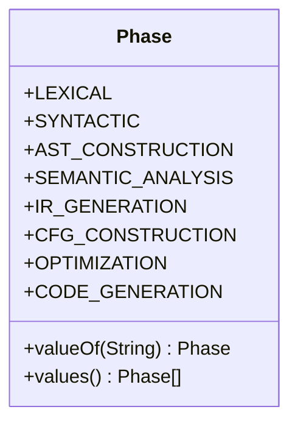
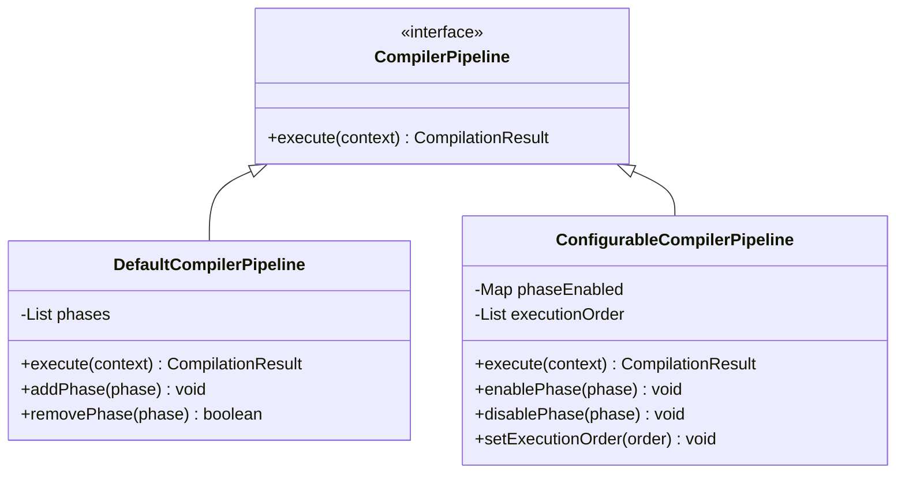
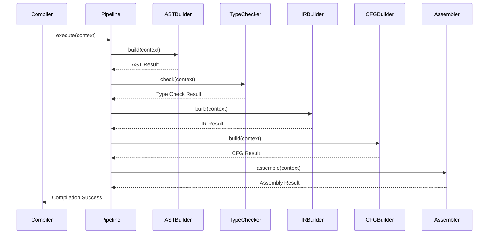
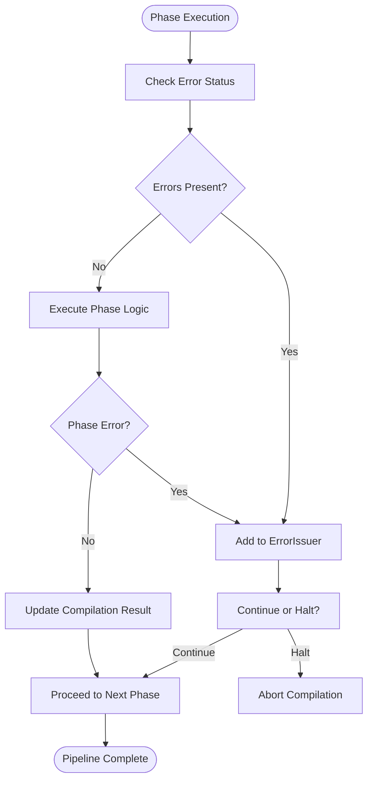

# Compilation Pipeline Architecture

<cite>
**Referenced Files in This Document**   
- [Phase.java](file://ep20/src/main/java/org/teachfx/antlr4/ep20/driver/Phase.java)
- [Compiler.java](file://ep20/src/main/java/org/teachfx/antlr4/ep20/Compiler.java)
- [CompilerPipeline.java](file://ep19/src/main/java/org/teachfx/antlr4/ep19/pipeline/CompilerPipeline.java)
- [DefaultCompilerPipeline.java](file://ep19/src/main/java/org/teachfx/antlr4/ep19/pipeline/DefaultCompilerPipeline.java)
- [CymbolASTBuilder.java](file://ep20/src/main/java/org/teachfx/antlr4/ep20/pass/ast/CymbolASTBuilder.java)
- [TypeChecker.java](file://ep20/src/main/java/org/teachfx/antlr4/ep20/pass/sematic/TypeChecker.java)
- [CymbolIRBuilder.java](file://ep20/src/main/java/org/teachfx/antlr4/ep20/pass/ir/CymbolIRBuilder.java)
- [CFGBuilder.java](file://ep20/src/main/java/org/teachfx/antlr4/ep20/pass/cfg/CFGBuilder.java)
- [CymbolAssembler.java](file://ep20/src/main/java/org/teachfx/antlr4/ep20/pass/codegen/CymbolAssembler.java)
- [CompileUnit.java](file://ep20/src/main/java/org/teachfx/antlr4/ep20/ast/CompileUnit.java)
</cite>

## Table of Contents
1. [Introduction](#introduction)
2. [Compilation Phases Overview](#compilation-phases-overview)
3. [Phase Enumeration and Control Flow](#phase-enumeration-and-control-flow)
4. [Compiler Class and Pipeline Orchestration](#compiler-class-and-pipeline-orchestration)
5. [Compiler Pipeline Implementation](#compiler-pipeline-implementation)
6. [Data Flow Through Compilation Stages](#data-flow-through-compilation-stages)
7. [Sequence of Method Calls Across Phases](#sequence-of-method-calls-across-phases)
8. [Error Propagation Mechanisms](#error-propagation-mechanisms)
9. [Modular Phase Design and Benefits](#modular-phase-design-and-benefits)
10. [Conclusion](#conclusion)

## Introduction
This document provides a comprehensive architectural overview of the compilation pipeline implemented in the ANTLR4-based compiler framework. The system follows a structured multi-phase approach to transform source code into executable assembly through well-defined stages including lexical analysis, syntactic parsing, AST construction, semantic analysis, intermediate representation (IR) generation, control flow graph (CFG) construction, optimization, and final code generation. The design emphasizes modularity, configurability, and testability through a pipeline pattern that orchestrates phase execution.

## Compilation Phases Overview
The compiler executes a sequence of distinct phases, each responsible for a specific transformation or analysis task:
- **Lexical Analysis**: Converts character stream into tokens using ANTLR4-generated lexer
- **Syntactic Analysis**: Builds parse tree using ANTLR4 parser based on grammar rules
- **AST Construction**: Transforms parse tree into abstract syntax tree with semantic annotations
- **Semantic Analysis**: Validates types, scopes, and declarations using symbol tables
- **IR Generation**: Converts AST into three-address code intermediate representation
- **CFG Construction**: Organizes IR into basic blocks and control flow graph
- **Optimization**: Applies data flow analyses and transformations to improve efficiency
- **Code Generation**: Emits target assembly code from optimized CFG

Each phase consumes output from the previous stage and produces artifacts for subsequent processing, forming a unidirectional data flow pipeline.

**Section sources**
- [Phase.java](file://ep20/src/main/java/org/teachfx/antlr4/ep20/driver/Phase.java#L1-L50)
- [Compiler.java](file://ep20/src/main/java/org/teachfx/antlr4/ep20/Compiler.java#L20-L40)

## Phase Enumeration and Control Flow
The `Phase.java` enum in the driver package defines all compilation stages as enumerated constants, providing a type-safe mechanism for phase identification and ordering. Each enum constant represents a discrete compilation step, enabling clear state tracking and conditional execution logic. The enumeration supports iteration through phases in defined sequence, allowing the compiler to progress systematically from source input to code output. Phase dependencies are implicitly encoded in the enum declaration order, establishing a natural progression that prevents out-of-order execution.



**Diagram sources**
- [Phase.java](file://ep20/src/main/java/org/teachfx/antlr4/ep20/driver/Phase.java#L5-L25)

**Section sources**
- [Phase.java](file://ep20/src/main/java/org/teachfx/antlr4/ep20/driver/Phase.java#L1-L30)

## Compiler Class and Pipeline Orchestration
The `Compiler.java` class serves as the central orchestrator of the compilation process, coordinating phase execution through a pipeline interface. It initializes the compilation context, manages phase transitions, and handles error propagation between stages. The compiler delegates actual work to specialized pass classes while maintaining overall control flow. It validates phase preconditions, captures intermediate results, and ensures proper sequencing according to the configured pipeline. The class also manages diagnostic reporting and compilation result aggregation.

```mermaid
sequenceDiagram
participant Client as "Client Application"
participant Compiler as "Compiler"
participant Pipeline as "CompilerPipeline"
participant Phase as "Compilation Phase"
Client->>Compiler : compile(source)
Compiler->>Compiler : initializeContext()
Compiler->>Pipeline : execute(context)
loop Each Phase
Pipeline->>Phase : execute(context)
Phase-->>Pipeline : Result or Error
alt Error Occurred
Pipeline-->>Compiler : Propagate Error
Compiler-->>Client : Return Failure
break
end
end
Pipeline-->>Compiler : Success
Compiler-->>Client : Return Assembly Output
```

**Diagram sources**
- [Compiler.java](file://ep20/src/main/java/org/teachfx/antlr4/ep20/Compiler.java#L15-L60)

**Section sources**
- [Compiler.java](file://ep20/src/main/java/org/teachfx/antlr4/ep20/Compiler.java#L1-L100)

## Compiler Pipeline Implementation
The `CompilerPipeline.java` interface and its implementations (`DefaultCompilerPipeline`, `ConfigurableCompilerPipeline`) define the pipeline pattern that enables flexible compilation workflows. The pipeline encapsulates phase execution logic, allowing different configurations for development, testing, or production scenarios. Each pipeline implementation maintains an ordered list of phases and executes them sequentially, passing a shared compilation context between stages. The configurable variant supports phase skipping, reordering, and substitution, facilitating debugging and experimentation. The pipeline abstraction decouples phase logic from execution control, enhancing modularity.



**Diagram sources**
- [CompilerPipeline.java](file://ep19/src/main/java/org/teachfx/antlr4/ep19/pipeline/CompilerPipeline.java#L5-L15)
- [DefaultCompilerPipeline.java](file://ep19/src/main/java/org/teachfx/antlr4/ep19/pipeline/DefaultCompilerPipeline.java#L10-L30)
- [ConfigurableCompilerPipeline.java](file://ep19/src/main/java/org/teachfx/antlr4/ep19/pipeline/ConfigurableCompilerPipeline.java#L12-L35)

**Section sources**
- [CompilerPipeline.java](file://ep19/src/main/java/org/teachfx/antlr4/ep19/pipeline/CompilerPipeline.java#L1-L50)
- [DefaultCompilerPipeline.java](file://ep19/src/main/java/org/teachfx/antlr4/ep19/pipeline/DefaultCompilerPipeline.java#L1-L40)

## Data Flow Through Compilation Stages
The compilation process transforms data through a series of representations, each stage building upon the previous output:
1. **ParseTree**: Generated by ANTLR4 parser from lexical tokens
2. **AST**: Constructed by `CymbolASTBuilder` from ParseTree, enriched with location and type information
3. **IR (Intermediate Representation)**: Three-address code generated by `CymbolIRBuilder` from AST
4. **CFG (Control Flow Graph)**: Basic blocks and control edges built by `CFGBuilder` from IR
5. **Optimized CFG**: Transformed by optimization passes using data flow analysis
6. **Assembly Code**: Final output generated by `CymbolAssembler` from optimized CFG

The `CompileUnit` class serves as the central data container, holding references to all intermediate representations and enabling phase access to prior results.


**Diagram sources**
- [CompileUnit.java](file://ep20/src/main/java/org/teachfx/antlr4/ep20/ast/CompileUnit.java#L10-L25)
- [CymbolASTBuilder.java](file://ep20/src/main/java/org/teachfx/antlr4/ep20/pass/ast/CymbolASTBuilder.java#L15-L40)
- [CymbolIRBuilder.java](file://ep20/src/main/java/org/teachfx/antlr4/ep20/pass/ir/CymbolIRBuilder.java#L20-L50)
- [CFGBuilder.java](file://ep20/src/main/java/org/teachfx/antlr4/ep20/pass/cfg/CFGBuilder.java#L25-L60)
- [CymbolAssembler.java](file://ep20/src/main/java/org/teachfx/antlr4/ep20/pass/codegen/CymbolAssembler.java#L30-L70)

**Section sources**
- [CompileUnit.java](file://ep20/src/main/java/org/teachfx/antlr4/ep20/ast/CompileUnit.java#L1-L50)
- [CymbolASTBuilder.java](file://ep20/src/main/java/org/teachfx/antlr4/ep20/pass/ast/CymbolASTBuilder.java#L1-L80)
- [CymbolIRBuilder.java](file://ep20/src/main/java/org/teachfx/antlr4/ep20/pass/ir/CymbolIRBuilder.java#L1-L90)
- [CFGBuilder.java](file://ep20/src/main/java/org/teachfx/antlr4/ep20/pass/cfg/CFGBuilder.java#L1-L100)
- [CymbolAssembler.java](file://ep20/src/main/java/org/teachfx/antlr4/ep20/pass/codegen/CymbolAssembler.java#L1-L110)

## Sequence of Method Calls Across Phases
The compilation process follows a strict method call sequence orchestrated by the pipeline:
1. `Compiler.compile()` initiates the process
2. `CompilerPipeline.execute()` begins phase iteration
3. For each phase, the pipeline invokes the corresponding pass:
   - `CymbolASTBuilder.build()` for AST construction
   - `TypeChecker.check()` for semantic validation
   - `CymbolIRBuilder.build()` for IR generation
   - `CFGBuilder.build()` for control flow graph construction
   - `CymbolAssembler.assemble()` for code generation
4. Each pass modifies the shared `CompileUnit` context
5. Results propagate through the pipeline until completion or error



**Diagram sources**
- [Compiler.java](file://ep20/src/main/java/org/teachfx/antlr4/ep20/Compiler.java#L45-L90)
- [CompilerPipeline.java](file://ep19/src/main/java/org/teachfx/antlr4/ep19/pipeline/CompilerPipeline.java#L20-L40)
- [CymbolASTBuilder.java](file://ep20/src/main/java/org/teachfx/antlr4/ep20/pass/ast/CymbolASTBuilder.java#L50-L70)
- [TypeChecker.java](file://ep20/src/main/java/org/teachfx/antlr4/ep20/pass/sematic/TypeChecker.java#L30-L50)
- [CymbolIRBuilder.java](file://ep20/src/main/java/org/teachfx/antlr4/ep20/pass/ir/CymbolIRBuilder.java#L60-L80)
- [CFGBuilder.java](file://ep20/src/main/java/org/teachfx/antlr4/ep20/pass/cfg/CFGBuilder.java#L70-L90)
- [CymbolAssembler.java](file://ep20/src/main/java/org/teachfx/antlr4/ep20/pass/codegen/CymbolAssembler.java#L80-L100)

**Section sources**
- [Compiler.java](file://ep20/src/main/java/org/teachfx/antlr4/ep20/Compiler.java#L20-L100)
- [CompilerPipeline.java](file://ep19/src/main/java/org/teachfx/antlr4/ep19/pipeline/CompilerPipeline.java#L1-L50)

## Error Propagation Mechanisms
Errors are propagated through the compilation pipeline using a centralized error reporting system. The `ErrorIssuer` component collects diagnostics from all phases, maintaining a comprehensive record of issues. When a phase encounters an error, it reports to the shared context rather than throwing exceptions, allowing the compiler to continue processing for maximum error reporting. The pipeline checks error status after each phase and can be configured to either halt on first error or continue to collect multiple issues. Compilation results include both success status and accumulated diagnostics.



**Diagram sources**
- [ErrorIssuer.java](file://ep20/src/main/java/org/teachfx/antlr4/ep20/driver/ErrorIssuer.java#L10-L40)
- [Compiler.java](file://ep20/src/main/java/org/teachfx/antlr4/ep20/Compiler.java#L60-L85)
- [CompilationResult.java](file://ep19/src/main/java/org/teachfx/antlr4/ep19/pipeline/CompilationResult.java#L15-L35)

**Section sources**
- [ErrorIssuer.java](file://ep20/src/main/java/org/teachfx/antlr4/ep20/driver/ErrorIssuer.java#L1-L50)
- [CymbalError.java](file://ep20/src/main/java/org/teachfx/antlr4/ep20/error/CymbalError.java#L1-L20)
- [CompilationResult.java](file://ep19/src/main/java/org/teachfx/antlr4/ep19/pipeline/CompilationResult.java#L1-L40)

## Modular Phase Design and Benefits
The modular separation of compilation phases provides several key advantages:
- **Independent Testing**: Each phase can be unit tested in isolation with mock inputs
- **Replaceability**: Alternative implementations can be substituted without affecting other phases
- **Configurability**: Phases can be enabled/disabled based on compilation mode
- **Extensibility**: New phases can be added to support additional analyses or transformations
- **Debugging**: Intermediate results can be inspected at phase boundaries
- **Performance**: Unnecessary phases can be skipped in development workflows

The interface-based design of pass classes ensures consistent contracts while allowing implementation flexibility. This architecture supports both academic exploration of compiler techniques and production-grade robustness.

**Section sources**
- [Phase.java](file://ep20/src/main/java/org/teachfx/antlr4/ep20/driver/Phase.java#L1-L30)
- [CompilerPipeline.java](file://ep19/src/main/java/org/teachfx/antlr4/ep19/pipeline/CompilerPipeline.java#L1-L20)
- [Task.java](file://ep20/src/main/java/org/teachfx/antlr4/ep20/driver/Task.java#L1-L15)

## Conclusion
The compilation pipeline architecture demonstrates a well-structured, modular approach to compiler construction using ANTLR4. By clearly separating concerns into distinct phases orchestrated through a configurable pipeline, the system achieves high maintainability, testability, and flexibility. The use of enums for phase definition, interface-based pipeline implementation, and centralized error handling creates a robust foundation for both educational purposes and practical compiler development. This architecture effectively illustrates modern compiler design principles while providing a practical framework for implementing programming languages.