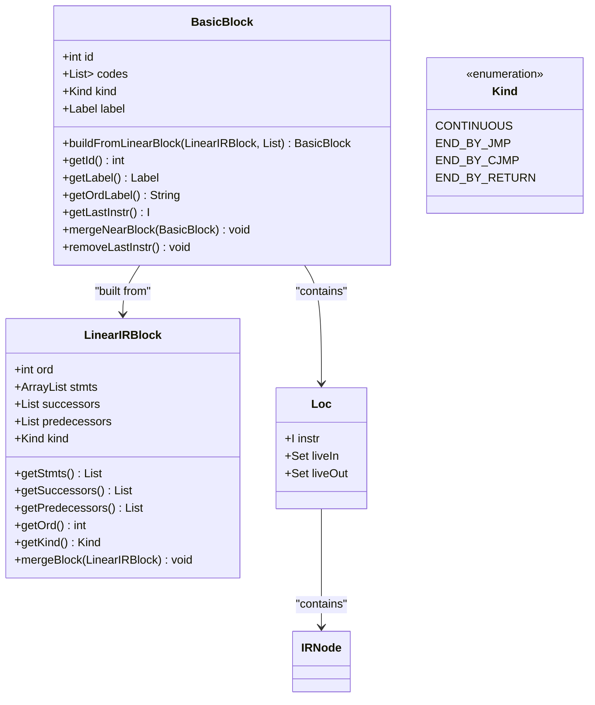
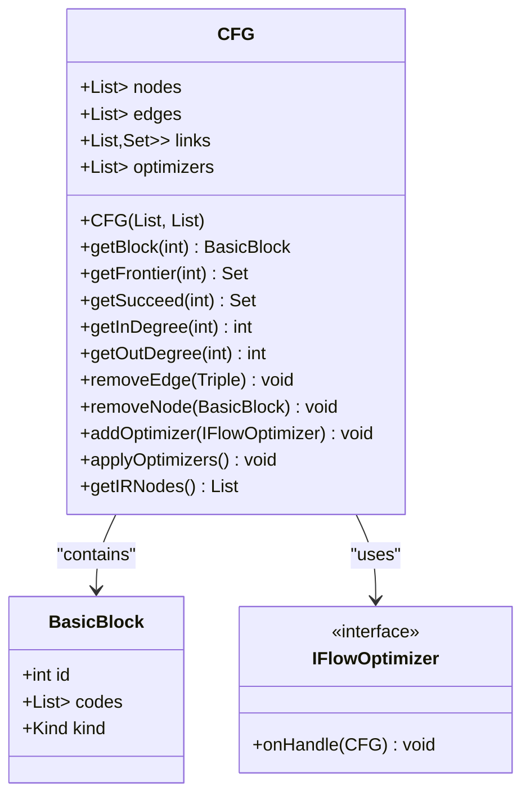
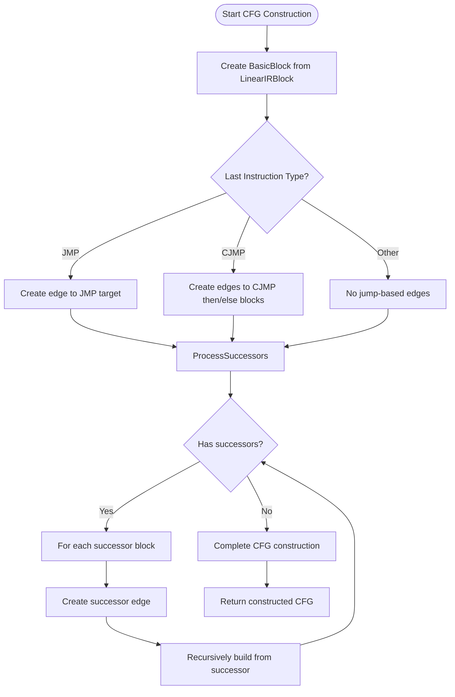
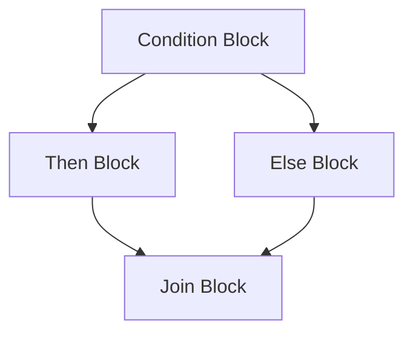
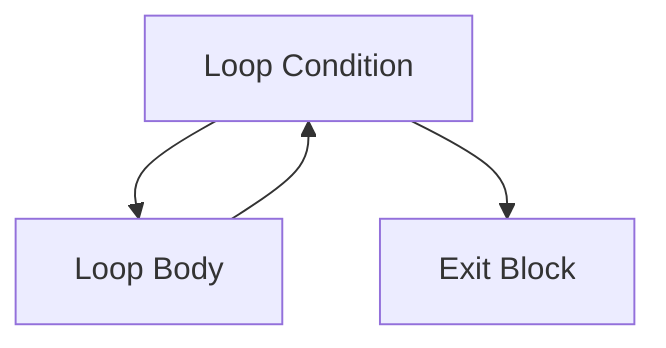
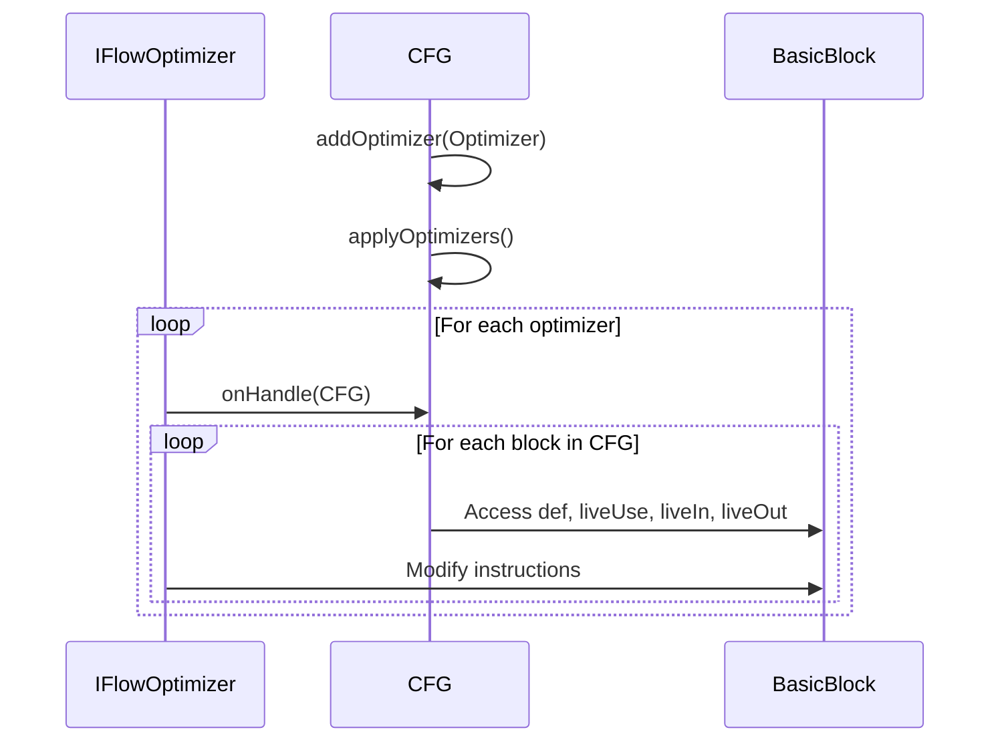

# Control Flow Graph Construction Phase

<cite>
**Referenced Files in This Document**   
- [CFGBuilder.java](file://ep20/src/main/java/org/teachfx/antlr4/ep20/pass/cfg/CFGBuilder.java)
- [CFG.java](file://ep20/src/main/java/org/teachfx/antlr4/ep20/pass/cfg/CFG.java)
- [BasicBlock.java](file://ep20/src/main/java/org/teachfx/antlr4/ep20/pass/cfg/BasicBlock.java)
- [LinearIRBlock.java](file://ep20/src/main/java/org/teachfx/antlr4/ep20/pass/cfg/LinearIRBlock.java)
- [CJMP.java](file://ep20/src/main/java/org/teachfx/antlr4/ep20/ir/stmt/CJMP.java)
- [JMP.java](file://ep20/src/main/java/org/teachfx/antlr4/ep20/ir/stmt/JMP.java)
- [Loc.java](file://ep20/src/main/java/org/teachfx/antlr4/ep20/pass/cfg/Loc.java)
</cite>

## Table of Contents
1. [Introduction](#introduction)
2. [Linear IR to BasicBlock Transformation](#linear-ir-to-basicblock-transformation)
3. [Control Flow Graph Representation](#control-flow-graph-representation)
4. [CFG Construction Algorithm](#cfg-construction-algorithm)
5. [Visual Examples of Control Structures](#visual-examples-of-control-structures)
6. [Optimization Applications](#optimization-applications)
7. [Structured Control Flow Preservation](#structured-control-flow-preservation)

## Introduction
The Control Flow Graph (CFG) construction phase is a critical component in the compiler's intermediate representation (IR) processing pipeline. This phase transforms linear IR code into a structured graph representation that captures the program's control flow semantics. The CFG serves as the foundation for subsequent optimization passes and code generation, enabling sophisticated program analysis through its explicit representation of basic blocks and control flow edges.

**Section sources**
- [CFGBuilder.java](file://ep20/src/main/java/org/teachfx/antlr4/ep20/pass/cfg/CFGBuilder.java#L1-L64)
- [CFG.java](file://ep20/src/main/java/org/teachfx/antlr4/ep20/pass/cfg/CFG.java#L1-L159)

## Linear IR to BasicBlock Transformation

The CFG construction process begins with partitioning linear IR into BasicBlock units. Each BasicBlock represents a sequence of instructions with a single entry point and a single exit point, forming the fundamental building blocks of the control flow graph. The transformation from LinearIRBlock to BasicBlock is handled by the `BasicBlock.buildFromLinearBlock()` static method, which creates a BasicBlock instance from a LinearIRBlock while preserving its instruction sequence, label, and ordinal identifier.

Basic blocks are categorized by their termination type, represented by the `Kind` enumeration:
- **CONTINUOUS**: Blocks ending with non-terminating instructions
- **END_BY_JMP**: Blocks ending with unconditional jumps
- **END_BY_CJMP**: Blocks ending with conditional jumps
- **END_BY_RETURN**: Blocks ending with return instructions

The transformation process preserves the instruction sequence while establishing the block's structural properties, including its unique identifier (id), instruction list (codes), and control flow characteristics. The `dropLabelSeq()` method provides access to the instruction sequence excluding the initial label, while `allSeq()` returns the complete instruction sequence based on the block's kind.

**Diagram sources**
- [BasicBlock.java](file://ep20/src/main/java/org/teachfx/antlr4/ep20/pass/cfg/BasicBlock.java#L1-L131)
- [LinearIRBlock.java](file://ep20/src/main/java/org/teachfx/antlr4/ep20/pass/cfg/LinearIRBlock.java#L1-L237)
- [Loc.java](file://ep20/src/main/java/org/teachfx/antlr4/ep20/pass/cfg/Loc.java#L1-L31)

**Section sources**
- [BasicBlock.java](file://ep20/src/main/java/org/teachfx/antlr4/ep20/pass/cfg/BasicBlock.java#L1-L131)
- [LinearIRBlock.java](file://ep20/src/main/java/org/teachfx/antlr4/ep20/pass/cfg/LinearIRBlock.java#L1-L237)

## Control Flow Graph Representation

The CFG class provides a comprehensive representation of the control flow graph, encapsulating both the structural and analytical aspects of the program's control flow. The graph consists of nodes (BasicBlock instances) and directed edges representing control flow transitions between blocks. The CFG maintains three primary data structures:
- **nodes**: List of BasicBlock instances indexed by their ordinal identifier
- **edges**: List of weighted edges represented as triples (source, destination, weight)
- **links**: Adjacency information mapping each node to its predecessors and successors

The CFG implementation provides essential graph operations for control flow analysis:
- **getFrontier(id)**: Returns the set of predecessor block IDs
- **getSucceed(id)**: Returns the set of successor block IDs  
- **getInDegree(id)**: Returns the number of incoming edges
- **getOutDegree(id)**: Returns the number of outgoing edges
- **getInEdges(key)**: Returns a stream of incoming edges

The graph supports modification operations such as `removeEdge()` and `removeNode()`, which maintain consistency between the edges list and adjacency information. Additionally, the CFG supports optimization passes through the `addOptimizer()` and `applyOptimizers()` methods, enabling extensible optimization frameworks.

**Diagram sources**
- [CFG.java](file://ep20/src/main/java/org/teachfx/antlr4/ep20/pass/cfg/CFG.java#L1-L159)
- [BasicBlock.java](file://ep20/src/main/java/org/teachfx/antlr4/ep20/pass/cfg/BasicBlock.java#L1-L131)

**Section sources**
- [CFG.java](file://ep20/src/main/java/org/teachfx/antlr4/ep20/pass/cfg/CFG.java#L1-L159)

## CFG Construction Algorithm

The CFG construction algorithm implemented in CFGBuilder.java follows a recursive traversal approach to build the control flow graph from linear IR blocks. The algorithm begins with a designated start block and recursively processes all reachable blocks, establishing control flow edges based on jump instructions and successor relationships.

The construction process involves three key steps:
1. **Block Creation**: Each LinearIRBlock is converted to a BasicBlock using `BasicBlock.buildFromLinearBlock()`
2. **Edge Identification**: Control flow edges are identified by examining the final instruction of each block
3. **Recursive Traversal**: Successor blocks are processed recursively to build the complete graph

For unconditional jumps (JMP), the algorithm creates a control flow edge from the current block to the target block specified in the jump instruction. For conditional jumps (CJMP), edges are created to both the then-block and else-block. Additional edges are created based on the successor relationships established in the LinearIRBlock structure.

The algorithm employs edge deduplication using a caching mechanism (`cachedEdgeLinks`) to prevent the creation of duplicate edges. Each edge is assigned a weight based on its type: 5 for jump-based edges and 10 for successor-based edges, providing differentiation between explicit jump targets and structural successors.

**Diagram sources**
- [CFGBuilder.java](file://ep20/src/main/java/org/teachfx/antlr4/ep20/pass/cfg/CFGBuilder.java#L1-L64)
- [JMP.java](file://ep20/src/main/java/org/teachfx/antlr4/ep20/ir/stmt/JMP.java#L1-L46)
- [CJMP.java](file://ep20/src/main/java/org/teachfx/antlr4/ep20/ir/stmt/CJMP.java#L1-L61)

**Section sources**
- [CFGBuilder.java](file://ep20/src/main/java/org/teachfx/antlr4/ep20/pass/cfg/CFGBuilder.java#L1-L64)

## Visual Examples of Control Structures

### If-Else Structure
The if-else control structure is represented as a diamond pattern in the CFG, with the condition block branching to both the then-block and else-block, which subsequently merge at a join point.

**Diagram sources**
- [CFG.java](file://ep20/src/main/java/org/teachfx/antlr4/ep20/pass/cfg/CFG.java#L1-L159)
- [CJMP.java](file://ep20/src/main/java/org/teachfx/antlr4/ep20/ir/stmt/CJMP.java#L1-L61)

### While Loop Structure
The while loop structure forms a cycle in the CFG, with the loop condition block branching to the loop body and exit block, and the loop body containing a back edge to the condition block.

**Diagram sources**
- [CFG.java](file://ep20/src/main/java/org/teachfx/antlr4/ep20/pass/cfg/CFG.java#L1-L159)
- [JMP.java](file://ep20/src/main/java/org/teachfx/antlr4/ep20/ir/stmt/JMP.java#L1-L46)

## Optimization Applications

The CFG serves as the foundation for numerous optimization passes, with liveness analysis and dead code elimination being two primary applications. Liveness analysis determines which variables are live (will be used) at each program point, enabling optimizations such as register allocation and dead code elimination.

The BasicBlock class includes fields specifically designed for data flow analysis:
- **def**: Set of operands defined in the block
- **liveUse**: Set of operands used before definition
- **liveIn**: Set of operands live at block entry
- **liveOut**: Set of operands live at block exit

These fields support iterative data flow algorithms that propagate liveness information across the control flow graph. Dead code elimination can then remove instructions that compute values that are never used, improving code efficiency.

The CFG's support for optimization passes through the IFlowOptimizer interface enables a modular optimization framework where multiple optimization algorithms can be applied sequentially to the same graph structure.

**Diagram sources**
- [CFG.java](file://ep20/src/main/java/org/teachfx/antlr4/ep20/pass/cfg/CFG.java#L1-L159)
- [BasicBlock.java](file://ep20/src/main/java/org/teachfx/antlr4/ep20/pass/cfg/BasicBlock.java#L1-L131)

**Section sources**
- [CFG.java](file://ep20/src/main/java/org/teachfx/antlr4/ep20/pass/cfg/CFG.java#L1-L159)
- [BasicBlock.java](file://ep20/src/main/java/org/teachfx/antlr4/ep20/pass/cfg/BasicBlock.java#L1-L131)

## Structured Control Flow Preservation

During the transformation from linear IR to CFG, structured control flow is preserved through careful handling of jump instructions and block relationships. The LinearIRBlock class maintains explicit successor and predecessor lists, ensuring that the structural relationships between blocks are maintained throughout the compilation process.

The merge operations in both LinearIRBlock and BasicBlock preserve control flow integrity:
- **LinearIRBlock.mergeBlock()**: Merges two adjacent blocks by combining their instruction sequences and updating successor/predecessor relationships
- **BasicBlock.mergeNearBlock()**: Merges two basic blocks by removing the jump instruction from the first block and appending the instructions from the second block (excluding its label)

These merge operations maintain the single-entry, single-exit property of basic blocks while optimizing the control flow graph structure. The preservation of structured control flow enables higher-level optimizations and ensures that the generated code maintains the intended program semantics.

**Section sources**
- [LinearIRBlock.java](file://ep20/src/main/java/org/teachfx/antlr4/ep20/pass/cfg/LinearIRBlock.java#L1-L237)
- [BasicBlock.java](file://ep20/src/main/java/org/teachfx/antlr4/ep20/pass/cfg/BasicBlock.java#L1-L131)