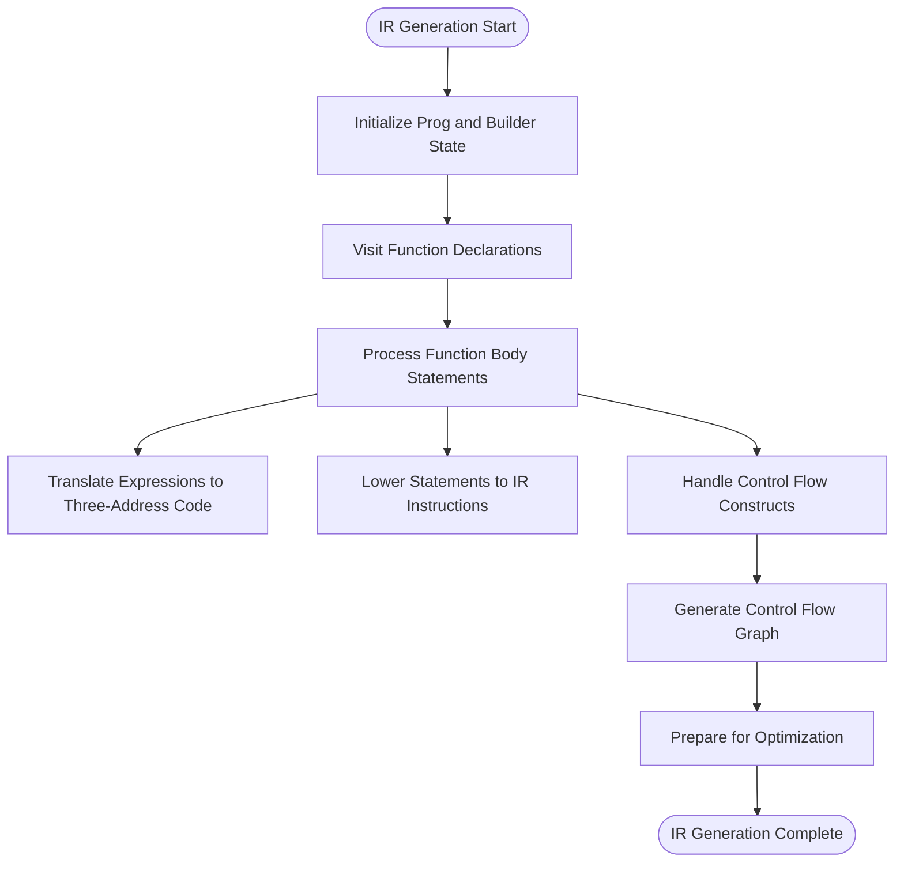
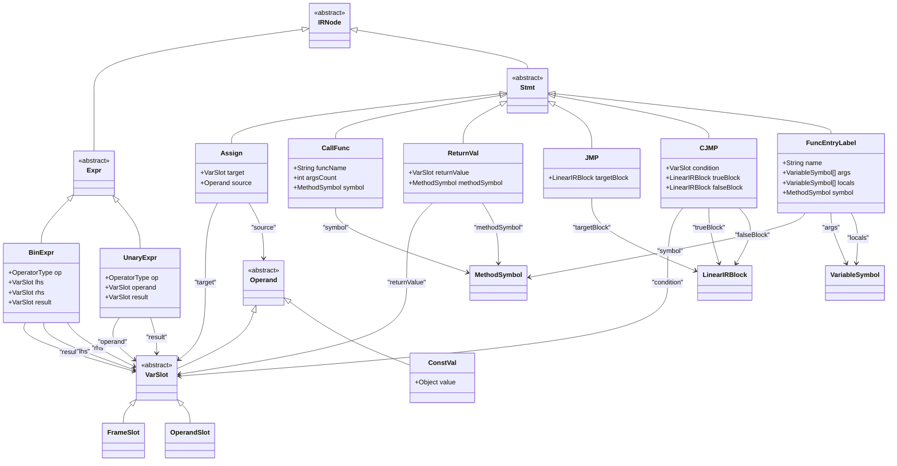
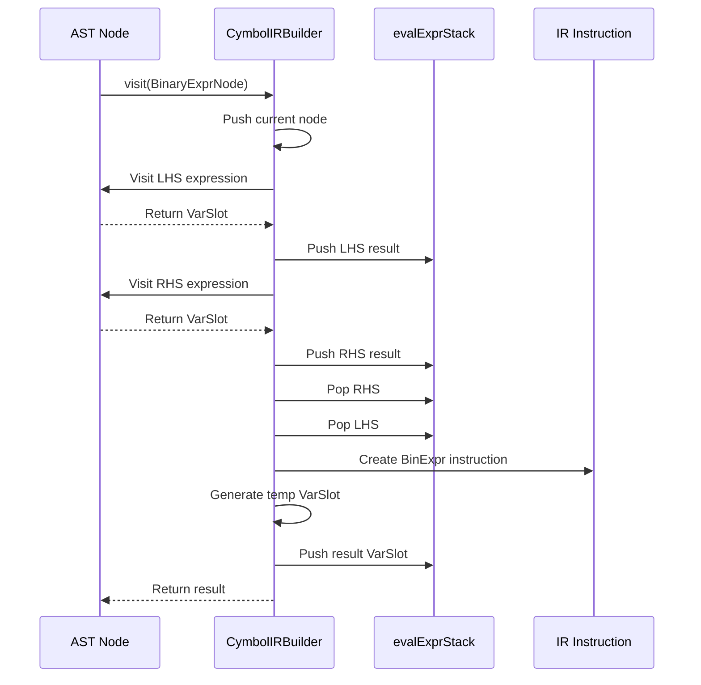
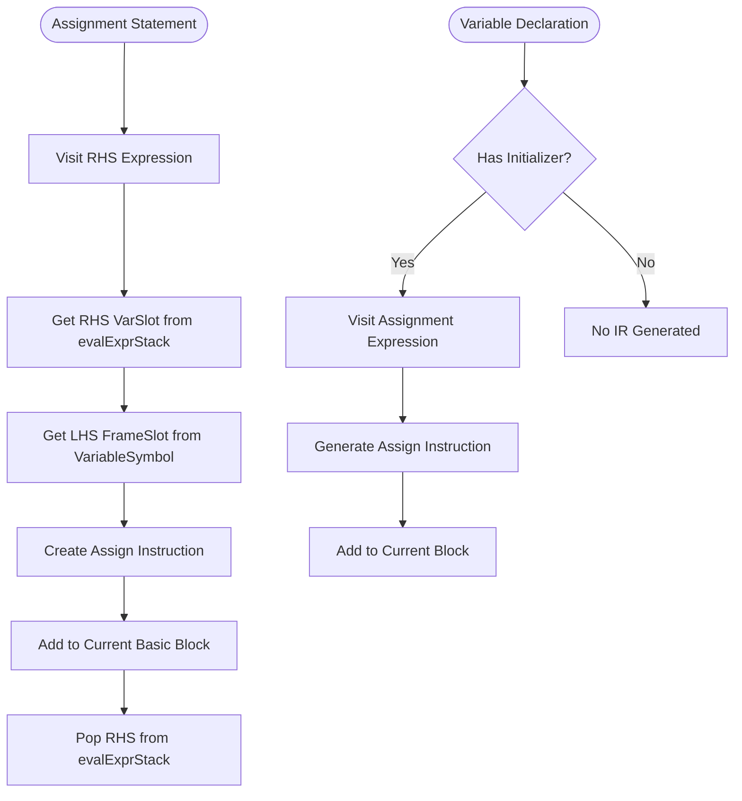
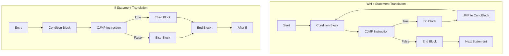
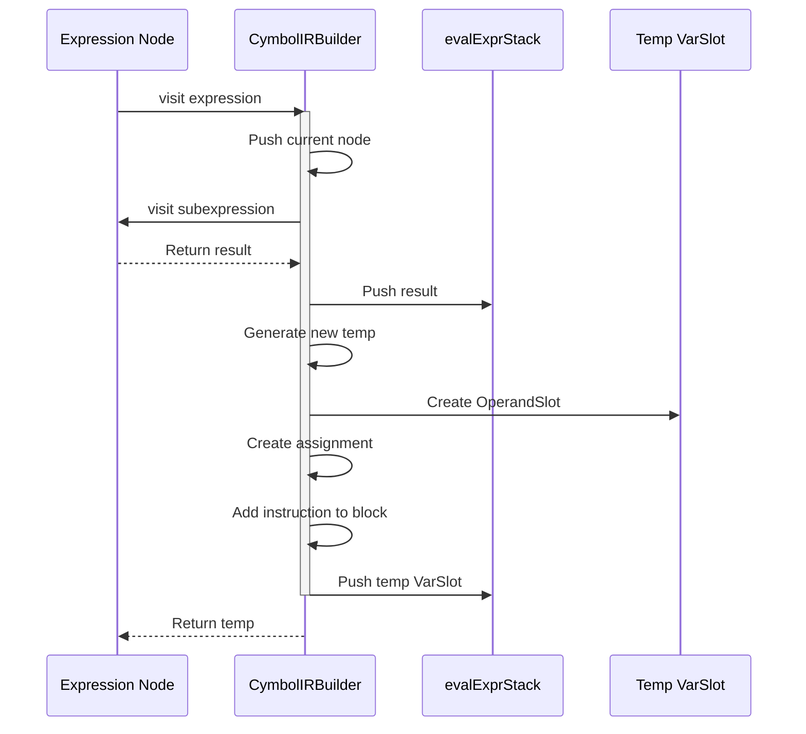
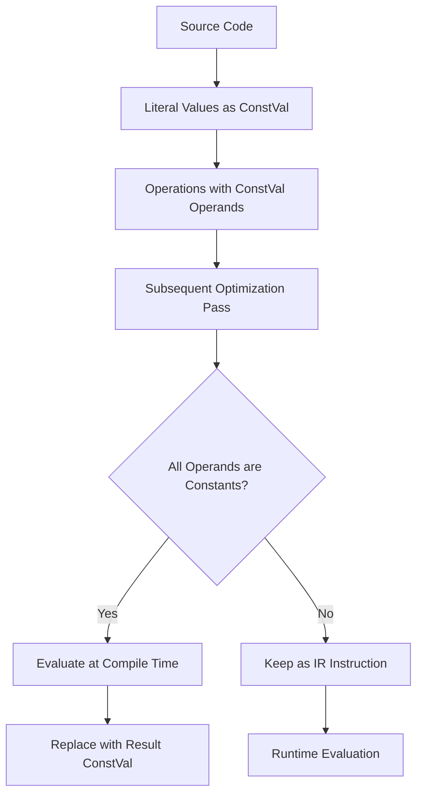
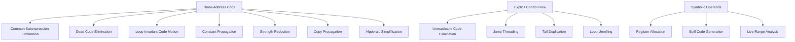

# Intermediate Representation Generation Phase

<cite>
**Referenced Files in This Document**   
- [CymbolIRBuilder.java](file://ep20/src/main/java/org/teachfx/antlr4/ep20/pass/ir/CymbolIRBuilder.java)
- [IRNode.java](file://ep20/src/main/java/org/teachfx/antlr4/ep20/ir/IRNode.java)
- [VarSlot.java](file://ep20/src/main/java/org/teachfx/antlr4/ep20/ir/expr/VarSlot.java)
- [OperandSlot.java](file://ep20/src/main/java/org/teachfx/antlr4/ep20/ir/expr/addr/OperandSlot.java)
- [ConstVal.java](file://ep20/src/main/java/org/teachfx/antlr4/ep20/ir/expr/val/ConstVal.java)
- [LinearIRBlock.java](file://ep20/src/main/java/org/teachfx/antlr4/ep20/pass/cfg/LinearIRBlock.java)
- [Prog.java](file://ep20/src/main/java/org/teachfx/antlr4/ep20/ir/Prog.java)
- [Assign.java](file://ep20/src/main/java/org/teachfx/antlr4/ep20/ir/stmt/Assign.java)
- [BinExpr.java](file://ep20/src/main/java/org/teachfx/antlr4/ep20/ir/expr/arith/BinExpr.java)
- [UnaryExpr.java](file://ep20/src/main/java/org/teachfx/antlr4/ep20/ir/expr/arith/UnaryExpr.java)
- [CJMP.java](file://ep20/src/main/java/org/teachfx/antlr4/ep20/ir/stmt/CJMP.java)
- [JMP.java](file://ep20/src/main/java/org/teachfx/antlr4/ep20/ir/stmt/JMP.java)
- [CallFunc.java](file://ep20/src/main/java/org/teachfx/antlr4/ep20/ir/expr/CallFunc.java)
- [ReturnVal.java](file://ep20/src/main/java/org/teachfx/antlr4/ep20/ir/stmt/ReturnVal.java)
- [FuncEntryLabel.java](file://ep20/src/main/java/org/teachfx/antlr4/ep20/ir/stmt/FuncEntryLabel.java)
- [FrameSlot.java](file://ep20/src/main/java/org/teachfx/antlr4/ep20/ir/expr/addr/FrameSlot.java)
</cite>

## Table of Contents
1. [Introduction](#introduction)
2. [IR Generation Process](#ir-generation-process)
3. [Intermediate Representation Structure](#intermediate-representation-structure)
4. [Expression Translation](#expression-translation)
5. [Statement Lowering](#statement-lowering)
6. [Control Flow Translation](#control-flow-translation)
7. [Temporary Variables and Operand Management](#temporary-variables-and-operand-management)
8. [Constant Folding and Optimization](#constant-folding-and-optimization)
9. [Platform-Independent Optimization Enablers](#platform-independent-optimization-enablers)
10. [Control Flow Analysis Preparation](#control-flow-analysis-preparation)
11. [Conclusion](#conclusion)

## Introduction
The Intermediate Representation (IR) generation phase in the Cymbol compiler transforms Abstract Syntax Tree (AST) nodes into a linear sequence of three-address code instructions. This phase serves as a crucial bridge between high-level language constructs and low-level machine code, enabling platform-independent optimizations and facilitating subsequent analysis phases. The CymbolIRBuilder class implements the visitor pattern to traverse the AST and generate IR nodes that represent arithmetic operations, boolean expressions, memory addressing, assignments, control flow, and function calls.

**Section sources**
- [CymbolIRBuilder.java](file://ep20/src/main/java/org/teachfx/antlr4/ep20/pass/ir/CymbolIRBuilder.java#L27-L63)

## IR Generation Process
The IR generation process begins with the visit method for CompileUnit, which initializes the Prog object and processes each function declaration. The CymbolIRBuilder implements the ASTVisitor interface with a return type of VarSlot for expression nodes and Void for statement nodes. As the visitor traverses the AST, it constructs a control flow graph composed of LinearIRBlock objects, each containing a sequence of IRNode subclasses. The builder maintains state through various stacks that manage break/continue targets and expression evaluation.

**Diagram sources**
- [CymbolIRBuilder.java](file://ep20/src/main/java/org/teachfx/antlr4/ep20/pass/ir/CymbolIRBuilder.java#L65-L75)

## Intermediate Representation Structure
The intermediate representation is built upon a hierarchy of IRNode subclasses that represent different types of operations. The structure includes expression nodes for arithmetic and boolean operations, statement nodes for assignments and control flow, and special nodes for function entry points and returns. Each IR instruction follows the three-address code format where at most three operands are involved in each operation, typically two sources and one destination.

**Diagram sources**
- [IRNode.java](file://ep20/src/main/java/org/teachfx/antlr4/ep20/ir/IRNode.java#L2-L4)
- [BinExpr.java](file://ep20/src/main/java/org/teachfx/antlr4/ep20/ir/expr/arith/BinExpr.java)
- [UnaryExpr.java](file://ep20/src/main/java/org/teachfx/antlr4/ep20/ir/expr/arith/UnaryExpr.java)
- [Assign.java](file://ep20/src/main/java/org/teachfx/antlr4/ep20/ir/stmt/Assign.java)
- [CallFunc.java](file://ep20/src/main/java/org/teachfx/antlr4/ep20/ir/expr/CallFunc.java)
- [ReturnVal.java](file://ep20/src/main/java/org/teachfx/antlr4/ep20/ir/stmt/ReturnVal.java)
- [JMP.java](file://ep20/src/main/java/org/teachfx/antlr4/ep20/ir/stmt/JMP.java)
- [CJMP.java](file://ep20/src/main/java/org/teachfx/antlr4/ep20/ir/stmt/CJMP.java)
- [FuncEntryLabel.java](file://ep20/src/main/java/org/teachfx/antlr4/ep20/ir/stmt/FuncEntryLabel.java)

## Expression Translation
The CymbolIRBuilder translates high-level expressions into three-address code by visiting expression nodes and generating appropriate IRNode instances. Arithmetic expressions are converted to BinExpr or UnaryExpr nodes, while literal values are represented as ConstVal instances. Variable references are handled through FrameSlot objects that represent their location in the activation frame. The builder uses an evaluation stack (evalExprStack) to manage intermediate results during expression translation.

**Diagram sources**
- [CymbolIRBuilder.java](file://ep20/src/main/java/org/teachfx/antlr4/ep20/pass/ir/CymbolIRBuilder.java#L122-L140)
- [BinExpr.java](file://ep20/src/main/java/org/teachfx/antlr4/ep20/ir/expr/arith/BinExpr.java)

## Statement Lowering
High-level statements are lowered into sequences of IR instructions that capture their semantics in a linear format. Assignment statements generate Assign nodes that transfer values between slots. Expression statements are translated by visiting the contained expression. Variable declarations with initializers are converted to assignment instructions. This lowering process transforms structured programming constructs into a flat sequence of operations that can be easily analyzed and optimized.

**Diagram sources**
- [CymbolIRBuilder.java](file://ep20/src/main/java/org/teachfx/antlr4/ep20/pass/ir/CymbolIRBuilder.java#L250-L267)
- [Assign.java](file://ep20/src/main/java/org/teachfx/antlr4/ep20/ir/stmt/Assign.java)

## Control Flow Translation
Control flow constructs such as if statements and while loops are translated into conditional and unconditional jumps using CJMP and JMP instructions. The builder creates basic blocks for different control flow paths and manages them through explicit block linking. For while loops, the translation creates a loop structure with condition checking, body execution, and back-edge jumping. Break and continue statements are handled using stacks that maintain the target blocks for these control transfers.

**Diagram sources**
- [CymbolIRBuilder.java](file://ep20/src/main/java/org/teachfx/antlr4/ep20/pass/ir/CymbolIRBuilder.java#L280-L318)
- [CJMP.java](file://ep20/src/main/java/org/teachfx/antlr4/ep20/ir/stmt/CJMP.java)
- [JMP.java](file://ep20/src/main/java/org/teachfx/antlr4/ep20/ir/stmt/JMP.java)

## Temporary Variables and Operand Management
The IR generation process extensively uses temporary variables to hold intermediate computation results. These temporaries are represented as OperandSlot instances that are managed through a stack-based allocation scheme. The evalExprStack maintains the current evaluation context, pushing results of subexpressions and popping them when used as operands in larger expressions. This stack discipline ensures proper ordering of operations and correct handling of nested expressions.

**Diagram sources**
- [CymbolIRBuilder.java](file://ep20/src/main/java/org/teachfx/antlr4/ep20/pass/ir/CymbolIRBuilder.java#L380-L410)
- [OperandSlot.java](file://ep20/src/main/java/org/teachfx/antlr4/ep20/ir/expr/addr/OperandSlot.java)
- [VarSlot.java](file://ep20/src/main/java/org/teachfx/antlr4/ep20/ir/expr/VarSlot.java)

## Constant Folding and Optimization
While the primary IR generation phase focuses on translation rather than optimization, it lays the groundwork for constant folding by representing literal values as ConstVal nodes. The separation of value representation from operations enables subsequent optimization passes to identify and evaluate constant expressions at compile time. The three-address code format makes it easier to detect opportunities for constant propagation and folding by analyzing data dependencies between instructions.

**Section sources**
- [ConstVal.java](file://ep20/src/main/java/org/teachfx/antlr4/ep20/ir/expr/val/ConstVal.java)
- [CymbolIRBuilder.java](file://ep20/src/main/java/org/teachfx/antlr4/ep20/pass/ir/CymbolIRBuilder.java#L170-L190)

## Platform-Independent Optimization Enablers
The generated IR serves as a foundation for platform-independent optimizations by providing a uniform representation that abstracts away source language specifics and target architecture details. The three-address code format enables standard optimization techniques such as common subexpression elimination, dead code elimination, and loop optimizations. The linear instruction sequence with explicit control flow allows for comprehensive data flow analysis, while the use of symbolic operands rather than physical registers enables register allocation in later stages.

**Section sources**
- [Prog.java](file://ep20/src/main/java/org/teachfx/antlr4/ep20/ir/Prog.java)
- [LinearIRBlock.java](file://ep20/src/main/java/org/teachfx/antlr4/ep20/pass/cfg/LinearIRBlock.java)
- [CymbolIRBuilder.java](file://ep20/src/main/java/org/teachfx/antlr4/ep20/pass/ir/CymbolIRBuilder.java)

## Control Flow Analysis Preparation
The IR generation phase prepares the intermediate representation for control flow analysis by constructing a control flow graph (CFG) through the creation of basic blocks and explicit jump instructions. Each LinearIRBlock represents a maximal sequence of instructions with a single entry and exit point. The builder establishes control flow edges through JMP and CJMP instructions, creating the structure needed for subsequent analysis phases such as liveness analysis, dominator computation, and optimization. The getCFG method provides the interface for building the complete control flow graph from the linear IR sequence.

```mermaid
graph TD
A[LinearIRBlock] --> B[Sequence of IR Instructions]
A --> C[Single Entry Point]
A --> D[Single Exit Point]
A --> E[No Internal Jumps]
F[JMP Instruction] --> G[Unconditional Control Flow]
F --> H[Links Basic Blocks]
I[CJMP Instruction] --> J[Conditional Control Flow]
I --> K[Branches to Two Blocks]
L[FuncEntryLabel] --> M[Function Entry Point]
N[ReturnVal] --> O[Function Exit Point]
P[CymbolIRBuilder] --> Q[Constructs Basic Blocks]
P --> R[Establishes Control Flow Edges]
P --> S[Manages Block Linking]
P --> T[Provides CFG Interface]
```

**Diagram sources**
- [LinearIRBlock.java](file://ep20/src/main/java/org/teachfx/antlr4/ep20/pass/cfg/LinearIRBlock.java)
- [JMP.java](file://ep20/src/main/java/org/teachfx/antlr4/ep20/ir/stmt/JMP.java)
- [CJMP.java](file://ep20/src/main/java/org/teachfx/antlr4/ep20/ir/stmt/CJMP.java)
- [CymbolIRBuilder.java](file://ep20/src/main/java/org/teachfx/antlr4/ep20/pass/ir/CymbolIRBuilder.java#L460-L470)

## Conclusion
The IR generation phase in the Cymbol compiler effectively translates high-level language constructs into a platform-independent intermediate representation based on three-address code. The CymbolIRBuilder systematically visits AST nodes and generates appropriate IRNode subclasses that capture the semantics of expressions, statements, and control flow. This phase establishes the foundation for subsequent optimization and code generation by creating a linear instruction sequence with explicit control flow, managing temporary variables through operand stacks, and preparing the structure for comprehensive data flow analysis. The resulting IR enables a wide range of platform-independent optimizations while serving as the input for control flow analysis and eventual code generation.