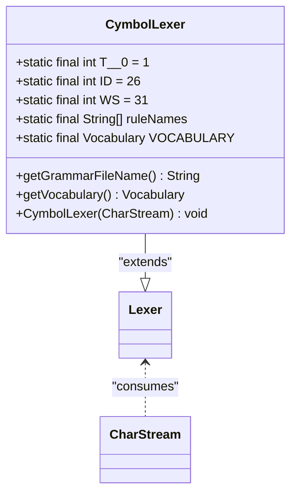
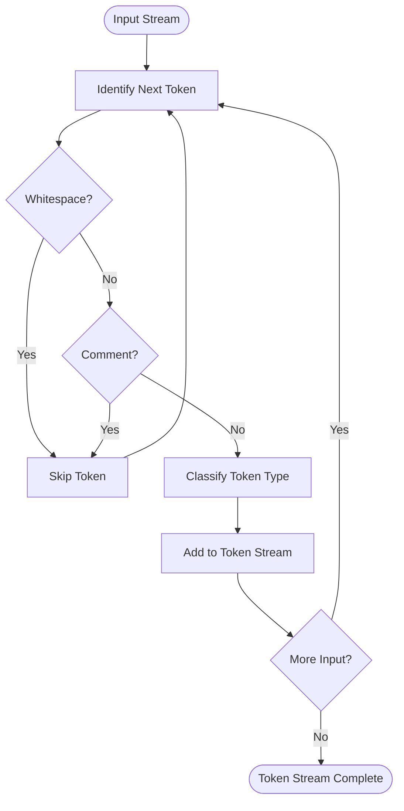
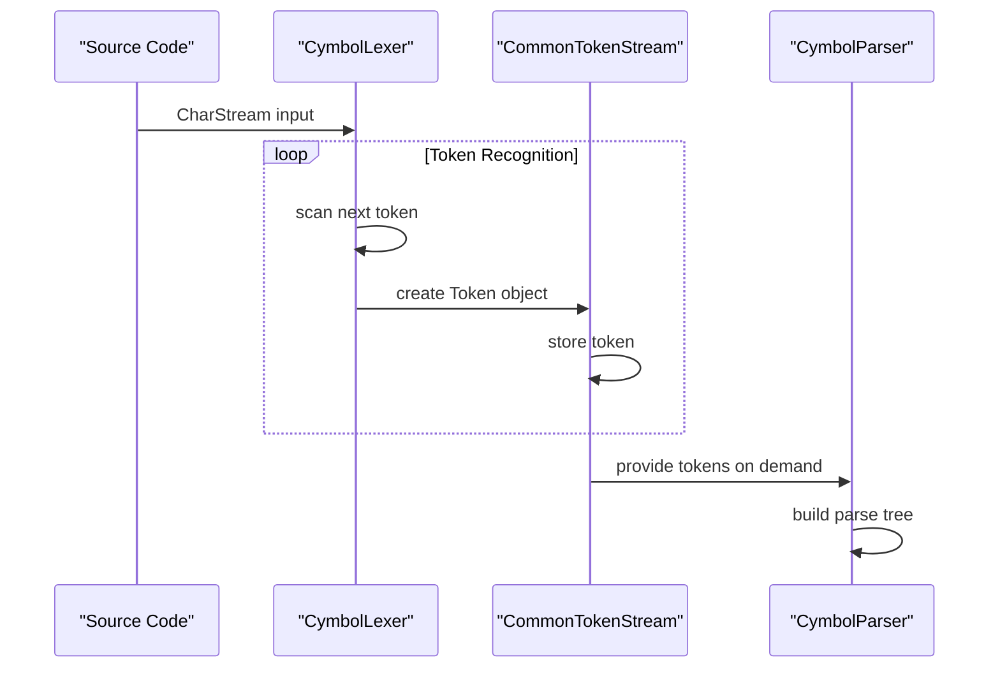
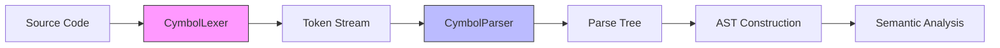

# Lexical Analysis Phase

<cite>
**Referenced Files in This Document**   
- [CymbolLexer.java](file://ep16/src/main/java/org/teachfx/antlr4/ep16/parser/CymbolLexer.java)
- [Cymbol.g4](file://ep16/src/main/antlr4/Cymbol.g4)
- [Compiler.java](file://ep16/src/main/java/org/teachfx/antlr4/ep16/Compiler.java)
- [t.cymbol](file://ep16/src/main/resources/t.cymbol)
</cite>

## Table of Contents
1. [Introduction](#introduction)
2. [Lexer Architecture and ANTLR4 Integration](#lexer-architecture-and-antlr4-integration)
3. [Tokenization Rules and Grammar Definition](#tokenization-rules-and-grammar-definition)
4. [Token Stream Generation and Processing](#token-stream-generation-and-processing)
5. [Error Handling in Lexical Analysis](#error-handling-in-lexical-analysis)
6. [Whitespace, Comments, and Case Sensitivity](#whitespace-comments-and-case-sensitivity)
7. [Integration with Syntactic Analysis](#integration-with-syntactic-analysis)
8. [Common Lexer Issues and Debugging Tips](#common-lexer-issues-and-debugging-tips)

## Introduction
The lexical analysis phase is the first stage in the compiler pipeline, responsible for converting raw source code into a structured sequence of meaningful tokens. This document details how the `CymbolLexer.java` class, generated by ANTLR4, performs lexical analysis on Cymbol language source code. The lexer identifies and categorizes tokens such as identifiers, keywords, operators, and literals according to rules defined in the `Cymbol.g4` grammar file. This process enables subsequent phases of the compiler, particularly syntactic analysis, to operate on a clean, structured representation of the source code.

## Lexer Architecture and ANTLR4 Integration

The `CymbolLexer` class is an ANTLR4-generated lexer that extends the base `Lexer` class from the ANTLR runtime. It operates on a `CharStream` input and produces a stream of tokens that conform to the lexical rules specified in the `Cymbol.g4` grammar. The lexer uses a finite-state machine model encoded in the ATN (Augmented Transition Network) to recognize token patterns efficiently.

Key architectural components include:
- **Vocabulary Management**: The lexer maintains a `VOCABULARY` object that maps token types to their literal and symbolic names.
- **Rule Names and Token Types**: Static arrays like `ruleNames`, `tokenNames`, and `_SYMBOLIC_NAMES` provide metadata about the lexer's capabilities.
- **ATN Execution**: The lexer uses an `ATN` structure to guide its state transitions during token recognition.



**Diagram sources**
- [CymbolLexer.java](file://ep16/src/main/java/org/teachfx/antlr4/ep16/parser/CymbolLexer.java#L1-L264)

**Section sources**
- [CymbolLexer.java](file://ep16/src/main/java/org/teachfx/antlr4/ep16/parser/CymbolLexer.java#L1-L264)

## Tokenization Rules and Grammar Definition

The lexical rules for the Cymbol language are defined in the `Cymbol.g4` grammar file. These rules specify how characters are grouped into tokens such as identifiers, keywords, literals, and operators. The lexer processes the input character by character, applying these rules to identify token boundaries.

Key token categories include:
- **Identifiers (ID)**: Sequences starting with a letter followed by letters or digits
- **Keywords**: Reserved words like 'float', 'int', 'void', 'return', 'if', 'else', 'while'
- **Literals**: Integer (INT), floating-point (FLOAT), character (CHAR), string (STRING), and boolean (BOOLEAN) values
- **Operators**: Arithmetic (+, -, *, /), assignment (=), comparison (==, !=, <, <=, >, >=), and logical (!)
- **Punctuation**: Parentheses, braces, commas, semicolons

The grammar uses both terminal rules (for tokens) and fragment rules (for reusable subpatterns). For example, the `LETTER` fragment is used in the `ID` rule to ensure identifiers start with a letter.



**Diagram sources**
- [Cymbol.g4](file://ep16/src/main/antlr4/Cymbol.g4#L1-L66)

**Section sources**
- [Cymbol.g4](file://ep16/src/main/antlr4/Cymbol.g4#L1-L66)

## Token Stream Generation and Processing

The lexer generates a token stream that serves as input to the parser. Each token contains information about its type, text content, line number, and character position. The `CommonTokenStream` class buffers these tokens and provides them to the parser on demand.

For example, given the sample Cymbol code:
```
int a = 12;
print(a + b);
```

The lexer would produce the following token sequence:
- `INT` (keyword)
- `ID` with text "a"
- `=` (operator)
- `INT` with value "12"
- `;` (punctuation)
- `ID` with text "print"
- `(` (punctuation)
- `ID` with text "a"
- `+` (operator)
- `ID` with text "b"
- `)` (punctuation)
- `;` (punctuation)

This token stream preserves the essential structure of the source code while eliminating irrelevant details like whitespace and comments.



**Diagram sources**
- [CymbolLexer.java](file://ep16/src/main/java/org/teachfx/antlr4/ep16/parser/CymbolLexer.java#L1-L264)
- [Compiler.java](file://ep16/src/main/java/org/teachfx/antlr4/ep16/Compiler.java#L1-L43)

**Section sources**
- [CymbolLexer.java](file://ep16/src/main/java/org/teachfx/antlr4/ep16/parser/CymbolLexer.java#L1-L264)
- [Compiler.java](file://ep16/src/main/java/org/teachfx/antlr4/ep16/Compiler.java#L1-L43)

## Error Handling in Lexical Analysis

The lexer implements error handling for invalid characters and malformed tokens. When the lexer encounters input that doesn't match any defined token rule, it triggers a lexical error. ANTLR4's default error recovery mechanism attempts to synchronize the lexer state to continue processing after the error.

The lexer can detect and report various lexical errors, including:
- Invalid character sequences that don't form recognized tokens
- Malformed numeric literals
- Unclosed string or character literals
- Unknown identifiers (though identifiers are generally accepted as valid tokens)

Error recovery strategies include:
- Skipping invalid characters
- Inserting missing tokens when possible
- Reporting errors with line and column information

The lexer's error handling is integrated with ANTLR4's error reporting infrastructure, allowing detailed diagnostic messages to be generated for debugging purposes.

**Section sources**
- [CymbolLexer.java](file://ep16/src/main/java/org/teachfx/antlr4/ep16/parser/CymbolLexer.java#L1-L264)
- [Cymbol.g4](file://ep16/src/main/antlr4/Cymbol.g4#L1-L66)

## Whitespace, Comments, and Case Sensitivity

The Cymbol lexer handles whitespace and comments through specific lexical rules that direct these tokens to be skipped rather than included in the output token stream.

- **Whitespace (WS)**: Defined as one or more space, tab, newline, or carriage return characters. The `-> skip` directive ensures these tokens are consumed but not added to the token stream.
- **Single-line Comments (SLCOMMENT)**: Lines starting with '//' and continuing to the end of line are skipped using the `-> skip` directive.
- **Case Sensitivity**: The lexer is case-sensitive, as evidenced by the exact matching of keywords like 'float', 'int', and 'void'. Identifiers are also case-sensitive, following standard programming language conventions.

These rules ensure that formatting and comments do not interfere with the syntactic structure of the program while preserving the case distinctions that are meaningful in the language.

**Section sources**
- [Cymbol.g4](file://ep16/src/main/antlr4/Cymbol.g4#L60-L66)

## Integration with Syntactic Analysis

The lexer integrates seamlessly with the syntactic analysis phase through the ANTLR4 runtime framework. The `CymbolLexer` produces tokens that are consumed by the `CymbolParser` to build a parse tree according to the grammar rules.

The integration points include:
- **Token Stream Interface**: The lexer outputs tokens through the `CommonTokenStream` interface, which the parser reads from.
- **Error Synchronization**: Lexical errors are reported through the same error listener infrastructure used by the parser.
- **Position Tracking**: Each token carries line and column information that enables accurate error reporting in the parser.

The `Compiler.java` file demonstrates this integration by creating a lexer instance, wrapping it in a token stream, and passing that stream to the parser constructor.



**Diagram sources**
- [Compiler.java](file://ep16/src/main/java/org/teachfx/antlr4/ep16/Compiler.java#L1-L43)
- [CymbolLexer.java](file://ep16/src/main/java/org/teachfx/antlr4/ep16/parser/CymbolLexer.java#L1-L264)
- [Cymbol.g4](file://ep16/src/main/antlr4/Cymbol.g4#L1-L66)

**Section sources**
- [Compiler.java](file://ep16/src/main/java/org/teachfx/antlr4/ep16/Compiler.java#L1-L43)

## Common Lexer Issues and Debugging Tips

When working with the Cymbol lexer, several common issues may arise:

1. **Unexpected Token Errors**: Often caused by missing or incorrect lexer rules. Verify that all required tokens are defined in the grammar.
2. **Case Sensitivity Problems**: Ensure keywords and identifiers are written with correct casing.
3. **Comment and Whitespace Issues**: Check that comment and whitespace rules are properly defined with `-> skip`.
4. **Literal Parsing Errors**: Validate that numeric, string, and character literals conform to the defined patterns.

Debugging tips:
- Use ANTLR4's built-in tooling to visualize the token stream
- Enable detailed error reporting to identify the exact location of lexical errors
- Test the lexer in isolation with simple input cases before integrating with the parser
- Verify that the grammar's fragment rules are correctly referenced in token rules

Understanding these common issues and their solutions helps ensure robust lexical analysis in the compiler pipeline.

**Section sources**
- [CymbolLexer.java](file://ep16/src/main/java/org/teachfx/antlr4/ep16/parser/CymbolLexer.java#L1-L264)
- [Cymbol.g4](file://ep16/src/main/antlr4/Cymbol.g4#L1-L66)
- [t.cymbol](file://ep16/src/main/resources/t.cymbol#L1-L6)