# Optimization Phase

<cite>
**Referenced Files in This Document**   
- [LivenessAnalysis.java](file://ep20/src/main/java/org/teachfx/antlr4/ep20/pass/cfg/LivenessAnalysis.java)
- [ControlFlowAnalysis.java](file://ep20/src/main/java/org/teachfx/antlr4/ep20/pass/cfg/ControlFlowAnalysis.java)
- [IFlowOptimizer.java](file://ep20/src/main/java/org/teachfx/antlr4/ep20/pass/cfg/IFlowOptimizer.java)
- [Prog.java](file://ep20/src/main/java/org/teachfx/antlr4/ep20/ir/Prog.java)
- [CFG.java](file://ep20/src/main/java/org/teachfx/antlr4/ep20/pass/cfg/CFG.java)
- [BasicBlock.java](file://ep20/src/main/java/org/teachfx/antlr4/ep20/pass/cfg/BasicBlock.java)
- [CymbolIRBuilder.java](file://ep20/src/main/java/org/teachfx/antlr4/ep20/pass/ir/CymbolIRBuilder.java)
- [Compiler.java](file://ep20/src/main/java/org/teachfx/antlr4/ep20/Compiler.java)
</cite>

## Table of Contents
1. [Introduction](#introduction)
2. [Liveness Analysis and Register Allocation](#liveness-analysis-and-register-allocation)
3. [Control Flow Optimizations](#control-flow-optimizations)
4. [Extensible Optimizer Interface](#extensible-optimizer-interface)
5. [IR Transformation Examples](#ir-transformation-examples)
6. [Optimization Trade-offs](#optimization-trade-offs)
7. [Semantic Preservation](#semantic-preservation)
8. [Conclusion](#conclusion)

## Introduction
This document details the optimization phase in the compiler implementation, focusing on liveness analysis, control flow optimizations, and the extensible optimizer framework. The optimization phase plays a critical role in improving program performance while preserving semantic correctness. The system implements data flow analysis techniques to determine variable lifetimes and enable efficient register allocation, along with control flow optimizations that simplify program structure and eliminate redundant code.

## Liveness Analysis and Register Allocation

Liveness analysis determines the lifetime of variables across basic blocks by tracking when variables are used (use) and defined (def) within the intermediate representation (IR). The `LivenessAnalysis` class implements the `IRVisitor` interface to traverse IR nodes and maintain current use and def sets for each instruction.

For binary expressions, the analysis collects operands from both left and right sub-expressions into the use set, while unary expressions add their single operand to the use set. Assignment statements are particularly important as they define the left-hand side variable (adding to def set) while using the right-hand side expression (adding to use set). Frame slots representing local variables are added to the use set when referenced, while constant values do not contribute to either use or def sets since they don't represent variable lifetimes.

The liveness information gathered at the instruction level is used to construct live-in and live-out sets for basic blocks, which are essential for register allocation. Variables that are simultaneously live may not share the same register, while variables with non-overlapping lifetimes can be allocated to the same register, enabling more efficient code generation.

```mermaid
flowchart TD
Start([Liveness Analysis Start]) --> ProcessNode["Process IR Node"]
ProcessNode --> NodeType{"Node Type?"}
NodeType --> |Assignment| HandleAssign["Add LHS to def set<br/>Add RHS to use set"]
NodeType --> |Binary Expression| HandleBinExpr["Add both operands to use set"]
NodeType --> |Unary Expression| HandleUnaryExpr["Add operand to use set"]
NodeType --> |Frame Slot| HandleFrameSlot["Add to use set"]
NodeType --> |Constant| HandleConst["No use/def"]
HandleAssign --> UpdateSets
HandleBinExpr --> UpdateSets
HandleUnaryExpr --> UpdateSets
HandleFrameSlot --> UpdateSets
HandleConst --> UpdateSets
UpdateSets --> Continue["Continue to next node"]
Continue --> MoreNodes{"More nodes?"}
MoreNodes --> |Yes| ProcessNode
MoreNodes --> |No| End([Liveness Analysis Complete])
```

**Diagram sources**
- [LivenessAnalysis.java](file://ep20/src/main/java/org/teachfx/antlr4/ep20/pass/cfg/LivenessAnalysis.java#L0-L147)

**Section sources**
- [LivenessAnalysis.java](file://ep20/src/main/java/org/teachfx/antlr4/ep20/pass/cfg/LivenessAnalysis.java#L0-L147)

## Control Flow Optimizations

The compiler implements several control flow optimizations in the `ControlFlowAnalysis` class to simplify program structure and eliminate unnecessary code. These optimizations are applied during the optimization phase to improve both performance and code readability.

Jump threading is implemented by examining basic blocks with a single outgoing edge that ends with a jump instruction. When the jump target matches the natural successor of the block, the jump instruction can be eliminated, allowing subsequent blocks to be merged. This optimization reduces the number of jump instructions and enables further optimizations by creating larger basic blocks.

Unreachable code elimination is performed as part of basic block optimization in the `Prog` class. Empty basic blocks are identified and removed from the control flow graph. When an empty block is encountered, its predecessors are updated to point directly to its successors, effectively removing the empty block from the execution path. This optimization is particularly effective after other transformations that may create empty blocks.

The optimization process also ensures that each basic block has a label when needed, inserting labels at the beginning of blocks that don't already have them. This maintains the structural integrity of the IR while enabling efficient code generation.

**Diagram sources**
- [ControlFlowAnalysis.java](file://ep20/src/main/java/org/teachfx/antlr4/ep20/pass/cfg/ControlFlowAnalysis.java#L0-L68)
- [Prog.java](file://ep20/src/main/java/org/teachfx/antlr4/ep20/ir/Prog.java#L36-L70)

**Section sources**
- [ControlFlowAnalysis.java](file://ep20/src/main/java/org/teachfx/antlr4/ep20/pass/cfg/ControlFlowAnalysis.java#L0-L68)
- [Prog.java](file://ep20/src/main/java/org/teachfx/antlr4/ep20/ir/Prog.java#L36-L137)

## Extensible Optimizer Interface

The optimization framework is designed with extensibility in mind through the `IFlowOptimizer` interface, which defines a clean contract for optimization passes. This interface allows custom optimization passes to be plugged into the compilation pipeline without modifying the core optimization engine.

The `IFlowOptimizer<I extends IRNode>` interface declares a single method `onHandle(CFG<I> cfg)` that receives a control flow graph as input. This design enables optimizers to analyze and transform the entire control flow structure of a function. Multiple optimizers can be registered with a CFG instance through the `addOptimizer` method, and they are applied sequentially when `applyOptimizers` is called.

The extensible design follows the strategy pattern, allowing different optimization algorithms to be implemented as separate classes that conform to the same interface. This promotes code reuse, simplifies testing, and enables selective application of optimizations based on compilation flags or performance requirements.

The compiler pipeline applies optimizations by first building the CFG from the IR, saving the original state for comparison, applying the registered optimizers (including `ControlFlowAnalysis`), and then saving the optimized state. This approach facilitates debugging and performance analysis by providing clear before-and-after representations of the code.

**Diagram sources**
- [IFlowOptimizer.java](file://ep20/src/main/java/org/teachfx/antlr4/ep20/pass/cfg/IFlowOptimizer.java#L0-L7)
- [ControlFlowAnalysis.java](file://ep20/src/main/java/org/teachfx/antlr4/ep20/pass/cfg/ControlFlowAnalysis.java#L0-L68)
- [CFG.java](file://ep20/src/main/java/org/teachfx/antlr4/ep20/pass/cfg/CFG.java#L0-L158)
- [BasicBlock.java](file://ep20/src/main/java/org/teachfx/antlr4/ep20/pass/cfg/BasicBlock.java#L0-L130)

**Section sources**
- [IFlowOptimizer.java](file://ep20/src/main/java/org/teachfx/antlr4/ep20/pass/cfg/IFlowOptimizer.java#L0-L7)
- [ControlFlowAnalysis.java](file://ep20/src/main/java/org/teachfx/antlr4/ep20/pass/cfg/ControlFlowAnalysis.java#L0-L68)

## IR Transformation Examples

The optimization process transforms the intermediate representation through a series of well-defined steps. Before optimization, the IR may contain redundant jumps, empty blocks, and suboptimal control flow structures. After optimization, these inefficiencies are eliminated, resulting in more efficient code.

One common transformation involves jump threading, where a basic block ending with an unconditional jump to its immediate successor is simplified by removing the jump instruction and merging the blocks. For example, a sequence of blocks where block A jumps to block B, and block B is the natural successor of block A, can be optimized by removing the jump from A to B and appending B's instructions to A.

Another transformation eliminates empty basic blocks that may be created during earlier compilation phases. When an empty block is encountered, its predecessors are updated to point directly to its successors, effectively removing the empty block from the control flow path. This not only reduces code size but also improves execution efficiency by eliminating unnecessary control flow transitions.

The optimization pipeline also ensures proper labeling of basic blocks, inserting labels where needed to maintain the structural requirements of the IR. This is particularly important for code generation, where labels serve as targets for jump instructions.

**Diagram sources**
- [ControlFlowAnalysis.java](file://ep20/src/main/java/org/teachfx/antlr4/ep20/pass/cfg/ControlFlowAnalysis.java#L0-L68)
- [Prog.java](file://ep20/src/main/java/org/teachfx/antlr4/ep20/ir/Prog.java#L36-L70)

## Optimization Trade-offs

The optimization phase involves important trade-offs between optimization aggressiveness and compilation time. More aggressive optimizations can yield better runtime performance but at the cost of increased compilation time and complexity. The current implementation strikes a balance by focusing on lightweight, high-impact optimizations that provide significant benefits with minimal overhead.

Jump threading and unreachable code elimination are relatively inexpensive to implement and can be performed in linear time relative to the size of the control flow graph. These optimizations provide immediate benefits by reducing code size and eliminating unnecessary control flow transitions without requiring complex analysis.

The extensible optimizer interface allows for selective application of optimizations based on compilation mode. For development builds, fewer optimizations can be applied to reduce compilation time, while production builds can enable a full suite of optimizations to maximize runtime performance. This flexibility enables developers to choose the appropriate trade-off for their specific use case.

The current implementation also includes debugging features that save both the original and optimized CFG representations, allowing developers to compare the effects of optimizations. While this increases disk I/O during compilation, it provides valuable insights for performance tuning and debugging.

## Semantic Preservation

All optimizations are designed to preserve the original program semantics while improving performance. The transformations implemented in the optimization phase are proven to be semantically equivalent to the original code, ensuring that the optimized program produces the same results as the unoptimized version.

Control flow optimizations like jump threading and unreachable code elimination maintain the same execution paths and side effects as the original program. The removal of redundant jumps does not change the order of instruction execution, and the elimination of empty blocks does not affect program behavior since they contain no executable instructions.

The liveness analysis used for register allocation is conservative in its estimates, ensuring that variables are not deallocated before their last use. This prevents optimization-induced bugs that could occur from premature register reuse. The analysis correctly handles all IR node types, properly accounting for variable uses and definitions across different expression types.

The optimization framework's modular design allows each optimization pass to be verified independently, making it easier to ensure semantic correctness. The use of well-defined interfaces and clear separation of concerns reduces the risk of introducing semantic errors during optimization.

## Conclusion

The optimization phase in this compiler implementation provides a robust framework for improving code quality through liveness analysis, control flow optimizations, and an extensible optimizer interface. The liveness analysis enables efficient register allocation by accurately determining variable lifetimes across basic blocks. Control flow optimizations such as jump threading and unreachable code elimination simplify program structure and eliminate redundant code. The extensible optimizer interface allows custom optimization passes to be easily integrated into the compilation pipeline. These optimizations are carefully designed to preserve program semantics while improving performance, with trade-offs between optimization aggressiveness and compilation time that can be tuned based on specific requirements.