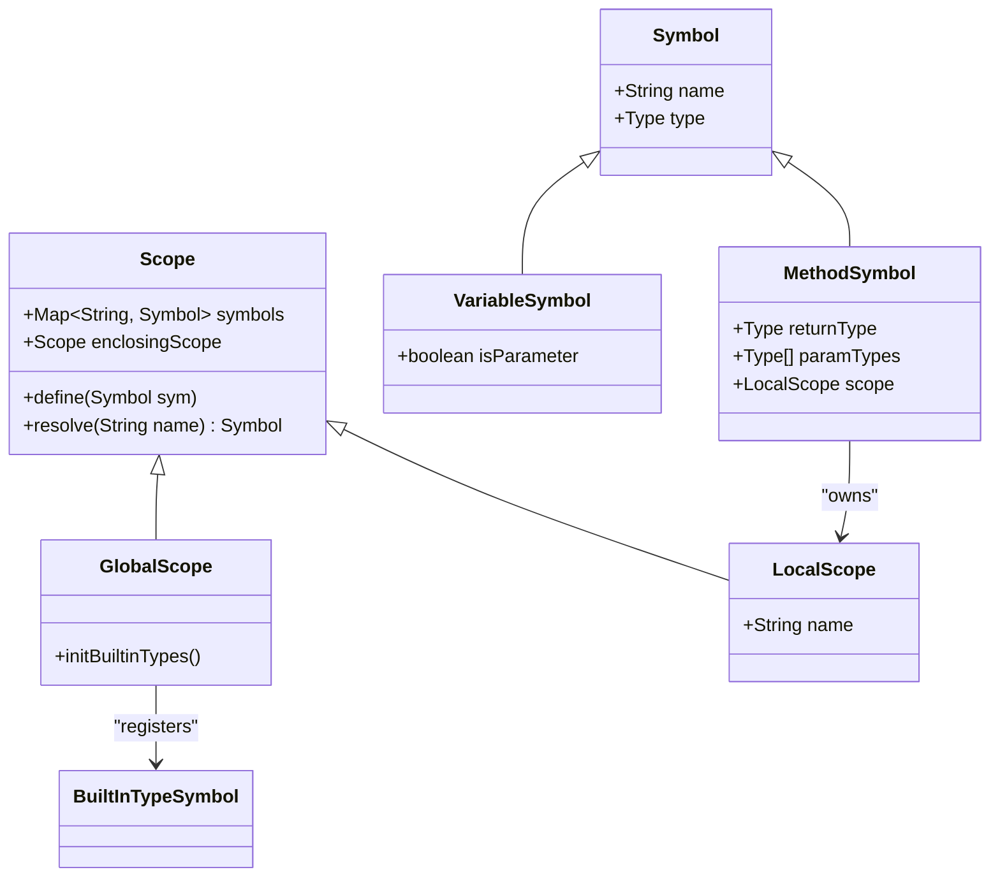
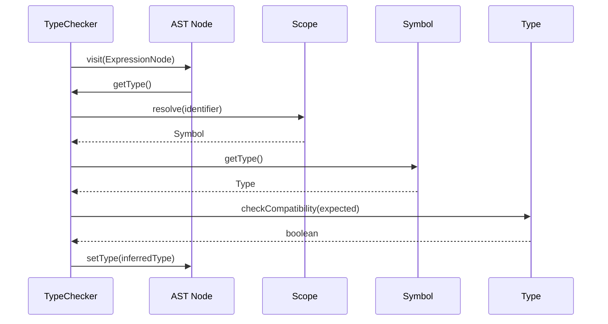
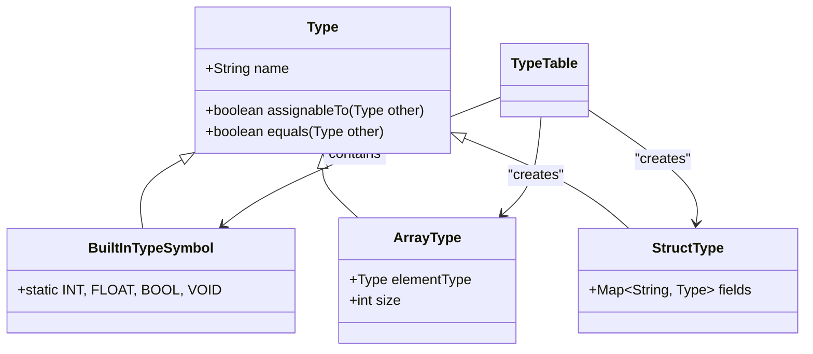
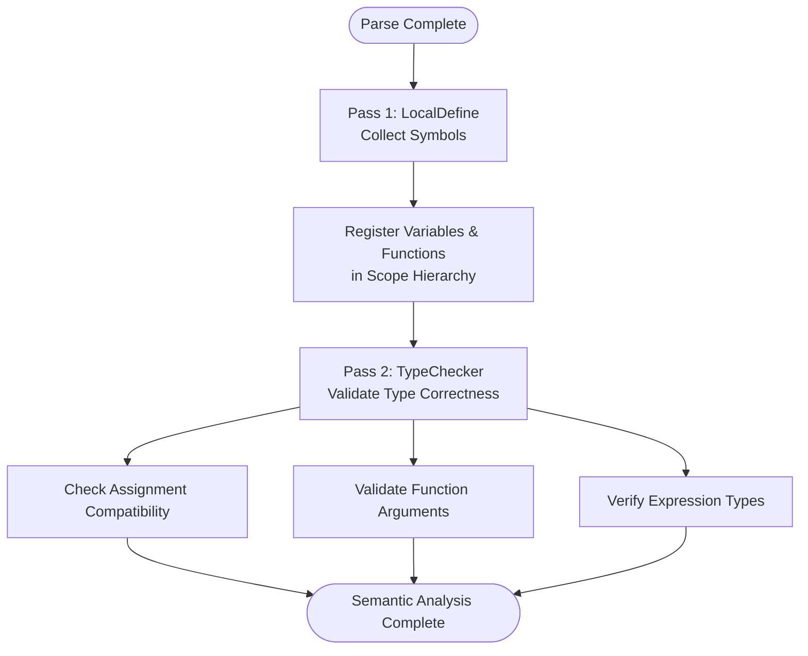

# Semantic Analysis Phase

<cite>
**Referenced Files in This Document**  
- [LocalDefine.java](file://src/main/java/org/teachfx/antlr4/ep20/pass/symtab/LocalDefine.java)
- [TypeChecker.java](file://src/main/java/org/teachfx/antlr4/ep20/pass/semetic/TypeChecker.java)
- [GlobalScope.java](file://src/main/java/org/teachfx/antlr4/ep20/symtab/scope/GlobalScope.java)
- [LocalScope.java](file://src/main/java/org/teachfx/antlr4/ep20/symtab/scope/LocalScope.java)
- [Scope.java](file://src/main/java/org/teachfx/antlr4/ep20/symtab/scope/Scope.java)
- [VariableSymbol.java](file://src/main/java/org/teachfx/antlr4/ep20/symtab/symbol/VariableSymbol.java)
- [MethodSymbol.java](file://src/main/java/org/teachfx/antlr4/ep20/symtab/symbol/MethodSymbol.java)
- [Type.java](file://src/main/java/org/teachfx/antlr4/ep20/symtab/type/Type.java)
- [TypeTable.java](file://src/main/java/org/teachfx/antlr4/ep20/symtab/type/TypeTable.java)
- [CymbalError.java](file://src/main/java/org/teachfx/antlr4/ep20/error/CymbalError.java)
</cite>

## Table of Contents
1. [Introduction](#introduction)
2. [Symbol Resolution with LocalDefine.java](#symbol-resolution-with-localdefinejava)
3. [Scope Hierarchy and Symbol Table Management](#scope-hierarchy-and-symbol-table-management)
4. [Type Checking with TypeChecker.java](#type-checking-with-typecheckerjava)
5. [Type System and Built-in Types](#type-system-and-built-in-types)
6. [Semantic Error Detection and Reporting](#semantic-error-detection-and-reporting)
7. [Two-Pass Semantic Analysis Design](#two-pass-semantic-analysis-design)
8. [Conclusion](#conclusion)

## Introduction
The semantic analysis phase in the compiler pipeline ensures that the program adheres to language-specific rules beyond syntax. This includes validating variable and function declarations, enforcing type correctness, and resolving identifiers within appropriate scopes. The implementation leverages a two-pass approach: first collecting symbol definitions (LocalDefine), then verifying type usage (TypeChecker). This document details how these components work together to enforce semantic integrity, prevent type mismatches, and report meaningful errors during compilation.

## Symbol Resolution with LocalDefine.java

The `LocalDefine.java` class implements the first pass of semantic analysis by traversing the abstract syntax tree (AST) to collect and register symbol declarations into hierarchical scopes. It processes variable declarations, function definitions, and parameter lists, binding each identifier to its corresponding symbol object within the current scope.

When encountering a variable declaration, `LocalDefine` creates a `VariableSymbol` instance and inserts it into the active scope. For function declarations, it constructs a `MethodSymbol` containing return type, parameter types, and local scope information. Parameters are added to the function's local scope during traversal. This process ensures that all identifiers are properly declared before use and that shadowing rules are respected across nested scopes.

The visitor pattern enables recursive descent through the AST, maintaining a stack of scopes that mirrors the program’s block structure. Each time a new block (e.g., function body or compound statement) is entered, a new `LocalScope` is pushed onto the stack; upon exit, it is popped. This mechanism supports lexical scoping and prevents premature access to variables declared in inner blocks.

**Section sources**
- [LocalDefine.java](file://src/main/java/org/teachfx/antlr4/ep20/pass/symtab/LocalDefine.java#L1-L150)
- [VariableSymbol.java](file://src/main/java/org/teachfx/antlr4/ep20/symtab/symbol/VariableSymbol.java#L5-L40)
- [MethodSymbol.java](file://src/main/java/org/teachfx/antlr4/ep20/symtab/symbol/MethodSymbol.java#L5-L50)

## Scope Hierarchy and Symbol Table Management

The compiler implements a hierarchical scope system using `Scope`, `GlobalScope`, and `LocalScope` classes. The `GlobalScope` serves as the root, containing built-in types and globally declared functions. Each function or block introduces a `LocalScope` that inherits visibility from its parent but can override names locally.

Scopes form a tree-like structure where each scope maintains a map of symbol names to their definitions and a reference to its enclosing (parent) scope. Name resolution proceeds outward from the current scope until a match is found or the global scope is reached. This design supports lexical scoping and allows efficient lookup and insertion operations.

The `SymbolTable` interface abstracts symbol management, while concrete implementations like `BaseScope` provide methods for defining and resolving symbols. Built-in types such as `int`, `float`, `bool`, and `void` are pre-registered in the global scope via `BuiltInTypeSymbol`, ensuring they are always available without explicit declaration.

**Diagram sources**
- [Scope.java](file://src/main/java/org/teachfx/antlr4/ep20/symtab/scope/Scope.java#L10-L60)
- [GlobalScope.java](file://src/main/java/org/teachfx/antlr4/ep20/symtab/scope/GlobalScope.java#L15-L45)
- [LocalScope.java](file://src/main/java/org/teachfx/antlr4/ep20/symtab/scope/LocalScope.java#L8-L30)
- [VariableSymbol.java](file://src/main/java/org/teachfx/antlr4/ep20/symtab/symbol/VariableSymbol.java#L5-L25)
- [MethodSymbol.java](file://src/main/java/org/teachfx/antlr4/ep20/symtab/symbol/MethodSymbol.java#L5-L40)

**Section sources**
- [Scope.java](file://src/main/java/org/teachfx/antlr4/ep20/symtab/scope/Scope.java#L1-L100)
- [GlobalScope.java](file://src/main/java/org/teachfx/antlr4/ep20/symtab/scope/GlobalScope.java#L1-L60)
- [LocalScope.java](file://src/main/java/org/teachfx/antlr4/ep20/symtab/scope/LocalScope.java#L1-L50)

## Type Checking with TypeChecker.java

The `TypeChecker.java` class performs the second pass of semantic analysis, validating type correctness across expressions, assignments, and function calls. It traverses the AST after symbol resolution is complete, ensuring all identifiers have been defined and their types are used consistently.

For arithmetic operations (addition, subtraction, multiplication, division), the type checker verifies that both operands are numeric (`int` or `float`) and applies standard promotion rules (e.g., `int + float → float`). Boolean logic operations (AND, OR, NOT) require operands to be of type `bool`. Comparisons between values return `bool` and allow mixed numeric types with implicit conversion.

Assignments are validated by checking that the right-hand side expression’s type is assignment-compatible with the left-hand side variable’s declared type. Function calls are checked against the declared signature: the number and types of arguments must match the parameter list, with implicit conversions allowed where safe (e.g., `int` to `float`).

During traversal, `TypeChecker` annotates expression nodes with their computed types, enabling downstream passes (e.g., code generation) to make informed decisions based on type information.

**Diagram sources**
- [TypeChecker.java](file://src/main/java/org/teachfx/antlr4/ep20/pass/semetic/TypeChecker.java#L20-L200)
- [ExpressionNode.java](file://src/main/java/org/teachfx/antlr4/ep20/ast/expr/ExprNode.java#L10-L35)
- [Scope.java](file://src/main/java/org/teachfx/antlr4/ep20/symtab/scope/Scope.java#L40-L70)

**Section sources**
- [TypeChecker.java](file://src/main/java/org/teachfx/antlr4/ep20/pass/semetic/TypeChecker.java#L1-L300)

## Type System and Built-in Types

The compiler’s type system is implemented through the `Type` hierarchy and `TypeTable` registry. Primitive types (`int`, `float`, `bool`, `void`) are represented as singleton instances of `BuiltInTypeSymbol` and registered in the global scope. The `TypeTable` provides centralized access to these types and supports type lookup by name.

Type compatibility is determined through a combination of exact matching and implicit conversions. For example, an `int` value can be assigned to a `float` variable, but not vice versa without an explicit cast. Array and struct types are also supported, with `ArrayType` and `StructType` extending the base `Type` class.

The system enforces strong typing: operations between incompatible types (e.g., adding a string to an integer) result in semantic errors. However, it allows limited coercion for numeric types to support natural mathematical expressions.

**Diagram sources**
- [Type.java](file://src/main/java/org/teachfx/antlr4/ep20/symtab/type/Type.java#L5-L50)
- [BuiltInTypeSymbol.java](file://src/main/java/org/teachfx/antlr4/ep20/symtab/type/BuiltInTypeSymbol.java#L10-L80)
- [ArrayType.java](file://src/main/java/org/teachfx/antlr4/ep20/symtab/type/ArrayType.java#L5-L35)
- [TypeTable.java](file://src/main/java/org/teachfx/antlr4/ep20/symtab/type/TypeTable.java#L15-L60)

**Section sources**
- [Type.java](file://src/main/java/org/teachfx/antlr4/ep20/symtab/type/Type.java#L1-L100)
- [TypeTable.java](file://src/main/java/org/teachfx/antlr4/ep20/symtab/type/TypeTable.java#L1-L80)

## Semantic Error Detection and Reporting

Semantic errors are detected during both symbol resolution and type checking phases. Common issues include undeclared variables, redeclaration of symbols in the same scope, type mismatches in assignments or expressions, incorrect function argument counts or types, and invalid operations (e.g., boolean arithmetic).

When an error is encountered, the compiler uses the `CymbalError` class to generate descriptive diagnostic messages that include source location (line and column), error code, and human-readable explanation. These errors are collected and reported to the user, often allowing multiple issues to be displayed in a single compilation run for improved developer experience.

Error recovery strategies enable the compiler to continue processing after certain errors (like undeclared variables) to detect additional issues, rather than halting immediately. This improves usability by reducing the edit-compile-debug cycle time.

**Section sources**
- [CymbalError.java](file://src/main/java/org/teachfx/antlr4/ep20/error/CymbalError.java#L5-L100)
- [LocalDefine.java](file://src/main/java/org/teachfx/antlr4/ep20/pass/symtab/LocalDefine.java#L80-L120)
- [TypeChecker.java](file://src/main/java/org/teachfx/antlr4/ep20/pass/semetic/TypeChecker.java#L150-L250)

## Two-Pass Semantic Analysis Design

The two-pass design separates symbol collection (`LocalDefine`) from type validation (`TypeChecker`) to resolve forward references and support mutual recursion. In the first pass, all declarations are registered in their respective scopes, making them visible for subsequent lookups. This allows functions to call each other even if declared out of order.

The second pass assumes complete symbol information and focuses solely on type correctness. By deferring type checks until all symbols are known, the compiler can validate complex expressions involving forward-declared functions or mutually recursive data structures.

This separation enhances modularity, simplifies implementation, and improves error reporting accuracy. It also enables future extensions such as constant folding or early optimization passes between the two stages.

**Diagram sources**
- [LocalDefine.java](file://src/main/java/org/teachfx/antlr4/ep20/pass/symtab/LocalDefine.java#L1-L150)
- [TypeChecker.java](file://src/main/java/org/teachfx/antlr4/ep20/pass/semetic/TypeChecker.java#L1-L300)

**Section sources**
- [LocalDefine.java](file://src/main/java/org/teachfx/antlr4/ep20/pass/symtab/LocalDefine.java#L1-L150)
- [TypeChecker.java](file://src/main/java/org/teachfx/antlr4/ep20/pass/semetic/TypeChecker.java#L1-L300)

## Conclusion

The semantic analysis phase plays a critical role in ensuring program correctness by enforcing scoping rules and type safety. Through a well-structured two-pass approach, the compiler first resolves all symbol declarations using `LocalDefine.java` and hierarchical scope management, then validates type usage via `TypeChecker.java`. This design enables robust handling of forward references and mutual recursion while maintaining clarity and modularity. The integration of comprehensive error reporting ensures developers receive actionable feedback, contributing to a reliable and user-friendly compilation process.