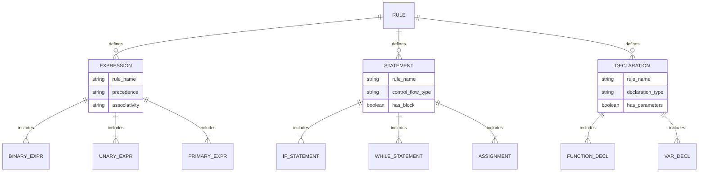

# Syntactic Analysis Phase

<cite>
**Referenced Files in This Document**   
- [CymbolParser.java](file://ep16/src/main/java/org/teachfx/antlr4/ep16/parser/CymbolParser.java)
- [CymbolLexer.java](file://ep16/src/main/java/org/teachfx/antlr4/ep16/parser/CymbolLexer.java)
- [CompilerTestUtil.java](file://ep19/src/test/java/org/teachfx/antlr4/ep19/CompilerTestUtil.java)
</cite>

## Table of Contents
1. [Introduction](#introduction)
2. [Parser and Lexer Interaction](#parser-and-lexer-interaction)
3. [Context-Free Grammar Implementation](#context-free-grammar-implementation)
4. [LL(*) Parsing Strategy](#ll-parsing-strategy)
5. [Rule Definitions for Expressions, Statements, and Declarations](#rule-definitions-for-expressions-statements-and-declarations)
6. [Error Recovery Mechanisms](#error-recovery-mechanisms)
7. [Parse Tree Construction](#parse-tree-construction)
8. [Extending the Grammar](#extending-the-grammar)
9. [Troubleshooting Parsing Conflicts](#troubleshooting-parsing-conflicts)
10. [Conclusion](#conclusion)

## Introduction
The syntactic analysis phase in the Cymbol compiler, implemented using ANTLR4, transforms a stream of tokens from the lexer into a structured ParseTree representation. This document details how CymbolParser.java implements context-free grammar rules to parse Cymbol language constructs, covering the LL(*) parsing strategy, rule definitions for various language elements, and error recovery mechanisms for malformed syntax.

**Section sources**
- [CymbolParser.java](file://ep16/src/main/java/org/teachfx/antlr4/ep16/parser/CymbolParser.java#L0-L1567)

## Parser and Lexer Interaction
The syntactic analysis phase begins with the lexer (CymbolLexer.java) converting source code into a token stream. The parser (CymbolParser.java) then consumes this token stream to build a ParseTree. The lexer identifies lexical tokens such as identifiers, keywords, operators, and literals, while the parser applies grammar rules to organize these tokens into a hierarchical structure representing the program's syntax.

**Diagram sources**
- [CymbolLexer.java](file://ep16/src/main/java/org/teachfx/antlr4/ep16/parser/CymbolLexer.java#L0-L264)
- [CymbolParser.java](file://ep16/src/main/java/org/teachfx/antlr4/ep16/parser/CymbolParser.java#L0-L1567)

**Section sources**
- [CymbolLexer.java](file://ep16/src/main/java/org/teachfx/antlr4/ep16/parser/CymbolLexer.java#L0-L264)
- [CymbolParser.java](file://ep16/src/main/java/org/teachfx/antlr4/ep16/parser/CymbolParser.java#L0-L1567)

## Context-Free Grammar Implementation
CymbolParser.java implements a context-free grammar that defines the syntax of the Cymbol programming language. The grammar consists of production rules that specify how different language constructs can be formed from tokens and other grammar rules. Each rule in the grammar corresponds to a method in the generated parser class, which returns a context object representing a node in the ParseTree.

**Diagram sources**
- [CymbolParser.java](file://ep16/src/main/java/org/teachfx/antlr4/ep16/parser/CymbolParser.java#L0-L1567)

**Section sources**
- [CymbolParser.java](file://ep16/src/main/java/org/teachfx/antlr4/ep16/parser/CymbolParser.java#L0-L1567)

## LL(*) Parsing Strategy
ANTLR4 employs an LL(*) parsing strategy, which is a top-down parsing approach that can handle a wide range of context-free grammars. The LL(*) parser uses adaptive prediction to determine which production rule to apply at each parsing decision point. This allows the parser to handle grammars with arbitrary lookahead requirements, making it suitable for complex programming languages like Cymbol.

**Diagram sources**
- [CymbolParser.java](file://ep16/src/main/java/org/teachfx/antlr4/ep16/parser/CymbolParser.java#L0-L1567)

**Section sources**
- [CymbolParser.java](file://ep16/src/main/java/org/teachfx/antlr4/ep16/parser/CymbolParser.java#L0-L1567)

## Rule Definitions for Expressions, Statements, and Declarations
The Cymbol grammar defines specific rules for expressions, statements, and declarations. Expression rules handle arithmetic, logical, and relational operations, with proper precedence and associativity. Statement rules cover control flow constructs like if-else and while loops, as well as variable declarations and assignments. Declaration rules define function signatures and variable types.

**Diagram sources**
- [CymbolParser.java](file://ep16/src/main/java/org/teachfx/antlr4/ep16/parser/CymbolParser.java#L0-L1567)

**Section sources**
- [CymbolParser.java](file://ep16/src/main/java/org/teachfx/antlr4/ep16/parser/CymbolParser.java#L0-L1567)

## Error Recovery Mechanisms
CymbolParser.java implements robust error recovery mechanisms to handle malformed syntax. When a syntax error is encountered, the parser reports the error and attempts to recover by skipping tokens until a synchronization point is reached. This allows the parser to continue processing the rest of the input, potentially identifying multiple syntax errors in a single pass.

**Diagram sources**
- [CymbolParser.java](file://ep16/src/main/java/org/teachfx/antlr4/ep16/parser/CymbolParser.java#L0-L1567)

**Section sources**
- [CymbolParser.java](file://ep16/src/main/java/org/teachfx/antlr4/ep16/parser/CymbolParser.java#L0-L1567)

## Parse Tree Construction
The parser constructs a ParseTree by creating context objects for each grammar rule that is successfully matched. Each context object contains references to its child contexts, forming a hierarchical tree structure that represents the syntactic structure of the input program. This ParseTree serves as the foundation for subsequent compilation phases, such as semantic analysis and code generation.

**Diagram sources**
- [CymbolParser.java](file://ep16/src/main/java/org/teachfx/antlr4/ep16/parser/CymbolParser.java#L0-L1567)

**Section sources**
- [CymbolParser.java](file://ep16/src/main/java/org/teachfx/antlr4/ep16/parser/CymbolParser.java#L0-L1567)

## Extending the Grammar
The Cymbol grammar can be extended to support new language constructs by adding new rules to the grammar definition. This involves defining new parser rules, updating existing rules to reference the new constructs, and ensuring that the grammar remains unambiguous. The ANTLR4 toolchain automatically generates updated parser code when the grammar is modified.

**Section sources**
- [CymbolParser.java](file://ep16/src/main/java/org/teachfx/antlr4/ep16/parser/CymbolParser.java#L0-L1567)

## Troubleshooting Parsing Conflicts
Common parsing conflicts in the Cymbol grammar include ambiguities in expression parsing and issues with nested control structures. These can be resolved by carefully designing grammar rules with proper precedence and associativity, using syntactic predicates when necessary, and testing the parser with a comprehensive suite of valid and invalid inputs.

**Section sources**
- [CymbolParser.java](file://ep16/src/main/java/org/teachfx/antlr4/ep16/parser/CymbolParser.java#L0-L1567)

## Conclusion
The syntactic analysis phase in the Cymbol compiler effectively transforms token streams into structured ParseTree representations using ANTLR4's LL(*) parsing strategy. The implementation in CymbolParser.java demonstrates how context-free grammar rules can be used to parse complex language constructs, with robust error recovery mechanisms to handle malformed syntax. The interaction between the parser and lexer ensures a smooth transition from lexical analysis to syntactic analysis, providing a solid foundation for subsequent compilation phases.

**Section sources**
- [CymbolParser.java](file://ep16/src/main/java/org/teachfx/antlr4/ep16/parser/CymbolParser.java#L0-L1567)
- [CymbolLexer.java](file://ep16/src/main/java/org/teachfx/antlr4/ep16/parser/CymbolLexer.java#L0-L264)