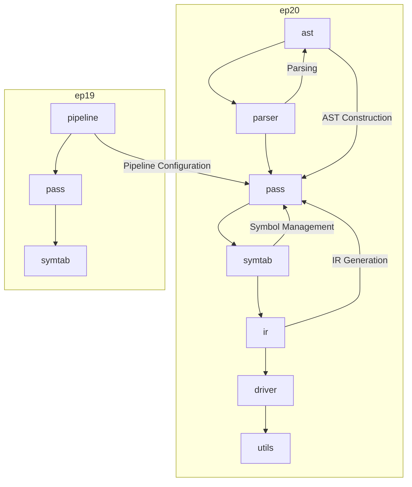
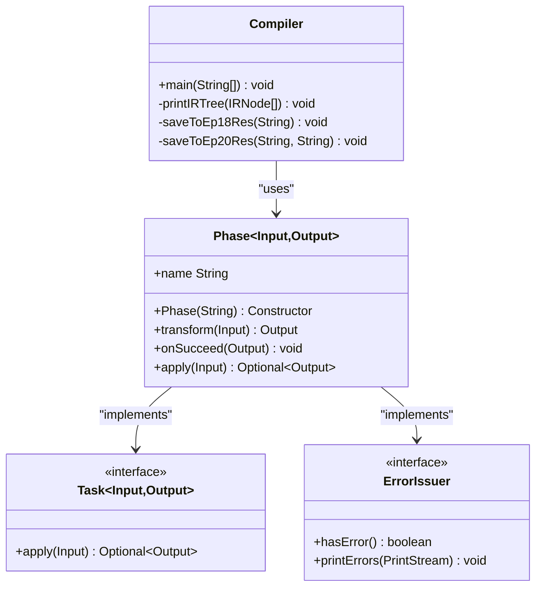
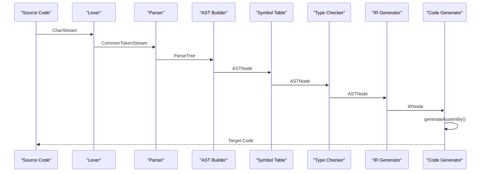
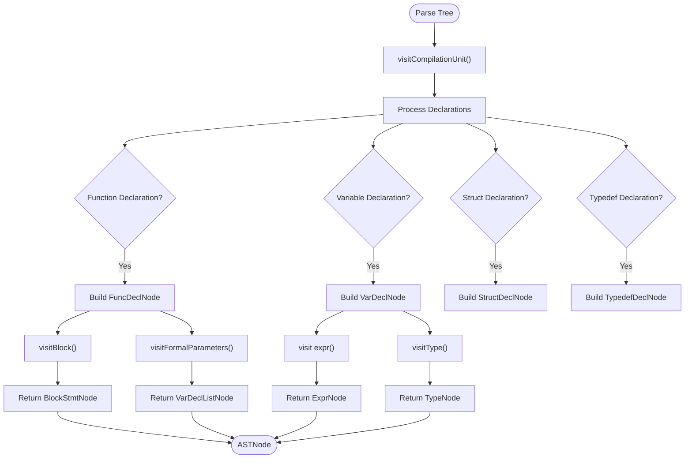
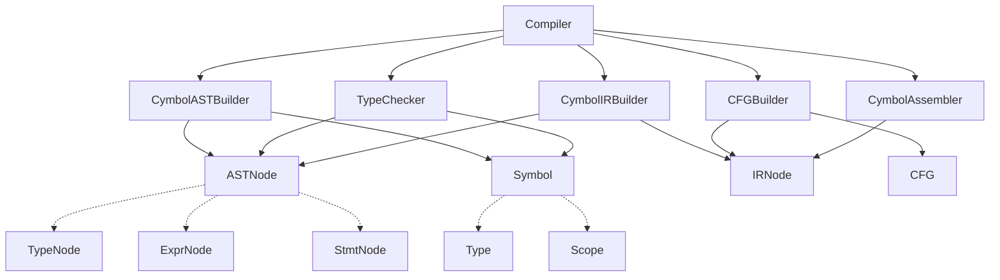

# Compiler Architecture and Design

<cite>
**Referenced Files in This Document**   
- [Compiler.java](file://ep20/src/main/java/org/teachfx/antlr4/ep20/Compiler.java)
- [Phase.java](file://ep20/src/main/java/org/teachfx/antlr4/ep20/driver/Phase.java)
- [CompilerPipeline.java](file://ep19/src/main/java/org/teachfx/antlr4/ep19/pipeline/CompilerPipeline.java)
- [CymbolASTBuilder.java](file://ep20/src/main/java/org/teachfx/antlr4/ep20/pass/ast/CymbolASTBuilder.java)
- [TypeChecker.java](file://ep20/src/main/java/org/teachfx/antlr4/ep20/pass/sematic/TypeChecker.java)
</cite>

## Table of Contents
1. [Introduction](#introduction)
2. [Project Structure](#project-structure)
3. [Core Components](#core-components)
4. [Architecture Overview](#architecture-overview)
5. [Detailed Component Analysis](#detailed-component-analysis)
6. [Dependency Analysis](#dependency-analysis)
7. [Performance Considerations](#performance-considerations)
8. [Troubleshooting Guide](#troubleshooting-guide)
9. [Conclusion](#conclusion)

## Introduction
This document provides comprehensive architectural documentation for a modular compiler system built using ANTLR4. The compiler processes source code through a well-defined pipeline of distinct phases: lexical analysis, parsing, AST construction, semantic analysis, IR generation, CFG construction, optimization, and code generation. The design emphasizes separation of concerns, extensibility, and configurability through a pipeline pattern. The system leverages ANTLR4-generated parsers and employs visitor patterns for tree traversal and transformation across compilation phases.

## Project Structure
The compiler project follows a modular package structure organized by compilation phases and responsibilities. The core components are located in the ep20 module, with supporting pipeline abstractions in ep19. The structure separates concerns into distinct packages for AST representation, symbol table management, intermediate representation, control flow analysis, code generation, and driver logic.

**Diagram sources**
- [Compiler.java](file://ep20/src/main/java/org/teachfx/antlr4/ep20/Compiler.java)
- [Phase.java](file://ep20/src/main/java/org/teachfx/antlr4/ep20/driver/Phase.java)

**Section sources**
- [Compiler.java](file://ep20/src/main/java/org/teachfx/antlr4/ep20/Compiler.java)
- [Phase.java](file://ep20/src/main/java/org/teachfx/antlr4/ep20/driver/Phase.java)

## Core Components
The compiler's core components implement a modular pipeline architecture that processes source code through distinct compilation phases. The main entry point is Compiler.java, which coordinates the compilation workflow by orchestrating phase execution. The Phase.java class provides an abstract foundation for compilation phases, defining a consistent interface for input/output transformation. The pipeline pattern, defined in CompilerPipeline.java, enables configurable compilation workflows. Key passes include CymbolASTBuilder for AST construction and TypeChecker for semantic analysis, both implementing visitor patterns for tree traversal.

**Section sources**
- [Compiler.java](file://ep20/src/main/java/org/teachfx/antlr4/ep20/Compiler.java)
- [Phase.java](file://ep20/src/main/java/org/teachfx/antlr4/ep20/driver/Phase.java)
- [CompilerPipeline.java](file://ep19/src/main/java/org/teachfx/antlr4/ep19/pipeline/CompilerPipeline.java)

## Architecture Overview
The compiler implements a modular pipeline architecture that processes source code through sequential phases, each transforming the program representation into a more refined form. The architecture follows a clean separation of concerns, with distinct components responsible for lexical analysis, parsing, AST construction, semantic analysis, IR generation, control flow analysis, optimization, and code generation.

**Diagram sources**
- [Compiler.java](file://ep20/src/main/java/org/teachfx/antlr4/ep20/Compiler.java)
- [CymbolASTBuilder.java](file://ep20/src/main/java/org/teachfx/antlr4/ep20/pass/ast/CymbolASTBuilder.java)

## Detailed Component Analysis

### Compiler and Phase Management
The Compiler.java class serves as the main entry point and coordinator of the compilation process. It follows a sequential workflow that begins with lexical analysis using ANTLR4's lexer and parser, proceeds through AST construction, semantic analysis, IR generation, and concludes with code generation. The Phase.java abstract class defines the foundation for compilation phases, providing a consistent interface with transform methods and error handling capabilities. Each phase extends Phase with specific input and output types, enabling type-safe composition of the compilation pipeline.

**Diagram sources**
- [Compiler.java](file://ep20/src/main/java/org/teachfx/antlr4/ep20/Compiler.java#L1-L161)
- [Phase.java](file://ep20/src/main/java/org/teachfx/antlr4/ep20/driver/Phase.java#L1-L28)

**Section sources**
- [Compiler.java](file://ep20/src/main/java/org/teachfx/antlr4/ep20/Compiler.java#L1-L161)
- [Phase.java](file://ep20/src/main/java/org/teachfx/antlr4/ep20/driver/Phase.java#L1-L28)

### Pipeline Architecture
The compiler pipeline architecture enables configurable and extensible compilation workflows. The CompilerPipeline interface, defined in ep19, specifies the standard phases of compilation including lexical analysis, syntax analysis, symbol definition, symbol resolution, type checking, and interpretation. This interface allows for different pipeline implementations that can include or exclude specific phases based on requirements. The modular design supports both full compilation and partial analysis workflows, making the system adaptable to various use cases such as static analysis tools or interpreters.

**Diagram sources**
- [CompilerPipeline.java](file://ep19/src/main/java/org/teachfx/antlr4/ep19/pipeline/CompilerPipeline.java#L1-L109)
- [Compiler.java](file://ep20/src/main/java/org/teachfx/antlr4/ep20/Compiler.java#L1-L161)

**Section sources**
- [CompilerPipeline.java](file://ep19/src/main/java/org/teachfx/antlr4/ep19/pipeline/CompilerPipeline.java#L1-L109)

### AST Construction and Semantic Analysis
The AST construction phase is implemented by CymbolASTBuilder, which extends ANTLR4's base visitor to transform parse trees into a custom AST representation. This visitor pattern implementation traverses the parse tree and constructs AST nodes for declarations, expressions, and statements. The semantic analysis phase, represented by TypeChecker, performs type checking and other semantic validations on the AST. Both components follow the visitor pattern, allowing for clean separation of traversal logic from processing logic and enabling easy extension with new node types or analysis rules.

**Diagram sources**
- [CymbolASTBuilder.java](file://ep20/src/main/java/org/teachfx/antlr4/ep20/pass/ast/CymbolASTBuilder.java#L1-L318)
- [TypeChecker.java](file://ep20/src/main/java/org/teachfx/antlr4/ep20/pass/sematic/TypeChecker.java#L1-L105)

**Section sources**
- [CymbolASTBuilder.java](file://ep20/src/main/java/org/teachfx/antlr4/ep20/pass/ast/CymbolASTBuilder.java#L1-L318)
- [TypeChecker.java](file://ep20/src/main/java/org/teachfx/antlr4/ep20/pass/sematic/TypeChecker.java#L1-L105)

## Dependency Analysis
The compiler components exhibit a layered dependency structure where higher-level components depend on lower-level representations. The main compilation driver depends on all phase implementations, while individual passes have focused dependencies on AST nodes, symbol table components, and IR elements. The use of interfaces like CompilerPipeline enables loose coupling between the pipeline configuration and specific phase implementations, promoting extensibility and testability.

**Diagram sources**
- [Compiler.java](file://ep20/src/main/java/org/teachfx/antlr4/ep20/Compiler.java)
- [CymbolASTBuilder.java](file://ep20/src/main/java/org/teachfx/antlr4/ep20/pass/ast/CymbolASTBuilder.java)

**Section sources**
- [Compiler.java](file://ep20/src/main/java/org/teachfx/antlr4/ep20/Compiler.java)
- [CymbolASTBuilder.java](file://ep20/src/main/java/org/teachfx/antlr4/ep20/pass/ast/CymbolASTBuilder.java)

## Performance Considerations
The compiler architecture incorporates several performance considerations. The pipeline design enables incremental processing and potential parallelization of independent phases. The visitor pattern implementation for AST traversal provides efficient tree processing with O(n) complexity relative to the number of nodes. The IR optimization phase includes basic block optimization to improve code efficiency. The modular structure allows for selective execution of phases, reducing overhead for use cases that don't require full compilation. Memory usage is managed through streaming of intermediate representations where possible.

## Troubleshooting Guide
Common issues in the compiler system typically relate to phase execution, type checking errors, or code generation problems. The Phase class provides built-in error handling with the hasError() and printErrors() methods. When debugging compilation issues, examine the output of each phase sequentially to identify where failures occur. For AST construction problems, verify that the CymbolASTBuilder correctly handles all grammar constructs. For semantic analysis issues, ensure that symbol table population precedes type checking. The logging framework can be used to trace the compilation workflow and inspect intermediate representations.

**Section sources**
- [Phase.java](file://ep20/src/main/java/org/teachfx/antlr4/ep20/driver/Phase.java#L1-L28)
- [Compiler.java](file://ep20/src/main/java/org/teachfx/antlr4/ep20/Compiler.java#L1-L161)

## Conclusion
The compiler architecture demonstrates a well-structured, modular design that effectively separates concerns across compilation phases. The pipeline pattern provides flexibility in workflow configuration while maintaining a clear progression from source code to executable output. The use of ANTLR4 for parsing and visitor patterns for tree traversal ensures robust handling of complex grammars. The separation of AST construction, semantic analysis, and code generation into distinct phases enhances maintainability and extensibility. This architecture supports the addition of new optimization passes and target backends with minimal impact on existing components, making it a solid foundation for language implementation projects.