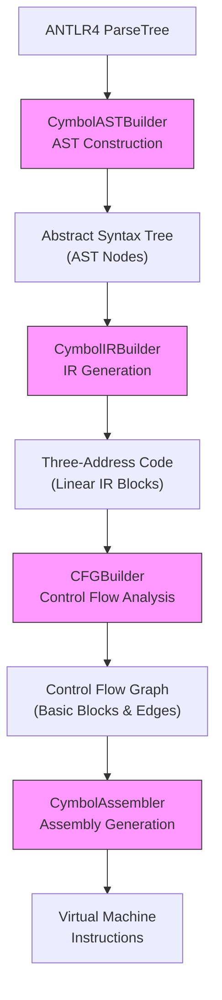
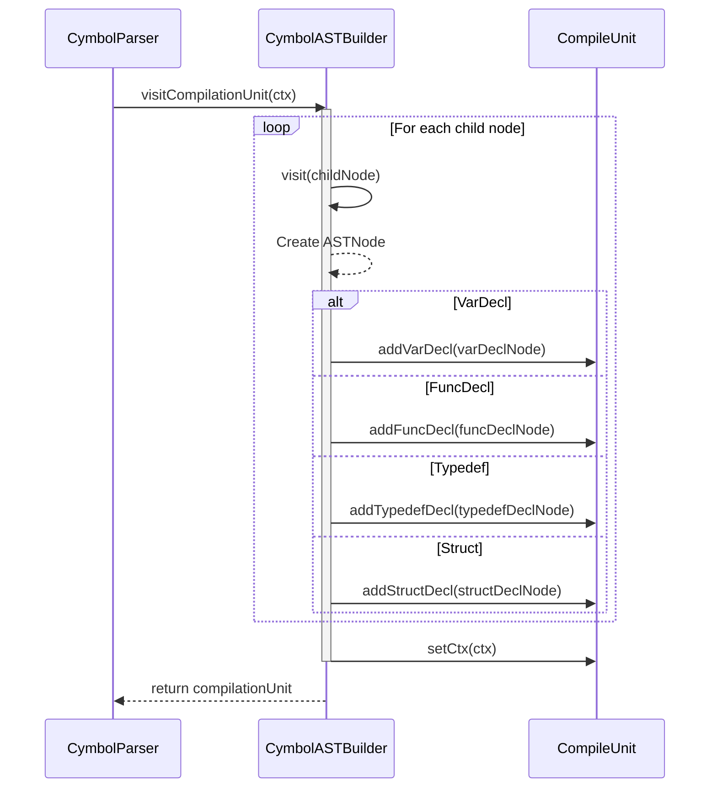
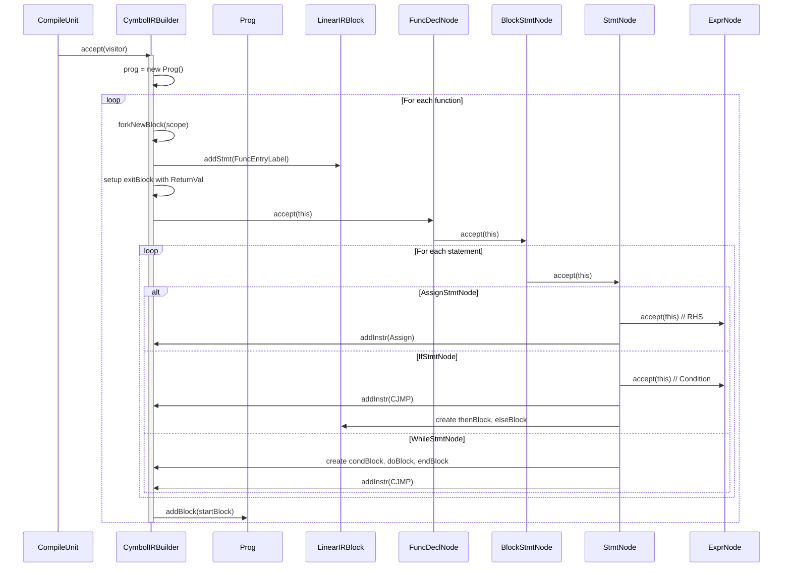
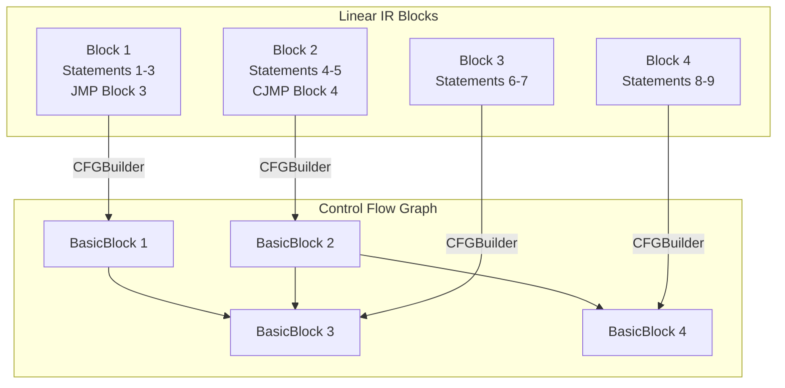
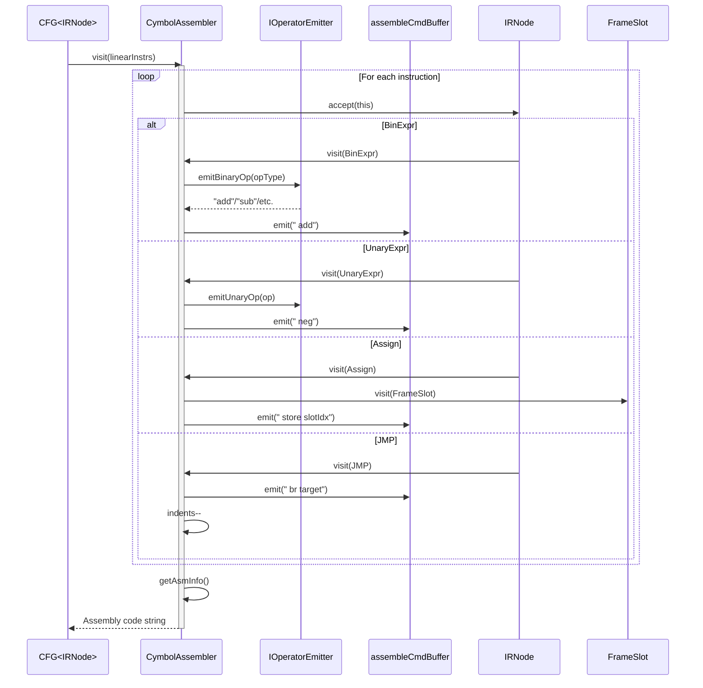
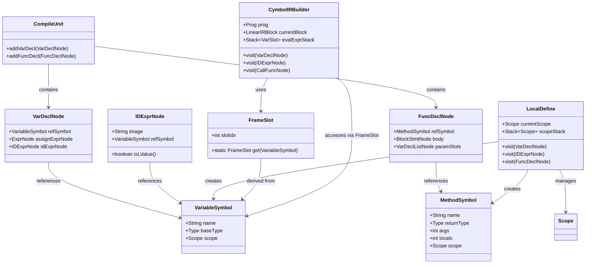

# Compilation Pipeline Phase Interactions

<cite>
**Referenced Files in This Document**   
- [CymbolASTBuilder.java](file://ep20/src/main/java/org/teachfx/antlr4/ep20/pass/ast/CymbolASTBuilder.java)
- [CymbolIRBuilder.java](file://ep20/src/main/java/org/teachfx/antlr4/ep20/pass/ir/CymbolIRBuilder.java)
- [CFGBuilder.java](file://ep20/src/main/java/org/teachfx/antlr4/ep20/pass/cfg/CFGBuilder.java)
- [CymbolAssembler.java](file://ep20/src/main/java/org/teachfx/antlr4/ep20/pass/codegen/CymbolAssembler.java)
- [LocalDefine.java](file://ep20/src/main/java/org/teachfx/antlr4/ep20/pass/symtab/LocalDefine.java)
- [IOperatorEmitter.java](file://ep20/src/main/java/org/teachfx/antlr4/ep20/pass/codegen/IOperatorEmitter.java)
- [CymbolVMIOperatorEmitter.java](file://ep20/src/main/java/org/teachfx/antlr4/ep20/pass/codegen/CymbolVMIOperatorEmitter.java)
</cite>

## Table of Contents
1. [Introduction](#introduction)
2. [Phase Interaction Overview](#phase-interaction-overview)
3. [AST Construction Phase](#ast-construction-phase)
4. [IR Generation Phase](#ir-generation-phase)
5. [Control Flow Graph Construction](#control-flow-graph-construction)
6. [Assembly Code Generation](#assembly-code-generation)
7. [Symbol Information Propagation](#symbol-information-propagation)
8. [Error Handling and Context Preservation](#error-handling-and-context-preservation)
9. [Conclusion](#conclusion)

## Introduction
This document details the sequential interactions between compilation phases in the Cymbol compiler implementation. It explains the transformation pipeline from source code to virtual machine instructions, focusing on the data flow and object interactions between key components. The compilation process follows a structured sequence: parsing with ANTLR4, abstract syntax tree (AST) construction, intermediate representation (IR) generation, control flow graph (CFG) formation, and final assembly code emission. Each phase consumes the output of the previous phase and produces structured data for subsequent processing, with symbol information and error context preserved throughout the pipeline.

## Phase Interaction Overview

The compilation pipeline consists of four main sequential phases that transform source code into executable instructions. Each phase builds upon the output of the previous phase, creating a structured transformation from high-level source code to low-level virtual machine instructions.

**Diagram sources**
- [CymbolASTBuilder.java](file://ep20/src/main/java/org/teachfx/antlr4/ep20/pass/ast/CymbolASTBuilder.java#L1-L318)
- [CymbolIRBuilder.java](file://ep20/src/main/java/org/teachfx/antlr4/ep20/pass/ir/CymbolIRBuilder.java#L1-L473)
- [CFGBuilder.java](file://ep20/src/main/java/org/teachfx/antlr4/ep20/pass/cfg/CFGBuilder.java#L1-L63)
- [CymbolAssembler.java](file://ep20/src/main/java/org/teachfx/antlr4/ep20/pass/codegen/CymbolAssembler.java#L1-L154)

**Section sources**
- [CymbolASTBuilder.java](file://ep20/src/main/java/org/teachfx/antlr4/ep20/pass/ast/CymbolASTBuilder.java#L1-L318)
- [CymbolIRBuilder.java](file://ep20/src/main/java/org/teachfx/antlr4/ep20/pass/ir/CymbolIRBuilder.java#L1-L473)

## AST Construction Phase

The AST construction phase begins with the ParseTree generated by ANTLR4's CymbolParser. The CymbolASTBuilder, extending CymbolBaseVisitor, traverses this parse tree and constructs a structured Abstract Syntax Tree (AST) with typed nodes. This visitor pattern implementation processes each grammar rule and creates corresponding AST nodes that preserve semantic information beyond the syntactic structure.

The CymbolASTBuilder handles various declaration types including variable declarations (VarDeclNode), function declarations (FuncDeclNode), and type declarations (TypedefDeclNode, StructDeclNode). For expressions, it creates appropriate expression nodes such as BinaryExprNode for arithmetic operations and UnaryExprNode for negation. Statement processing includes control flow constructs like IfStmtNode and WhileStmtNode, as well as assignment and return statements.

During AST construction, the builder maintains context by setting parent scope types on block statements and preserving parser context information in each AST node. This contextual information is crucial for subsequent phases, particularly for error reporting and symbol resolution. The compilation unit (CompileUnit) serves as the root node, aggregating all top-level declarations and establishing the initial structure for semantic analysis.

**Diagram sources**
- [CymbolASTBuilder.java](file://ep20/src/main/java/org/teachfx/antlr4/ep20/pass/ast/CymbolASTBuilder.java#L50-L85)
- [CymbolASTBuilder.java](file://ep20/src/main/java/org/teachfx/antlr4/ep20/pass/ast/CymbolASTBuilder.java#L87-L105)

**Section sources**
- [CymbolASTBuilder.java](file://ep20/src/main/java/org/teachfx/antlr4/ep20/pass/ast/CymbolASTBuilder.java#L1-L318)

## IR Generation Phase

The IR generation phase transforms the structured AST into three-address code through the CymbolIRBuilder visitor. This phase consumes the AST nodes produced by CymbolASTBuilder and generates linear intermediate representation (IR) instructions that are closer to machine code while maintaining platform independence.

The CymbolIRBuilder implements the ASTVisitor interface with a return type of VarSlot, representing virtual registers or stack slots in the intermediate representation. During traversal, it maintains several key data structures: a current block (LinearIRBlock) for accumulating instructions, stacks for managing break/continue targets, and an evaluation stack (evalExprStack) for handling expression results.

For function declarations, the builder creates a new LinearIRBlock and establishes entry/exit points with FuncEntryLabel and ReturnVal statements. Control flow statements like IfStmtNode and WhileStmtNode generate conditional jumps (CJMP) and unconditional jumps (JMP) with proper block linking. Expression nodes such as BinaryExprNode produce arithmetic operations (BinExpr) that are added to the current block.

The IR generation process handles data dependencies by using FrameSlot objects that reference VariableSymbol instances from the symbol table. This ensures that variable accesses in the IR correctly map to their declarations, preserving scoping and type information. The builder also manages temporary values through OperandSlot, which represents virtual registers used for intermediate computation results.

**Diagram sources**
- [CymbolIRBuilder.java](file://ep20/src/main/java/org/teachfx/antlr4/ep20/pass/ir/CymbolIRBuilder.java#L50-L100)
- [CymbolIRBuilder.java](file://ep20/src/main/java/org/teachfx/antlr4/ep20/pass/ir/CymbolIRBuilder.java#L150-L250)

**Section sources**
- [CymbolIRBuilder.java](file://ep20/src/main/java/org/teachfx/antlr4/ep20/pass/ir/CymbolIRBuilder.java#L1-L473)

## Control Flow Graph Construction

The control flow graph (CFG) construction phase transforms linear IR blocks into a structured control flow graph using the CFGBuilder. This phase consumes the LinearIRBlock instances generated by CymbolIRBuilder and establishes the control flow edges that represent the possible execution paths through the program.

The CFGBuilder performs a recursive traversal of the linear IR blocks, creating BasicBlock instances and establishing edges based on jump instructions. For unconditional jumps (JMP), it creates a direct edge from the current block to the target block. For conditional jumps (CJMP), it creates edges to both the then-block and else-block, representing the two possible execution paths.

The builder maintains a set of cached edge links to prevent duplicate edges in the graph, ensuring that each control flow relationship is represented exactly once. It uses triplets of integers to represent edges, containing the source block ordinal, target block ordinal, and edge weight (representing edge type or priority).

During construction, the CFGBuilder preserves the lexical ordering of blocks through ordinal numbers while establishing the semantic control flow relationships. This allows subsequent optimization passes to analyze data flow and perform transformations based on the actual execution paths rather than just the linear instruction sequence.

**Diagram sources**
- [CFGBuilder.java](file://ep20/src/main/java/org/teachfx/antlr4/ep20/pass/cfg/CFGBuilder.java#L1-L63)
- [CymbolIRBuilder.java](file://ep20/src/main/java/org/teachfx/antlr4/ep20/pass/ir/CymbolIRBuilder.java#L450-L470)

**Section sources**
- [CFGBuilder.java](file://ep20/src/main/java/org/teachfx/antlr4/ep20/pass/cfg/CFGBuilder.java#L1-L63)

## Assembly Code Generation

The assembly code generation phase converts the optimized control flow graph into virtual machine instructions through the CymbolAssembler. This final phase consumes the IR statements and produces human-readable assembly code that can be executed by the Cymbol virtual machine.

The CymbolAssembler implements the IRVisitor interface and processes each IR node to generate appropriate assembly instructions. It uses the IOperatorEmitter interface, implemented by CymbolVMIOperatorEmitter, to abstract the instruction emission logic and allow for potential targeting of different virtual machines.

For arithmetic operations (BinExpr, UnaryExpr), the assembler emits corresponding virtual machine operations such as "add", "sub", "mul", and "div". Variable accesses are translated to load/store operations with slot indices that correspond to their position in the activation frame. Control flow instructions generate branch operations: "br" for unconditional jumps and "brf" for conditional branches.

The assembler maintains an indentation level to produce readable output, increasing indentation after labels and decreasing it after jump instructions. It uses a command buffer (assembleCmdBuffer) to collect the generated instructions before final output. Function entry points are marked with function labels, and the main function termination is signaled with a "halt" instruction rather than a regular "ret".

**Diagram sources**
- [CymbolAssembler.java](file://ep20/src/main/java/org/teachfx/antlr4/ep20/pass/codegen/CymbolAssembler.java#L1-L154)
- [IOperatorEmitter.java](file://ep20/src/main/java/org/teachfx/antlr4/ep20/pass/codegen/IOperatorEmitter.java)
- [CymbolVMIOperatorEmitter.java](file://ep20/src/main/java/org/teachfx/antlr4/ep20/pass/codegen/CymbolVMIOperatorEmitter.java)

**Section sources**
- [CymbolAssembler.java](file://ep20/src/main/java/org/teachfx/antlr4/ep20/pass/codegen/CymbolAssembler.java#L1-L154)

## Symbol Information Propagation

Symbol information flows through the compilation pipeline from the semantic analysis phase into IR generation and beyond. The LocalDefine visitor establishes symbol bindings during AST construction, and this information is preserved and utilized in subsequent phases.

During the LocalDefine phase, symbols are created for variables, functions, and types, and stored in appropriate scopes (GlobalScope, LocalScope). Variable declarations create VariableSymbol instances that are referenced by IDExprNode objects through the setRefSymbol method. Function declarations create MethodSymbol instances that include information about parameters, return types, and local variables.

This symbol information is critical during IR generation, where CymbolIRBuilder uses VariableSymbol instances to create FrameSlot objects that represent the memory layout of activation records. The FrameSlot.get() method uses the VariableSymbol to determine the appropriate slot index for variable access, ensuring that the generated IR correctly references variables according to their scope and lifetime.

Method symbols also provide essential information for function calls, including parameter counts and types, which are used to validate calls and generate appropriate call instructions. The symbol table hierarchy preserves lexical scoping rules, allowing the compiler to resolve references correctly even in nested scopes and handle shadowing appropriately.

**Diagram sources**
- [LocalDefine.java](file://ep20/src/main/java/org/teachfx/antlr4/ep20/pass/symtab/LocalDefine.java#L1-L170)
- [CymbolIRBuilder.java](file://ep20/src/main/java/org/teachfx/antlr4/ep20/pass/ir/CymbolIRBuilder.java#L1-L473)
- [CymbolASTBuilder.java](file://ep20/src/main/java/org/teachfx/antlr4/ep20/pass/ast/CymbolASTBuilder.java#L1-L318)

**Section sources**
- [LocalDefine.java](file://ep20/src/main/java/org/teachfx/antlr4/ep20/pass/symtab/LocalDefine.java#L1-L170)

## Error Handling and Context Preservation

Error handling and context preservation are maintained throughout the compilation pipeline, ensuring that issues can be reported with accurate source location information and that the compiler can recover gracefully from errors.

Each AST node retains a reference to its parser context (ctx), which contains line number, column position, and other source location information. This context is preserved through all phases, allowing error messages to pinpoint the exact location of issues in the original source code. When errors are detected during semantic analysis or code generation, the system can use this context to generate precise diagnostic messages.

The compilation process uses a layered error handling approach. Lexical and syntactic errors are caught by ANTLR4 during parsing. Semantic errors, such as undefined symbols or type mismatches, are detected during the LocalDefine and subsequent phases. The LocalDefine visitor outputs error messages directly to standard output when undefined symbols are encountered, though a more sophisticated error reporting system could collect and format these issues.

Context preservation extends beyond error handling to include scope information, which is maintained through the scope stack in LocalDefine and passed to IR blocks in CymbolIRBuilder. This ensures that variables are accessed according to their lexical scope and that shadowing rules are respected. The activation frame layout is determined based on the symbol information, preserving the program's intended variable lifetime and accessibility.

The pipeline design allows for phase-specific error handling while maintaining overall compiler stability. Even if one function contains errors, the compiler can often continue processing other functions, providing comprehensive feedback rather than failing on the first issue encountered.

**Section sources**
- [CymbolASTBuilder.java](file://ep20/src/main/java/org/teachfx/antlr4/ep20/pass/ast/CymbolASTBuilder.java#L1-L318)
- [LocalDefine.java](file://ep20/src/main/java/org/teachfx/antlr4/ep20/pass/symtab/LocalDefine.java#L1-L170)
- [CymbolIRBuilder.java](file://ep20/src/main/java/org/teachfx/antlr4/ep20/pass/ir/CymbolIRBuilder.java#L1-L473)

## Conclusion

The compilation pipeline demonstrates a well-structured phase interaction model where each component has a clearly defined responsibility and interface. The CymbolASTBuilder successfully consumes the ANTLR4 ParseTree to produce a semantically rich AST, which serves as the foundation for subsequent phases. The CymbolIRBuilder effectively transforms this AST into three-address code, maintaining data dependencies through symbol references and virtual registers.

The CFGBuilder correctly establishes control flow edges between basic blocks, creating a graph representation that enables advanced optimizations. Finally, the CymbolAssembler consumes the optimized CFG and emits virtual machine instructions through the abstraction provided by the IOperatorEmitter interface, demonstrating a clean separation between IR processing and target-specific code generation.

Symbol information flows seamlessly through the pipeline, with LocalDefine establishing bindings that are utilized throughout IR generation and beyond. Error handling and context preservation are maintained across phase boundaries, ensuring that diagnostic information remains accurate and meaningful. This phased approach enables modular design, easier debugging, and potential for intermediate optimizations between phases.