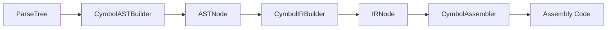
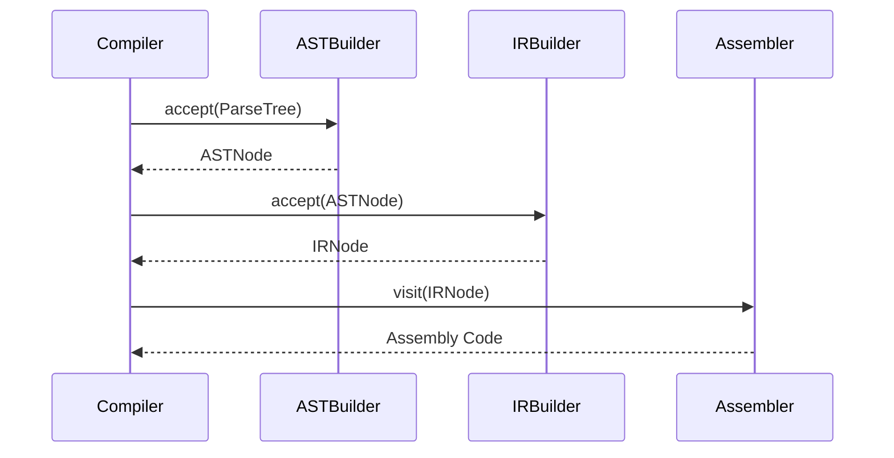
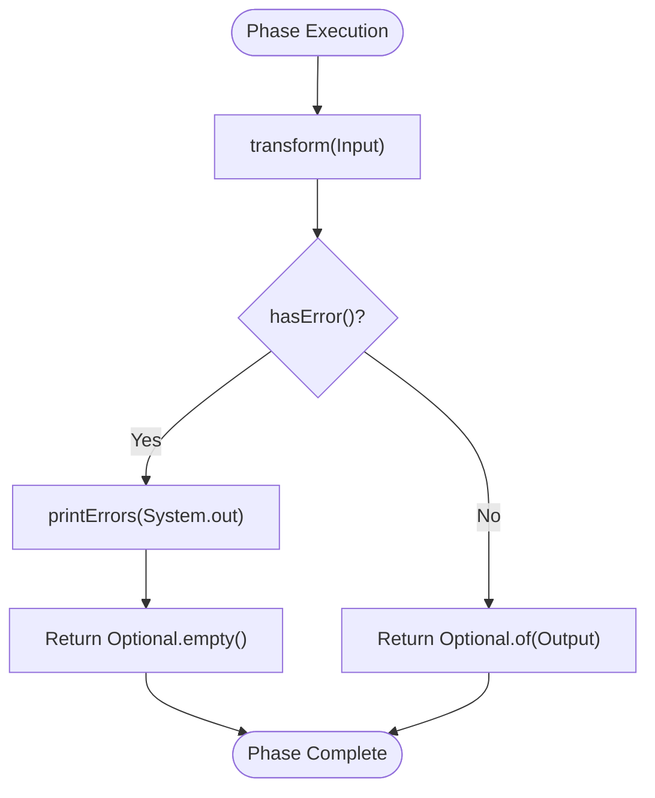
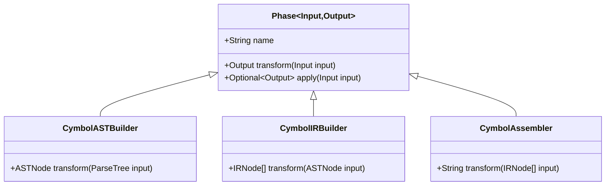
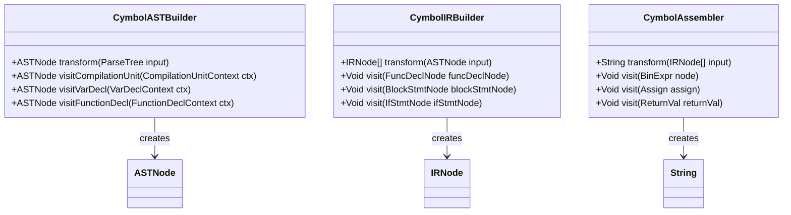
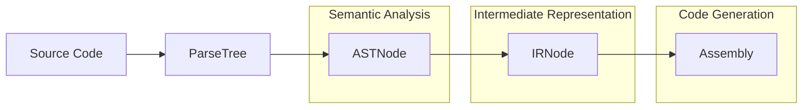

# Compiler Driver and Phase Interactions

<cite>
**Referenced Files in This Document**   
- [Compiler.java](file://ep20/src/main/java/org/teachfx/antlr4/ep20/Compiler.java)
- [Phase.java](file://ep20/src/main/java/org/teachfx/antlr4/ep20/driver/Phase.java)
- [Task.java](file://ep20/src/main/java/org/teachfx/antlr4/ep20/driver/Task.java)
- [ErrorIssuer.java](file://ep20/src/main/java/org/teachfx/antlr4/ep20/driver/ErrorIssuer.java)
- [CymbolASTBuilder.java](file://ep20/src/main/java/org/teachfx/antlr4/ep20/pass/ast/CymbolASTBuilder.java)
- [CymbolIRBuilder.java](file://ep20/src/main/java/org/teachfx/antlr4/ep20/pass/ir/CymbolIRBuilder.java)
- [CymbolAssembler.java](file://ep20/src/main/java/org/teachfx/antlr4/ep20/pass/codegen/CymbolAssembler.java)
</cite>

## Table of Contents
1. [Compiler Pipeline Architecture](#compiler-pipeline-architecture)
2. [Phase and Task Abstractions](#phase-and-task-abstractions)
3. [Compilation Pipeline Execution](#compilation-pipeline-execution)
4. [Error Handling and Reporting](#error-handling-and-reporting)
5. [Type-Safe Phase Interactions](#type-safe-phase-interactions)
6. [Phase Implementation Examples](#phase-implementation-examples)
7. [Data Flow Through Compilation Stages](#data-flow-through-compilation-stages)

## Compiler Pipeline Architecture

The compiler orchestrates the compilation process through a structured pipeline that transforms source code through multiple intermediate representations. The architecture follows a sequential phase model where each phase consumes a specific input type and produces a well-defined output type, enabling type-safe transformations throughout the compilation process.

The compilation pipeline begins with a ParseTree generated by ANTLR4's parser and progresses through AST (Abstract Syntax Tree), IR (Intermediate Representation), and finally ASM (Assembly) stages. Each transformation is handled by specialized components that implement the Phase interface, ensuring consistent execution patterns and error handling across all stages.



**Diagram sources**
- [Compiler.java](file://ep20/src/main/java/org/teachfx/antlr4/ep20/Compiler.java#L30-L160)
- [CymbolASTBuilder.java](file://ep20/src/main/java/org/teachfx/antlr4/ep20/pass/ast/CymbolASTBuilder.java#L4-L318)
- [CymbolIRBuilder.java](file://ep20/src/main/java/org/teachfx/antlr4/ep20/pass/ir/CymbolIRBuilder.java#L4-L473)
- [CymbolAssembler.java](file://ep20/src/main/java/org/teachfx/antlr4/ep20/pass/codegen/CymbolAssembler.java#L4-L154)

**Section sources**
- [Compiler.java](file://ep20/src/main/java/org/teachfx/antlr4/ep20/Compiler.java#L30-L160)

## Phase and Task Abstractions

The Phase class serves as the foundation for all compilation stages, providing a standardized interface for executing compilation tasks with built-in error handling. The Phase abstract class implements both the Task interface for functional composition and the ErrorIssuer interface for error management, creating a cohesive framework for phase execution.

The Task interface defines a functional contract for compilation units, extending Java's Function interface with Optional return types to handle potential failures. This enables the implementation of the Kleisli composition pattern through the "then" method, allowing phases to be chained together in a pipeline where subsequent phases only execute if preceding phases succeed.

```mermaid
classDiagram
class Phase<Input,Output> {
+String name
+Phase(String name)
+abstract Output transform(Input input)
+void onSucceed(Output output)
+Optional<Output> apply(Input input)
}
class Task<T, R> {
+<V> Task<T, V> then(Task<R, V> next)
}
class ErrorIssuer {
+void issue(CymbalError error)
+boolean hasError()
+void printErrors(PrintStream to)
}
Phase <-- Task : implements
Phase <-- ErrorIssuer : implements
```

**Diagram sources**
- [Phase.java](file://ep20/src/main/java/org/teachfx/antlr4/ep20/driver/Phase.java#L4-L27)
- [Task.java](file://ep20/src/main/java/org/teachfx/antlr4/ep20/driver/Task.java#L8-L21)
- [ErrorIssuer.java](file://ep20/src/main/java/org/teachfx/antlr4/ep20/driver/ErrorIssuer.java#L8-L43)

**Section sources**
- [Phase.java](file://ep20/src/main/java/org/teachfx/antlr4/ep20/driver/Phase.java#L4-L27)
- [Task.java](file://ep20/src/main/java/org/teachfx/antlr4/ep20/driver/Task.java#L8-L21)

## Compilation Pipeline Execution

The compilation pipeline executes through a series of coordinated phases that transform the program representation from source code to executable assembly. The process begins with the ANTLR4-generated ParseTree, which is then converted to an AST through visitor pattern traversal, followed by IR generation and finally assembly code emission.

Each phase in the pipeline is implemented as a specialized visitor that traverses the current representation and constructs the next representation. The CymbolASTBuilder transforms the ParseTree into an ASTNode hierarchy, the CymbolIRBuilder converts ASTNodes into IRNodes, and the CymbolAssembler translates IRNodes into assembly instructions. These transformations are orchestrated in the Compiler's main method, which sequences the phases and manages data flow between them.



**Diagram sources**
- [Compiler.java](file://ep20/src/main/java/org/teachfx/antlr4/ep20/Compiler.java#L30-L160)
- [CymbolASTBuilder.java](file://ep20/src/main/java/org/teachfx/antlr4/ep20/pass/ast/CymbolASTBuilder.java#L4-L318)
- [CymbolIRBuilder.java](file://ep20/src/main/java/org/teachfx/antlr4/ep20/pass/ir/CymbolIRBuilder.java#L4-L473)
- [CymbolAssembler.java](file://ep20/src/main/java/org/teachfx/antlr4/ep20/pass/codegen/CymbolAssembler.java#L4-L154)

**Section sources**
- [Compiler.java](file://ep20/src/main/java/org/teachfx/antlr4/ep20/Compiler.java#L30-L160)

## Error Handling and Reporting

Error handling in the compilation pipeline is centralized through the ErrorIssuer interface, which provides a consistent mechanism for error reporting across all phases. When a phase encounters an error during transformation, it issues a CymbalError through the ErrorIssuer interface, which is collected in a shared error list.

The Optional<Output> return pattern ensures that failed phases do not propagate invalid data to subsequent stages. When the Phase.apply method detects errors via the hasError() check, it returns Optional.empty(), preventing the pipeline from continuing with corrupted data. This fail-fast approach ensures compilation integrity and provides clear error feedback to the user.



**Diagram sources**
- [Phase.java](file://ep20/src/main/java/org/teachfx/antlr4/ep20/driver/Phase.java#L4-L27)
- [ErrorIssuer.java](file://ep20/src/main/java/org/teachfx/antlr4/ep20/driver/ErrorIssuer.java#L8-L43)

**Section sources**
- [Phase.java](file://ep20/src/main/java/org/teachfx/antlr4/ep20/driver/Phase.java#L4-L27)
- [ErrorIssuer.java](file://ep20/src/main/java/org/teachfx/antlr4/ep20/driver/ErrorIssuer.java#L8-L43)

## Type-Safe Phase Interactions

The compilation pipeline ensures type safety through parameterized generics in the Phase interface, where each phase specifies its input and output types. This design prevents incorrect phase sequencing and ensures that each phase receives the expected input type from the previous phase.

The type parameters enforce compile-time type checking, guaranteeing that the output of one phase matches the input requirements of the next phase. For example, the CymbolASTBuilder phase is parameterized as Phase<ParseTree, ASTNode>, ensuring it only accepts ParseTree inputs and produces ASTNode outputs, while the CymbolIRBuilder is parameterized as Phase<ASTNode, List<IRNode>> to maintain type consistency.



**Diagram sources**
- [Phase.java](file://ep20/src/main/java/org/teachfx/antlr4/ep20/driver/Phase.java#L4-L27)
- [CymbolASTBuilder.java](file://ep20/src/main/java/org/teachfx/antlr4/ep20/pass/ast/CymbolASTBuilder.java#L4-L318)
- [CymbolIRBuilder.java](file://ep20/src/main/java/org/teachfx/antlr4/ep20/pass/ir/CymbolIRBuilder.java#L4-L473)
- [CymbolAssembler.java](file://ep20/src/main/java/org/teachfx/antlr4/ep20/pass/codegen/CymbolAssembler.java#L4-L154)

**Section sources**
- [Phase.java](file://ep20/src/main/java/org/teachfx/antlr4/ep20/driver/Phase.java#L4-L27)

## Phase Implementation Examples

The compilation pipeline demonstrates concrete implementations of the Phase interface through specialized classes that handle specific transformation stages. Each implementation follows the same pattern: extending the Phase abstract class, implementing the transform method, and leveraging the built-in error handling mechanisms.

The CymbolASTBuilder implements AST construction by visiting ParseTree nodes and creating corresponding ASTNode instances. The CymbolIRBuilder generates intermediate representation by traversing ASTNodes and emitting IRNodes. The CymbolAssembler produces assembly code by visiting IRNodes and generating corresponding assembly instructions. These implementations showcase the consistent application of the Phase interface across different compilation stages.



**Diagram sources**
- [CymbolASTBuilder.java](file://ep20/src/main/java/org/teachfx/antlr4/ep20/pass/ast/CymbolASTBuilder.java#L4-L318)
- [CymbolIRBuilder.java](file://ep20/src/main/java/org/teachfx/antlr4/ep20/pass/ir/CymbolIRBuilder.java#L4-L473)
- [CymbolAssembler.java](file://ep20/src/main/java/org/teachfx/antlr4/ep20/pass/codegen/CymbolAssembler.java#L4-L154)

**Section sources**
- [CymbolASTBuilder.java](file://ep20/src/main/java/org/teachfx/antlr4/ep20/pass/ast/CymbolASTBuilder.java#L4-L318)
- [CymbolIRBuilder.java](file://ep20/src/main/java/org/teachfx/antlr4/ep20/pass/ir/CymbolIRBuilder.java#L4-L473)
- [CymbolAssembler.java](file://ep20/src/main/java/org/teachfx/antlr4/ep20/pass/codegen/CymbolAssembler.java#L4-L154)

## Data Flow Through Compilation Stages

The data flow through the compilation pipeline follows a well-defined sequence of transformations, with each stage processing the output of the previous stage. The process begins with source code parsing, continues through abstract syntax tree construction, intermediate representation generation, and concludes with assembly code emission.

The transformation from ParseTree to AST preserves the syntactic structure of the source code while adding semantic information through symbol resolution. The AST to IR transformation flattens the hierarchical structure into linear three-address code, enabling optimization and analysis. Finally, the IR to assembly transformation maps intermediate operations to target-specific instructions, producing executable code.



**Diagram sources**
- [Compiler.java](file://ep20/src/main/java/org/teachfx/antlr4/ep20/Compiler.java#L30-L160)
- [CymbolASTBuilder.java](file://ep20/src/main/java/org/teachfx/antlr4/ep20/pass/ast/CymbolASTBuilder.java#L4-L318)
- [CymbolIRBuilder.java](file://ep20/src/main/java/org/teachfx/antlr4/ep20/pass/ir/CymbolIRBuilder.java#L4-L473)
- [CymbolAssembler.java](file://ep20/src/main/java/org/teachfx/antlr4/ep20/pass/codegen/CymbolAssembler.java#L4-L154)

**Section sources**
- [Compiler.java](file://ep20/src/main/java/org/teachfx/antlr4/ep20/Compiler.java#L30-L160)